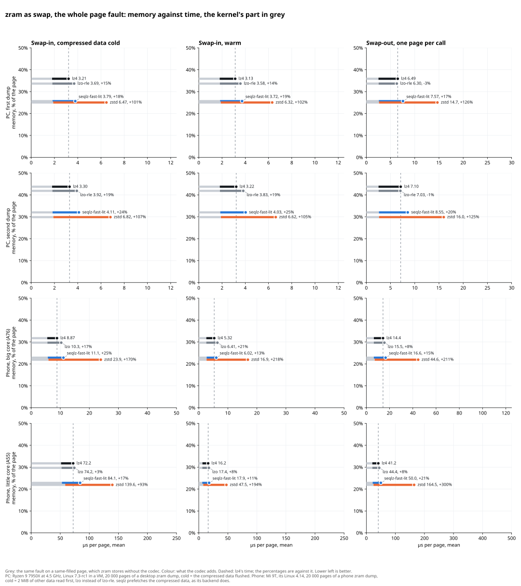

# quetschn

[](https://github.com/martinus/quetschn/actions/workflows/ci.yml)

Compression for memory pages, built for Linux zram. The goal is to get as close as possible to `lz4`'s
speed and to `zstd`'s size, with no more work memory than `lz4` and without recompression.

The codec is `seqlz-fast-lit`: LZ sequences from a greedy matcher, Huffman coded with static tables,
and one of 8 literal tables per page. On a Xiaomi Mi 9T, in the phone's own kernel, with 20 000 pages
from the phone's zram, the whole page fault per page:

| codec | bytes per page | swap-in warm, A76 / A55 | swap-out, A76 / A55 |
| --- | ---: | ---: | ---: |
| `lz4` | 1300 | 5.3 / 16.2 µs | 10.3 / 31.2 µs |
| `lzo` | 1216 | 6.4 / 17.4 µs | 11.2 / 33.9 µs |
| `zstd` 3 | 898 | 16.9 / 47.5 µs | 34.7 / 133 µs |
| **`seqlz-fast-lit`** | **935** | **6.0 / 17.9 µs** | **12.4 / 38.8 µs** |

So `seqlz-fast-lit` stores a page in 28% fewer bytes than `lz4` and 4% more than `zstd`. It swaps in
13% slower than `lz4` on the big core and 11% slower on the little one, and 25% and 17% slower cold,
with 2 MiB of other data read before each fault. Swap-out is all pages of a mapping in one `madvise()`
call, and there it is 20% and 24% slower. In the mean it is slower than `lz4` in every column, so the
case for it is memory, at a small cost in time.

<details>
<summary>The same on the PC and on the phone, memory against time</summary>

Lower left is better. Time is the whole fault, the grey part is the kernel's, which is the same for
every codec. How it was measured is in
[explored-designs.md, "The whole page fault"](docs/explored-designs.md#the-whole-page-fault-the-kernels-part-is-the-same-for-every-codec-the-gap-to-lz4-about-halves).



</details>

## Where it stands

As of 7th October 2026. The details, and what comes next, are in [the plan, §9](docs/plan.md#9-where-the-project-stands-and-the-next-actions).

- [x] Benchmark harness, page collectors, zram dumps of a desktop and of a phone
- [x] The codec, [`seqlz-fast-lit`](docs/seqlz.md), and every alternative that was measured
- [x] [The format](docs/format.md), two reference decoders written from it, fuzzing, the worst case measured
- [x] Measured in a kernel: a VM on x86-64, and the Mi 9T's own kernel on arm64
- [ ] Ask the zram maintainers whether they want a new backend at all, and in which form
- [x] 16 KiB pages: tables trained on the pages of the Android 17 emulator
- [ ] 16 KiB pages: work memory within `lz4`'s, and a phone with 16 KiB pages
- [ ] The kernel port: `lib/` and a zram backend, swap thrash under KASAN, the zram selftests

> [!WARNING]
> Nobody uses seqlz yet, and the format can still change. Don't store pages with it that have to
> decode in a later version.

## Build and test

You need CMake 3.25, Ninja, and a C and C++20 compiler. doctest is fetched by CMake.

```sh
cmake -S . -B build -G Ninja -DQUETSCHN_WERROR=ON
cmake --build build
./build/quetschn_test
```

That builds the codec, the tests and the tools that need no kernel. The benchmarks against zram's own
codecs need a Linux source tree, see [Measuring](docs/measuring.md). How to change something is in
[CONTRIBUTING.md](CONTRIBUTING.md).

## What is where

| directory | what it holds |
| --- | --- |
| [`src/`](src) | the codec, freestanding C: encoder, decoder, matcher, and the trained tables |
| [`bench/`](bench) | the benchmark harness: per-page timing, zsmalloc's cost model, table training, zram's codecs built in userspace |
| [`test/`](test) | the doctest unit tests, `quetschn_test` |
| [`fuzz/`](fuzz) | libFuzzer and AFL++ targets: the decoder, the roundtrip, the decoder against the reference decoder |
| [`tools/`](tools) | page collectors, reference decoders, the kernel VM, the phone tests, plots, see [`tools/README.md`](tools/README.md) |
| [`docs/`](docs) | how seqlz works, the format, the plan, how to measure, and every design measured, see [`docs/README.md`](docs/README.md) |
| [`cmake/`](cmake) | builds zram's `lz4`, `lzo` and `zstd` from a kernel tree with the kernel's flags |

## Documentation

| document | read it if you want to |
| --- | --- |
| [How seqlz works](docs/seqlz.md) | understand the codec, also without having written a compressor before |
| [The seqlz format](docs/format.md) | write a decoder, or check one |
| [Measuring](docs/measuring.md) | benchmark, in a kernel VM, in userspace or on a phone, and collect pages |
| [The plan](docs/plan.md) | know the goal, how designs are scored, what zram needs, and where the project stands |
| [Explored designs](docs/explored-designs.md) | know what was tried, with the numbers, before you try it again |
| [seqlz, bit by bit](docs/seqlz-bit-by-bit.html) and [seqlz, compressed](docs/seqlz-compressed.html) | watch real pages being decoded and compressed, step by step. GitHub shows only their source: download a file and open it in a browser |

## License

quetschn is dual licensed under **`MIT OR GPL-2.0-only`**, at your option:
[LICENSE-MIT](LICENSE-MIT), [LICENSE-GPL-2.0](LICENSE-GPL-2.0). The GPL-2.0-only option is there so
the codec can go into the Linux kernel, the MIT option so that userspace and non-GPL projects can use
it too. zstd does the same.

The `quetschn-bench-*` binaries are an exception: they link GPL-2.0-only kernel code, so they are
GPL-2.0 works. They are for measuring and not for distribution.
