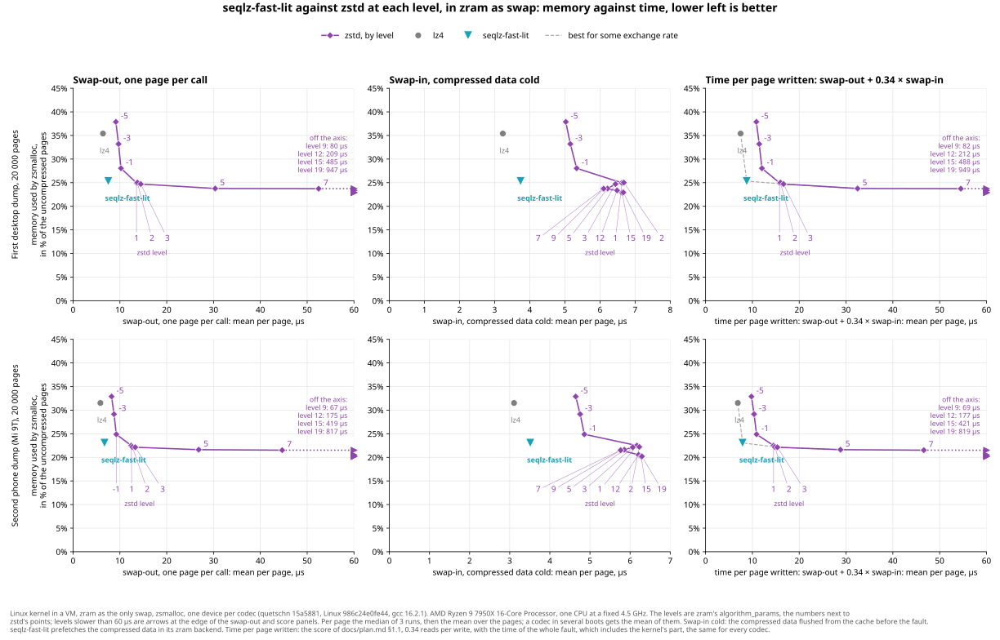
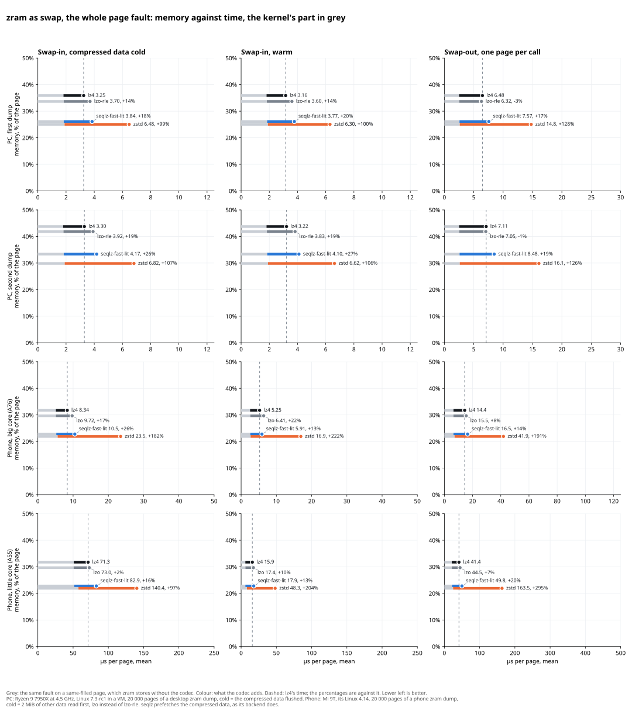
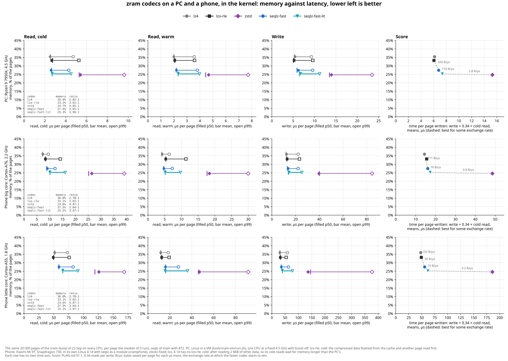
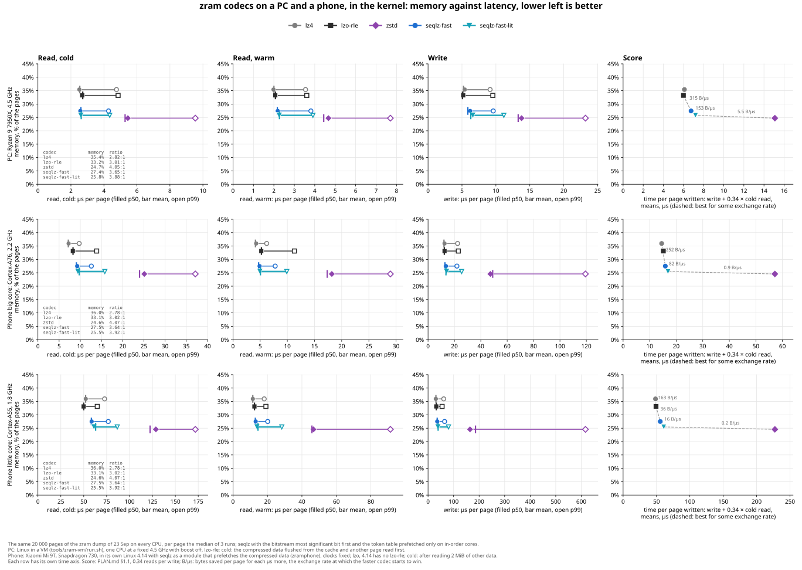
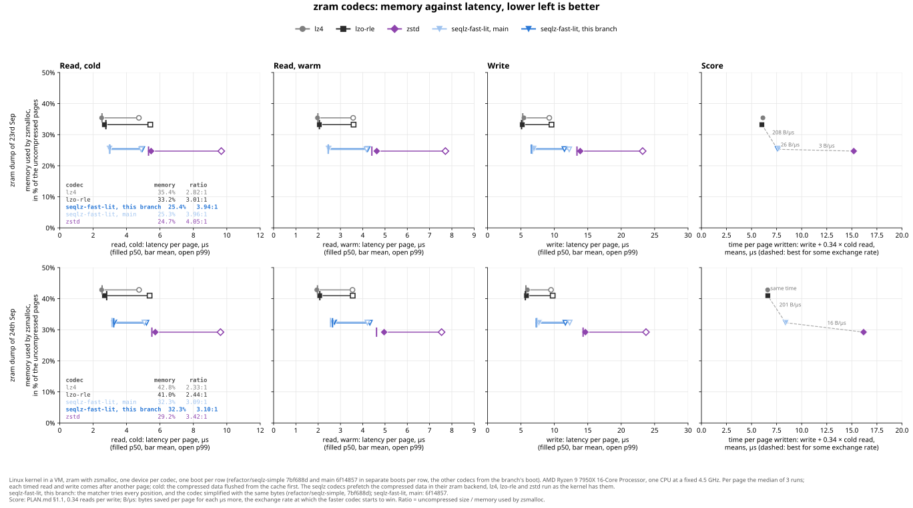
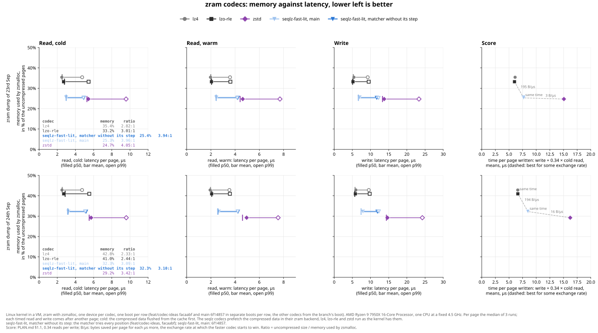
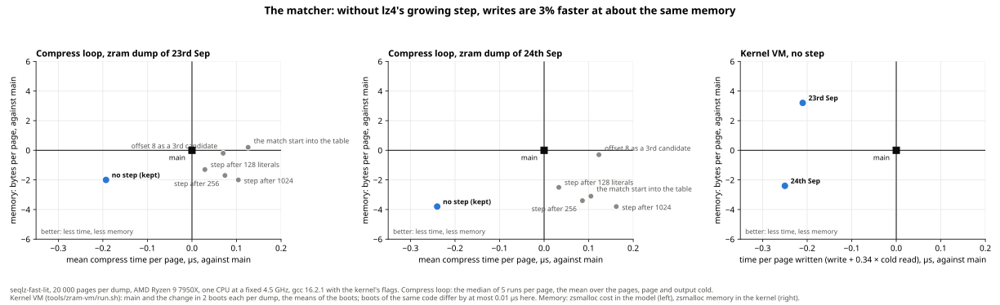
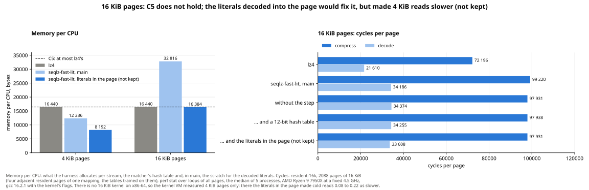
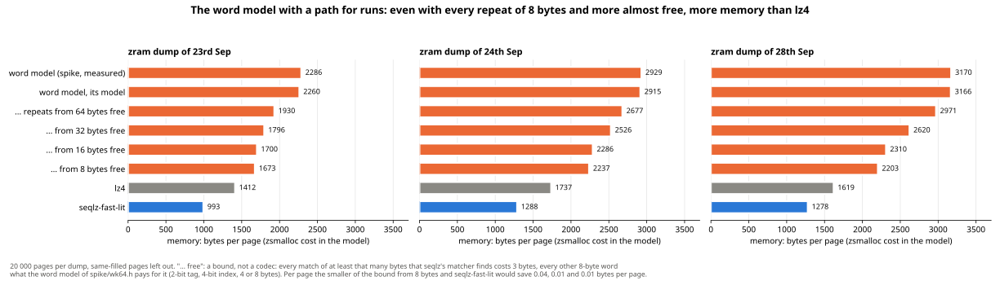

# Explored designs

Every design that was measured for quetschn, with the numbers, and whether it was kept and why. Read
it before you try something new, so that nothing is measured twice, and add an entry for everything
you measure, also and especially for what did not work.

A design is judged by the score of [plan.md §1.1](plan.md#11-the-score-memory-against-time-not-bars):
zsmalloc memory per stored page against the mean time per page written, see
[The designs by the score](#the-designs-by-the-score). The older entries were judged by the bars C1 to
C3 of [plan.md §1](plan.md#1-goal-and-success-criteria) instead: Σ zsmalloc cost (§3.1) and cold p99
per page (§5.2).

> [!TIP]
> **The short version.** The gap between `lz4` and `zstd -1` is mostly how the sequences are coded,
> not the literals and not better matches, see [Where the ratio of `zstd` comes from](#where-the-ratio-of-zstd-comes-from).
> The codec built on that, [`seqlz-fast-lit`](#seqlz-fast-lit-one-of-8-literal-tables-per-page), has
> the lowest score for any exchange rate from 24 to about 150 bytes per µs in the kernel VM. With the
> tables of 7th October it stores 28.5% and 26.8% less than `lz4` on two desktop dumps and 28% less on
> the phone, and swaps in 18% and 24% slower on the PC, 13% warm and 25% cold on the phone's big core,
> 11% and 17% on the little one ([The tables trained again](#the-tables-trained-again-4-less-on-one-desktop-dump-the-phone-the-same)).
> On a phone that switches between 25 apps with the same RAM for zram, no app had to start again with
> `seqlz-fast` in 3 runs, and 54 launches did with `lz4`
> ([Apps on the phone](#apps-on-the-phone-with-the-same-ram-no-cold-launch-in-6-runs-of-seqlz-54-in-3-runs-of-lz4)).
> Two decoders beat `lz4` at cold p99, but only with formats that need 55.7% and 70.5% of the page,
> against 34.5% for `lz4`: local tricks on 8 or 64 bytes do not get the ratio, it has to come from
> repeats across the whole page.

Each entry has the numbers of the day it was measured. Later changes to the codec make some of them
stale, which the entries do not repeat every time. Code that was removed is named by its old path,
e.g. `explore/bytelz.c` or `spike/`. It is in git history before `57fb8fb`, the commit of 7th October
2026 that removed it: `git show 57fb8fb^:explore/bytelz.c`.

## Index

**How to measure, and the baselines**

- [How the numbers are measured](#how-the-numbers-are-measured)
- [The harness on the PC: a codec's times depend on the other codecs in the run, not found why](#the-harness-on-the-pc-a-codecs-times-depend-on-the-other-codecs-in-the-run-not-found-why)
- [Less noise on the phone: one codec per process and the memory's clocks fixed](#less-noise-on-the-phone-one-codec-per-process-and-the-memorys-clocks-fixed)
- [The app test's spread: zram's memory moves by 2 to 3% between runs, cold launches by 51 to 173%](#the-app-tests-spread-zrams-memory-moves-by-2-to-3-between-runs-cold-launches-by-51-to-173)
- [zram's memory against the model: exact on a new device, Σ zsmalloc cost 0.35 to 0.47% below it](#zrams-memory-against-the-model-exact-on-a-new-device-σ-zsmalloc-cost-035-to-047-below-it)
- [The first runs with dictionaries, Phases 0 to 2](#the-first-runs-with-dictionaries-phases-0-to-2)
- [Baselines](#baselines)
- [`lz4` with a dictionary](#lz4-with-a-dictionary)

**The score, and the whole page fault**

- [The designs by the score](#the-designs-by-the-score)
- [The score with the swap times: seqlz-fast-lit's range ends at 155 and 211 bytes per µs instead of 200 and 279](#the-score-with-the-swap-times-seqlz-fast-lits-range-ends-at-155-and-211-bytes-per-µs-instead-of-200-and-279)
- [zstd at every level, in a swap-in: no level stores less in less time than seqlz-fast-lit](#zstd-at-every-level-in-a-swap-in-no-level-stores-less-in-less-time-than-seqlz-fast-lit)
- [lz4 in hardware, a what-if: seqlz-fast-lit stays on the hull, up to 73 and 72 bytes per µs instead of 155 and 211](#lz4-in-hardware-a-what-if-seqlz-fast-lit-stays-on-the-hull-up-to-73-and-72-bytes-per-µs-instead-of-155-and-211)
- [The whole page fault: the kernel's part is the same for every codec, the gap to `lz4` about halves](#the-whole-page-fault-the-kernels-part-is-the-same-for-every-codec-the-gap-to-lz4-about-halves)
- [The decoder in a fault: 0.28 µs slower than in zram's read benchmark, warm caches give back 0.12](#the-decoder-in-a-fault-028-µs-slower-than-in-zrams-read-benchmark-warm-caches-give-back-012)
- [The decoder in a fault, found: 110 branch mispredictions per page that a decode of the same page before hides](#the-decoder-in-a-fault-found-110-branch-mispredictions-per-page-that-a-decode-of-the-same-page-before-hides)
- [Which branches: three in the sequence loop are 58% of the 130 misses of a page seen once](#which-branches-three-in-the-sequence-loop-are-58-of-the-130-misses-of-a-page-seen-once)
- [The refill without its branch, every second fast sequence: 63 ns less per swap-in on x86-64 and the A76, kept](#the-refill-without-its-branch-every-second-fast-sequence-63-ns-less-per-swap-in-on-x86-64-and-the-a76-kept)
- [The fast path's condition: its 22 misses per page are the length values, four ways around them slower, not kept](#the-fast-paths-condition-its-22-misses-per-page-are-the-length-values-four-ways-around-them-slower-not-kept)
- [The offset below 8: one copy for every offset saves 12 misses per page and costs more, not kept](#the-offset-below-8-one-copy-for-every-offset-saves-12-misses-per-page-and-costs-more-not-kept)
- [A branch or more work, again in a swap-in: the old choices hold, and loops over 2000 pages were never trained](#a-branch-or-more-work-again-in-a-swap-in-the-old-choices-hold-and-loops-over-2000-pages-were-never-trained)
- [Recompression, measured, not pursued](#recompression-measured-not-pursued)
- [zram's contexts split into compression and decompression: the same time in the VM, the same memory for seqlz](#zrams-contexts-split-into-compression-and-decompression-the-same-time-in-the-vm-the-same-memory-for-seqlz)

**Where the bytes are**

- [Where the ratio of `zstd` comes from](#where-the-ratio-of-zstd-comes-from)
- [How tight the bits are: ANS would give 0.3% at most, the offsets have 2%, 16 literal tables 0.1% to 2%](#how-tight-the-bits-are-ans-would-give-03-at-most-the-offsets-have-2-16-literal-tables-01-to-2)
- [Ratio from the parse and the tables on phone pages, measured offline, not built](#ratio-from-the-parse-and-the-tables-on-phone-pages-measured-offline-not-built)
- [The ideas of #29 and #31, measured](#the-ideas-of-29-and-31-measured)

**seqlz: the format**

- [seqlz: `lz4`'s matches, Huffman coded sequences with static tables](#seqlz-lz4s-matches-huffman-coded-sequences-with-static-tables)
- [seqlz-fast-lit: one of 8 literal tables per page](#seqlz-fast-lit-one-of-8-literal-tables-per-page)
- [A page ends where its bits end: no damaged page with bytes or bits too many decodes, 0.1 µs on the A55, kept](#a-page-ends-where-its-bits-end-no-damaged-page-with-bytes-or-bits-too-many-decodes-01-µs-on-the-a55-kept)
- [The format written down: one set of tables, and stream sizes that hold](#the-format-written-down-one-set-of-tables-and-stream-sizes-that-hold)
- [The tables trained again: 4% less on one desktop dump, the phone the same](#the-tables-trained-again-4-less-on-one-desktop-dump-the-phone-the-same)
- [Stream sizes in as many bits as the largest needs, kept](#stream-sizes-in-as-many-bits-as-the-largest-needs-kept)
- [Length values in 5 plain bits instead of their tables: 3 bytes per page more, not kept](#length-values-in-5-plain-bits-instead-of-their-tables-3-bytes-per-page-more-not-kept)
- [The sequences' bitstream most significant bit first: the token table's codes in one range on every CPU, kept](#the-sequences-bitstream-most-significant-bit-first-the-token-tables-codes-in-one-range-on-every-cpu-kept)
- [Offset classes from a histogram: today's are close, two more give 0.1 points at most](#offset-classes-from-a-histogram-todays-are-close-two-more-give-01-points-at-most)
- [A literal table per half or quarter of the literals: 0.02 to 0.05 points, not built](#a-literal-table-per-half-or-quarter-of-the-literals-002-to-005-points-not-built)
- [The token's table by the offset before it: 3 and 12 bytes per page, not kept](#the-tokens-table-by-the-offset-before-it-3-and-12-bytes-per-page-not-kept)
- [Per page: its own literal table and one of 4 token tables, measured, not kept](#per-page-its-own-literal-table-and-one-of-4-token-tables-measured-not-kept)
- [A literal table of the page's own at levels 3 and 4: 2.5% to 3.4% less, a second literal path in the format, not kept](#a-literal-table-of-the-pages-own-at-levels-3-and-4-25-to-34-less-a-second-literal-path-in-the-format-not-kept)
- [Pages without matches but with literals that code well: coded now](#pages-without-matches-but-with-literals-that-code-well-coded-now)
- [Coded literals only where they save 51 bytes: 2.7 µs per page written less on the A55, kept](#coded-literals-only-where-they-save-51-bytes-27-µs-per-page-written-less-on-the-a55-kept)
- [seqlz-fast-lit by the score: no budget, offsets in steps of 8](#seqlz-fast-lit-by-the-score-no-budget-offsets-in-steps-of-8)
- [seqlz-fast-lit within C3: a budget for coding the literals](#seqlz-fast-lit-within-c3-a-budget-for-coding-the-literals)
- [seqlz simplified: the same bytes, 800 lines less, compressing 4% faster](#seqlz-simplified-the-same-bytes-800-lines-less-compressing-4-faster)

**seqlz: the matcher**

- [Levels 3 and 4: a hash chain priced by the tables, as small as `zstd` 3 on two of four dumps and faster to write and read, not kept](#levels-3-and-4-a-hash-chain-priced-by-the-tables-as-small-as-zstd-3-on-two-of-four-dumps-and-faster-to-write-and-read-not-kept)
- [The matcher without its step: writes 1% to 3% faster, kept](#the-matcher-without-its-step-writes-1-to-3-faster-kept)
- [The matcher without its step against the other codecs: 0.02 to 0.05 us per page less](#the-matcher-without-its-step-against-the-other-codecs-002-to-005-us-per-page-less)
- [The matcher on an in-order core: 3.4% fewer compress cycles on the A55, same output, kept](#the-matcher-on-an-in-order-core-34-fewer-compress-cycles-on-the-a55-same-output-kept)
- [The matcher's table with the bytes, its loop in assembly on arm64: 9% fewer compress cycles on the A55, not kept](#the-matchers-table-with-the-bytes-its-loop-in-assembly-on-arm64-9-fewer-compress-cycles-on-the-a55-not-kept)
- [The compressor into a buffer of any size: the bitstream from the back, the same bytes in zram, writes 2% faster in the VM, kept](#the-compressor-into-a-buffer-of-any-size-the-bitstream-from-the-back-the-same-bytes-in-zram-writes-2-faster-in-the-vm-kept)
- [Coded literals from the matcher's table: a buffer of one page costs 0.1% to 0.5% instead of 1.6% to 2.9%, kept](#coded-literals-from-the-matchers-table-a-buffer-of-one-page-costs-01-to-05-instead-of-16-to-29-kept)
- [The bitstream copied once, behind the literals raw or coded: writes up to 0.3 µs slower in the VM and 0.8 µs on the A55, not kept](#the-bitstream-copied-once-behind-the-literals-raw-or-coded-writes-up-to-03-µs-slower-in-the-vm-and-08-µs-on-the-a55-not-kept)
- [Memory for speed on the phone: no trade worth it, not kept](#memory-for-speed-on-the-phone-no-trade-worth-it-not-kept)
- [seqlz-fast-lit faster at the same memory: five tries, none kept](#seqlz-fast-lit-faster-at-the-same-memory-five-tries-none-kept)

**seqlz: the decoder, in the kernel**

- [zram: prefetch the compressed data before decompression](#zram-prefetch-the-compressed-data-before-decompression)
- [A kernel built with clang dropped the decoder's prefetches: fixed, p99 back at gcc's](#a-kernel-built-with-clang-dropped-the-decoders-prefetches-fixed-p99-back-at-gccs)
- [The kernel's prefetch() on x86-64, fixed in the kernel: a patch gives clang its prefetches back](#the-kernels-prefetch-on-x86-64-fixed-in-the-kernel-a-patch-gives-clang-its-prefetches-back)
- [The macros of seqlz.c as inline functions: the same time in the VM, on the phone no more than where a module lands, kept](#the-macros-of-seqlzc-as-inline-functions-the-same-time-in-the-vm-on-the-phone-no-more-than-where-a-module-lands-kept)
- [The kernel copy's long functions split into inline helpers: the same time in the VM and on the phone, kept](#the-kernel-copys-long-functions-split-into-inline-helpers-the-same-time-in-the-vm-and-on-the-phone-kept)
- [Numbers that were only in the codec's comments, until 10th October 2026](#numbers-that-were-only-in-the-codecs-comments-until-10th-october-2026)
- [The kernel copy's choices measured in one boot and on the phone: -O3 kept, one decode loop, prefetch(), no __aligned(64), no load16()](#the-kernel-copys-choices-measured-in-one-boot-and-on-the-phone--o3-kept-one-decode-loop-prefetch-no-__aligned64-no-load16)
- [seqlz.c split in three, as lib/lz4 is: the kernel copy the same speed, measured on the kernel copy itself](#seqlzc-split-in-three-as-liblz4-is-the-kernel-copy-the-same-speed-measured-on-the-kernel-copy-itself)
- [copy_match() without its dead branch: within what the code's place moves, kept](#copy_match-without-its-dead-branch-within-what-the-codes-place-moves-kept)
- [Five simplifications measured in the VM and on the phone: the literal streams as arrays kept, four not](#five-simplifications-measured-in-the-vm-and-on-the-phone-the-literal-streams-as-arrays-kept-four-not)
- [Length values in 5 plain bits again: 0.2 to 0.3% more memory, no read faster, not kept](#length-values-in-5-plain-bits-again-02-to-03-more-memory-no-read-faster-not-kept)
- [seqlz's decoder for an in-order core: 15% fewer instructions, 0.7 to 0.8 µs less at cold p99 on the A55, kept](#seqlzs-decoder-for-an-in-order-core-15-fewer-instructions-07-to-08-µs-less-at-cold-p99-on-the-a55-kept)
- [The next token before the copies: reads faster on both phone cores, kept](#the-next-token-before-the-copies-reads-faster-on-both-phone-cores-kept)
- [The worst case: the slowest pages found cost 1.3 times the p99 of real ones, as for `lz4`](#the-worst-case-the-slowest-pages-found-cost-13-times-the-p99-of-real-ones-as-for-lz4)
- [The numbers again, with the format as it is now: reads 0.3 µs faster than on 29th September](#the-numbers-again-with-the-format-as-it-is-now-reads-03-µs-faster-than-on-29th-september)
- [The numbers again, with the bit order and the token table's prefetch: cold reads on the A76 3 µs faster](#the-numbers-again-with-the-bit-order-and-the-token-tables-prefetch-cold-reads-on-the-a76-3-µs-faster)

**On the phone**

- [arm64: on a phone, `seqlz-fast-lit` is 1.7 to 1.9 times `lz4` at cold p99](#arm64-on-a-phone-seqlz-fast-lit-is-17-to-19-times-lz4-at-cold-p99)
- [seqlz-fast on the phone: time goes per sequence, and code layout moves reads by 130 ns](#seqlz-fast-on-the-phone-time-goes-per-sequence-and-code-layout-moves-reads-by-130-ns)
- [A second phone dump, after 12 hours of use: seqlz-fast reads faster than lzo-rle at p99](#a-second-phone-dump-after-12-hours-of-use-seqlz-fast-reads-faster-than-lzo-rle-at-p99)
- [In the phone's own kernel: cold reads on the little core cost seqlz-fast 9 µs more than lz4](#in-the-phones-own-kernel-cold-reads-on-the-little-core-cost-seqlz-fast-9-µs-more-than-lz4)
- [Apps on the phone: with the same RAM, no cold launch in 6 runs of seqlz, 54 in 3 runs of lz4](#apps-on-the-phone-with-the-same-ram-no-cold-launch-in-6-runs-of-seqlz-54-in-3-runs-of-lz4)
- [Six choices made on the PC, measured on the phone: the token table and the prefetches matter, the rest does not](#six-choices-made-on-the-pc-measured-on-the-phone-the-token-table-and-the-prefetches-matter-the-rest-does-not)
- [The A55 again: the write as on 4 October, the decoder's code prefetched for cold reads, not kept](#the-a55-again-the-write-as-on-4-october-the-decoders-code-prefetched-for-cold-reads-not-kept)

**16 KiB pages**

- [16 KiB pages](#16-kib-pages)
- [16 KiB pages, tuned: C5 does not hold, the literals in the page would fix it, not kept](#16-kib-pages-tuned-c5-does-not-hold-the-literals-in-the-page-would-fix-it-not-kept)
- [Android 17 in the emulator: the 4 KiB tables fit, the 16 KiB ones trained again, 2.6% smaller](#android-17-in-the-emulator-the-4-kib-tables-fit-the-16-kib-ones-trained-again-26-smaller)

**Other designs, not kept**

- [bytelz: `seqlz-fast`'s matcher, a byte oriented format](#bytelz-seqlz-fasts-matcher-a-byte-oriented-format)
- [seqlz-opt: a parser that knows seqlz's costs, zstd's memory at lz4's read speed](#seqlz-opt-a-parser-that-knows-seqlzs-costs-zstds-memory-at-lz4s-read-speed)
- [seqlz-opt with a literal table per page: less memory than `zstd`, slower reads, not kept](#seqlz-opt-with-a-literal-table-per-page-less-memory-than-zstd-slower-reads-not-kept)
- [lz4's format from a compressor for pages, measured, not kept](#lz4s-format-from-a-compressor-for-pages-measured-not-kept)
- [Word model: WKdm-style 64-bit words](#word-model-wkdm-style-64-bit-words)
- [The word model with a path for runs: not even `lz4`'s memory, not built](#the-word-model-with-a-path-for-runs-not-even-lz4s-memory-not-built)
- [Byte shuffle + `lz4`](#byte-shuffle--lz4)
- [Base + delta per 64-byte block (BDI)](#base--delta-per-64-byte-block-bdi)
- [memlz](#memlz)

**Open**

- [Not evaluated yet](#not-evaluated-yet)

## How the numbers are measured

All numbers here are from the first zram dump of the development machine (`plan.md` Phase 1): 460 923
pages swapped out by a Fedora desktop, 5684 of them same-filled and skipped, 455 239 measured. Ryzen 9
7950X, one core pinned, `powersave` governor, so the frequency is not fixed. Every codec is built with
the kernel's compiler flags (`cmake/kernel_codecs.cmake`), the candidates with `lz4`'s `-O3`.

Two benchmarks, and a few rules that came from getting it wrong first:

* **Fast:** `tools/quick-bench.sh build <corpus> <out> lz4,<candidates>`, 91s for five codecs. The
  zsmalloc cost comes from the whole corpus without timing (`--no-timing`), so it is exact. Latency
  comes from a fixed random sample of 20 000 pages (`quetschn-sample-corpus`), interleaved, in 5
  separate processes.
* **Full:** `quetschn-bench-interleaved` on the whole corpus, 89s for six codecs. Only to confirm a
  result that goes into this file or `plan.md`. The fast one agreed with it within 2% to 4% for five
  of six codecs; for `spike-slots` the fast one said 1800 ns cold p99, the full one 2000 ns. So a
  difference below about 300 ns needs the full run.
* **Interleaved, always.** Separate runs drifted by 6%, as much as the effects measured.
  `run_interleaved` runs every codec once per repetition on the same page, in rotating order.
* **Reverse the codec order** when a difference is below about 200 ns. All codecs are in one binary
  and the code layout of one shifts the others: `shuffle-lz4` against `lz4` was +380 ns in one order
  and +210 ns in the other.
* **Buffers aligned like the kernel.** The output page is page aligned, allocations of a page or more
  too, and the compressed data starts at a different offset for every page, like zsmalloc objects.
  With 64-byte aligned buffers the difference of `shuffle-lz4` to `lz4` moved from +390 to -110 ns
  between two builds that only differed in how the corpus was allocated.
* **Nothing else runs on the machine while a benchmark times.** A build or a test run during a
  benchmark gave numbers that the next clean run did not reproduce.
* **Fixed clock, compressions apart from decompressions, and several processes.** Cold latency was
  the hard part; warm latency and compression time were always stable to 1% or 2%. Three causes,
  found one after the other:
  * The clock. With boost on, warm decoding ran at 5.3 GHz every time, but the cold numbers of two
    identical runs differed by up to 520 ns. With CPU 2 fixed at 4.5 GHz and boost off, identical
    runs agreed within 10 to 80 ns. Counting cycles (APERF via `rdpru`) instead of time did not help:
    the time spent waiting for DRAM counts more cycles at a higher clock.
  * The other codecs in the run. With `lz4hc` in a run, `lzo-rle` against `lz4` moved from -100 to
    +200 ns. `lz4hc` touches a 256 KiB workspace when it compresses, and that ran right before the
    next codec's decompression. Now every repetition first times all compressions, then all
    decompressions; `lzo-rle` against `lz4` was then -50 to -110 ns with and without `lz4hc`.
  * The process. Five identical runs gave `zstd -1` against `lz4` +2390, +4620, +2300, +1800 and
    +2490 ns, while each run's own confidence interval was about ±80 ns. It only covers which pages
    were sampled, not e.g. which physical pages the buffers got. So `tools/quick-bench.sh` runs the
    latency in 5 processes and shows the median and the smallest and largest difference.

  Every benchmark prints the frequency range and boost state, a table needs min equal to max and
  boost off. The commands for that are in [`measuring.md`](measuring.md#fix-the-clock-first).

The latencies in the sections on the word model, byte shuffle and base + delta were measured before
these three fixes, with boost on and one process. Their differences to `lz4` can be off by a few
hundred ns; the Σ zsmalloc cost is exact in every section.

## The designs by the score

`plan.md` §1.1 replaces the bars C1 to C3 as the target with a score: zsmalloc bytes per page against
the time per page written, `write + r * read + b * recompression`, means over the pages, with `r =
0.34` reads per write from the development machine and `b` the weight of recompression. The designs on
the lower left convex hull of (time, bytes) have the lowest `bytes + lambda * time` for some lambda;
between neighbours the exchange rate in bytes per us is the lambda at which the faster one starts to
win. `quetschn-score` computes it from the logs.

**In the kernel `seqlz-fast-lit` has the lowest score for any lambda from 24 to 150 bytes per us.**
VM of `tools/zram-vm/run.sh`, 20 000 pages per dump, one boot per dump for the 7 devices and one more
per dump for #37, one CPU at a fixed 4.5 GHz; means over the pages of the median of 3 runs, cold reads
with another page before and the compressed data flushed, first dump / second dump, times in us,
`b = 1`:

| codec | bytes per page | write | cold read | recompression | us per page written |
| --- | --- | --- | --- | --- | --- |
| `lz4` | 1 450.4 / 1 754.5 | 5.28 / 5.76 | 2.55 / 2.58 | 0.0 / 0.0 | 6.15 / 6.64 |
| `lzo-rle` | 1 361.1 / 1 678.5 | 5.14 / 5.72 | 2.80 / 2.92 | 0.0 / 0.0 | 6.09 / 6.71 |
| `zstd` | 1 012.3 / 1 197.5 | 13.58 / 14.53 | 5.35 / 5.60 | 0.0 / 0.0 | 15.40 / 16.44 |
| `bytelz` | 1 250.7 / 1 600.5 | 6.09 / 6.65 | 2.71 / 2.81 | 0.0 / 0.0 | 7.01 / 7.61 |
| `seqlz` | 1 147.7 / 1 487.9 | 6.02 / 6.59 | 2.70 / 2.79 | 0.0 / 0.0 | 6.94 / 7.54 |
| `seqlz-lit` | 1 079.9 / 1 398.6 | 6.48 / 7.06 | 2.65 / 2.95 | 0.0 / 0.0 | 7.38 / 8.06 |
| `seqlz-lit+seqlz-opt` | 987.1 / 1 225.9 | 6.47 / 7.07 | 2.83 / 3.02 | 235.6 / 233.1 | 243.04 / 241.18 |
| `seqlz-lit+seqlz-opt`, own tables (#37) | 973.6 / 1 175.6 | 6.42 / 7.07 | 3.00 / 3.31 | 245.2 / 243.7 | 252.65 / 251.89 |

| `b = 1`, from the fastest to the smallest | first dump | second dump |
| --- | --- | --- |
| `lzo-rle` to `seqlz` | 213 bytes for 0.85 us, 252 per us | 191 bytes for 0.83 us, 229 per us |
| `seqlz` to `seqlz-lit` | 68 bytes for 0.45 us, 152 per us | 89 bytes for 0.52 us, 172 per us |
| `seqlz-lit` to `zstd` 3 | 68 bytes for 8.02 us, 8.4 per us | 201 bytes for 8.38 us, 24 per us |
| `zstd` 3 to the own tables of #37, recompressed | 39 bytes for 237 us, 0.2 per us | 22 bytes for 235 us, 0.1 per us |

`lz4` is on the hull of the second dump only, 76 bytes above `lzo-rle` for 0.07 us: the two are the
same speed within the noise of one boot. `bytelz` is behind `seqlz` in both, and `seqlz-opt` with the
fixed tables is not on the hull at any `b` below.

**The weight of recompression decides whether recompression pays.** It takes 233 to 245 us per page,
about 17 times a write with `zstd` 3. At `b = 0.1` the step from `zstd` 3 to the own tables is 2.3 and 1.4
bytes per us, at `b = 0.03` the own tables follow `seqlz-lit` directly with 14 and 30 bytes per us,
and `zstd` 3 drops off the hull; at `b = 0` they follow `lzo-rle` with 287 and 339 bytes per us, and
recompression with `seqlz-opt` is the best choice for every lambda below that. Where recompression is on the hull,
it is with the own tables of #37 and not the fixed ones: 13.5 and 50 bytes smaller, for 0.01 and 0.1
us more of writes and reads per page and 10 us more of recompression. Whether that is worth it depends on how many
pages get recompressed and what the CPU time of an idle CPU costs, energy on a phone and nothing much
on a desktop. #37 stays closed until there is a number for that.

**In userspace the hull is the same.** `quetschn-bench-interleaved`, 20 000 pages per dump, CPU 2 at
4.5 GHz, the mean of each page's median, same-filled pages excluded, zsmalloc cost of the model, times
in us:

| codec | bytes per page | compress | cold decompress | us per page written |
| --- | --- | --- | --- | --- |
| `lz4:1` | 1 411.8 / 1 737.3 | 3.51 / 3.95 | 1.27 / 1.29 | 3.95 / 4.39 |
| `lz4hc:9` | 1 257.1 / 1 560.0 | 36.89 / 31.00 | 1.04 / 1.07 | 37.25 / 31.37 |
| `lzo` | 1 306.6 / 1 631.7 | 3.85 / 4.41 | 1.89 / 1.83 | 4.50 / 5.03 |
| `lzo-rle` | 1 326.1 / 1 646.4 | 2.90 / 3.10 | 1.33 / 1.30 | 3.35 / 3.54 |
| `zstd:-1` | 1 101.3 / 1 449.6 | 7.85 / 8.57 | 3.01 / 3.05 | 8.87 / 9.61 |
| `zstd:3` | 964.6 / 1 163.0 | 12.44 / 13.84 | 3.90 / 4.14 | 13.77 / 15.25 |
| `bdelta:1` | 2 888.6 / 3 404.7 | 3.40 / 3.02 | 0.51 / 0.46 | 3.57 / 3.17 |
| `bytelz` | 1 212.8 / 1 574.7 | 4.72 / 5.30 | 1.57 / 1.65 | 5.26 / 5.86 |
| `seqlz:1` | 1 125.1 / 1 449.9 | 6.86 / 7.88 | 1.91 / 2.08 | 7.51 / 8.59 |
| `seqlz-fast` | 1 106.5 / 1 462.3 | 4.78 / 5.37 | 1.64 / 1.77 | 5.34 / 5.97 |
| `seqlz-fast-lit` | 1 037.6 / 1 368.6 | 3.96 / 4.43 | 1.35 / 1.43 | 4.42 / 4.91 |
| `seqlz-hc:3` | 1 049.2 / 1 350.5 | 17.51 / 19.83 | 1.61 / 1.76 | 18.05 / 20.43 |
| `seqlz-hc-lit:3` | 978.8 / 1 231.6 | 13.22 / 14.68 | 1.34 / 1.49 | 13.68 / 15.19 |
| `seqlz-opt` | 940.7 / 1 198.3 | 253.20 / 251.45 | 1.75 / 1.98 | 253.80 / 252.12 |
| `shuffle-lz4:1` | 1 678.7 / 2 109.1 | 4.45 / 5.13 | 1.73 / 1.67 | 5.04 / 5.69 |
| `spike-branchless` | 2 286.0 / 2 928.6 | 2.37 / 2.26 | 1.93 / 1.53 | 3.02 / 2.77 |
| `spike-slots` | 2 286.0 / 2 928.6 | 1.47 / 1.45 | 1.19 / 0.99 | 1.87 / 1.79 |
| `spike-switch` | 2 286.0 / 2 928.6 | 1.27 / 1.27 | 1.41 / 1.18 | 1.75 / 1.68 |
| `spike-zeroskip` | 2 286.0 / 2 928.6 | 1.24 / 1.26 | 1.40 / 1.21 | 1.72 / 1.67 |
| `zstd-nolit:3` | 1 058.4 / 1 357.5 | 8.49 / 9.69 | 2.42 / 2.58 | 9.32 / 10.57 |

The hull, the same on both dumps up to `zstd` 3: `spike-zeroskip`, `lzo-rle` (590 and 687 bytes per us
from the spike), `seqlz-fast-lit` (268 and 202), `zstd` 3 (7.8 and 19.9). Without zram and zsmalloc the
times are 1.6 to 3 us shorter per page, so the rates are higher than in the VM, the order is the
same. The spike decoders win only for lambda above 590 bytes per us. `zstd -1` is behind
`seqlz-fast-lit` on both axes, `seqlz-hc-lit` just behind the line from `seqlz-fast-lit` to `zstd` 3
(978.8 bytes for 13.68 us against 964.6 for 13.77), `lz4hc` 9 far behind. `seqlz-fast-lit`
compresses faster than `seqlz-fast` here, 3.96 against 4.78 us on the first dump, where in the VM it
is 6.48 against 6.02: the harness times compression by the codec's position in the list, see
[seqlz-fast-lit by the score](#seqlz-fast-lit-by-the-score-no-budget-offsets-in-steps-of-8).

The other designs in this file have no codec in the harness any more, only the size, or ticks from
their own loops: the word model, BΔI, the shuffle, XOR, FSST, BPC, the pair matcher. None of them was
dropped for a p99 alone; they were larger than a codec that was also faster, which the score does not
change.

## The score with the swap times: seqlz-fast-lit's range ends at 155 and 211 bytes per µs instead of 200 and 279

*The score of "The designs by the score" took its times from zram's read and write benchmark, which
decodes every page several times. With the times of a swap-out and a swap-in, each page compressed and
decompressed once, `seqlz-fast-lit` still has the lowest score from 3.2 and 10.4 bytes per µs on, but
only up to 155 and 211 instead of 200 and 279. Its reads are 0.52 and 0.72 µs slower than `lz4`'s in a
fault, and 0.12 and 0.27 in the read benchmark.* `quetschn-score` reads the logs of `MODE=swap` now.

VM of `tools/zram-vm/run.sh` at `986c24e0fe44`, gcc 16.2.1, the backend's prefetch, 20 000 pages per
dump, CPU 2 at 4.5 GHz, boost off, the tables of 7 October. Per dump 2 boots in each mode, in turns,
the means of the two. The read mode: write with another page before, read cold with another page first
and the compressed data flushed, as before. `MODE=swap`: the swap-out with one call per page, the
swap-in with the compressed data flushed. Both are means over the 20 000 pages, the same-filled ones of
the dump included and the 2000 that `MODE=swap` adds left out. The swap times have the kernel's part
in them, about 2.5 µs per write and 1.8 µs per read for every codec, which moves every codec by the same
time and changes no exchange rate. `r = 0.34`, `b = 1`, µs, first dump / second dump:

| codec | bytes per page | write, read mode | cold read, read mode | swap-out | swap-in | µs per page written, read mode | µs per page written, swap |
| --- | ---: | ---: | ---: | ---: | ---: | ---: | ---: |
| `lz4` | 1450.4 / 1754.5 | 5.25 / 5.76 | 2.64 / 2.63 | 6.41 / 6.99 | 3.23 / 3.27 | 6.16 / 6.66 | 7.51 / 8.10 |
| `lzo-rle` | 1361.1 / 1678.5 | 5.08 / 5.70 | 2.86 / 2.97 | 6.24 / 6.96 | 3.69 / 3.89 | 6.06 / 6.71 | 7.50 / 8.28 |
| `zstd` 3 | 1012.3 / 1197.5 | 13.32 / 14.42 | 5.45 / 5.69 | 14.56 / 15.81 | 6.44 / 6.73 | 15.17 / 16.36 | 16.76 / 18.10 |
| `seqlz-fast` | 1123.7 / 1472.5 | 5.88 / 6.44 | 2.72 / 2.77 | 6.96 / 7.54 | 3.59 / 3.69 | 6.81 / 7.38 | 8.19 / 8.79 |
| `seqlz-fast-lit` | 1037.5 / 1284.5 | 6.30 / 7.06 | 2.76 / 2.90 | 7.46 / 8.32 | 3.75 / 3.99 | 7.24 / 8.05 | 8.74 / 9.68 |

The hull, from the fastest to the smallest, in bytes per µs, read mode / swap:

| | first dump | second dump |
| --- | --- | --- |
| `lz4` to `lzo-rle` | `lzo-rle` is faster in both | 1689 / 422 |
| `lzo-rle` to `seqlz-fast` | 317 / 344 | 307 / 404 |
| `seqlz-fast` to `seqlz-fast-lit` | 200 / 155 | 279 / 211 |
| `seqlz-fast-lit` to `zstd` 3 | 3.2 / 3.1 | 10.5 / 10.3 |

The writes move by about the same time for every codec, `seqlz-fast-lit` is 1.05 µs behind `lz4` on the
first dump in both modes. The reads do not: in a fault `seqlz-fast` and `seqlz-fast-lit` read 0.36 to
0.72 µs slower than `lz4`, in the read benchmark 0.08 to 0.27. "The decoder in a fault, found" has why,
the branch predictor that the read benchmark trains on each page. `lzo-rle` loses as much in a fault,
for some reason, so the step from `lzo-rle` to `seqlz-fast` gets cheaper and the one from `seqlz-fast`
to `seqlz-fast-lit` dearer. The lower end does not move: `seqlz-fast-lit` is 25 and 87 bytes per page
above `zstd` 3 for 8 µs less, and with the tables of 7 October that is 3.1 and 10.3 bytes per µs, not
the 8.4 and 24 above, which had the old tables. In one boot of each dump in swap mode `lz4` and
`lzo-rle` swap places, they are the same speed within the noise of a boot.

`seqlz-fast-lit` is the codec with the lowest score for lambda from 3.1 to 155 bytes per µs on the
first dump and from 10.3 to 211 on the second, with these times. Not measured: the phone's swap times
in the score, and `r` on a phone.

```sh
KARGS=zram.zram_prefetch=8 MODE=swap ALGOS=lz4,lzo-rle,zstd,seqlz,seqlz-lit tools/zram-vm/run.sh <linux tree> <corpus> >swap.log
./build/quetschn-score swap.log
```

## zstd at every level, in a swap-in: no level stores less in less time than seqlz-fast-lit

*zram lets `zstd` run at any level, from the fast negative ones to 22, through `algorithm_params`. So is
there a level that beats `seqlz-fast-lit`? Not in a swap-in: every level that stores less takes at least
6.6 µs more per page written, and every faster negative level stores more and is still slower. With
the score's exchange rates `seqlz-fast-lit` is the best choice from 3.2 to 318 bytes per µs on the
first desktop dump and from 5.1 to 342 on the second phone dump.* Code: `tools/zram-vm/init.c` takes
a level as `zstd:5`, `tools/plot-zstd-levels.py` draws it.



VM of `tools/zram-vm/run.sh` at `986c24e0fe44`, gcc 16.2.1, `MODE=swap`, the backend's prefetch,
20 000 pages per dump, CPU 2 at 4.5 GHz, boost off, the tables of 7 October. zram has 8 devices, so two
groups of levels per dump, each with `lz4` and `seqlz-fast-lit`, each group booted twice, in turns.
Bytes per page and µs per page from `quetschn-score`, the means of the boots, first desktop dump /
second phone dump; time per page written is swap-out + 0.34 × swap-in:

| codec | bytes per page | swap-out | swap-in, cold | time per page written |
| --- | ---: | ---: | ---: | ---: |
| `lz4` | 1450.3 / 1291.2 | 6.38 / 5.83 | 3.23 / 3.11 | 7.48 / 6.89 |
| `seqlz-fast-lit` | 1037.5 / 944.5 | 7.51 / 6.71 | 3.74 / 3.51 | 8.78 / 7.90 |
| `zstd` -5 | 1551.9 / 1346.9 | 9.13 / 8.22 | 5.03 / 4.64 | 10.84 / 9.80 |
| `zstd` -3 | 1359.8 / 1193.9 | 9.71 / 8.74 | 5.15 / 4.75 | 11.46 / 10.36 |
| `zstd` -1 | 1148.9 / 1019.2 | 10.23 / 9.23 | 5.33 / 4.86 | 12.04 / 10.88 |
| `zstd` 1 | 1022.3 / 921.3 | 13.54 / 12.43 | 6.62 / 6.17 | 15.79 / 14.52 |
| `zstd` 2 | 1024.8 / 909.7 | 13.73 / 12.66 | 6.68 / 6.23 | 16.01 / 14.78 |
| `zstd` 3 | 1012.3 / 906.8 | 14.46 / 13.27 | 6.44 / 6.06 | 16.65 / 15.34 |
| `zstd` 5 | 973.4 / 885.7 | 30.35 / 26.82 | 6.21 / 5.86 | 32.46 / 28.81 |
| `zstd` 7 | 971.9 / 881.4 | 52.45 / 44.66 | 6.08 / 5.76 | 54.52 / 46.62 |
| `zstd` 9 | 972.3 / 881.0 | 79.97 / 67.49 | 6.11 / 5.76 | 82.05 / 69.45 |
| `zstd` 12 | 957.0 / 841.1 | 209.38 / 175.18 | 6.49 / 6.21 | 211.58 / 177.28 |
| `zstd` 15 | 936.9 / 826.3 | 485.39 / 419.23 | 6.63 / 6.28 | 487.64 / 421.37 |
| `zstd` 19 | 939.4 / 827.4 | 946.63 / 816.81 | 6.67 / 6.29 | 948.90 / 818.95 |

The lowest score for some exchange rate, the same on both dumps: `lz4`, `seqlz-fast-lit`, `zstd` 3,
`zstd` 5, `zstd` 12, `zstd` 15. From `seqlz-fast-lit` to `zstd` 3 it is 25 and 38 bytes per page for
7.9 and 7.4 µs, 3.2 and 5.1 bytes per µs; from `lz4` to `seqlz-fast-lit` 413 and 347 bytes for 1.3 and
1.0 µs.

* **The negative levels lose on both axes.** `zstd` -1 stores 111 and 75 bytes per page more than
  `seqlz-fast-lit` and takes 3.3 and 3.0 µs more; `zstd` -5 stores more than `lz4`. Their swap-in
  alone is 4.6 to 5.3 µs, `seqlz-fast-lit`'s 3.5 and 3.7.
* **`zstd` 1 is the closest that stores less**: 15 and 23 bytes per page, 1.5% and 2.5%, for 7.0 and 6.6
  µs more per page written, and a swap-in of 6.6 and 6.2 µs against 3.7 and 3.5.
* **Above level 3 only the swap-out grows.** The swap-in stays at 5.8 to 6.7 µs, and the last 75 and 80
  bytes per page, down to `zstd` 15, cost 470 and 406 µs per swap-out. Levels 1, 2, 7, 9 and 19 do not
  have the lowest score for any exchange rate, the line between their neighbours is below them.

Not measured: the phone's own kernel with `zstd`'s levels, and the levels above 19.

```sh
KARGS=zram.zram_prefetch=8 MODE=swap ALGOS=lz4,seqlz-lit,zstd:-5,zstd:-3,zstd:-1,zstd:1,zstd:2,zstd:3 \
    tools/zram-vm/run.sh <linux tree> <corpus> >g1.log
KARGS=zram.zram_prefetch=8 MODE=swap ALGOS=lz4,seqlz-lit,zstd:5,zstd:7,zstd:9,zstd:12,zstd:15,zstd:19 \
    tools/zram-vm/run.sh <linux tree> <corpus> >g2.log
tools/plot-zstd-levels.py --row "First desktop dump=g1.log,g2.log" --out zstd-levels.svg
```

## lz4 in hardware, a what-if: seqlz-fast-lit stays on the hull, up to 73 and 72 bytes per µs instead of 155 and 211

*Qualcomm posted a zram backend `qpace-lz4` for a page compression engine in its new SoCs on 30th
September 2026 ([series 1177021](https://patchwork.kernel.org/series/1177021/), `docs/plan.md` R12).
It makes `lz4` faster and stores the same bytes, so how fast must `lz4` get before `seqlz-fast-lit`
has the lowest score for no lambda at all? It never gets there: even with `lz4`'s own time at 0,
`seqlz-fast-lit` stays on the hull from 3.1 to 73 bytes per µs on the first desktop dump and from 10.3
to 72 on the second. Without the hardware it was up to 155 and 211.* Nothing is measured on the
hardware, there is no such device here. Code: `quetschn-score --what-if <codec>:<factor>`
(`bench/score.cpp`, `what_if()`).

`--what-if lz4:x` adds a codec with `lz4`'s bytes and `lz4`'s own time times x. In a log of
`MODE=swap` the time of a same-filled page is the kernel's part, zram stores such a page without the
codec, and that part stays: about 2.5 µs per swap-out and 1.8 µs per swap-in. For the reads that fits
what `zcomp_decompress()` takes alone in the same boot, 1.43 µs of `lz4`'s swap-in against 1.45 µs
from the difference.

The logs of "The score with the swap times": VM of `tools/zram-vm/run.sh` at `986c24e0fe44`, gcc
16.2.1, 20 000 pages per dump, CPU 2 at 4.5 GHz, boost off, the tables of 7 October, 2 boots per dump,
the means of the two. `r = 0.34`, `b = 1`, first dump / second dump:

| x | `lz4`'s µs per page written | `seqlz-fast-lit` on the hull, bytes per µs | faster codecs on the hull |
| ---: | ---: | --- | --- |
| 1 | 7.50 / 8.10 | 3.1 to 155 / 10.3 to 211 | `lzo-rle`, `seqlz-fast` / `lz4`, `lzo-rle`, `seqlz-fast` |
| 0.75 | 6.41 / 6.86 | 3.1 to 155 / 10.3 to 167 | `lz4` x, `seqlz-fast` / `lz4` x |
| 0.5 | 5.30 / 5.62 | 3.1 to 120 / 10.3 to 116 | `lz4` x |
| 0.25 | 4.21 / 4.37 | 3.1 to 91 / 10.3 to 89 | `lz4` x |
| 0.1 | 3.55 / 3.62 | 3.1 to 80 / 10.3 to 78 | `lz4` x |
| 0 | 3.11 / 3.12 | 3.1 to 73 / 10.3 to 72 | `lz4` x |

The lower end does not move, it is the step to `zstd` 3. The upper end is the step from `lz4` x, and
at x = 0 it is simply what `seqlz-fast-lit` saves per page divided by its own time: 413 and 470 bytes
for 5.6 and 6.6 µs per page written. So whoever values 1 µs at less than about 72 bytes still gets the
lowest score with `seqlz-fast-lit` instead of free hardware `lz4`. `seqlz-fast` leaves the hull at x =
0.5 on the first dump and at x = 0.75 on the second; `lzo-rle` at x = 0.75.

A faster `lz4` cannot push `seqlz-fast-lit` off the hull, it only lowers the upper end. Off the hull
means the upper end falls below the lower end, so that no lambda is left. On the first dump that is
413 / (8.74 µs - `lz4`'s time) < 3.1, which needs `lz4` at 8.74 - 133 µs per page written, on the
second 9.68 - 45.6 µs: both below 0. Only a codec that also stores small can do it, from below, e.g. a
`zstd` that is much faster.

The Mi 9T has no log that `quetschn-score` reads, so its numbers come from the table of "The numbers
again, with the bit order and the token table's prefetch", zramphone, the first desktop dump's 20 000
pages, bytes from the rounded memory column. Its times are zram's reads and writes, with zram's own
work in them, and the factor scales all of it. At x = 1 this gives the hull of that entry again, 0.9 to
82 and 0.2 to 16. Big core / little core:

| x | `seqlz-fast-lit` on the hull, bytes per µs |
| ---: | --- |
| 1 | 0.9 to 82 / 0.2 to 16 |
| 0.75 | 0.9 to 72 / 0.2 to 16 |
| 0.5 | 0.9 to 45 / 0.2 to 12 |
| 0.25 | 0.9 to 32 / 0.2 to 8.8 |
| 0.1 | 0.9 to 28 / 0.2 to 7.7 |
| 0 | 0.9 to 25 / 0.2 to 7.1 |

At x = 0 on the phone that is 430 bytes for 16.9 µs on the big core and 60.9 µs on the little one.

x = 0 is the limit, not a likely value. `qpace-lz4` copies the page into a DMA buffer and the result
out of one, and the CPU polls until the engine is done, which is time the factor does not see. Also the
kernel's part above is a same-filled page's, which skips `zs_malloc()` and the copy into zsmalloc, so x =
0 takes those away from `lz4` too, and the phone's rows scale zram's own work. All of this makes the
hardware `lz4` faster than it can be, and the ranges end lower than they would. Not known: whether
`qpace-lz4` stores the bytes of software `lz4` at all (if it stores more, the gap grows), and the swap
times of a phone with the engine.

```sh
./build/quetschn-score --what-if lz4:0.5 swap.log
```

## The whole page fault: the kernel's part is the same for every codec, the gap to `lz4` about halves

*How much of a swap-in is the codec?* "A Compressed RAM Service" (Gregory Price,
[LPC 2026](https://lpc.events/event/20/contributions/2424/)) is about CXL memory that compresses in
hardware: its pages stay mapped read-only, a read does not fault at all, a write moves the page back to
DRAM ([the mm/cram RFC](https://lkml.iu.edu/2602.2/06848.html)). There is no codec in the kernel and
the device is a server part, so it does not replace zram on a phone; a full CRAM node reclaims to swap,
which can be zram. The talk's argument for it is a measurement of Kairui Song, per page of a swap-in:

| part | µs per page |
| --- | --- |
| page fault handling | about 1.92 |
| swap machinery (slot, swap cache, rmap, zram, ...) | about 1.04 |
| `lzo` decompression | about 0.32 |

Decompression would be less than 10% of a swap-in. The times so far in this file are zram alone:
`tools/zram-vm/run.sh` reads `/dev/zram0` with `O_DIRECT`, zramphone the same on the phone. What the
kernel adds is the same for every codec, so the score of `plan.md` §1.1 does not change from it, the
differences of the times and the exchange rates stay. What changes is how a codec reads against
another: 1.5 times `lz4` in the codec is less for the task that waits for the page.

**Measured.** `MODE=swap tools/zram-vm/run.sh` in the VM, `tools/swap-fault/swap_fault.c` on the Mi 9T,
in its own Linux 4.14 with `seqlz` as a module built from this branch. zram is the only swap, one
device per codec, swapped on in turn. 20 000 pages and 2000 same-filled ones are in one anonymous
mapping, swapped out with `MADV_PAGEOUT` (on 4.14 `/proc/self/reclaim`) and touched in a random order,
one fault each, `page-cluster` 0. The VM has the two desktop dumps, the phone the second phone dump.
zram stores a same-filled page without the codec, so its fault is the kernel's part: the page fault,
the swap entry, zram's slot and a `memset()` of the page. The rest of a page's time is the codec's,
with zsmalloc's mapping and the compression stream. `seqlz` prefetches the compressed data before
`seqlz_decode()`, as its backend does (`KARGS=zram.zram_prefetch=8` in the VM, the module's glue on the
phone); the others have no prefetch of their own. Cold on the PC is the compressed data flushed before
the decompression, the flushes' mean (207 to 224 ns) subtracted. On the phone 64 KiB, 256 KiB or
2 MiB of other data are read before each fault; 2 MiB also evicts the kernel's code and data, and is
"cold" here. Swap-out one page per `madvise()` call, which has the call's cost in it, and all pages in
one call, where reclaim batches, the mean over all 22 000 pages. Means over the pages of the median of
3 runs, µs, the kernel's part in parentheses:

| PC, VM, first / second dump | bytes per page | swap-in cold | swap-in warm | swap-out per page | swap-out, all in one call |
| --- | --- | --- | --- | --- | --- |
| `lz4` | 1470 / 1792 | 3.25 / 3.30 (1.82) | 3.16 / 3.22 (1.80) | 6.48 / 7.11 (2.50) | 5.33 / 5.76 |
| `lzo-rle` | 1379 / 1714 | 3.70 / 3.92 (1.84) | 3.60 / 3.83 (1.82) | 6.32 / 7.05 (2.55) | 5.16 / 5.69 |
| `zstd` 3 | 1026 / 1223 | 6.48 / 6.82 (1.90) | 6.30 / 6.62 (1.90) | 14.78 / 16.09 (2.64) | 13.11 / 14.02 |
| `seqlz-fast` | 1138 / 1508 | 3.67 / 3.86 (1.83) | 3.60 / 3.79 (1.83) | 7.03 / 7.69 (2.56) | 5.82 / 6.27 |
| `seqlz-fast-lit` | 1069 / 1367 | 3.84 / 4.17 (1.83) | 3.77 / 4.10 (1.84) | 7.57 / 8.48 (2.59) | 6.34 / 7.01 |

| Mi 9T, phone pages, A76 | bytes per page | warm | after 64 KiB | after 256 KiB | cold, after 2 MiB | swap-out per page | all in one call |
| --- | --- | --- | --- | --- | --- | --- | --- |
| `lz4` | 1300 | 5.25 (2.54) | 4.96 (2.59) | 5.22 (2.77) | 8.34 (5.11) | 14.39 | 10.27 |
| `lzo` | 1216 | 6.41 (2.60) | 6.02 (2.61) | 6.33 (2.76) | 9.72 (5.11) | 15.49 | 11.25 |
| `zstd` 3 | 898 | 16.94 (2.70) | 16.58 (2.73) | 17.06 (2.84) | 23.48 (5.61) | 41.90 | 32.92 |
| `seqlz-fast-lit` | 934 | 5.91 (2.60) | 5.71 (2.66) | 6.19 (2.81) | 10.48 (5.23) | 16.48 | 12.25 |

| Mi 9T, phone pages, A55 | bytes per page | warm | after 64 KiB | after 256 KiB | cold, after 2 MiB | swap-out per page | all in one call |
| --- | --- | --- | --- | --- | --- | --- | --- |
| `lz4` | 1300 | 15.91 (5.99) | 14.38 (5.93) | 16.51 (7.48) | 71.26 (50.97) | 41.41 | 30.90 |
| `lzo` | 1216 | 17.44 (6.10) | 16.02 (5.97) | 18.38 (7.54) | 72.95 (50.78) | 44.50 | 33.66 |
| `zstd` 3 | 898 | 48.28 (8.28) | 44.34 (6.61) | 46.87 (8.22) | 140.36 (57.59) | 163.54 | 132.39 |
| `seqlz-fast-lit` | 934 | 17.90 (6.01) | 17.51 (6.04) | 20.78 (7.52) | 82.92 (51.65) | 49.83 | 38.71 |

**Where the codec's part goes, PC.** A third swap-in per run, flushed, with `zcomp_decompress()` timed
alone in zram (`zram_decomp_ns` of `zram-prefetch.patch`); the timing adds about 0.1 µs to the fault, so
this pass is apart from the table. First dump, means in µs:

| codec | whole swap-in | the kernel's part | zram and zsmalloc | `zcomp_decompress()` | its share |
| --- | --- | --- | --- | --- | --- |
| `lz4` | 3.51 | 1.93 | 0.16 | 1.43 | 41% |
| `lzo-rle` | 3.98 | 1.94 | 0.16 | 1.88 | 47% |
| `zstd` 3 | 6.88 | 2.04 | 0.11 | 4.73 | 69% |
| `seqlz-fast` | 3.95 | 1.99 | 0.09 | 1.87 | 47% |
| `seqlz-fast-lit` | 4.13 | 1.97 | 0.13 | 2.04 | 49% |



What it says:

* **Decompression is 41% of `lz4`'s cold swap-in on the PC, not 10%.** 1.43 µs of 3.51, zram and
  zsmalloc 0.16, the kernel 1.93. How the 0.32 µs of the talk were measured, the slide does not say;
  here the compressed data is cold and the page decompressed into is new.
* **The kernel's part is the same for every codec, so the gaps shrink.** `seqlz-fast-lit` swaps in 18%
  and 26% slower than `lz4` on the PC's two dumps, the codec alone 41% and 55%, and stores 27% and 24%
  less. On the phone's own pages it stores 28% less than `lz4` and 4% more than `zstd`, and swaps in
  13% slower warm on both cores, 15% to 26% with other data before. `zstd` takes 2 to 3.2 times
  `lz4`'s swap-in.
* **On the A55, 2 MiB of other data is mostly the kernel waiting for memory.** A same-filled page takes
  51 µs then, 6 µs warm and 7.5 µs after 256 KiB. Up to 256 KiB the kernel's code and data stay in
  the caches; which of these a real swap-in sees depends on what ran before it. The first fault of a
  burst after an app was in the background is closer to 2 MiB, the ones after it to 256 KiB or warm.
* **A fault on a new anonymous page, without swap, is 0.78 µs on the PC** (p50), so zram's swap path
  adds about 1 µs to it. On the phone this baseline ran with a bug that touched some pages twice, so
  it is left out.
* **Swap-out:** the same-filled page takes 2.5 µs per call on the PC, `seqlz-fast-lit` 17% to 19% more
  than `lz4` per page, 19% to 22% in one call. On the phone 15% to 25%.

**The read harness and the fault disagree on `seqlz-fast-lit`.** In zram's `O_DIRECT` read it is 0.12 to
0.20 µs slower than `lz4` with its prefetch, 0.22 to 0.35 µs without, whether the codecs take turns on
every page or each has a boot of its own (first dump, means in µs):

| `run.sh` read mode, first dump | `lz4` | `seqlz-fast-lit` |
| --- | --- | --- |
| one codec per boot, compressed data flushed, without / with the prefetch | 2.59 / 2.51 | 2.81 / 2.63 |
| one codec per boot, flushed, another page first, without / with | 2.64 / 2.56 | 2.94 / 2.76 |
| five codecs taking turns, compressed data flushed, without / with | 2.50 / 2.45 | 2.85 / 2.63 |
| five codecs taking turns, flushed, another page first, without / with | 2.62 / 2.59 | 2.90 / 2.72 |

In the fault it is 0.59 µs slower, and `zcomp_decompress()` alone shows the same 0.61. So the decoder
itself is slower in a fault. Likely, not measured: the fault path touches page tables, the allocator,
the rmap and the LRU between two decompressions, which pushes `seqlz`'s tables out of the caches;
`lz4` has none. The fault is closer to a real swap-in, so its numbers are the ones to use. If they
hold, `seqlz-fast-lit` costs `r * 0.51` µs, 0.17 µs at `r = 0.34`, per page written more against
`lz4` than the score has now, which has it 0.08 µs slower; not recomputed yet. Tables that stay in the
caches, or a prefetch of all of them on x86, might get some of it back. They do not, see
[The decoder in a fault](#the-decoder-in-a-fault-028-µs-slower-than-in-zrams-read-benchmark-warm-caches-give-back-012):
the gap to the read benchmark is 0.28 µs, and warm tables give back at most 25 ns of it.

Without the prefetch in the module, on the same phone pages, `seqlz-fast-lit` swapped in 1 µs slower
on the A55 warm and 0.2 µs slower on the A76 cold, as "The phone's module did not prefetch the
compressed data" found for zram's reads.

## The decoder in a fault: 0.28 µs slower than in zram's read benchmark, warm caches give back 0.12

*Is `seqlz`'s decoder slower in a page fault because its tables leave the caches between two faults, as
"The whole page fault" guessed? Measured: the decoder is slower in a fault, by less than thought, and
cold caches are less than half of it. Nothing in the codec changed.* Code: `zram.zram_warm` in
`tools/zram-vm/zram-prefetch.patch` and `backend_seqlz.c`, `quetschn.decomp=1` in `tools/zram-vm/init.c`.

The 0.4 µs of "The whole page fault" compared two different things: `zcomp_decompress()` alone in the
fault against the whole `pread()` of the read benchmark. The read benchmark now times
`zcomp_decompress()` alone too, with `quetschn.decomp=1` on the kernel command line. Its closest
condition to a fault is "flushed, other page first": the compressed data flushed, and before it the
same codec decoded another page, so there is no training on the page itself. Kernel VM of
`tools/zram-vm/run.sh` at `986c24e0fe44`, gcc 16.2.1, CPU 2 of a Ryzen 9 7950X at 4.5 GHz, boost off,
20 000 pages of the first desktop dump, `lz4` and `seqlz-lit` in every boot, the backend's prefetch,
means over the pages in ns:

| `zcomp_decompress()` alone | `lz4` | `seqlz-fast-lit` | gap |
| --- | ---: | ---: | ---: |
| read benchmark, flushed, other page first (2 boots) | 1364, 1349 | 1658, 1667 | 306 |
| swap-in fault, flushed (5 boots) | 1411 to 1428 | 2001 to 2015 | 590 |

So the fault adds 0.35 µs to `seqlz-fast-lit`'s decoder and 0.06 µs to `lz4`'s, and the gap between
them grows by 0.28 µs. In the read benchmark the whole `pread()` shows 0.26 to 0.28 µs of the 0.31.

**Warm caches, outside the timed call.** `zram.zram_warm=N` runs something right before the timed
`zcomp_decompress()` of a swap-in: 1 reads every cache line of `seqlz`'s tables (43 280 bytes) and of its
literal scratch, 2 decodes a made-up page of about 100 sequences and coded literals, which warms the
decoder's code, the tables it uses and the branch predictors, on another page. 3 writes the destination
page, for every codec, 4 does 3 and 2. `MODE=swap`, the same setup, ns:

| `zram_warm` | boots | `lz4` | `seqlz-fast-lit` | gap |
| --- | ---: | ---: | ---: | ---: |
| 0, nothing | 5 | 1411 to 1428 | 2001 to 2015 | 590 |
| 1, tables and scratch read | 2 | 1406, 1412 | 1982, 2001 | 583 |
| 2, a page decoded before | 2 | 1421, 1425 | 1954, 1955 | 532 |
| 3, the destination written | 2 | 1384, 1422 | 1938, 1942 | 537 |
| 4, both 3 and 2 | 2 | 1403, 1408 | 1875, 1882 | 473 |

* **The tables are not it.** Read before the decode, they make it 6 to 25 ns faster. The prefetch of
  all of them, which x86 builds already do, leaves little to gain.
* **Everything warm gives back 0.12 µs of the 0.28.** The decoder's code and branch predictors are
  about 50 ns, the destination page about 65 ns, which a fault takes new from the allocator, where the
  read benchmark decodes into the same buffer every time. `lz4` gains up to 30 ns from the same.
* **0.17 µs are not found here.** They are branch prediction: the read benchmark decodes a page several
  times in a row, see [The decoder in a fault, found](#the-decoder-in-a-fault-found-110-branch-mispredictions-per-page-that-a-decode-of-the-same-page-before-hides).

The fault's times, not the read benchmark's, are what a swap-in waits for, and the score is not
recomputed with them yet, see "The whole page fault". Warming the caches in the kernel is no fix: the
warm-up costs more than it saves, with mode 2 the whole swap-in took 2.0 µs longer.

```sh
KARGS="zram.zram_prefetch=8 zram.zram_warm=2" MODE=swap ALGOS=lz4,seqlz-lit tools/zram-vm/run.sh <linux tree> <corpus>
KARGS="quetschn.decomp=1" ALGOS=lz4,seqlz-lit tools/zram-vm/run.sh <linux tree> <corpus>
```

## The decoder in a fault, found: 110 branch mispredictions per page that a decode of the same page before hides

*What are the 0.17 µs that cold caches do not explain in "The decoder in a fault"? The branch
predictor. `seqlz-fast-lit`'s decoder mispredicts about 110 branches per page more in a fault than right
after it decoded the same page, and every benchmark so far decoded a page more than once.* Code:
`zram.zram_pmu` and `zram.zram_warm=5` to `7` in `tools/zram-vm/zram-prefetch.patch` and
`backend_seqlz.c`, `quetschn.cond` in `tools/zram-vm/init.c`.

**perf kvm was the wrong tool.** Sampling the guest from the host with periods of 100 000 cycles and 500
cache misses gave 75 000 samples a second, each one an interrupt of the guest, and `lz4`'s swap-in
took 7.1 instead of 3.5 µs. Periods long enough not to disturb leave too few samples in the decoder.
So zram counts instead: `zram.zram_pmu=1` creates six of the guest's counters at boot and adds up
their difference around every timed `zcomp_decompress()`, kernel only. Every read of a counter exits
to the host, which costs 77 to 80 µs per call and stirs the caches the same way in every mode: the
counts are the guest's alone, but not those of an undisturbed fault. The data TLB counter is not
supported in the guest and reads 0.

**Decoding the same page right before.** Two more warm-ups of the kind of "The decoder in a fault": 5
decodes the compressed page of the fault before, a real page instead of 2's made-up one, and 6 also
writes the destination. 7 decodes this very page once, right before it is timed, as the read
benchmark does without meaning to: it reads every page 6 times in a row, once per codec and prefetch
mode, so "other page first" still decoded the same page with the same codec a few reads earlier. The
same setup as there, `zcomp_decompress()` alone, means in ns:

| `zram_warm` | boots | `lz4` | `seqlz-fast-lit` |
| --- | ---: | ---: | ---: |
| 0, nothing | 3 | 1415 to 1442 | 1991 to 2017 |
| 5, the page before decoded again | 2 | 1416, 1437 | 1933, 1964 |
| 6, 5 and the destination written | 2 | 1386, 1391 | 1864, 1873 |
| 7, this page decoded before | 2 | 1429, 1430 | 1412, 1419 |

With `zram.zram_pmu=1`, per `zcomp_decompress()` of 58 098, one boot each:

| `seqlz-fast-lit` | `zram_warm=0` | `zram_warm=7` |
| --- | ---: | ---: |
| cycles | 13 436 | 11 569 |
| instructions | 24 087 | 24 082 |
| branch misses | 200.9 | 89.5 |
| L1 data cache misses | 389.4 | 386.1 |

`lz4`, without a warm-up in either boot, 162.3 and 161.6 branch misses.

* **Another page decoded before does not help, the same page does.** 5 gives back about 50 ns, as 2 did. 7
  gives back 0.6 µs and makes `seqlz-fast-lit` as fast as `lz4`.
* **It is branch prediction, not the caches.** With 7, the branch misses fall by 111 and the cycles by
  1867, about 17 cycles per miss; instructions and L1 misses stay the same.
* **Every number of the decoder before this is too good for it.** The read benchmark of
  `tools/zram-vm/run.sh` reads each page 6 times in a row, and the userspace harness takes the median of
  5 decodes per page, probably with the same effect, not measured. `MODE=swap` decodes each page once
  per pass, with 20 000 other pages in between, and is what a swap-in waits for: `seqlz-fast-lit`
  decodes 0.59 µs slower than `lz4` there, not 0.31.
* **Where the decoder can still get faster.** About 200 branch misses per page in a fault, counted with
  the counters' exits in between, 110 of them in branches that a predictor gets right only after it saw
  the page. A decoder with fewer branches that depend on the data would gain up to about 0.5 µs per
  swap-in. Which branches they are: [Which branches](#which-branches-three-in-the-sequence-loop-are-58-of-the-130-misses-of-a-page-seen-once).

```sh
KARGS="zram.zram_prefetch=8 zram.zram_warm=7" MODE=swap ALGOS=lz4,seqlz-lit tools/zram-vm/run.sh <linux tree> <corpus>
KARGS="zram.zram_prefetch=8 zram.zram_pmu=1" MODE=swap ALGOS=lz4,seqlz-lit tools/zram-vm/run.sh <linux tree> <corpus>
```

## Which branches: three in the sequence loop are 58% of the 130 misses of a page seen once

*Where are the 110 mispredictions of "The decoder in a fault, found"? In userspace, the same effect
shows when every page is decoded once: 130 branch misses per page, and 12 when the page was decoded
right before. Three branches of the sequence loop are 58% of them, the refill of the bit buffer the
largest. Nothing changed yet.* Code: `tools/seqlz-branches/`.

`decode_once.c` compresses every page as `seqlz-fast-lit` and then decodes each page once, in order, or
twice in a row; `run.sh` builds `seqlz.c` with the kernel's flags of `cmake/kernel_codecs.cmake` and
`-g`, which leaves the code the same instruction for instruction. The 20 000-page sample of the first
desktop dump without the same-filled pages and the ones zram stores as they are, 19 577 pages, CPU 2 of
the Ryzen 9 7950X at 4.5 GHz, boost off, gcc 16.2.1. Per decode, from `perf stat`, the compression
subtracted:

| | seen once | right after the same page |
| --- | ---: | ---: |
| branch misses | 130.0 | 11.6 |
| branches | 2859 | 2857 |
| instructions | 23 479 | 23 464 |
| cycles | 6970 | 4911 |

2059 cycles, 0.46 µs, for 118 misses, as in the kernel VM. Where the mispredicted branches of a page
seen once are, from the branch records of AMD's LBR (`perf record -j any`), by source line of
commit `99bac5e`, two runs:

| where | the branch | share | per decode |
| --- | --- | ---: | ---: |
| `seqlz.c:940` | `NEXT_TOKEN()`: are fewer than 23 bits left, refill? | 24% to 25% | 32 |
| `seqlz.c:934` | the fast path: no length value follows, and far from the ends | 18% to 19% | 24 |
| `seqlz.c:954` | the match's offset at least 8, or the overlapping copy | 15% to 17% | 20 to 22 |
| `page_lz.h:285` | `copy_match()`'s loop, on the slow path, for long matches | 12% to 13% | 16 |
| `seqlz.c:909` | an escaped token | 7% | 9 |
| `seqlz.c:963` | a match longer than 16 bytes | 5% | 7 |
| `page_lz.h:222` | `copy_literals()`'s loop, for long literal runs | 5% | 6 |
| `seqlz.c:1002` | a literal length value | 4% | 5 |
| `page_lz.h:265` | the loop of an offset below 8 | 3% to 4% | 4 |

The literal streams of `decode_literals()` mispredict at most 2 per page. A share is of the sampled
branch records; a branch that stalls may be counted a bit more often than it runs.

What could take them out, none built yet:

* **The refill without a branch.** Whether the 64-bit buffer has 23 bits left depends on the code
  lengths of the sequences before, which a predictor learns only for a page it has seen. Built: every
  second fast sequence refills without the check, on out-of-order cores, see
  [The refill without its branch](#the-refill-without-its-branch-every-second-fast-sequence-63-ns-less-per-swap-in-on-x86-64-and-the-a76-kept).
* **The fast path's condition** mispredicts when a length value follows, after 8.5% of the matches and
  the literal runs of 15 bytes and more. Fewer of them needs other tables or a larger token, a format
  change; or the length values in the fast path too. Tried, four ways, none faster, see
  [The fast path's condition](#the-fast-paths-condition-its-22-misses-per-page-are-the-length-values-four-ways-around-them-slower-not-kept).
* **The offset below 8** goes to its own copy. One copy for every offset, without a branch, would have to
  build the repeated 8 bytes also when the offset is 8 or more. Tried, slower, see
  [The offset below 8](#the-offset-below-8-one-copy-for-every-offset-saves-12-misses-per-page-and-costs-more-not-kept).
* **A match longer than 16 bytes**, line 963. Fixed copies of 32 or 40 bytes instead were slower
  ("Six choices made on the PC", 6), but measured with a hot loop and the read benchmark, where the
  predictor knew the page. In a fault the branch costs more. That holds for every choice so far between
  a branch and more work: each should be measured again with `MODE=swap`. Measured again, both hold, see
  [A branch or more work, again in a swap-in](#a-branch-or-more-work-again-in-a-swap-in-the-old-choices-hold-and-loops-over-2000-pages-were-never-trained).
* **The loops of long copies**, `copy_match()` and `copy_literals()`, run a number of times that depends
  on the length. No idea yet.

```sh
tools/seqlz-branches/run.sh <build dir with QUETSCHN_KERNEL_TREE> <pages file>
```

## The refill without its branch, every second fast sequence: 63 ns less per swap-in on x86-64 and the A76, kept

*The largest of the branches of "Which branches": `NEXT_TOKEN()` refills the bit buffer only when
fewer than 23 bits are left, which depends on the codes before. Now a fast sequence on an out-of-order
core refills every second time without asking. In a swap-in the decoder takes 63 ns less on x86-64, the
A76 decodes a page seen once 75 ns faster, and the in-order A55 keeps the loop it had.* Code:
`seqlz_decode()` and `decode_page()` in `src/seqlz.c`.

Every refill without a check puts a load in front of the next token's lookup: its address depends on
the bits the sequence used, the lookup on what it loads. Two ways, both behind the fast path's
condition, which now also needs 8 bytes of input:

* **A, every fast sequence.** Measured with `tools/seqlz-branches/run.sh`, x86-64 as there, cycles per
  decode, two runs each:

  | | branch misses | cycles, page seen once | cycles, right after the same page |
  | --- | ---: | ---: | ---: |
  | before | 129.8, 129.9 | 6961, 7082 | 4836, 4698 |
  | A | 102.3, 102.1 | 7033, 6992 | 5236, 5323 |

  The refill's branch is gone, 28 misses less, and its loads take what they save, and 500 cycles more
  on a page the predictor knows. Not kept.
* **B, every second fast sequence.** A refill leaves at least 56 bits, two fast sequences take at most
  2 * (11 + 14), and after a sequence of the slow path it always refills. A branch that alternates is
  one any predictor gets right:

  | | branch misses | cycles, page seen once | cycles, right after the same page |
  | --- | ---: | ---: | ---: |
  | before | 130.1, 130.0 | 6982, 6943 | 4868, 4646 |
  | B | 101.2, 101.6 | 6732, 6668 | 4809, 4890 |

**In the kernel.** VM of `tools/zram-vm/run.sh` at `986c24e0fe44`, `MODE=swap`, the backend's prefetch,
20 000 pages of the first desktop dump, CPU 2 at 4.5 GHz, boost off, the two kernels booted in turns,
3 boots each, means in ns:

| kernel | `lz4` `zcomp_decompress()` | `seqlz-fast-lit` `zcomp_decompress()` | its whole swap-in |
| --- | ---: | ---: | ---: |
| gcc 16.2.1, before | 1414 to 1426 | 2010, 2010, 2011 | 4122 to 4127 |
| gcc 16.2.1, B | 1414 to 1426 | 1935, 1940, 1941 | 4045 to 4059 |
| clang 22.1.8, before | 1372 to 1383 | 2020, 2030, 2040 | 4133 to 4140 |
| clang 22.1.8, B | 1373 to 1385 | 1976, 1980, 1983 | 4077 to 4091 |

With clang `run.sh` also showed B 300 to 600 cycles slower on a page the predictor knows, which is no
swap-in.

**On the phone B loses on the little core.** `decode_once.c` for arm64, `seqlz.c` with the kernel's flags
for arm64, on the Mi 9T with the 20 000-page sample of its second dump, cpu2 at 1804.8 MHz and cpu7 at
2208 MHz, ns per decode, 4 or 8 runs each:

| | page seen once | right after the same page |
| --- | ---: | ---: |
| A55, before | 11 378 to 11 563 | 6626 to 6726 |
| A55, B | 11 367 to 11 785 | 6864 to 6970 |
| A76, before | 3309 to 3340 | 2488 to 2494 |
| A76, B | 3241 to 3272 | 2483 to 2491 |

The in-order A55 waits for every load, and its mispredictions cost less. So the refill depends on the
core, as the token table's prefetch already does: `in_order_core()` by the core's id in arm64 kernels,
out of order everywhere else. A switch at run time inside the loop cost the A55 200 to 250 ns on its own, the
compare more in the fast path's condition and the alternation on every sequence. Kept is a loop per
kind of core: `decode_page()` is inlined twice with `in_order` a constant, and the in-order copy for
arm64 is the loop of before, the same 1000 instructions in the NDK's build. Two copies are about 3.7 KB
more code in an arm64 kernel, from the instructions of that build, and each core runs one of them. Elsewhere `in_order_core()` is a constant and there is one
copy. Measured with the kept code, the A55 through `-DSEQLZ_IN_ORDER=1`, which picks the in-order loop
in userspace:

| | page seen once | right after the same page |
| --- | ---: | ---: |
| A55, before | 11 447 to 11 626 | 6647 to 6716 |
| A55, kept | 11 491 to 11 569, one run 10 304 | 6638 to 6737 |
| A76, before | 3311 to 3331 | 2481 to 2495 |
| A76, kept | 3240 to 3255 | 2476 to 2489 |
| x86-64 kernel, gcc, `zcomp_decompress()` before | 1995, 2001, 2008 | |
| x86-64 kernel, gcc, `zcomp_decompress()` kept | 1936, 1938, 1942 | |

The whole swap-in in that gcc kernel 4111 to 4130 before and 4050 to 4064 ns with it, `lz4` 1423 to 1431
in both, swap-out the same. The one A55 run at 10 304 ns has the same code as the others, not found why.
Not measured: the phone's own kernel, where a big and a little core run the same kernel.

Checked: the tests with both loops, `SEQLZ_IN_ORDER` 0 and 1, with ASan and UBSan, 16 KiB pages, the
spec decoder, the same bytes on the endian test, 60 s of fuzzing per target with each loop. Three
mutations fail the tests under the sanitizers: the alternation not reset after the slow path, no
refill at all, and the fast path without its input bound.

## zram's memory against the model: exact on a new device, Σ zsmalloc cost 0.35 to 0.47% below it

*The gate of [plan.md Phase 5](plan.md#phase-5-kernel-port-and-validation-in-a-vm-16-weeks) asks
whether `mm_stat` in the VM confirms the userspace prediction within 2%. It does: after writing all
pages of a dump to a new zram device, `mem_used_total` is exactly what the model gives for a new
pool, to the byte, for `lz4` and both seqlz levels. The sum of the per-page costs, the score's
memory, is 0.35 to 0.47% below it.* Kept, as `zsmalloc_model::fresh_pool_bytes()`.

The per-page cost of the model, `cost()`, spreads each zspage's tail over its objects, so it has no
partly filled zspage. A new device has one in every class it uses: per class, zsmalloc takes as many
whole zspages as the class's objects need, the last one partly filled. `fresh_pool_bytes()` counts
that, and `quetschn-bench-*` prints it as `zsmalloc new device`. Without frees there is no
fragmentation, so on a new device it is the whole story.

`tools/kernel-port/stress.sh`, phase 1: the kernel's own seqlz (`tools/kernel-port/`, kernel
`986c24e0fe44` with KASAN and lockdep), every page written to a new device with `O_DIRECT`,
`mem_used_total` from `mm_stat` right after, bytes:

| pages | zram | `mem_used_total` | model, new device | Σ zsmalloc cost |
| --- | --- | ---: | ---: | ---: |
| 20 000, the second phone dump's sample | `lz4` | 25 825 280 | 25 825 280 | 24 665 262, -4.5% |
| | `seqlz` level 1 | 19 820 544 | 19 820 544 | 18 808 935, -5.1% |
| | `seqlz` level 2 | 18 890 752 | 18 890 752 | 17 756 217, -6.0% |
| 267 269, the whole second phone dump | `lz4` | 330 706 944 | 330 706 944 | 329 558 036, -0.35% |
| | `seqlz` level 1 | 252 211 200 | 252 211 200 | 251 043 035, -0.46% |
| | `seqlz` level 2 | 238 022 656 | 238 022 656 | 236 933 698, -0.46% |

The partly filled zspages are about 1.1 MB per device, nearly the same for every codec, so on 20 000
pages they are 4.5 to 6% and on the whole dump below 0.5%. The score's comparisons between codecs are
not changed by them. Under churn it is different. At the end of each 15 minutes of swap thrash in the
same runs, 8.6 to 8.8 million pages swapped out, the workers had exited and 953 pages were left in
zram: 3.9 MB, compressed to 2.2 to 2.5 MB, held in 6.1 to 6.5 MB of zsmalloc, after a peak of 338 to
358 MB and 186 335 to 267 113 pages compacted. That is fragmentation, which a model of sizes can't
predict; [plan.md §3.1](plan.md#31-zram-does-not-pay-for-bytes-it-pays-for-zsmalloc-size-classes)
has how large it got on the development machine.

## zram's contexts split into compression and decompression: the same time in the VM, the same memory for seqlz

*Sergey Senozhatsky's series of 5th October 2026 splits zram's per-CPU stream and the backends'
context into one for compression and one for decompression (#102, patch 09 of
[series 1179613](https://lore.kernel.org/all/20261005122036.718976-10-senozhatsky@chromium.org/)). Its
point is a reader that waits for a writer on the same CPU. Without contention, in the kernel VM, it
changes no codec's time: every mean within 0.04 µs per page. seqlz needs no more memory with it.* Kept:
the harness and the kernel's backend have both contexts.

The series doesn't apply to the tree the project builds from, `986c24e0fe44`, but all 10 patches apply
to `mm-unstable` at `fb0fbeb37` (`tools/kernel-port/zcomp-split.sh`). `mm-unstable` also reads the
compressed data through a scatterlist, without the series too, so `tools/zram-vm/run.sh` applies
`zram-prefetch-sg.patch` there, which maps the data for the experiments only for an object within one
page. Kernel VM, `MODE=swap`, `zram.zram_prefetch=8`, 20 000 pages of the first desktop dump
(`zram0-2026-09-24`), CPU 2 at 4.5 GHz, boost off, gcc 16.2.1. The tree without the series and the one
with it took turns, A B B A, 2 boots per run; the means of each boot in µs per page:

| codec | | without the series | with it | difference |
| --- | --- | --- | --- | ---: |
| `lz4` | swap-out, one call per page | 7.08, 7.15, 7.07, 7.12 | 7.05, 7.07, 7.05, 7.07 | -0.04 |
| | swap-in, flushed | 3.28, 3.28, 3.28, 3.26 | 3.26, 3.25, 3.28, 3.27 | -0.01 |
| `lzo-rle` | swap-out | 7.01, 7.02, 7.02, 7.05 | 6.99, 6.99, 7.04, 6.99 | -0.03 |
| | swap-in | 3.88, 3.87, 3.85, 3.87 | 3.85, 3.85, 3.89, 3.84 | -0.01 |
| `zstd` | swap-out | 16.07, 15.95, 16.13, 16.06 | 16.07, 16.04, 16.18, 16.09 | +0.04 |
| | swap-in | 6.70, 6.70, 6.64, 6.62 | 6.62, 6.64, 6.62, 6.65 | -0.03 |
| `seqlz-fast` | swap-out | 7.53, 7.55, 7.50, 7.51 | 7.52, 7.50, 7.49, 7.46 | -0.03 |
| | swap-in | 3.73, 3.73, 3.72, 3.72 | 3.73, 3.72, 3.74, 3.73 | +0.01 |
| `seqlz-fast-lit` | swap-out | 8.33, 8.33, 8.31, 8.31 | 8.29, 8.30, 8.30, 8.27 | -0.03 |
| | swap-in | 4.02, 4.04, 4.03, 4.02 | 4.02, 4.03, 4.04, 4.03 | +0.00 |

The ranges overlap for every codec. The VM's seqlz backend gives both contexts a whole context of
before, hash table and scratch, so that the decoder finds the scratch where it found it, and the times
compare.

Memory per CPU, harness, 4 KiB pages: `seqlz-fast-lit` has 8192 bytes for compression, the hash table,
and 4112 for decompression, the scratch of the coded literals, 12 304 together as before. `seqlz-fast`
has no decompression context. The kernel's backend (`tools/kernel-port/backend_seqlz.c`, written by
`port.py` in the form of the tree) has the same, and at level 1 no decompression context either,
because `seqlz_decompress()` takes no work memory for pages without coded literals. On `mm-unstable`
with the series, `tools/kernel-port/stress.sh` ran both levels under KASAN and lockdep, 3 minutes
each: 12.7 million pages swapped out, none different, no report. The copied glue of `lz4`, `lzo` and
`zstd` stays at `986c24e0fe44` with one context for both, until the series is in a tree the project
builds from (#103).

Not measured: a reader and a writer on the same CPU, the case the series is for. Patch 09's commit
message has fio numbers for it, with `zstd` at level 12.

## Levels 3 and 4: a hash chain priced by the tables, as small as `zstd` 3 on two of four dumps and faster to write and read, not kept

*`seqlz_compress_hc()`, the same format and decoder as `seqlz-fast-lit`, finds the sequences with a
hash chain and takes the match that saves the most bits by the fixed tables, with one lazy step. On
the full dumps, level 3 stores 2.7% to 4.3% less than level 2, as much as `zstd` 3 on the first
desktop dump and 0.6% less on the first phone dump. It writes a page in 1.8 to 1.9 times the time of
level 2 and in 23% to 31% less time than `zstd` 3, and reads it 0.08 to 0.14 µs faster than level 2,
in less than half of `zstd`'s time. Level 4 searches deeper, 1.2% to 1.7% less than level 3, for 1.5
to 1.8 times its write time. With the swap times of the kernel VM level 3 follows level 2 on the hull
at 4.2 and 8.3 bytes per µs on two of four dumps, and `zstd` 3 drops off one of them; on the other two
`zstd` 3 is 3.5% and 5.5% smaller, because it codes the literals with a table of the page's own. Not
kept: level 3 pays only where a µs of writing is worth less than 4 to 8 bytes, and that is
`zstd`'s place, not the one of a codec that has to stay close to `lz4`.* Code: the branch `seqlz-hc`,
#143, closed without merging: `seqlz_compress_hc()` and `hc_match_page()` in its `src/seqlz.c`,
`seqlz-hc` in its harness (`src/zram_seqlz.c`), levels 3 and 4 in its `tools/kernel-port/`,
`tools/zram-vm/` and `tools/zram-phone/`. Issue #139.

**The matcher.** Every position of the page goes into a hash chain: `head[]` has the newest position
for each hash of 5 bytes, 2048 of them, `chain[]` for each position the one before with the same hash.
At a position where the repeated offset or the newest position of the chain has the same 4 bytes, the
search goes 4 steps down the chain, 16 at level 4. A match saves its length in literals at 6.5 bits
each and costs its token, its offset's bits and its length value, by the code lengths of the tables.
The one with the most bits saved wins, so the repeated offset beats a match one byte longer 300 bytes
back. Then one lazy step, two at level 4: a match one position on that saves more bits is taken
instead. Level 3 puts the last 2 positions of a match into the chain, level 4 all of them. The work
memory is 2048 heads and one link per position, 12 288 bytes; with the decoder's scratch 16 400 bytes
per CPU, below `lz4`'s 16 416 (C5), whichever context C5 limits (plan.md §3.3).

**How it got there.** `seqlz-hc` as a prototype in the harness, every parameter at run time, sizes on
the 20 000-page samples of four dumps (bytes per page in the zsmalloc model): desktop 1 is the first
desktop dump, of 23rd September, desktop 2 the one of 28th September, phone 1 and 2 the Mi 9T's dumps
of 3rd and 4th October; the time in TSC ticks per page from a loop over the 2000 pages of
the first desktop dump's small sample, without the kernel's flags:

| variant | desktop 1 | desktop 2 | phone 1 | phone 2 | ticks per page |
| --- | ---: | ---: | ---: | ---: | ---: |
| level 2 | 999.5 | 1237.2 | 708.4 | 899.0 | 21 100 |
| first prototype: depth 8, one lazy step, 4096 heads | 954.2 | | | | |
| depth 4, no lazy step | 972.7 | 1193.3 | 692.0 | 878.7 | |
| depth 4, one lazy step | 960.3 | 1172.6 | 682.0 | 867.8 | |
| depth 8, one lazy step | 957.9 | 1168.3 | 680.3 | 865.5 | |
| depth 8, two lazy steps | 957.2 | 1167.4 | 679.7 | 865.0 | |
| level 3: depth 4, one lazy step, 2048 heads, the last 2 positions of a match | 967.1 | 1186.1 | 684.9 | 872.7 | 39 500 |
| level 4: depth 16, two lazy steps, every position | 954.2 | 1163.5 | 677.8 | 862.9 | 68 300 |

The rows without ticks put every position of a match into the chain and have 4096 heads. The first
prototype compressed a page in 24.5 µs in the harness, level 2 in 5.0 and `zstd` 3 in 12.1. What
mattered for the time, in the order it was found:

* **The candidates' matches counted in full.** The first prototype called `count()` 1855 times per page
  and compared 19 700 bytes, on pages this repetitive most positions of a chain match. Counting a
  candidate only where its first 4 bytes and the 4 up to the best length so far match, as `lz4hc`
  does, cut that to 479 calls for 0.1% of memory. A match one byte longer with a dearer offset can
  still win, a shorter one with a cheaper offset is lost.
* **The positions without a match.** The search ran at every position: the base loop at depth 1, no
  lazy step, took 2.6 times level 2's cycles for the same matches. Now a loop like `match_page()`'s
  puts each position into the chain and searches only where the repeated offset or the newest position
  with the same hash have the same 4 bytes, 0.2% more memory.
* **The lazy step for longer matches.** The lazy step counts a match one position on only if it is
  longer than the current one less 1: 0.8 to 1 µs per page less, the same bytes. Without the lazy step
  for matches of 24 bytes and more, pages were 0.1% to 0.3% larger; it stops at 64.
* **The positions inside a match.** All of them into the chain: 0.2% to 0.9% smaller than only the
  last 2; the first 8 of them got most of it, for 8% more time. Level 3 has the last 2, level 4 all.
* **2048 heads instead of 4096**, so that compression and decompression fit C5 together: 0.1% to 0.2%
  more memory. With 2048 heads the newest position of a hash is often one of other bytes, and the
  search did not start. Level 4 also starts where the second position of the chain matches, 0.25% to
  0.3% less memory for 3% to 4% more time; at level 3 the same bytes cost 7% more time. Searching at
  every position at level 4: 0.1% less for 29% more time.
* **No gain:** literal prices from 6 to 7.5 bits, within 0.1% of each other; hashing 4 positions of a
  match from one load; the price of the literal length value out of the loop over candidates; a
  literal price per page, from what the best literal table costs the page's bytes, within 0.1% of the
  constant one.

**PC, userspace.** `tools/quick-bench.sh`, sizes on the whole dumps, times on their 20 000-page
samples, CPU 2 at 4.5 GHz, boost off, gcc 16.2.1 with the kernel's flags, the tables of 7 October.
Σ zsmalloc cost against the pages' size:

| codec | desktop 1 | desktop 2 | phone 1 | phone 2 |
| --- | ---: | ---: | ---: | ---: |
| `lz4` | 34.5% | 39.6% | 25.8% | 30.5% |
| `seqlz-fast-lit`, level 2 | 24.4% | 30.3% | 17.2% | 21.9% |
| level 3 | 23.6% | 29.0% | 16.7% | 21.3% |
| level 4 | 23.3% | 28.5% | 16.5% | 21.0% |
| `zstd` 3 | 23.6% | 27.3% | 16.8% | 20.9% |

Means and p99 per page on the samples, µs, the median of 5 processes for the cold read:

| codec | write, mean / p99 | cold read, mean / p99 | µs per page written |
| --- | --- | --- | --- |
| desktop 1: level 2 | 4.89 / 9.62 | 1.64 / 3.14 | 5.45 |
| level 3 | 9.10 / 18.90 | 1.51 / 3.08 | 9.61 |
| level 4 | 15.44 / 35.47 | 1.46 / 3.04 | 15.94 |
| `zstd` 3 | 11.92 / 22.45 | 3.60 / 6.80 | 13.14 |
| desktop 2: level 2 | 5.52 / 9.57 | 1.80 / 3.04 | 6.13 |
| level 3 | 9.78 / 18.26 | 1.66 / 2.95 | 10.34 |
| level 4 | 15.09 / 29.30 | 1.60 / 2.84 | 15.64 |
| `zstd` 3 | 12.65 / 22.36 | 3.77 / 6.38 | 13.93 |
| phone 1: level 2 | 3.50 / 8.33 | 1.31 / 2.87 | 3.95 |
| level 3 | 6.51 / 16.93 | 1.23 / 2.84 | 6.93 |
| level 4 | 11.92 / 30.99 | 1.23 / 2.78 | 12.33 |
| `zstd` 3 | 9.38 / 21.12 | 2.87 / 6.22 | 10.36 |
| phone 2: level 2 | 4.00 / 8.91 | 1.41 / 2.98 | 4.48 |
| level 3 | 7.25 / 17.41 | 1.31 / 2.92 | 7.69 |
| level 4 | 12.65 / 30.45 | 1.28 / 2.90 | 13.08 |
| `zstd` 3 | 10.43 / 21.04 | 3.19 / 6.40 | 11.51 |

The hull of `quetschn-score`, `r = 0.34`, bytes per µs: level 2 to level 3 at 7.8, 7.9 and 8.2 on
desktop 1 and both phone dumps, then level 4 at 2.0 and 1.3, or `zstd` 3 at 3.1 on the second phone
dump. On the second desktop dump level 3 is not on it: `zstd` 3 is 119 bytes per page below level 2
for 7.8 µs, 15.3 bytes per µs, and level 3 gets 51 bytes for 4.2 µs.

**Where `zstd` 3 is smaller: the literals.** On the second desktop dump's sample, level 3 needs 68
bytes per page more than `zstd` 3, most of it on pages that level 3 stores in 1.5 to 3.5 KiB: 120 to 500
bytes more each. Their literals have an order-0 entropy of about 2300 bytes per page, and the best of
the 8 fixed literal tables needs 3400 to 4400; `zstd` codes them with a table of the page's own. A table
per page, priced at the literals' entropy and 64 bytes for its lengths, would save 47 bytes per page
there, 43 on the second phone dump, 31 and 28 on the first ones. That is a change of the format, and
it was measured with `seqlz-opt` before:
[seqlz-opt with a literal table per page](#seqlz-opt-with-a-literal-table-per-page-less-memory-than-zstd-slower-reads-not-kept),
and for level 3 after it: [A literal table of the page's own at levels 3 and 4](#a-literal-table-of-the-pages-own-at-levels-3-and-4-25-to-34-less-a-second-literal-path-in-the-format-not-kept). The other thing `zstd` has
and seqlz has not, three repeated offsets instead of one, is worth less: of level 3's matches 3.5% to
7.4% have the offset before the last one, and 2.1% to 4.0% the one before that, and their offset bits
are 4.8 to 7.3 and 2.9 to 4.6 bytes per page on the samples of desktop 1, desktop 2 and phone 2, before
what more token symbols would cost.

**The writes' p99 (C2).** Level 3's p99 is about twice level 2's, 16.9 to 18.9 µs against 8.3 to
9.6, below `zstd` 3's 21.0 to 22.5, and its slowest page took 23 to 25 µs, `zstd` 3's 25 to 27. The
slowest 1% of the first desktop dump's sample are no outliers of the matcher: 20.2 µs on average, 2.5
times level 2 on the same pages and as long as `zstd` 3 on them, pages of 1.8 KiB on average with many
matches. The time per page against level 2 is highest for pages of 0.5 to 2 KiB, 1.9 times, and 1.0
for pages stored raw.

**In the kernel.** VM of `tools/zram-vm/run.sh` at `986c24e0fe44`, gcc 16.2.1, `MODE=swap`, the
backend's prefetch, 20 000 pages per dump, CPU 2 at 4.5 GHz, boost off, 3 boots per dump with the
order rotated, the means over the boots; bytes per page of zram's `mem_used_total`, the swap-out with
one call per page and the swap-in with the compressed data flushed, µs, `r = 0.34`:

| codec | bytes per page | swap-out | swap-in | µs per page written |
| --- | ---: | ---: | ---: | ---: |
| first desktop dump: `lz4` | 1450.3 | 6.41 | 3.24 | 7.52 |
| level 2 | 1037.5 | 7.37 | 3.74 | 8.64 |
| level 3 | 1019.0 | 11.79 | 3.71 | 13.06 |
| level 4 | 992.4 | 18.23 | 3.69 | 19.48 |
| `zstd` 3 | 1012.3 | 14.63 | 6.44 | 16.82 |
| dump of 24th September: `lz4` | 1754.4 | 6.99 | 3.29 | 8.10 |
| level 2 | 1284.4 | 8.20 | 3.98 | 9.55 |
| level 3 | 1240.8 | 13.09 | 3.97 | 14.44 |
| level 4 | 1227.7 | 19.13 | 3.94 | 20.47 |
| `zstd` 3 | 1197.4 | 15.78 | 6.72 | 18.06 |
| dump of 28th September: `lz4` | 1667.6 | 6.85 | 3.22 | 7.95 |
| level 2 | 1291.6 | 8.02 | 4.04 | 9.39 |
| level 3 | 1237.3 | 12.61 | 4.05 | 13.99 |
| level 4 | 1215.2 | 17.95 | 4.00 | 19.31 |
| `zstd` 3 | 1168.9 | 15.26 | 6.61 | 17.51 |
| second phone dump: `lz4` | 1291.2 | 5.84 | 3.12 | 6.90 |
| level 2 | 944.5 | 6.58 | 3.51 | 7.77 |
| level 3 | 915.4 | 10.11 | 3.48 | 11.29 |
| level 4 | 909.5 | 15.63 | 3.47 | 16.81 |
| `zstd` 3 | 906.8 | 13.43 | 6.04 | 15.48 |

Each mean moved by at most 0.51 µs between the boots, `zstd` 3's swap-out, the others' by 0.41 or
less. In the kernel level 3 writes a page 3.5 to 4.9 µs slower than level 2, 2.7 to 3.3 µs faster than
`zstd` 3, and swaps it in as fast as level 2, 2.6 to 2.8 µs faster than `zstd` 3. The hull of
`quetschn-score`: on the first desktop dump level 2, level 3 at 4.2 bytes per µs, level 4 at 4.1, and
`zstd` 3 off it, larger than level 4 and only 6.7 bytes smaller than level 3 for 3.8 µs more; on the
phone dump level 2, level 3 at 8.3, `zstd` 3 at 2.1. On the dumps of 24th and 28th September `zstd` 3
follows level 2 directly, at 10.2 and 15.1 bytes per µs, where level 3 has 8.9 and 11.8.

**On the phone, in its own kernel.** Mi 9T, `tools/zram-phone/run.sh`, each codec alone in its own
process, 3 rounds, the A55 at 1804.8 MHz and the A76 at 2208 MHz, `COOL=45`, the memory's clocks not
fixed, 19 752 pages of the second phone dump without the same-filled ones; zram's `mem_used_total` per
page, and the means over the rounds in µs, the cold read after 2 MiB of other data:

| codec | bytes per page | A55 write | A55 warm / cold read | A76 write | A76 warm / cold read |
| --- | ---: | ---: | ---: | ---: | ---: |
| `lz4` | 1304.8 | 26.84 | 9.72 / 45.69 | 9.95 | 3.75 / 6.35 |
| level 2 | 937.3 | 35.39 | 13.59 / 57.19 | 12.16 | 4.35 / 8.04 |
| level 3 | 911.6 | 65.09 | 13.23 / 57.80 | 22.59 | 4.28 / 7.85 |
| level 4 | 902.7 | 114.99 | 13.18 / 57.52 | 40.22 | 4.22 / 7.76 |
| `zstd` | 899.0 | 124.31 | 41.18 / 97.86 | 33.90 | 15.50 / 21.60 |

The rounds of a write differ by at most 0.5 µs, `zstd`'s by 4.4. Level 3 writes in 1.84 times level
2's time on the A55 and 1.86 times on the A76, half of `zstd`'s on the A55 and two thirds on the A76,
and reads as fast as level 2, 3.1 and 3.6 times as fast as `zstd` warm, 1.7 and 2.8 times cold. The
phone's `zstd` module, at its default level, stores 1.4% less than level 3, level 4 0.4% more than `zstd`. The score with `r = 0.34`, from level 2 on: on the
A76 level 3 at 2.5 bytes per µs, then `zstd` at 0.8, and level 4 off the hull; on the A55 level 3 at
0.86, level 4 at 0.18, then `zstd` at 0.16. On the little core every step after level 2 is dear,
because its writes take 3 times as long as on the big core.

Tests: pages of all kinds come back at both levels, with a state shared over pages, and are the bytes
`seqlz_encode()` writes for `seqlz_find_hc()`'s sequences; the spec decoder decodes them; a page of
another page's bytes has no match; nothing is read behind the page; any `dst` size. Three tests of the
choices, each failing under its mutation: an older position of the chain with a longer match (depth 1),
a longer match one position on (no lazy step), the repeated offset against a match one byte longer at a
dearer offset (prices by length). Pages of words: level 3 at least 2% smaller than level 2, level 4 at
least 0.5% smaller than level 3, failing with level 4's parameters set to level 3's. The roundtrip fuzz
target compresses at levels 3 and 4 too, 30 s per target without a finding, and the same-bytes test of
CI has them. KUnit runs all four levels and checks that each is smaller than the one before, which
fails with level 3 written as level 2. `tools/kernel-port/stress.sh` with levels 3 and 4, 3 minutes
each under KASAN, lockdep and UBSan: 11.2 million pages swapped out, none different, no report, the zram
selftests passed, and `mm_stat` of 20 000 pages of the first desktop dump the model's to the byte.

Not measured: level 3 with 16 KiB pages, where the chain needs 48 KiB per CPU.

**Why not kept.** Level 2 gets 300 to 400 bytes per µs against `lz4` on the hull, level 3 another 4 to
8 against level 2, and on two of four dumps in the VM it is not on the hull at all. Level 4 is on it on
one dump. Who values memory that much more than time uses `zstd` 3, which is smaller on two of the dumps
and slower on all of them. The levels need no change of the format or the decoder, but 850 lines in the
codec, its tests and the kernel port, 12 KiB of work memory per CPU, and two more levels for the patch
to explain and to test. `seqlz-fast-lit` stays at levels 1 and 2. The measurements hold for the branch
as long as the format and the tables do not change.

## A literal table of the page's own at levels 3 and 4: 2.5% to 3.4% less, a second literal path in the format, not kept

*Levels 3 and 4 coded a page's literals with a Huffman table of the page's own where that and its
description saved at least 16 bytes against the best of the 8 fixed tables. In the kernel VM level 3
stored 2.5% to 3.4% less than with the fixed tables alone: less than `zstd` 3 on the first desktop
dump and the second phone dump, as much on the dump of 24th September and 2.3% more on the one of
28th September. It took 2.4 to 2.6 µs more per swap-out and 0.11 to 0.19 µs more per swap-in, and a
faster encoder got about half of the write time back on the PC later. Not kept, because it is a second
way to code the literals: a table description with its own rules for an invalid one, a parser of untrusted
input in the decoder and in both reference decoders, about 900 lines with the tests, for one level.*
Code: the branch `seqlz-own-lit`, `own_code()`, `own_lengths()`, `code_literals()` and `own_table()`
in its `src/seqlz.c`, the format in its `docs/format.md`, "A table of the page's own". Issue #139,
after [levels 3 and 4](#levels-3-and-4-a-hash-chain-priced-by-the-tables-as-small-as-zstd-3-on-two-of-four-dumps-and-faster-to-write-and-read-not-kept).

**Why it was measured again.** Where `zstd` 3 was still smaller than level 3, the literals were the
difference: on the pages it won by most, their order-0 entropy was about 2300 bytes and the best fixed
table needed 3400 to 4400. [seqlz-opt with a literal table per page](#seqlz-opt-with-a-literal-table-per-page-less-memory-than-zstd-slower-reads-not-kept)
had not kept a table per page, because its decoder built the table in a scratch 3.3 KB larger, which
does not fit C5 next to level 3's hash chain, and cold reads got 0.8 to 1 µs slower at p99. This time
the decoder needs no memory of its own.

**The format.** Byte 2 of coded literals got a flag, bit 6; with it, a description of the table follows
the stream sizes. It lists the bytes by code length from 1 to 10, within a length by value, each as its
distance to the byte before, with a fixed code of 10 symbols of at most 6 bits, and it ends where the
code is complete. That is the order of the canonical codes, so a decoder writes each byte's entries of
the decode table of 1024 entries while it reads the description, and it writes them into the page it
decodes into, which is free until the literals are decoded. Offline, on the code lengths of the pages
that gain, 20 000-page samples of three dumps, bytes saved per page after the description, every way
coded with codes of at most 6 bits:

| how the 256 lengths are sent | desktop 1 | desktop 2 | phone 2 |
| --- | ---: | ---: | ---: |
| each byte's length, by the length the best fixed table gives it | 24.4 | 43.0 | 32.9 |
| in the order of the fixed table's lengths, runs of absent bytes, one code per fixed length | 30.4 | 58.7 | 37.1 |
| byte order, runs of absent bytes, one code | 28.0 | 52.7 | 35.3 |
| by length, within a length by byte, as distances, one code (built) | 26.6 | 51.1 | 34.2 |

The one built costs 1 to 2.4 bytes per page more than byte order with runs, and is the one a decoder
turns into a table without a second pass. It took 2450 TSC ticks per table on the second phone dump's
pages, 163 symbols each on average, after 2773 in the first version. On the PC, cold decodes of the
pages that went from a fixed table to their own were between 0.8% faster and 6.5% slower on three
dumps.

**The encoder.** Level 3 in TSC ticks per page on the PC, the 20 000-page samples of the first desktop
dump and the second phone dump, the best of 5 loops over all pages, CPU 2 at 4.5 GHz, boost off, gcc
16.2.1 with the kernel's flags; compressed bytes per page, not the zsmalloc model:

| variant | desktop 1 ticks | phone 2 ticks | desktop 1 bytes | phone 2 bytes |
| --- | ---: | ---: | ---: | ---: |
| fixed tables only | 38 500 | 31 100 | 929.7 | 838.4 |
| own table, a Huffman code of at most 10 bits | 47 800 | 40 400 | 910.2 | 817.5 |
| lengths without sorting | 46 800 | 39 400 | 910.4 | 817.7 |
| and an entropy check first | 43 000 | 35 600 | 910.4 | 817.7 |

* **The Huffman code** was Moffat and Katajainen's in-place algorithm on the bytes sorted by
  frequency, halving the weights where a code got longer than 10 bits. With the histogram, the
  canonical codes, the description and the streams' sizes it was 9300 ticks per page; `perf stat`
  showed about 23 000 instructions more per page than the fixed tables, and 47 more mispredictions.
* **Lengths without sorting.** Each byte gets the shortest length `l` with `freq * 2^l >= literals`,
  at most 10 bits, then the code is made complete in the order of how much a byte gains from a code one
  bit shorter, from 16 buckets. Offline that costs 0.02% of the literals' bits against the Huffman
  code, 0.2 bytes per page. It saved only 1000 ticks: the loops over the bytes cost about as much as the
  sort did.
* **The entropy check.** The code was built on 95% of the pages and won on 25%. The literals' entropy,
  from a table of 32 logarithms, and 0.45 bytes of description per byte with a code say before the code
  is built whether it can save 16 bytes against the fixed table and stay below the bytes where the
  literals stay raw. Offline that builds the code on 21% to 27% of the pages it was built on before, for 0.01
  to 0.02 bytes per page; measured the same bytes, 3800 ticks less.
* **No gain:** the histogram counted by the matcher, while it copies the literals, 1270 and 250 ticks
  more; counted in the fixed tables' pass over the literals, 350 to 450 more; four histograms instead
  of two, within the noise. The fixed tables' cost cannot replace the histogram either: pages gain
  from their own table where the fixed ones fit badly, and building the histogram only where they fit
  well loses 2.7 and 5.1 bytes per page. The streams' sizes from the bits written instead of a pass of
  their own would save 370 ticks at most.

That leaves 4500 ticks per page more than the fixed tables, 12% and 15% more per write: the histogram
alone costs 1600, the fixed tables' cost pass 800.

**Kernel VM.** `tools/zram-vm/run.sh MODE=swap BOOTS=3`, the 20 000-page samples, the means of 3 boots
in µs; an encoder like the second row's above. `zstd` 3 is zram's default:

| dump | fixed: bytes / swap-out / swap-in | own: bytes / swap-out / swap-in | `zstd` 3: bytes / swap-out / swap-in |
| --- | --- | --- | --- |
| desktop 1 | 1019.0 / 11.85 / 3.70 | 987.3 / 14.28 / 3.81 | 1012.3 / 14.63 / 6.43 |
| 24th September | 1240.8 / 13.15 / 3.95 | 1200.3 / 15.78 / 4.11 | 1197.4 / 15.84 / 6.72 |
| 28th September | 1237.3 / 12.62 / 4.04 | 1195.6 / 15.08 / 4.23 | 1168.9 / 15.27 / 6.63 |
| phone 2 | 915.4 / 10.13 / 3.46 | 892.1 / 12.58 / 3.58 | 906.8 / 13.32 / 6.03 |

The boots of a codec differ by at most 0.27 µs. With the score's `r = 0.34`, level 3 with its own tables
follows `seqlz-fast-lit` on the hull of three dumps, at 7.3, 11.1 and 8.7 bytes per µs, and level 3 with
the fixed tables is on none of them; on the dump of 28th September `zstd` 3 stays next.

**Phone.** The Mi 9T, zram in its own kernel, `tools/zram-phone/run.sh`, the second phone dump, 19 752
pages, means in µs, the cold read after 2 MiB of other data; "own or fixed" is what was built, "own
only" every coded page with its own table:

| level 3 | bytes per page | A55 write | A55 warm / cold read | A76 write | A76 warm / cold read |
| --- | ---: | ---: | ---: | ---: | ---: |
| fixed tables | 911.6 | 65.0 | 13.31 / 57.2 | 22.6 | 4.20 / 7.91 |
| own or fixed | 889.4 | 83.9 | 14.15 / 56.3 | 29.2 | 4.58 / 8.25 |
| own only | 894.8 | 84.7 | 14.46 / 59.1 | 29.6 | 4.65 / 8.51 |
| `zstd` | 899.0 | 123.7 | 41.1 / 103.9 | 34.2 | 15.4 / 21.3 |

On the A55 the writes took 29% more, before the entropy check; cold reads are the same, the fixed
table also has to come from memory. "Own only" is 5.4 bytes per page larger and slower to read, so the
fixed tables cannot go: they are also what decides fastest whether coding the literals pays at all.

**Level 2 with its own tables**, on the PC only, with the entropy check: 2.0% and 2.4% fewer bytes for
21% and 25% more time per write, 961.1 to 941.4 and 863.9 to 843.1 bytes per page for 20 400 to 24 800
and 16 900 to 21 200 ticks. Level 2 has to stay close to `lz4`, so this was not tried in the VM.

**Why not kept.** 2.5% to 3.4% at level 3 bring it to `zstd` 3's size on three of four dumps, which is
what level 3 is for. The price is the format: a flag, a description with its own code and its rules for
an invalid one, a decoder path that builds a table from untrusted input, and the same in both reference
decoders, for a level that is not kept either. `seqlz-fast-lit` stays with one of 8 fixed literal
tables per page. If the format ever gets a second way to code the literals anyway, the branch is the
place to start, but only the PC measured the encoder with the entropy check.

## The first runs with dictionaries, Phases 0 to 2

*Before any codec: is there room between `lzo-rle` and `zstd`, and does a dictionary close it for
`lz4`?* This was the cheapest check that could have disproved the project, so it came first. The
harness ran `lz4`, `lzo`, `lzo-rle` and `zstd` from the kernel tree with kernel flags, with and without
a dictionary. The zsmalloc cost model, `bench/zsmalloc_cost.cpp`, stored exactly as many pages
uncompressed as zram on the first dump.

First run with dictionaries, only to shake out the harness. 61 043 resident pages of the
development machine (the biased collector 1), split by process name: 72 names to train a 64 KiB
dictionary with `zstd --train -B4096 --maxdict=64KB` (Honor's settings), 32 other names with 8937
measured pages to test on. Ryzen 9 7950X pinned to one core, `powersave` governor so the frequency
was not fixed, median of 5 runs per page, TSC resolution about 10 ns:

| codec | Σ zsmalloc cost | per CPU | per device | decompress cold p50 / p99 |
| --- | --- | --- | --- | --- |
| `lz4` | 38.2% | 16 440 B | 0 | 1840 / 2940 ns |
| `lz4` + dict | 36.6% | 16 472 B | 16 416 B | 1740 / 3010 ns |
| `lzo-rle` | 36.0% | 16 384 B | 0 | 1820 / 3480 ns |
| `lzo` | 35.2% | 16 384 B | 0 | 2240 / 3800 ns |
| `zstd -1` | 30.2% | 169 728 B | 75 112 B | 3490 / 5120 ns |
| `zstd -1` + dict | 29.5% | 153 344 B | 58 728 B | 3150 / 4820 ns |
| `zstd 3` (zram default) | 27.6% | 186 112 B | 91 496 B | 4260 / 6570 ns |
| `zstd 3` + dict | 27.3% | 186 112 B | 435 560 B | 4890 / 7820 ns |

The dictionary saves `lz4` 4% here, not enough to beat `lzo-rle`. The Phase 2 gate proxy:
`zstd -1` needs 16% less memory than `lzo-rle`, the better of `lz4` + dict and `lzo-rle`, above the
12% bar. Still not the gate: wrong page population, one run, unfixed frequency.

Two side findings. `backend_zstd.c` creates a cdict and a ddict also without a dictionary, which
costs 73 to 89 KiB per zram device for nothing. And the `zstd --train ... --split=4096` in the
f0f6f7871430 commit message is not an option zstd 1.5.7 accepts; `-B4096` cuts the samples into
pages.

The same codecs on the pages zram really holds, the first zram dump (Phase 1): 455 239 pages
measured, 5684 same-filled skipped. Same machine and setup, median of 3 runs per page. The
dictionary is the one from above, trained on resident pages. Memory per CPU and per device are the
same as in the table above:

| codec | Σ zsmalloc cost | stored uncompressed | compress p99 | decompress cold p50 / p99 |
| --- | --- | --- | --- | --- |
| `lz4` | 34.5% | 10 523 | 3540 ns | 1660 / 2930 ns |
| `lz4` + dict | 33.7% | 11 783 | 3910 ns | 1670 / 3060 ns |
| `lzo-rle` | 32.4% | 11 852 | 3770 ns | 1660 / 3040 ns |
| `lzo` | 31.9% | 11 831 | 3770 ns | 2020 / 6270 ns |
| `zstd -1` | 26.9% | 9638 | 8680 ns | 3290 / 4730 ns |
| `zstd -1` + dict | 26.8% | 9846 | 9930 ns | 3020 / 5560 ns |
| `zstd 3` (zram default) | 23.6% | 7491 | 15 700 ns | 3990 / 7080 ns |
| `zstd 3` + dict | 24.2% | 7499 | 18 530 ns | 3860 / 7210 ns |

The gate proxy holds up on swapped pages: `zstd -1` needs 16.9% less Σ zsmalloc cost than
`lzo-rle`, which is again better than `lz4` + dict. A dictionary trained on resident pages saves
`lz4` only 2.3% on swapped pages, and makes `zstd 3` worse. Still not the gate: one machine,
one dump, no confidence intervals, and the dictionary was trained on a different page population.

`lz4` + dict stores 1292 pages uncompressed that `lz4` alone does not, and 75 the other way. The
harness is right about that, upstream LZ4 1.10.0 gives the same sizes. The dictionary gains 2.72% Σ
zsmalloc cost on the pages it helps and loses 0.35% on the others, mostly on pages that already
compress to 2.5 to 3.5 KiB, 0.107% alone for the pages pushed over the cliff. The extreme case is
weird: a page of `ff`×16 `00`×16 repeated compresses to 49 bytes without a dictionary and to 1543
bytes with one, and a dictionary of the 8 bytes `00 00 00 00 00 00 00 04` is enough. A match into
the dictionary at the start shifts the greedy parse, and from then on the "test next position"
shortcut of `LZ4_compress_generic` only finds matches of 5 to 11 bytes with offsets 2 and 21 to 27,
512 of them, and never gets back to the search that would find the 4019-byte match at offset 32.
Without a dictionary the same chain happens too, but it breaks after 72 bytes. Rotating the page
shows that it is the dictionary: without one, all 32 rotations compress to 36 to 49 bytes, with the
8-byte dictionary 8 of 32 rotations go to about 1540 bytes. On the zram dump only 107 pages got
more than twice as large, 0.01%, so it does not change the table. Reported upstream as
[lz4/lz4#1805](https://github.com/lz4/lz4/issues/1805).

## Baselines

Full run, all 455 239 pages. Cold p99 over all pages is what zram sees: for pages stored uncompressed
it is a `memcpy`. The last column is over the 290 693 pages that neither `lz4` nor any candidate
below stores uncompressed, which compares the decoders on the same work.

| codec | Σ zsmalloc cost | stored raw | per CPU | compress p99 | cold p99, all pages | cold p99, compressed pages |
| --- | --- | --- | --- | --- | --- | --- |
| `lz4` | 34.5% | 10 523 | 16 440 B | 3500 ns | 2350 ns | 2450 ns |
| `lzo-rle` | 32.4% | 11 852 | 16 384 B | 3740 ns | 2330 ns | 2360 ns |
| `zstd -1` | 26.9% | 9638 | 169 728 B | 8650 ns | 3850 ns | 3880 ns |

The target is the gap between the first two rows and the third: `zstd -1` needs 17% less memory than
`lzo-rle`, and 60% more time at cold p99 than `lz4`.

## arm64: on a phone, `seqlz-fast-lit` is 1.7 to 1.9 times `lz4` at cold p99

*The gap to `lz4` is larger on arm64 than on x86-64, largest on the in-order little core.* The old phone
of `plan.md` §4: Xiaomi Mi 9T, Snapdragon 730, MIUI 12.1.1 with its Linux 4.14 kernel, rooted. Little
core cpu2 (Kryo 470 Silver, Cortex-A55 based) fixed at 1804.8 MHz, big core cpu7 (Kryo 470 Gold,
Cortex-A76 based) fixed at 2208 MHz, both with the `performance` governor and min equal to max. A busy loop
counted 1.70 to 1.80 GHz on cpu2 and 2.18 to 2.21 GHz on cpu7 in 40 samples of each. Built with the Android NDK r30 (clang 21),
the codecs with the flags of an arm64 `defconfig` build of the kernel (`cmake/kernel_codecs.cmake`).
`tools/quick-bench.sh` on the 20 000 page sample of the first zram dump, the timed runs on the phone
over `adb`. The Σ zsmalloc cost is the same on both architectures, byte for byte for `lz4`, `lzo-rle`
and `zstd`.

Timing on arm64 needed two fixes in `bench/harness.cpp`. `steady_clock` steps by 52 ns on this phone,
so the harness reads the PMU cycle counter with `perf_event_open`, user mode only; `timer_step_ns()`
then says 5.0 ns. And `clock_gettime` is a system call on this kernel, so calibrating cycles against a
loop of `steady_clock` calls missed the 69% of the time spent in the kernel, and every latency came out
3.2 times too long. The calibration now runs over user code.

Cold p50 / p99 and warm p99 in ns, median of 5 processes, Δ cold p99 against `lz4` with the smallest
and largest of the 5:

| codec | Σ cost | little: cold p50 / p99 | warm p99 | Δ cold p99 | big: cold p50 / p99 | warm p99 | Δ cold p99 |
| --- | --- | --- | --- | --- | --- | --- | --- |
| `lz4` | 34.5% | 7187 / 11 240 | 10 466 | | 2990 / 5419 | 4183 | |
| `lzo-rle` | 32.4% | 7717 / 12 579 | 11 680 | 1338 [1308, 1371] | 3775 / 6514 | 5905 | 1095 [951, 1262] |
| `zstd` | 23.6% | 26 490 / 47 545 | 42 914 | 36 298 [36 209, 36 457] | 10 075 / 17 684 | 16 660 | 12 203 [12 029, 12 638] |
| `seqlz-fast-lit` | 24.2% | 11 400 / 20 995 | 19 314 | 9760 [9747, 9880] | 4766 / 9226 | 7840 | 3778 [3475, 3952] |

Compress p50 on the little core: `lz4` 18 817 ns, `lzo-rle` 17 774, `zstd` 76 233, `seqlz-fast-lit`
31 456; on the big core 9173, 8750, 25 990 and 12 816.

Cold p99 against `lz4`:

| codec | little core | big core | x86-64 |
| --- | --- | --- | --- |
| `lzo-rle` | 1.12 | 1.20 | 0.97 |
| `zstd` | 4.23 | 3.26 | 2.59 |
| `seqlz-fast-lit` | 1.87 | 1.70 | 1.22 |

The x86-64 column is the same sample and codecs on the Ryzen 9 7950X, but with boost on and the
`powersave` governor, so its cold numbers can be off by a few hundred ns: `lz4` 2320 ns, `lzo-rle` 2260,
`zstd` 6000, `seqlz-fast-lit` 2820. `seqlz-fast-lit` keeps its place between `lz4` and `zstd` on every
core, at 0.44 and 0.52 times `zstd`'s cold p99 on the phone. What costs it more on arm64 is not known
yet; `perf` on the phone would show it. These are quick bench numbers on the sample, not a full run, and
the phone's own kernel may be built with other flags than `defconfig`, e.g. with UBSAN.

The phone's own pages tell the same story. A `dd` of the Mi 9T's `/dev/block/zram0` 50 minutes after
boot, 82 188 pages, 81 709 measured: they compress much better than the desktop's, `lz4` needs 25.8%
instead of 34.5%. Same clocks and the same quick bench, latency on a sample of 20 000 of these pages:

| codec | Σ cost | little: cold p50 / p99 | Δ cold p99 | big: cold p50 / p99 | Δ cold p99 |
| --- | --- | --- | --- | --- | --- |
| `lz4` | 25.8% | 6000 / 11 259 | | 2567 / 5241 | |
| `lzo-rle` | 24.2% | 6485 / 12 315 | 1050 [1024, 1085] | 2988 / 6213 | 972 [880, 1018] |
| `zstd` | 16.8% | 21 098 / 45 674 | 34 444 [34 309, 34 464] | 8534 / 16 914 | 11 585 [11 246, 11 985] |
| `seqlz-fast-lit` | 17.4% | 8950 / 19 745 | 8487 [8397, 8516] | 3500 / 8445 | 3136 [3106, 3501] |

`seqlz-fast-lit` needs 28% less than `lzo-rle` here, with tables trained on desktop pages, and its cold
p99 is 1.75 times `lz4`'s on the little core and 1.61 times on the big core. A dump this soon after
boot holds what Android swaps out first; a dump after a day of normal use may look different.

## seqlz's decoder for an in-order core: 15% fewer instructions, 0.7 to 0.8 µs less at cold p99 on the A55, kept

*On the Cortex-A55 the sequence loop of `seqlz_decode()` issued two instructions per cycle, so fewer
instructions were faster almost one for one.* `simpleperf` on the Mi 9T's little core showed 1.87 times
`lz4`'s instructions per page at an IPC of 0.99, and 18 of the about 60 instructions per sequence went
into unpacking the token: the offset class, its raw bits from a packed constant, the mask, the shift of
classes 4 and 5. Four changes, the format stays the same:

* The token table has entries of 4 bytes instead of 2, with what the decoder needs ready to use: the
  two shifts that bring the offset's raw bits into place, the bits of the whole sequence, `ll`, `ml`,
  and one bit for "a length value follows", which replaces two compares. 8 KiB instead of 4 KiB, once
  per device, not per CPU.
* The fast path does not check `nl` against the literals left. Its 16 byte copy stays inside the
  input; a page whose literals run past their end is rejected by the next sequence on the slow path,
  where every page ends. Without the new check there, ASan reports a heap overflow in the existing test.
* The room checks of the fast path are compares against precomputed limits.
* The tables are prefetched 8 lines per loop iteration, and a match is copied from `d - off` once
  computed: clang computed `d + 8 - off` anew for every load.

Per page of the decode loop on the little core, phone pages, `simpleperf stat` of 6 passes minus 1:

| step | instructions | cycles |
| --- | --- | --- |
| before | 17 842 | 16 976 to 17 308 |
| match copy from `d - off` | 17 542 | |
| room checks as compares, no `nl` check | 16 809 | 16 676 |
| prefetch 8 lines per iteration | 16 547 | 16 247 |
| token entries of 4 bytes | 15 539 | 15 776 |
| the length value flag in the entry | 15 129 | 15 797 |

The last step saved instructions but no cycles: the chain from one token's lookup to the next is the
limit there. `lz4` needs 9640 instructions and 11 874 cycles for the same pages.

Latency in the harness, A/B of the binary of `main` and this one, alternating, 5 rounds per core, each
run with `lz4`, Δ against `lz4` in ns with the smallest and largest of the 5 runs:

| pages | core | Δ cold p50 before / after | Δ cold p99 before | Δ cold p99 after |
| --- | --- | --- | --- | --- |
| desktop | little | 3481 / 2477 | 8677 [8547, 8818] | 7895 [7848, 7973] |
| desktop | big | 1745 / 1294 | 3955 [3903, 4249] | 3638 [3620, 3736] |
| phone | little | 2352 / 1847 | 7514 [7424, 7571] | 6787 [6756, 6849] |
| phone | big | 780 / 512 | 3673 [3301, 3812] | 3387 [3234, 3645] |

Cold p99 of `seqlz-fast-lit` against `lz4`'s is now 1.64 instead of 1.69 times on the little core with
desktop pages, 1.55 instead of 1.61 with phone pages. These runs have only the two codecs, so they are
lower than the 1.87 of the quick bench above, where `zstd` runs in between. The larger token table did
not cost cold reads: an 8 KiB table was slower once, see `docs/seqlz.md`, but that was 4096 entries of
2 bytes, indexed by 12 bits.

x86-64 gains too, the Ryzen 9 7950X with boost on, so only the A/B within a run counts: 19 656 instead
of 22 073 instructions per page in the decode loop, and Δ cold p99 against `lz4` -170 [-220, -90] ns
instead of -50 [-80, -40] on the desktop sample, -300 [-360, -270] instead of -240 [-260, -230] on the
phone pages. In these two codec runs `seqlz-fast-lit` is already faster than `lz4` at cold p99 on
x86-64, unlike in the four codec quick bench; why is not looked into yet.

## The next token before the copies: reads faster on both phone cores, kept

*In `seqlz_decode()`, a sequence without a length value looks up the next token before it copies.* By
source line on the little core, the fast path waited for its own token: the entry was loaded right
before its fields were needed, and the match copy then waited for the offset. The next token's entry
only needs the bits after this sequence, known after its `drop`, so the lookup now goes before the
16 to 48 bytes of copies, which fill the time the load takes on an in-order core. The slow path looks
it up after its length values, as before.

In the harness, phone pages, `main` and this alternating, 5 runs per core, Δ against `lz4` in ns with
the smallest and largest of the 5:

| core | | `main` | this |
| --- | --- | --- | --- |
| little | cold p50 | 2169 [2147, 2202] | 2007 [1984, 2054] |
| little | cold p99 | 7364 [7225, 7454] | 7178 [6989, 7235] |
| little | warm p99 | 6614 [6568, 6679] | 6459 [6431, 6558] |
| big | cold p50 | 456 [379, 473] | 330 [275, 335] |
| big | cold p99 | 3204 [3086, 3398] | 3011 [2939, 3095] |
| big | warm p99 | 2363 [2344, 2374] | 2121 [2100, 2138] |

x86-64, the decode loop: 5800 instead of 5967 user cycles per page, the same instructions. The lookup
needs two more registers, and on arm64 two values go to the stack; the little core gains anyway.

**Tried and not kept: `copy_match()` with 16 bytes per round.** For runs with an offset of 1, 2 or 4
two stores per round, for offsets of 16 and more two loads, then two stores. On the little core 3.4%
fewer cycles per page and 6% fewer instructions, but cold p99 against `lz4` 7798 [7644, 7870] instead of
7400 [7268, 7646] ns and warm p99 6859 instead of 6630: the slowest pages have many short matches and
runs, and the extra loop and the check of the step are branches that mispredict there. Together with
the next token it was worse at p99 than the next token alone.
## The matcher on an in-order core: 3.4% fewer compress cycles on the A55, same output, kept

*`match_page()` loads one position ahead, the bytes it writes do not change.* By source line, with
`simpleperf` on the Mi 9T's little core and the phone's pages, `seqlz-fast-lit`'s compression went to
the positions without a match (46%, the hash included), extending matches in `count()` (24%), writing
the bitstream (18%) and coding the literals (10%). The loop over the positions is one chain: 8 bytes,
the 64 bit multiply of the hash, the table entry, the 4 bytes at the candidate, the compare. The A55
issues in order and waits at every link, at 0.91 instructions per cycle. Changes:

* The next position's 8 bytes, hash, table entry and the 4 bytes at its candidate are loaded while this
  one is compared. The entry is read after the position before was stored, as before.
* The 4 bytes to compare come from the 8 of the hash, the last offset is a negative index: 15 instead of
  17 instructions per position.
* The encoder masks the offset only for class 0: an offset of class 1 to 5 has no more bits than the
  class sends.

Every page's compressed length is the same as before for `seqlz-fast`, `seqlz-fast-lit` and `bytelz`, on
the 455 239 pages of the desktop dump and the 81 709 of the phone's. Per page in the compress loop on the
little core, `main` and this alternating, median of 5 runs: 42 349 [42 018, 43 290] instead of 43 841
[43 722, 45 211] cycles, 39 762 instead of 40 965 instructions; x86-64 16 148 instead of 16 489 user
cycles. In the harness, phone pages, median of 5 runs with `lz4`:

| core | compress p50 | compress p99 | against `lz4`, p50 / p99 |
| --- | --- | --- | --- |
| little, before | 19.56 µs | 63.5 µs | 1.57 / 1.86 times |
| little, after | 19.00 µs | 59.8 µs | 1.52 / 1.76 times |
| big, before | 7.50 µs | 20.0 µs | 1.37 / 1.43 times |
| big, after | 7.40 µs | 19.2 µs | 1.35 / 1.37 times |

Tried and not kept, all with the same output: the next table entry chosen by a compare instead of read
after the store, 9% more cycles, from more instructions; `count()` with 16 bytes per round, 1% more,
most matches end in its first 16 bytes. Two that change the output, measured for later: `lz4`'s growing
step without a match, 2.4% fewer cycles for 2.4 bytes more per page, and a hash of 4 bytes with a 32
bit multiply, 2.3% fewer cycles for 1.9% more memory.

## Memory for speed on the phone: no trade worth it, not kept

*Three changes to the matcher that cost memory, measured by the score of `plan.md` §1.1 on the Mi 9T.*
After PR #61 and #62 the matcher and the decoder had no cheap instructions left on the little core, so
the next question was what memory buys. Each variant was a compile time switch in `match_page()`:

* **step**: `lz4`'s growing step without a match, `1 + (pos - anchor) >> 6`, see "The matcher without
  its step" for why it was removed on x86-64.
* **hash4**: a hash of 4 bytes with a 32 bit multiply, `lz4`'s, instead of 5 bytes with a 64 bit one.
* **both**.

Bytes per page, `seqlz-fast` / `seqlz-fast-lit`:

| variant | phone pages | desktop pages |
| --- | --- | --- |
| `main` | 749.8 / 714.0 | 1084.3 / 993.1 |
| step | 752.4 / 716.4 | 1088.9 / 995.5 |
| hash4 | 758.2 / 731.9 | 1084.0 / 1010.9 |
| both | 759.9 / 732.8 | 1085.7 / 1012.2 |

Time per page written, `write + 0.34 * cold read`, from `quetschn-score`, phone pages, 20 000 of them,
median of 3 runs, clock fixed; `lz4` needs 1059.3 bytes and 15.90 / 7.09 µs:

| variant | `seqlz-fast-lit`, little core | big core | `seqlz-fast`, little core | big core |
| --- | --- | --- | --- | --- |
| `main` | 23.92 µs | 8.32 µs | 21.40 µs | 8.11 µs |
| step | 23.63 µs | 8.44 µs | 21.11 µs | 8.25 µs |
| hash4 | 23.51 µs | 8.38 µs | 21.35 µs | 8.42 µs |
| both | 22.93 µs | 8.65 µs | 20.69 µs | 8.73 µs |

The best one, both together, saves 1.0 µs per page written on the little core, 4%, for 2.7% more memory,
and is slower on the big core, as every variant is. The clearer trade is one that exists already:
`seqlz-fast`, without coded literals, needs 2.5 µs less on the little core for 5% more memory. On the big
core `seqlz-fast-lit` takes 1.17 times `lz4`'s time per page written, on the little core 1.50 times:
what is left there is the format, the Huffman coded sequences, two candidates per position, and the
literal coding.

## seqlz-fast on the phone: time goes per sequence, and code layout moves reads by 130 ns

*What makes `seqlz-fast`'s pages slow on the Mi 9T's little core, one change kept, and a trap in the A/B
runs.* Per page of the phone sample, the time in the harness fitted by least squares on what the matcher
makes of the page explains 96% of the read time and 99.6% of the compress time:

| per | cold read | compress |
| --- | --- | --- |
| sequence | 17.8 ns, 32 cycles | 67.8 ns, 122 cycles |
| literal byte | 1.1 ns | 11.7 ns, 21 cycles, one position without a match |
| length value of `ll` | 43.7 ns | 49.7 ns |

The slowest 1% of the reads are pages with 490 sequences instead of 165, many of them at the last
offset, and there `seqlz-fast` takes 1.11 times `lz4`'s time, less than its 1.18 on all pages: they
are slow for `lz4` too. The slowest 1% of the writes are pages with 2055 literals instead of 418, the
positions without a match, and there it takes 1.43 times `lz4`'s time. 74% of the matches are at most
12 bytes long, on the phone's pages as on the desktop's.

* **`count()` with one ctz, kept.** Its first 16 bytes computed the ctz of both words and combined
  them; now it takes the first word that differs and one ctz, still without a branch. Same output,
  every page's length checked on both dumps. Compress p50 against `lz4` on the big core 1107 instead
  of 1208 ns, p99 2396 instead of 2664; on the little core no difference in the harness, 1.6% fewer
  cycles in the compress loop; x86-64 3% fewer.
* **A minimum length for the table's matches, again, not kept.** Measured offline before, now with the
  sequences: at least 5 bytes leaves 161.0 instead of 161.3 sequences per page, the table's hash of 5
  bytes rarely finds shorter ones; 6 bytes 155.8 sequences for 761.0 instead of 749.8 bytes per page.

* **The other 8 KiB of the per CPU budget, not kept.** C5 allows `lz4`'s 16 416 bytes per CPU, and
  `seqlz-fast` uses 8192 for its table. Spent on the matcher, it could have bought memory to trade for
  a faster parse, e.g. `lz4`'s growing step. It buys almost nothing: bytes per page on the phone's /
  the desktop's dump, and sequences per page of the phone sample:

  | matcher | phone | desktop | sequences |
  | --- | --- | --- | --- |
  | today, 4096 entries | 749.8 | 1084.3 | 161.3 |
  | 8192 entries | 749.3 | 1082.6 | 161.4 |
  | 4096 entries of 2 positions | 749.0 | 1081.6 | 161.5 |
  | today with the step | 752.4 | 1088.9 | 160.6 |
  | 8192 entries with the step | 751.9 | 1087.1 | 160.7 |
  | 2 positions with the step | 751.6 | 1086.1 | 160.8 |

  A page has 4096 positions, and a table of 4096 entries already keeps nearly every candidate that
  helps. With the step the larger tables are still worse than today, so they were not timed.

* **Two streams for the sequences, not kept.** Built on the branch `seqlz-two-streams`, behind
  `SEQLZ_TWO_STREAMS`: even sequences in stream A, odd ones in stream B, behind the literals as `u16`
  bytes of A, A, B, so that the in-order A55 decodes two token chains side by side; the same for raw and
  coded literals. 2.4 bytes more per page. With both builds aligned, phone pages, median of 5 runs, cold
  reads in µs, one stream / two streams:

  | codec, core | p50 | p99 |
  | --- | --- | --- |
  | `seqlz-fast`, little | 7.31 / 7.91 | 12.44 / 13.95 |
  | `seqlz-fast`, big | 2.73 / 3.01 | 5.40 / 5.87 |
  | `seqlz-fast-lit`, little | 7.96 / 8.71 | 18.82 / 19.81 |
  | `seqlz-fast-lit`, big | 2.97 / 3.22 | 7.90 / 8.06 |

  Writes got slower too, `seqlz-fast` on the little core 0.4 µs at p50, and on x86-64 decoding took 6 to
  9% more cycles per page. Since #62 the decoder looks up the next token before the copies, so the token
  chain no longer limits it, and the second stream only adds a bit reader and the switch between them.

**Code layout.** The first A/B of the `count()` change made reads 130 ns slower on the little core,
though `seqlz_decode()` was the same code: with the kernel's `-falign-functions=4` on arm64 it had moved
by 12 bytes. Two runs of the same build differ by 10 to 20 ns. With every function on 64 bytes in both
builds, the reads are the same and only the compression differs. `-DQUETSCHN_ALIGN_FUNCTIONS=ON` builds
the codecs that way, for A/B runs. #62, the next token before the copies, was measured with the kernel's
alignment, so it was measured again with 64 bytes: on the little core cold p50 against `lz4` 2062
[2050, 2103] instead of 2213 [2204, 2233] ns, p99 7317 instead of 7516, on the big core 425 instead of
553 and 3317 instead of 3456. It holds.

## The matcher's table with the bytes, its loop in assembly on arm64: 9% fewer compress cycles on the A55, not kept

*With its loop over the positions in assembly, `seqlz-fast` compressed with 9% fewer cycles on the Mi
9T's little core, and in the phone's kernel its slowest writes were as fast as `lz4`'s. In C, which the
codec has to stay, the same design gains 2.5% in the harness and nothing in the phone's kernel.* The
assembly version is on the branch `seqlz-matcher-asm`. Its changes in `match_page()`:

* A table entry has 8 bytes: the position, the generation of the page and the 4 bytes at the position.
  2048 slots, 16 KiB, `lz4`'s size, instead of 4096 slots of 2 bytes. A candidate is compared with its
  entry, without a load from the page, and the generation, counted up per page, replaces clearing the
  table for every page: an entry of an earlier page never matches, the table is cleared when the count
  wraps after 2^20 pages.
* On arm64 the loop over the positions without a match is inline assembly, two positions per round,
  each with its own registers, so nothing is moved for the next position. It finds the same matches as
  the C loop: the sequences of all 20 000 pages of the second phone dump's sample hash the same on the
  phone, with and without the assembly, and on x86-64.
* The search stops 9 bytes before the end of the page instead of 8: the assembly reads the 8 bytes two
  positions on, and with 8 its last round read one byte behind the page. A test compresses a page that
  ends where the memory ends; with 8 it crashes on the phone.

**Why.** By instruction with `simpleperf` on the little core, the second dump's sample, the compress
loop: the positions without a match took 41% of the cycles, `count()` 24%, writing the sequence 18%,
the backward extension and the restart after a match 6% each. As clang 21 compiles the C, a position
is one chain: 8 bytes, the 64 bit multiply of the hash, the table entry, the 4 bytes at the candidate,
the compare, about 18 cycles for 16 instructions. `lz4`'s loop is the same chain with 15 instructions;
it visits fewer positions. A page of the sample has 163 sequences and 643 literals, so a run without a
match is 4 positions long on average, and a pipeline that has to be filled again after every match
costs more than it saves.

Cycles and instructions per page in the compress loop on the little core, `simpleperf stat` of 6
passes minus 1, median of 3, with the harness's two clock reads per page:

| variant | same matches | cycles | instructions |
| --- | --- | --- | --- |
| `main` | | 42 000 | 37 560 |
| C: hash 3, entry 2, bytes 1 position ahead | yes | 45 300 | 48 300 |
| C: two positions per step | yes | 40 300 | 38 200 |
| C: the same, one branch, next bytes loaded ahead | yes | 42 600 | 41 100 |
| C: entries with bytes and generation, median of 5 | no | 40 650 | 40 090 |
| the same, next entry read before the store, fixed by a compare | no | 43 700 | 42 200 |
| the same, bytes 2 and hash 1 position ahead | no | 44 900 | 45 300 |
| the same, two positions per round as in the assembly | no | 41 800 | 42 200 |
| the same, the test at the end of the step | no | 43 800 | 48 800 |
| the same, hash and next bytes pinned with an empty `asm` | no | 40 300 | 44 600 |
| assembly, today's table | yes | 39 700 | 38 700 |
| assembly, entries with bytes and generation | no | 38 700 | 41 300 |
| the same, two positions per round | no | 38 000 | 39 500 |
| the same, the search stops 1 position earlier, median of 5 | no | 38 300 | 39 200 |

clang turned each C version that loads ahead back into the chain: it moves the next position's hash
and entry behind the branch, where only the path without a match uses them, or across the loop's edge
into the next step. With the test at the end of the step it read the entry in the next step and
computed the hash there again. `-mtune=cortex-a55` did not change that, 41 700 cycles for `main`. The
big core: the assembly 18 150 and the C with the new entries 18 380 instead of 18 800 cycles.

In the harness, the second dump's sample, `main` and the other build alternating, 3 rounds per core,
each run with `lz4`, Δ against `lz4` in ns with the smallest and largest of the 3, and the mean time to
compress a page:

| core | | `main` | C, new entries | assembly |
| --- | --- | --- | --- | --- |
| little | Δ compress p50 | 5463 [5460, 5480] | 5192 [5129, 5219] | 4143 [4132, 4184] |
| little | Δ compress p99 | 11 962 [11 882, 11 971] | 10 846 [10 552, 10 861] | 7969 [7949, 7975] |
| little | mean, `lz4` 15.5 µs | 21.17 µs | 20.65 µs | 19.16 µs |
| big | Δ compress p50 | 1300 [1291, 1310] | 961 [949, 965] | 762 [751, 785] |
| big | Δ compress p99 | 1915 [1913, 1916] | 1186 [1179, 1221] | 782 [723, 789] |
| big | mean, `lz4` 6.8 µs | 7.92 µs | 7.62 µs | 7.37 µs |

In the phone's own kernel, the setup of the section on it, 19 752 pages of the second dump, all four in
one run, write p50 / p99 / mean in µs:

| core | `lz4` | `main` | C, new entries | assembly |
| --- | --- | --- | --- | --- |
| little | 24.4 / 53.4 / 25.0 | 29.7 / 58.9 / 30.0 | 30.2 / 60.2 / 30.4 | 28.3 / 53.0 / 28.0 |
| big | 9.6 / 18.5 / 9.5 | 11.1 / 20.6 / 10.8 | 11.1 / 20.4 / 10.7 | 10.7 / 19.7 / 10.3 |

The modules are built with the phone kernel's compiler, clang 9 from NDK r21e, and with it the C
version gains nothing. `seqlz.o` of the assembly version built with clang 21 instead, the rest of the
module unchanged, writes 0.3 to 0.4 µs faster and reads warm 0.1 to 0.2 µs faster; cold reads do not
change.

The costs of the new entries, also in C: 723.15 instead of 721.88 bytes per page on the first dump,
917.77 instead of 915.82 on the second, from the smaller table; 16 392 instead of 8192 bytes of work
memory per CPU, `lz4` has 16 416; on x86-64 1.4% more cycles, 15 962 instead of 15 749 per page. For
2.5% on the little core in the harness and nothing in the kernel, the C version is not worth these.

**Tried and not kept**, all on the little core with the assembly: `count()` with 16 bytes per round for
long matches, 38 400 cycles against 38 000; the next position's table entry and bytes loaded before the
sequence is written, so that writing it fills their time, 40 100.

Two more for the C matcher of `main`, on the little core:

* **A growing step only after 512 positions without a match**, so that it hits mostly the pages zram
  stores raw: every position up to there in the loop of `main`, then a second loop with a step of
  `1 + (pos - start) >> 5`. 0.1% more bytes, 0.03% from 1024 on; the same cycles per page, and p99 49.6
  instead of 47.5 µs, because the second loop has the whole chain at every position it tries.
* **No clearing of the table for a page.** A position of an earlier page is a correct candidate too,
  because its 4 bytes are compared in the current page, as long as it is before the current position;
  one compare per position instead of 8 KiB of stores. 0.05% more bytes, and twice the time, 44.4 instead
  of 21.5 µs per page, 41% of the cycles at the store into the table. Why is not clear.

## Ratio from the parse and the tables on phone pages, measured offline, not built

*Six ideas for `seqlz-fast`'s memory on phone pages, each measured with the format as it is, none
worth its cost.* Bytes per page on the 20 000 page samples of the two phone dumps, pages zram stores
raw counted as 4096; `main` needs 916.8 on the second dump and 724.2 on the first.

Where the bytes go first, on the second dump's sample: 4.2% of the pages are stored raw, 172 of the
928 bytes per page; of the rest, 486 bytes per page are literals and 267 the sequences, 13.3 bits per
sequence. The literals are the largest part, and coding them order 0 takes only about 10% off.

| idea | second dump | first dump | why not |
| --- | --- | --- | --- |
| lazy, a longer match one position on wins, 1 step | 907.5 | 716.9 | -1.0%, one more lookup and `count()` per sequence |
| lazy, 2 steps | 907.5 | 717.0 | no better than 1 |
| lazy, 1 step, offset priced 4 bits lower | 905.8 | 714.7 | -1.2% |
| a fixed step of 2 without a match | 961.9 | 757.4 | +4.9%, misses most matches of 4 and 5 bytes |
| the last offset only checked up to 16 positions after a match | 919.3 | 724.6 | +0.3%, for one load less per position |
| the last offset not checked | 950.8 | 754.1 | +3.7% |

* **Literals as the difference to the byte at the last offset**, as LZMA codes a literal after a
  match: order 0 per page 6.01 bits per literal, the same as the bytes themselves, on the second dump,
  5.80 instead of 5.97 on the first. Arrays of records with a counter in them look like they would gain,
  the average does not.
* **Repeats of 2 and 3 bytes at the last offset**, below the 4 bytes of a match: 19.7% of the literals
  equal the byte at the last offset, in runs of 3 bytes 12.4 times per page, of 2 bytes 15.2 times. A
  match of 3 costs a token and a split of the literal run; worth about 10 bits each, 1.5% of the page,
  for 8% more sequences, which both directions pay for.
* **Code tables trained on phone pages** instead of the development machine's resident pages, full
  dumps: trained on the second dump, the first needs 719.85 instead of 721.88 bytes; trained on the
  first, the second needs 915.51 instead of 915.82. On their own training dump they gain 0.3% to 0.6%.
  The tables from the desktop fit phone pages.

## A second phone dump, after 12 hours of use: seqlz-fast reads faster than lzo-rle at p99

*The Mi 9T's zram after 12 hours with many apps opened and used, 267 269 pages, 264 181 of them measured;
the first dump was taken an hour after boot.* These pages compress worse, `lz4` needs 30.5% of them
instead of 25.8%, and coding the literals pays more:

| codec | first dump, bytes per page | this dump | against `lzo-rle` |
| --- | --- | --- | --- |
| `lz4` | 1055.3 | 1247.5 | +4.3% |
| `lzo-rle` | 992.1 | 1195.6 | |
| `seqlz-fast` | 749.8 | 951.5 | -20.4% |
| `seqlz-fast-lit` | 714.0 | 896.1 | -25.1% |
| `zstd` | 688.9 | 857.8 | -28.3% |

Quick bench on 20 000 of these pages, clock fixed, cold reads p50 / p99 and the time per page written,
`write + 0.34 * cold read`, from `quetschn-score`, in µs:

| codec | little: read | little: per page written | big: read | big: per page written |
| --- | --- | --- | --- | --- |
| `lz4` | 6.47 / 11.76 | 18.08 | 2.68 / 5.19 | 8.16 |
| `lzo-rle` | 6.95 / 13.78 | 17.55 | 3.27 / 6.86 | 7.84 |
| `seqlz-fast` | 7.86 / 12.62 | 24.92 | 2.95 / 5.64 | 9.22 |
| `seqlz-fast-lit` | 8.51 / 20.25 | 29.12 | 2.90 / 8.78 | 9.42 |
| `zstd` | 24.10 / 47.37 | 78.65 | 9.68 / 16.79 | 25.38 |

`seqlz-fast` reads the slowest pages faster than `lzo-rle`, zram's default and what the phone runs, on
both cores, for 20% less memory, and at 1.07 times `lz4`'s cold p99 on the little core. Writing is what
is left: 1.38 times `lz4`'s time per page written on the little core, 1.13 on the big one. `-lit` saves
55 bytes per page more, but costs 4.2 µs per page written and 1.6 times the cold p99 on the little core,
so on a phone `seqlz-fast` is the better trade.

## In the phone's own kernel: cold reads on the little core cost seqlz-fast 9 µs more than lz4

*zram on the Mi 9T's Linux 4.14, not the harness.* zram on 4.14 takes any registered crypto compressor,
so `seqlz-fast` and `seqlz-fast-lit` became a module, `lz4` too, which this kernel does not have. Xiaomi
did not publish the source of this kernel; the modules are built against `phoenix-r-oss` of
`MiCode/Xiaomi_Kernel_OpenSource`, the Redmi K30's kernel, also 4.14.180 for the same SoC family, with
the phone's `/proc/config.gz`, NDK r21e's clang 9 and the version string of the phone's kernel. Its
symbol CRCs match the phone's only for 356 of 970 symbols, the drivers only in the phone's kernel change
structs that many CRCs depend on; `struct module` has the same size and offsets. So the modules' version
table got the phone's CRC where one of the phone's own modules uses the symbol, and lost the entry for
the other kernel symbols. They loaded without a problem.

A tool like `tools/zram-vm/init.c` wrote 19 752 pages of the second phone dump to four new zram devices,
one per algorithm, and read them back with `O_DIRECT`, the devices taking turns per page; warm after a
read of another page, cold after reading 2 MiB of other data. Median of 3 runs per page, clock fixed,
µs:

| | `lzo` | `lz4` | `seqlz-fast` | `seqlz-fast-lit` |
| --- | --- | --- | --- | --- |
| zram's `mem_used` | 24.1 MB | 25.8 MB | 19.6 MB | 18.5 MB |
| little, write p50 / p99 | 28.0 / 50.3 | 24.7 / 54.1 | 29.8 / 59.4 | 32.4 / 79.3 |
| little, read warm p50 / p99 | 11.7 / 18.0 | 10.2 / 17.1 | 12.6 / 21.5 | 13.1 / 30.4 |
| little, read cold p50 / p99 | 45.6 / 62.3 | 45.2 / 63.6 | 54.3 / 75.0 | 56.4 / 81.8 |
| big, write p50 / p99 | 10.3 / 19.9 | 9.6 / 18.6 | 11.0 / 20.8 | 10.6 / 22.5 |
| big, read warm p50 / p99 | 5.1 / 10.6 | 3.9 / 6.3 | 4.3 / 6.8 | 4.1 / 8.8 |
| big, read cold p50 / p99 | 7.6 / 13.0 | 6.7 / 9.2 | 7.9 / 10.8 | 8.0 / 14.0 |

`seqlz-fast` needs 19% less memory than `lzo`, the phone's algorithm, and 24% less than `lz4`. On the
big core it is within 1.1 to 1.2 times `lz4` everywhere and reads cold faster than `lzo` at p99. On the
little core the cold read is the outlier: 9.2 µs more than `lz4` at p50, 11.4 at p99, while warm it is
2.4 and 4.3 µs; the harness, whose tables stay in the cache, never saw this. The decoder's tables are 12
KiB, the token table alone 8 KiB since #60, prefetched as 192 lines before each page, and the little core
has few misses in flight.

**Smaller tables and fewer prefetches, in the kernel, not kept.** Each variant its own module and name,
the devices taking turns per page in one run, cold reads on the little core, p50 in µs:

| decoder | run 1 | run 2 | warm p50, run 2 |
| --- | --- | --- | --- |
| `lz4` | 45.9 | 45.6 | 10.6 |
| `main` | 56.7 | 55.7 | 14.0 |
| without the prefetch of the length tables | 59.7 | | |
| without any prefetch | 73.0 | | |
| `main` with token entries of 2 bytes, 4 KiB | | 56.1 | 14.7 |
| before #60, 4 KiB | 53.1 | 55.2 | 15.0 |

The prefetch is needed on the little core, also the one of the length tables, though they are rarely
read; on the big core no prefetch was 0.5 µs faster. The 4 KiB table looked 3.6 µs faster in the first
run and was not in the second: the same decoder moved by up to 2 µs between runs, so a difference of 1
or 2 µs needs several runs. The gap to `lz4` stays at about 10 µs, and it fits what a cold read has to
fetch from DRAM, the 12 KiB of tables and the decoder's code, where `lz4` has no tables. Fewer table
bytes would need shorter token codes, which changes the format. How cold a read really is depends on
bursts: after the first swap-in of a burst the tables are in L2 again.

**How cold is cold: the read time by the data read in between.** The same tool, the reads after
reading 0, 64 KiB, 256 KiB, 1 MiB or 2 MiB of other data, the little core, p50 in µs:

| other data | `lzo` | `lz4` | `seqlz-fast` | `seqlz-fast` - `lz4` |
| --- | --- | --- | --- | --- |
| 0 | 11.7 | 10.4 | 13.5 | 3.1 |
| 64 KiB | 12.6 | 11.3 | 14.9 | 3.6 |
| 256 KiB | 13.9 | 12.7 | 16.3 | 3.6 |
| 1 MiB | 22.9 | 20.5 | 27.3 | 6.8 |
| 2 MiB | 45.7 | 45.6 | 56.8 | 11.1 |

Up to 256 KiB of other work between two swap-ins the gap stays at 3.1 to 3.6 µs; it grows when the
other data pushes the tables out of the 1 MiB L3. Already the warm gap is larger than in the harness,
where `seqlz-fast` decodes these pages 2.0 µs slower than `lz4` at p50 on the same core.

Two causes for the kernel's extra, measured, neither is it:

* **Tables from `kzalloc` instead of `vzalloc`**, in the linear map instead of 4 KiB pages of their
  own: cold p50 54.8 instead of 56.6 µs, warm 13.3 instead of 13.4. The TLB misses of the tables cost
  about 2 µs at most of the 11.
* **`seqlz.o` built with clang 21 instead of the kernel's clang 9**, the rest of the module the same:
  warm reads 0.1 to 0.2 µs faster, writes 0.3 to 0.4 µs, cold reads the same.


## Apps on the phone: with the same RAM, no cold launch in 6 runs of seqlz, 54 in 3 runs of lz4

*Android 11 on the Mi 9T, the modules of the previous section, 25 apps. Not the harness.* The question
here is if the smaller pages change anything a user sees, and if the slower reads do. `tools/phone-apps/`
launches 25 apps in turn with `am start -W`, which reports the launch time and if the app was still
there: cold means it was killed in between and starts from scratch, warm or hot means it came back from
memory, with what zram has of it. Chrome opens 4 pages in round 1, every app gets 2 swipes. Before each
run the phone reboots and waits 90 s, then `hog` locks 1536 MiB, so the 25 apps do not fit into the
phone's 5.4 GiB, and `zram0` gets the algorithm. 4 rounds; round 1 starts most apps cold, so all numbers
are of rounds 2 to 4, 75 launches per run. 3 runs per algorithm, each repetition starts at another
algorithm.

Two settings of Android decide before memory does, so both are changed:

* The kernel's lowmemorykiller of this phone kills by free memory and ignores swap. With it and the
  limit below, almost all launches after round 1 were cold. `setup.sh` switches it off and hides its parameters, so `lmkd`
  kills by memory pressure (PSI), like on current phones.
* ActivityManager keeps at most 32 cached processes here and kills the rest by count. `device_config`
  raises it to 96; a flag sync after boot sets it back, so `swapbench.sh` checks it before every
  launch. It was reset 17 times in series C, always in round 1.

**The same disksize for all, the phone's 2.5 GiB.** Mean of 3 runs, the launch times of rounds 2 to 4,
cold launches the sum of the 3 runs:

| | `lz4` | `lzo` | `seqlz-fast` | `seqlz-fast-lit` | `zstd` |
| --- | --- | --- | --- | --- | --- |
| zram's `mem_used` | 687 MiB | 650 MiB | 526 MiB | 484 MiB | 459 MiB |
| cold launches | 24 | 21 | 18 | 3 | 6 |
| all launches, median | 427 ms | 433 ms | 462 ms | 446 ms | 451 ms |
| all launches, mean | 536 ms | 573 ms | 575 ms | 516 ms | 551 ms |
| warm and hot only, median | 391 ms | 414 ms | 421 ms | 439 ms | 441 ms |
| pages swapped out | 1.90 M | 1.84 M | 1.72 M | 1.63 M | 1.65 M |
| kswapd CPU | 136 s | 140 s | 145 s | 132 s | 199 s |

In every run the 2.5 GiB were full, about 2200 MiB of pages, and about 1 million pages were swapped in.
`lmkd` also kills when swap runs low, and it counts swap in pages, not in RAM, so with the same disksize
a better ratio helps only with the RAM it frees. It did help `seqlz-fast-lit` and `zstd`, 3 and 6 cold
launches against 24 for `lz4`; `seqlz-fast`, with 18, hardly.

The median of the warm and hot launches alone made `seqlz-fast-lit` look 48 ms slower than `lz4`, and
that is mostly because it kept more apps: an app that survives makes a slow warm launch, with lots of
swap-ins, instead of a cold one that is not counted there. With the cold launches the median is 19 ms
above `lz4` and the mean 20 ms below. `zstd` costs 60 s more CPU in `kswapd` per run than all others,
that is its compression; both `seqlz` variants are at `lz4`'s and `lzo`'s.

**The same RAM for all: the disksize scaled by the ratio.** That is what a phone vendor would do who
picks the disksize for the algorithm. Every algorithm gets the RAM that `lzo` gets with 2.5 GiB, with the
ratios of the runs above: 2.33 GiB for `lz4`, 3.05 GiB for `seqlz-fast`, 3.26 GiB for `seqlz-fast-lit`,
3.42 GiB for `zstd`. Mean of 3 runs:

| | `lz4` | `lzo` | `seqlz-fast` | `seqlz-fast-lit` | `zstd` |
| --- | --- | --- | --- | --- | --- |
| zram's `mem_used` | 647 MiB | 644 MiB | 653 MiB | 617 MiB | 558 MiB |
| pages in zram | 2080 MiB | 2217 MiB | 2699 MiB | 2708 MiB | 2587 MiB |
| cold launches | 54 | 23 | 0 | 0 | 0 |
| killed processes per run | 145 | 124 | 63 | 66 | 71 |
| all launches, median | 534 ms | 440 ms | 417 ms | 411 ms | 459 ms |
| all launches, mean | 624 ms | 570 ms | 470 ms | 466 ms | 508 ms |
| warm and hot only, median | 426 ms | 411 ms | 417 ms | 411 ms | 459 ms |
| kswapd CPU | 145 s | 139 s | 133 s | 138 s | 200 s |

No app was killed between two rounds in any of the 9 runs of `seqlz-fast`, `seqlz-fast-lit` and `zstd`;
`lz4` had 11, 20 and 23 cold launches. The mean of all launches is 154 ms lower with `seqlz-fast` than
with `lz4`, and even the warm and hot launches alone are not slower. `zstd` keeps all apps too, but its
launches are about 45 ms slower than `seqlz`'s, and its 3.42 GiB were full before its RAM was.

**Where the slower reads went.** `swapbench.sh` reads `pswpin` before and after every launch, the
median launch swapped in about 3000 pages. A line through the launch time against these pages, all warm
and hot launches of an algorithm: 37.9 µs per page for `lz4`, 38.4 `lzo`, 45.7 `seqlz-fast`, 42.9
`seqlz-fast-lit`, 51.8 `zstd`. The runs of one algorithm spread by up to 14 µs per page. The slope also
holds the work of apps that need more pages, so only differences mean something: `zstd`'s slower reads
show, and the 3 to 11 µs per page that `seqlz-fast` reads slower in the previous section are within the
spread. Per launch that is 10 to 30 ms, less than what one cold launch more costs.

Before that, with the lowmemorykiller off and nothing killed at all, 10 apps, 6 rounds, 3 runs each:
`seqlz-fast` used 367 MiB against 481 MiB of `lz4` and 468 MiB of `lzo`, swapped in 146 000 pages against
177 000 and 231 000, and its launches took 469 ms on average against 480 and 483 ms.

All of this is one phone, one set of apps, 3 runs per setting; the median of one algorithm moved by up
to 90 ms between runs, so differences of 30 ms in a single row mean nothing. The cold launches are
counts of a few dozen, but the order held in every run of the second table. In one run of the second
table, the launch of YouTube stopped at a Google sign-in and the run hung; that run was repeated and
`swapbench.sh` now gives up a launch after 30 s, which happened once more. The first table ran without
the swap-ins per launch.

**`seqlz-fast` against `seqlz-fast-lit`, 5 runs each, the phone's 2.5 GiB.** In the first table
`seqlz-fast-lit` had 3 cold launches against 18 of `seqlz-fast`, so both ran again, alternating, with
the scripts of `tools/phone-apps/` as committed:

| | `seqlz-fast` | `seqlz-fast-lit` |
| --- | --- | --- |
| zram's `mem_used` | 528 MiB | 494 MiB |
| cold launches, per run | 18, 7, 4, 7, 2 | 7, 3, 3, 5, 7 |
| all launches, mean per run | 608, 535, 519, 523, 491 ms | 502, 490, 488, 510, 572 ms |
| all launches, median | 433 ms | 398 ms |
| warm and hot only, median | 402 ms | 386 ms |
| kswapd CPU | 137 s | 135 s |

`seqlz-fast-lit` needs 6% less RAM and is not slower, but that it keeps more apps is not shown: 25
cold launches against 38, and a rank test of the runs gives p = 0.33 for them, 0.056 with the runs of
the first table, and 0.11 for the mean of all launches. After 7 of the 10 runs it looked clearly
better, the last two runs took that back. Cold launches come in bursts: in every run round 2 had 0 to 6
and round 3 had 0 or 1, but run 1 of `seqlz-fast` had 11 in round 4 alone, one app after the other. Free
swap was at 276 MiB then and `lmkd`'s log shows `swap_free_percentage` at 10% to 11%, while the other
runs ended at 298 to 404 MiB. So a few dozen MiB decide if `lmkd` kills a whole burst of apps, and
5 runs are not enough to tell 6% of RAM apart in this test.

## The tables trained again: 4% less on one desktop dump, the phone the same

*Can the static tables be trained better (#57)?* Nobody uses the format of 6 October yet, so new tables
cost nothing but a new set of hashes in format.md. The tables were trained with k-means over the pages'
literal histograms, 4 starts of 15 rounds, on the desktop's resident pages and the first phone dump,
142 320 pages. `seqlz-fast-lit`'s zsmalloc bytes per page without the same-filled pages, from
`quetschn-bench-interleaved --no-timing`.

**Which start k-means takes moves the second desktop dump by 5%.** The same training with one start each,
seeds 1 to 6, the 20 000-page samples of the first and second desktop dump and of the second phone
dump:

| training | first desktop | second desktop | phone |
| --- | --- | --- | --- |
| the tables of 6 October | 1002.4 | 1308.1 | 898.7 |
| six single starts | 996.6 to 1006.0 | 1304.4 to 1367.2 | 897.4 to 900.2 |
| 32 starts, the best on the training pages | 998.2 | 1289.3 | 898.3 |
| 64 starts | 998.9 | 1307.4 | 897.9 |
| 32 k-means++ starts | 999.3 | 1307.2 | 897.8 |

k-means stops after 9 to 17 rounds, so 15 were about enough. The start with the fewest bits on the
training pages is not the one with the fewest on other pages: 32 starts helped the second desktop by
luck, 64 did not, k-means++ neither. A better optimum on the training pages is not what is missing. The
same training as on 6 October does not give the same tables either, 996.6, 1304.4 and 899.1: the
matcher changed since.

**The pages trained on are what matters.** The third desktop zram dump, of 28 September, is in none of
the measurements of this file. 60 132 pages drawn from it, as many as there are resident pages, with the
first phone dump; the full dumps from here on, 461 000, 312 000 and 267 000 pages:

| trained on | first desktop | second desktop | phone |
| --- | --- | --- | --- |
| resident pages, first phone dump (6 October) | 1002.8 | 1312.3 | 896.3 |
| resident and swapped desktop pages, first phone dump | 995.9 | 1242.0 | 900.1 |
| the same, the phone dump twice | 996.4 | 1246.2 | 898.3 |
| the same, the phone dump 3 times | 996.9 | 1247.9 | 897.7 |
| the same, the phone dump 5 times | 999.8 | 1259.9 | 896.9 |
| the token tables of 6 October's pages, the literal tables of the phone dump 3 times | 998.1 | 1256.2 | 897.3 |
| the other way around | 997.6 | 1286.2 | 896.3 |

Swapped desktop pages make the second desktop dump 5% smaller, more from the literal tables than from the
token tables, and the phone 0.4% larger. Each copy more of the phone dump gives some of the desktop's
gain back for the phone; with 5 the phone is within 0.07% of 6 October and the desktop dumps 0.3% and
4.0% smaller. The phone does not get smaller from any of these; its tables are as good as this
training gets.

**Kept: the phone dump 5 times.** One corpus, `train-rz-phone5`, 524 912 pages: the resident pages,
60 132 swapped pages of the desktop, 5 times the first phone dump; `quetschn-seqlz-train` takes 32
starts and up to 60 rounds by default now, k-means++ is not kept. The desktop's gain comes from pages of
the same desktop, so on another machine it may be smaller. With 16 KiB pages, which use the same literal
tables, the resident pages are 1.0% larger, 3922.4 instead of 3882.7 bytes per page; the 16 KiB format
is not fixed and gets its own tables with a real 16 KiB corpus.

The decoder is as fast with them. Kernel VM, `MODE=swap`, the backend's prefetch, `lz4` and
`seqlz-lit` in each boot, a boot with the tables of 6 October and one with the new ones, means in µs:

| 20 000 pages of | tables | zsmalloc `mem_used` | `lz4` swap-in, flushed | `seqlz-fast-lit` swap-in, flushed | its `zcomp_decompress()` |
| --- | --- | --- | --- | --- | --- |
| the first desktop dump | 6 October | 21 106 688 | 3.23 | 3.83 | 2.04 |
| | new | 20 750 336 | 3.28 | 3.85 | 2.02 |
| the second phone dump | 6 October | 18 874 368 | 3.16 | 3.60 | 1.76 |
| | new | 18 890 752 | 3.16 | 3.59 | 1.74 |

The whole page fault with the new tables, measured as in "The whole page fault" above: the kernel VM on
both desktop dumps, and the Mi 9T on the phone's pages with a module of the new tables. `seqlz-fast-lit`
stores 28.5% and 26.8% less than `lz4` on the desktop dumps and 28% less on the phone, and swaps in 18%
and 24% slower on the PC, 13% warm and 25% cold on the A76, 11% warm and 17% cold on the A55:


**How much room is left: 0.7% on the phone.** Trained on the dump that is measured, 32 starts, which no
real table can be:

| | first desktop | second desktop | phone |
| --- | --- | --- | --- |
| the new tables | 999.8 | 1259.9 | 896.9 |
| trained on the dump itself | 984.6 | 1228.2 | 890.9 |

That bounds what any training of these tables gets: 1.5% and 2.5% on the desktop dumps, 0.7% on the
phone. More than that needs a change of what the tables are, not of how they are trained.

Not done from #57: splitting and merging tables, and training for zsmalloc's size classes instead of
bits. With the training objective that weakly tied to other pages, a better optimum on the training
pages is unlikely to be the lever, and the bound above leaves little for it.

## The format written down: one set of tables, and stream sizes that hold

*format.md describes the format; writing it showed two things the code had decided, not the format.*

**Tables per device are not worth it.** zram's dictionary parameter could carry other token and length
tables, so the question was if a phone should get tables of its own. Tables trained on one zram dump
of the Mi 9T, measured on the other one and on the first desktop dump, with the literal tables trained
on the same pages and built in, zsmalloc cost in bytes per page of `seqlz-fast-lit`:

| tables trained on | phone 10-03 | phone 10-04 | desktop zram0 |
| --- | --- | --- | --- |
| desktop resident pages, the tables until now | 714.0 | 896.1 | 993.1 |
| phone 10-03 | 701.6, its own pages | 893.5 | 1001.9 |
| phone 10-04 | 706.8 | 886.3, its own pages | 1003.5 |
| for comparison: `lz4`, `zstd` | 1055.3, 688.9 | 1247.5, 857.8 | 1412.4, 964.9 |

On the other dump of the same phone the phone's tables save 0.3% and 1.0%, on the desktop they cost
0.9% and 1.0%; even on their own pages they save only 1.1% to 1.7%. For `seqlz-fast`, without coded
literals, all of it is 0 to 0.4%. So the tables are now part of the format and the dictionary
parameter is ignored, like `lzo` ignores it: one set for all, trained on the desktop's resident pages
and the first phone dump together, 138 268 pages. Against the tables before, on pages they have not
seen: phone 10-04 896.1 to 892.2, desktop zram0 993.1 to 996.9; on the phone dump they were trained
on 714.0 to 702.8. `seqlz-fast` moved by 0.1% at most on the unseen dumps.

**A literal stream's codes now have to fit into its size.** The decoder decodes the coded literals in
rounds of 40, 5 per stream, without a check per literal, and decoded the last round in full, also the
literals behind the last one. Their bits came from the bytes after the stream, so it accepted up to
50 bits more than the stream's size, and a stream one byte too short decoded with the bits of the next
one. Now the last round decodes each stream's own literals only, and a stream's codes must fit into
its size. Decode cycles per page of `seqlz-fast-lit` on the Mi 9T, 20 000 pages of the second phone
dump, clock fixed, median of 7 runs taking turns:

| core | before | now |
| --- | --- | --- |
| Cortex-A55, little | 16 357 [15 924 .. 16 610] | 16 540 [16 449 .. 16 826] |
| Cortex-A76, big | 7699 [7643 .. 7719] | 7691 [7629 .. 7736] |

1.1% more on the little core, 45 instructions per page more, nothing on the big one; the pages with raw
literals in the sample did not change, so per coded page it is a bit more. That last round was a loop
per stream, each ending after another number of literals on every page. Now it is the same steps for
all 8 streams, and in the last one the streams without a literal decode one and do not move on, so the
check stays exact. All three with the new tables, the same 20 000 pages, median of 7 runs taking turns:

| decoder | Cortex-A55 | Cortex-A76 | instructions |
| --- | --- | --- | --- |
| as before, 50 bits more allowed | 16 399 [16 282 .. 16 897] | 7414 [7397 .. 7480] | 15 299 |
| a loop per stream | 16 531 [14 742 .. 16 730] | 7480 [7435 .. 7494] | 15 349 |
| the same steps for all streams, kept | 16 620 [16 387 .. 16 792] | 7420 [7374 .. 7474] | 15 288 |

On the little core the three are within their spread, so the 1.1% above was about as much noise as
cost; on the big core the kept one is as fast as before. The decoder's scratch is 32 bytes smaller,
`SEQLZ_PAGE + 16`: what is decoded behind the last literal now is at most 7 bytes.

**format.md, checked with a second decoder.** `tools/seqlz-ref/seqlz_ref.py` decodes bit by bit from format.md
alone. On 13 279 inputs, the inputs AFL++ kept for the decode target, the pages of the roundtrip target
compressed with raw and with coded literals, and those pages with one literal stream one byte
shorter, it agreed with `seqlz_decode()` on every one: 5216 valid with the same page, the rest invalid
in both. With the old rule of the stream sizes, 50 bits more, the reference accepted all 5704
shortened pages, so the comparison sees a difference when there is one. A second reader then wrote
its own encoder from format.md and found no page on which the two decoders differ, on edge cases and
600 damaged pages of both page sizes; the four places where two careful decoders could have differed
are each a rule now. The 16 KiB tables are still trained on desktop pages only, 16 KiB pages made of 4
adjacent 4 KiB pages: there is no zram dump with 16 KiB pages yet.

## Stream sizes in as many bits as the largest needs, kept

*A page with coded literals stored the size of each of its 8 literal streams in 2 bytes. Most streams
are below 128 bytes.* Largest stream per page with coded literals, all pages of both dumps:

| largest stream | first dump | second dump |
| --- | --- | --- |
| 0 to 63 bytes | 46.8% | 30.0% |
| 64 to 127 bytes | 38.4% | 38.6% |
| 128 to 255 bytes | 12.8% | 25.6% |
| 256 bytes or more | 2.0% | 5.8% |

So byte 2, which used 3 bits for the literal table, now has the width `w` of the sizes in its other 5
bits, and the 8 sizes follow in `w` bits each, lowest bit first, which is exactly `w` bytes. The header
is `3 + w` bytes instead of 19, mostly 9 to 11. zsmalloc cost of `seqlz-fast-lit` in bytes per page,
all pages of both dumps:

| stream sizes | first dump | second dump |
| --- | --- | --- |
| 2 bytes each, before | 996.9 | 1311.7 |
| 1 byte each where all fit, a flag in byte 2 | 990.6 | 1305.9 |
| 4, 8 or 16 bits each, two bits of byte 2 | 990.5 | 1305.8 |
| any width from 1 to 16, 5 bits of byte 2 | 989.0 | 1304.5 |
| any width, the 1/16 rule as before | 991.7 | 1306.2 |
| widths 5 to 12, the 1/16 rule as before, kept | 991.7 | 1306.3 |

4 bits pay only when all streams are below 16 bytes, and pages with so few literals rarely pass the
1/16 rule, so the two bit mode adds 0.1 bytes to the one byte flag. Any width adds 1.6 and 1.4.

**Widths 5 to 12.** A stream holds at most every 8th literal of at most 10 bits, 640 bytes in a 4 KiB
page and 2560 in a 16 KiB page, so no page needs more than 10 and 12 bits. On the pages with coded
literals of the two desktop dumps and the second phone dump, 3 bits were 0.09%, 0.03% and 0.07%, 4
bits 0.7%, 1.4% and 3.2%, 10 bits 0.15%, 0.45% and 0.9%. So byte 2 has `w - 5` in 3 bits, 5 to 12 for
both page sizes, and its top 2 bits must be 0, kept for later. The pages that needed 3 or 4 bits cost
0.005 to 0.013 bytes per page more before size classes; zsmalloc cost 1306.3 instead of 1306.2 on the
second dump, and 888.5 instead of 892.2 before this change on the second phone dump.

**The 1/16 rule decides on the old header.** The rule counts the header, so with a smaller one more
pages pass it: on the samples of 20 000 pages, 64.2% instead of 53.6% of the pages on the first dump
got coded literals, 65.2% instead of 59.0% on the second. They are worth 2.7 and 1.7 bytes per page,
and every read of them decodes literals. Means in ns against `main`, 5 runs of each taking turns,
Ryzen 9 7950X on the samples of both dumps, the Mi 9T with the clock fixed on 20 000 pages of the
first phone dump:

| | stored, desktop | time per page written, desktop | stored, phone | little: write / cold read / time per page written | big: time per page written |
| --- | --- | --- | --- | --- | --- |
| the rule counts the header | -7.9 / -7.2 | +26 / +16 | -5.4 | +178 / +120 / +218 | +88 |
| the rule counts 19 bytes, kept | -5.2 / -5.5 | -4 / -8 | -3.4 | -35 / +8 / -33 | +27 |

Write and cold read p99 moved by less than 40 ns on the desktop for both. The extra coded pages are
2 bytes for 251 ns on the little core, 8 bytes per µs, below the 16 from which `seqlz-fast-lit` beats
`zstd` on both dumps (docs/seqlz.md); on the desktop they are 70 to 90 bytes per µs. So the encoder codes literals only where
that saves 1/16 of them and 19 bytes, as before, `SEQLZ_LIT_CODED_MIN`, and then writes the smaller
header: the same pages as before get coded literals, 0.13 points smaller.

**Code layout first.** The first A/B on the desktop showed writes 130 to 200 ns slower at p50, also
with the old rule, which codes the same pages. Per page, `lz4` took 200 to 220 ns less in the new
binaries than in `main`'s, although its code did not change. With `QUETSCHN_ALIGN_FUNCTIONS`, every
codec function aligned to 64 bytes, `lz4` took 2111, 2111 and 2108 ns per write in the three binaries,
and the difference was gone; all numbers above are from those builds.

`tools/seqlz-ref/seqlz_ref.py` agreed with `seqlz_decode()` on 12 690 inputs, 9803 valid with the same page, the
pages of the roundtrip target and damaged copies with bytes replaced, cut short, another width and a
header bit flipped, and on 3200 inputs with 16 KiB pages.

## Length values in 5 plain bits instead of their tables: 3 bytes per page more, not kept

*A length value's symbol, 0 to 24, has a Huffman code from the `ll` or `ml` table. 5 plain bits instead
would take two tables out of the format.* The codes of both tables average 3.7 to 4.1 bits. zsmalloc
cost in bytes per page, all pages of both dumps:

| length value symbols | `seqlz-fast-lit` | `seqlz-fast` |
| --- | --- | --- |
| Huffman coded, the tables | 996.9 / 1311.7 | 1085.1 / 1455.8 |
| 5 plain bits | 1000.1 / 1314.5 | 1088.3 / 1458.4 |

3.2 and 2.8 bytes per page, 0.07 to 0.08 points. Decoding a length value is one lookup either way, on the
path for sequences that have one; not timed. Kept: the tables cost the format two tables once, the 5
bits cost every page 3 bytes.

## The numbers again, with the format as it is now: reads 0.3 µs faster than on 29th September

*After the tables of #69, the stream sizes of #71 and the checks of #72, the kernel VM, the hot loop and
the phone again.* Kernel VM of `tools/zram-vm/run.sh`, 20 000 pages per dump, one boot per dump with
all five codecs, CPU 2 at a fixed 4.5 GHz with boost off; means in µs, first dump / second dump, from
`quetschn-score`:

| codec | bytes per page | write | cold read | µs per page written |
| --- | --- | --- | --- | --- |
| `lz4` | 1450.4 / 1754.5 | 5.28 / 5.75 | 2.53 / 2.54 | 6.14 / 6.61 |
| `lzo-rle` | 1361.1 / 1678.5 | 5.11 / 5.69 | 2.73 / 2.83 | 6.04 / 6.65 |
| `zstd` 3 | 1012.3 / 1197.5 | 13.49 / 14.40 | 5.29 / 5.53 | 15.29 / 16.28 |
| `seqlz-fast` | 1122.7 / 1477.0 | 5.89 / 6.41 | 2.63 / 2.74 | 6.79 / 7.34 |
| `seqlz-fast-lit` | 1034.9 / 1330.6 | 6.44 / 7.13 | 2.70 / 2.88 | 7.36 / 8.11 |

On 29th September `seqlz-fast-lit` was 1039 / 1322 bytes, 6.56 / 7.29 µs to write and 2.99 / 3.23 to
read. The reads are 0.29 and 0.35 µs faster, the writes 0.12 and 0.16. The second dump is 9 bytes per
page larger: the tables trained on the desktop's resident pages and a phone dump cost it about 14
bytes, the stream sizes save 5.5. At cold p99 `seqlz-fast-lit` reads in 4.51 and 4.61 µs, `lz4` in 4.72
and 4.71, `lzo-rle` in 5.26 and 5.48; it writes in 11.2 and 11.3 µs, `lz4` in 9.3 and 9.5. On the hull
of the score, `lzo-rle` to `seqlz-fast-lit` is 247 and 238 bytes per µs, `seqlz-fast-lit` to `zstd` 2.8 and
16.3. With `seqlz-fast` on the hull too, `seqlz-fast` to `seqlz-fast-lit` is 153 and 190.

Hot loop, perf over the 2000 page sample of the first dump, the counts of 30 loops minus 10, median of
5 processes, per page:

| codec | compress cycles | decode cycles | decode instructions |
| --- | --- | --- | --- |
| `lz4` | 17 183 | 4992 | 11 899 |
| `lzo-rle` | 15 736 | 6555 | 15 559 |
| `zstd` 3 | 54 037 | 16 489 | 57 296 |
| `seqlz-fast-lit` | 22 076 | 7609 | 25 284 |

On 30th September `seqlz-fast-lit` decoded in 8507 cycles and 28 768 instructions.

The Mi 9T, clocks fixed as in "arm64: on a phone", the harness with all five codecs on 20 000 pages of
the first desktop dump, median of 5 processes, ns, Δ cold p99 against `lz4` with the smallest and largest
of the 5:

| codec | little: cold p50 / p99 | warm p99 | Δ cold p99 | big: cold p50 / p99 | warm p99 | Δ cold p99 |
| --- | --- | --- | --- | --- | --- | --- |
| `lz4` | 7217 / 11 238 | 10 429 | | 2996 / 5194 | 4265 | |
| `lzo-rle` | 7798 / 12 456 | 11 511 | 1205 [1140, 1280] | 3854 / 6678 | 6069 | 1492 [1410, 1611] |
| `zstd` 3 | 26 864 / 48 063 | 43 424 | 36 747 [36 660, 37 417] | 10 238 / 17 945 | 16 820 | 12 625 [12 399, 13 005] |
| `seqlz-fast` | 9118 / 12 847 | 11 244 | 1607 [1543, 1688] | 3471 / 6088 | 4907 | 894 [769, 1015] |
| `seqlz-fast-lit` | 10 291 / 20 430 | 18 831 | 9202 [9113, 9254] | 3554 / 8863 | 6451 | 3719 [3557, 3767] |

`seqlz-fast-lit`'s cold reads were 11 400 / 20 995 on the little core and 4766 / 9226 on the big one in
that section. The gap to `lz4` at cold p99 on the little core is still 9.2 µs: the pages with coded
literals, whose literals the in-order core decodes slowly. Time per page written on the little core:
`lz4` 20.3 µs, `lzo-rle` 20.2, `seqlz-fast` 28.2, `seqlz-fast-lit` 33.1, `zstd` 84.5.

`tools/plot-speed.py` draws docs/seqlz.md's first chart from the VM logs and the hot loop, so that it can
be drawn again.

**In the phone's own kernel, on the same pages as the PC.** The harness on the PC gave writes that do
not hold: `seqlz-fast-lit` 3.40 µs and `seqlz-fast` 4.21, also with the two apart in `--codecs` and
without `zstd`, while each alone wrote in 3.17 and 2.67 µs and the kernel VM had the expected order. Not
looked into further; the comparison of the PC and the phone is in the kernel on both. `seqlz` as a
module for the Mi 9T's Linux 4.14 (`~/opt/mi9t-kernel/mkvar.sh`, which now also copies the tables'
`.inc`), zramphone with the same 20 000 pages of the first desktop dump as the VM, devices taking turns
per page, cold after reading 2 MiB of other data, clocks fixed, µs, p50 / p99, the mean last:

| | `lz4` | `lzo` | `zstd` 3 | `seqlz-fast` | `seqlz-fast-lit` |
| --- | --- | --- | --- | --- | --- |
| memory, % of the pages | 36.0 | 33.1 | 24.6 | 27.5 | 25.2 |
| big, write | 12.4 / 22.2 / 12.0 | 12.9 / 23.2 / 12.7 | 39.8 / 84.4 / 40.0 | 13.8 / 22.1 / 13.1 | 14.5 / 25.3 / 13.9 |
| big, read cold | 7.3 / 9.5 / 7.2 | 8.3 / 14.1 / 8.4 | 26.4 / 39.1 / 25.2 | 9.1 / 12.1 / 8.9 | 10.1 / 16.0 / 10.1 |
| little, write | 30.1 / 58.6 / 30.5 | 32.0 / 54.2 / 32.3 | 136.4 / 376.8 / 145.3 | 35.9 / 62.7 / 35.7 | 39.7 / 77.7 / 39.7 |
| little, read cold | 51.6 / 73.0 / 51.6 | 49.3 / 75.9 / 49.7 | 126.0 / 168.6 / 119.3 | 58.9 / 82.6 / 58.5 | 65.2 / 90.7 / 65.3 |

The order of the devices matters for writes: with `seqlz-fast-lit` right after `seqlz-fast`, which ran
the same matcher on the same page just before, its write on the big core was 13.5 µs, the same as
`seqlz-fast`'s; the table is from a second run with the two apart, `lz4 seqlz lzo seqlz-lit zstd`. On
the score's hull `seqlz-fast-lit` is the best choice from 2.8 to 153 bytes per µs on the PC, from 0.8
to 76 on the big core and from 0.2 to 15 on the little core, with `seqlz-fast` above it up to 36 and
`lzo` above that. `tools/plot-devices.py` draws the three side by side, docs/plots/devices-2026-10-05.svg:



## Coded literals only where they save 51 bytes: 2.7 µs per page written less on the A55, kept

*The encoder codes a page's literals where that saves 1/16 of them and 19 bytes. On the phone's
little core, `seqlz-fast-lit` was the best choice only up to 15 bytes per µs: decoding the literals
costs time on every read.* Two ways to code fewer pages, a larger part of the literals or a larger
minimum, the rule `coded + min < n - n * k / 16`. zsmalloc cost in bytes per page, all pages:

| rule | desktop 1 | desktop 2 | phone 10-03 | phone 10-04 |
| --- | --- | --- | --- | --- |
| 1/16 and 19, before | 991.7 | 1306.3 | 699.5 | 888.5 |
| 1/16 and 51, kept | 1002.8 | 1312.3 | 705.3 | 896.3 |
| 1/16 and 115 | 1019.1 | 1323.3 | 719.8 | 913.3 |
| 2/16 and 19 | 1005.5 | 1316.7 | 708.4 | 901.2 |
| 2/16 and 51 | 1015.7 | 1324.6 | 716.6 | 911.3 |
| 3/16 and 19 | 1021.1 | 1352.2 | 720.1 | 920.5 |
| 4/16 and 19 | 1044.6 | 1411.5 | 730.0 | 934.3 |

The minimum in finer steps, 1/16 each, and the pages coded in the 20 000 pages timed below:

| minimum | desktop 1 | desktop 2 | phone 10-03 | phone 10-04 | pages coded |
| --- | --- | --- | --- | --- | --- |
| 19 | 991.7 | 1306.3 | 699.5 | 888.5 | 38.8% |
| 27 | 994.4 | 1308.1 | 701.0 | 890.5 | 33.9% |
| 35 | 997.4 | 1309.7 | 702.4 | 892.4 | 30.2% |
| 43 | 1000.2 | 1311.1 | 703.8 | 894.3 | 27.5% |
| 51 | 1002.8 | 1312.3 | 705.3 | 896.3 | 24.9% |
| 59 | 1004.9 | 1313.6 | 707.1 | 898.5 | 22.5% |
| 67 | 1007.3 | 1314.8 | 708.9 | 900.7 | 20.3% |
| 83 | 1010.8 | 1317.3 | 713.1 | 905.2 | 16.3% |
| 115 | 1019.1 | 1323.3 | 719.8 | 913.3 | 10.9% |

The bytes grow evenly with the minimum, 0.25 to 0.37 bytes per page for each byte of it, without a
bend. Where the time stops falling is only measured at 19, 51 and 115, so 51 is the best of three, not
a measured optimum; 43 would cost 2 bytes less if it saved as much time.

The times in the phone's own kernel, each rule its own module next to `lz4`, `lzo` and `zstd`, the
`seqlz` ones never next to each other, 20 000 pages of the second phone dump, clocks fixed, means of the
time per page written, write + 0.34 × cold read, in µs, two runs with the rule before in each:

| rule | bytes per page | pages coded | A55 | A76 |
| --- | --- | --- | --- | --- |
| 1/16 and 19, before | 929.0 | 38.8% | 59.41 / 59.32 | 16.91 / 17.12 |
| 2/16 and 19 | 941.3 | 24.3% | 57.25 | 16.33 |
| 4/16 and 19 | 976.5 | 6.0% | 55.53 | 16.02 |
| 1/16 and 51 | 936.9 | 24.9% | 56.61 | 16.02 |
| 1/16 and 115 | 955.4 | 10.9% | 56.16 | 16.44 |

The pages that 2/16 no longer codes saved 85 bytes each and cost 15 µs per page written on the A55, far
more than their literals' decoding: a page with coded literals costs a fixed time, its literal table
and the 4 KiB it decodes them into, with the little core's few misses in flight. A minimum takes out
the pages with few literals first, so 51 bytes codes as few pages as 2/16 for 7.9 instead of 12.3
bytes, and saves more time: 2.7 µs per page written on the A55, 2.9 bytes per µs, and 1.1 µs on the A76,
7.2 bytes per µs. From 51 to 115 bytes is another 18.5 bytes for 0.45 µs on the A55.

On the PC it does not pay. Kernel VM, 20 000 pages of the first desktop dump, two boots each taking
turns, `lz4` in each: 1034.9 and 1055.3 bytes per page, `seqlz-fast-lit` 7.32 / 7.51 and 7.18 / 7.41 µs
per page written, 1.21 / 1.42 and 1.11 / 1.32 µs more than `lz4`; 0.1 µs, less than two boots of the
same build differ, for 20 bytes on this sample and 11 on the whole dump, about 200 bytes per µs, where
`seqlz-fast-lit` is the best choice up to 153. Kept for the phone, the target: `SEQLZ_LIT_CODED_MIN`
is 51. zram's level parameter could set it per device instead, which `seqlz` ignores so far; not done.

## Six choices made on the PC, measured on the phone: the token table and the prefetches matter, the rest does not

*Six parts of `seqlz` were chosen with measurements on x86-64: the token table's 11 bits, the literal
tables' 10 bits, 8 literal streams, prefetching all tables before each read, the matcher's hash of 5
bytes into 4096 slots, and the fast path's fixed copies. Each again, in the Mi 9T's own kernel.* Three
of them change the format, which is still free to change before upstreaming.

How: each variant is its own module (`~/opt/mi9t-kernel/mkvar.sh`) next to `lz4`, `lzo` and `zstd`, the
`seqlz` ones never next to each other, `zramphone` on 20 000 pages of the second phone dump, clocks
fixed, on the A76 (CPU 7) and the A55 (CPU 2). 2 or 3 rounds, the order of the variants rotated by one
each round, the current `seqlz-fast-lit` with the 51-byte rule in every run. Cold means a read after
reading 2 MiB of other data. Time per page written is write + 0.34 × cold read, in µs.

The noise first, because it decides what can be seen. On the A76 the same module gives the same time per
page written within 0.15 µs from round to round, but not from module to module: the same source built
twice under two names, in one run, 3 rounds, read cold in 9.68 and 9.22 µs, at p99 in 17.0 and 15.8,
warm in 4.77 and 4.55, and wrote in 12.43 and 11.93; 0.66 µs per page written for nothing but where the
module and its tables landed. The same module also moved by up to 1.4 µs of cold reads from one run to
the next. On the A55 the time per page written moves by up to 3.6 µs between rounds, 55.6 to 59.2,
because the cold reads of all codecs drift together; within a round two variants differ by ±2 µs for no
reason. Its warm reads are steady, within 0.4 µs for every module. So on the A76 only differences of
more than about 1 µs count, best seen again with other modules, on the A55 only differences of several
µs, and warm reads.

zsmalloc bytes per page of `seqlz-fast-lit`, all pages of the four dumps, from the harness; phone 10-03
is part of the pages the tables are trained on:

| variant | desktop 1 | desktop 2 | phone 10-03 | phone 10-04 |
| --- | --- | --- | --- | --- |
| as now | 1002.8 | 1312.3 | 705.3 | 896.3 |
| token table of 10 bits | 1005.8 | 1318.5 | 707.2 | 899.0 |
| token table of 9 bits | 1009.5 | 1325.6 | 709.4 | 901.9 |
| literal tables trained again, 10 bits | 997.1 | 1308.8 | 707.3 | 896.9 |
| literal tables of 9 bits | 1011.3 | 1376.5 | 708.7 | 899.3 |
| 4 literal streams | 1000.5 | 1309.7 | 703.9 | 894.5 |
| hash of 4 bytes | 1021.0 | 1347.7 | 724.6 | 918.6 |
| hash table of 2048 slots | 1004.3 | 1315.0 | 705.8 | 897.1 |
| hash table of 8192 slots | 1002.0 | 1311.4 | 704.9 | 895.9 |

### 1. The token table in 10 bits: cold reads 2 to 3 µs faster on both cores, for 3 to 6 bytes

The token table has 2048 entries of 4 bytes, 8 KiB, and the decoder prefetches all of it before each
page. With 10 bits it is 4 KiB, with 9 bits 2 KiB. Fewer tokens get a code of their own: the trainer
gives 512 tokens a code with 11 bits, 320 with 10, the others take the escape and 12 raw bits. Trained
again on the same pages, the 11 bits gave exactly the tables compiled in. Two runs, the first with 2
rounds, the second with 3, means in µs:

| token table | bytes | A76 warm | A76 cold | A76 cold p99 | A55 warm | A55 cold | A55 cold p99 |
| --- | --- | --- | --- | --- | --- | --- | --- |
| 11 bits, as now | 936.9 | 4.74 / 4.78 | 11.00 / 11.81 | 20.08 / 21.68 | 15.19 / 15.34 | 63.16 / 61.72 | 90.91 / 88.85 |
| 10 bits | 941.7 | 4.93 / 5.04 | 9.04 / 9.48 | 16.09 / 16.98 | 15.24 / 15.43 | 60.73 / 59.38 | 88.44 / 86.56 |
| 9 bits | 944.4 | 5.04 | 9.64 | 17.05 | 15.50 | 59.59 | 87.10 |

10 bits reads cold 2.0 and 2.3 µs faster on the A76 and 2.4 and 2.3 on the A55, at p99 4.0 and 4.7 µs
faster on the A76; a third run, in item 4, gave 2.7 and 3.2 µs. Per page written that is 0.65 µs on the
A76 and about 0.8 on the A55, for 4.8 bytes on these pages and 2 to 6 on the dumps: 6 to 7 bytes per µs.
The warm reads are 0.2 µs slower, more tokens take the escape. 9 bits gains nothing more for 2.7 bytes.
On the A76 the cold p99 of 21.7 µs is more than twice `lz4`'s 9.7, with 10 bits it is 17.0.

On the PC it costs almost no time. Kernel VM, 20 000 pages of the first desktop dump, two boots each
taking turns: cold reads 2.86 and 2.85 µs against 2.83 and 2.83, at p99 4.96 against 4.77, warm reads
2.33 against 2.32 and 2.33, writes the same except one boot with 11 bits. zsmalloc took 1051.9 against
1055.3 bytes per page there, for some reason 3.4 bytes less with 10 bits on these 20 000 pages. The hot
loop decodes 2.4% slower, 7595 against 7418 cycles per page; 9 bits 7.6% slower. Where the time comes
from is in the next item: on the A76 most of it is the prefetch of 64 lines less.

### 2. The literal tables in 9 bits: no faster, up to 64 bytes larger, not kept

Each literal table has 1024 entries of 2 bytes, the byte and its code length, 2 KiB; with 9 bits it is 1
KiB, half the cache lines on a cold read. Trained again for 9 bits on the same pages, and for 10 bits for
comparison, because the tables compiled in were trained with the old rule of 19 bytes. Three rounds:

| literal tables | bytes, the 20 000 pages | A76 cold / per page written | A55 cold / per page written |
| --- | --- | --- | --- |
| as now | 936.9 | 11.51 / 16.40 | 60.83 / 57.16 |
| trained again, 10 bits | 940.0 | 11.26 / 15.90 | 60.60 / 56.69 |
| trained again, 9 bits | 940.4 | 11.30 / 16.55 | 60.21 / 56.83 |

9 bits saves nothing measurable on either core, the warm read on the A76 is even 0.3 µs slower (4.93
against 4.62), and desktop 2 gets 64 bytes per page larger, most likely its pages with literals that need
codes longer than 9 bits. Not kept. The tables trained again for 51 bytes are 3.5 to 5.7 bytes smaller on
the desktop dumps and 0.6 and 2.0 bytes larger on the phone dumps; their 0.5 µs on the A76 is in the
write, which the literal tables do not change much, so most likely the layout of the module. Left as they
are.

### 3. 4 literal streams instead of 8: 2.7 bytes, no faster, not kept

8 streams were chosen so that x86-64 decodes 8 chains side by side. With 4, the header has 4 sizes
instead of 8 and every stream rounds up to a byte once less: 2.7 bytes per page on these pages, 1.4 to
2.6 on the dumps. Two rounds, means:

| streams | A76 cold / per page written | A55 cold / per page written |
| --- | --- | --- |
| 8, as now | 11.48 / 16.49 | 61.98 / 57.24 |
| 4 | 11.74 / 16.47 | 60.92 / 56.58 |

The A76 reads 0.26 µs slower, the A55 1.1 µs faster, both within what the rounds scatter. The PC's hot
loop decodes 2.8% slower, 7627 against 7418 cycles per page. A format change for 2.7 bytes and no time:
not kept. It would also need a 13th bit for the stream sizes of 16 KiB pages. The code is on the branch
`seqlz-4-streams`: the encoder in one pass of 4 streams, `decode_literals()` with 4 chains.

### 4. Prefetching the tables: the A55 needs it, the A76 is faster without

`seqlz_decode()` prefetches the token table, 128 lines of 64 bytes, and the two tables of the length
values, 16 lines each, before each page; `decode_literals()` the page's literal table, 32 lines. On x86
that made the cold misses overlap. The variants, each run against the decoder as now, the decoder only,
the bytes the same; cold reads, means in µs:

| prefetch | runs × rounds | A76 cold, now / variant | A76 cold p99 | A55 cold, now / variant | A55 cold p99 |
| --- | --- | --- | --- | --- | --- |
| no table | 1 × 3 | 11.10 / 9.88 | 19.62 / 17.54 | 62.76 / 77.28 | 90.26 / 120.45 |
| only the token table | 1 × 3 | 11.10 / 11.59 | 19.62 / 19.98 | 62.76 / 65.60 | 90.26 / 95.03 |
| the literal table first | 1 × 2 | 11.08 / 10.51 | 19.79 / 19.58 | 62.01 / 62.59 | 89.35 / 90.23 |
| not the token table | 1 × 3 | 11.87 / 10.58 | 21.74 / 19.81 | 63.06 / 75.35 | 90.94 / 110.52 |
| not the token table, its codes in one range | 1 × 3 | 11.87 / 9.69 | 21.74 / 16.79 | 63.06 / 71.95 | 90.94 / 104.05 |
| half of it, codes in one range | 1 × 3 | 10.96 / 9.97 | 19.46 / 17.50 | 63.49 / 68.72 | 91.01 / 98.25 |
| a quarter, codes in one range | 1 × 3 | 10.96 / 10.13 | 19.46 / 17.69 | 63.49 / 71.21 | 91.01 / 102.80 |
| the token table on in-order cores only, codes in one range | 1 × 2 | 10.87 / 9.64 | 20.00 / 16.74 | 61.73 / 61.99 | 88.57 / 89.35 |

The two cores want opposite things. The A55 needs every prefetch: without them its cold reads are 14.5 µs
slower and 30 µs at p99, and even the 32 lines of the length values cost it 2.8 µs. It is in order, and a
miss it did not see coming stops it. The A76 reads 1.2 µs faster without any: a page touches only about
55 of the token table's 128 lines, the out-of-order core fetches those as it needs them, and most likely
the 128 prefetches are in the way of the misses that matter, on the compressed data and the page. The
literal table first, before the token table, moves nothing beyond what modules differ.

Codes in one range: the bitstream is read least significant bit first, so the 2^(11 - l) entries of a
code of l bits are spread over the whole table, every 2^l entries. Indexed by the next 11 bits reversed,
`__builtin_bitreverse32()` and a shift, one `rbit` more on arm64, the entries of a code are one range and
a page touches 42.5 instead of 55.3 lines, counted on the 20 000 pages. That is decoder only, the format
and the encoder stay. Without the token table's prefetch it makes the A76's cold reads another 0.9 µs
faster than the spread layout, and the A55's 3.4 µs less slow. Prefetching only the first part does not
suit both: by probability the codes take as much of the table as they are used, so the first half has 48%
of the lookups, the first quarter 23%.

What suits both is to ask which core it is: prefetch the token table only on an in-order core, here
Cortex-A53, A55, A510, A520 and Qualcomm's Kryo silver cores by `read_cpuid_id()`, which the Mi 9T's
little cores are (implementer 0x51, part 0x805; the big ones 0x804). The A76 then reads 1.2 µs faster and
3.3 µs at p99, the A55 as before; in two more runs, item 7, 2.5 and 2.1 µs. On x86-64 the reversed index costs 19% more decode cycles in the hot
loop, 9347 against 7838 per page with clang, because it has no instruction for it: arm64 only.

With the token table of 10 bits, item 1, the A76 gets most of this already, it prefetches 64 lines less.
Both together, 3 rounds against 10 bits alone and 11 bits as now: cold 9.49 against 9.57 and 12.30 µs on
the A76, at p99 16.30 against 17.07 and 22.14; the A55 62.12 against 60.64 and 63.84, at p99 89.79
against 88.00 and 91.34, within its noise. So:

* **Decoder only**, the core asked and the codes in one range on arm64: the A76's cold reads 1.2 to 2.5
  µs faster and 3.3 to 6 µs at p99, the A55 unchanged, no bytes.
* **10 bits**: 2.0 to 2.7 µs on the A76, 2.3 to 3.2 µs on the A55, for 4.8 bytes per page, a format
  change.
* **Both**: the A76 as with the decoder only, the A55 2.0 to 2.6 µs of cold reads faster from the 10
  bits, measured again with the compressed data prefetched in item 7.

Decided in "The sequences' bitstream most significant bit first" below: the token table prefetched only
on in-order cores, with a code's entries in one range by the bit order, and 11 bits. Reading the CPU's
id in a codec is arm64 specific and new for zram's backends.

### 5. The matcher's hash: 5 bytes into 4096 slots stays

A hash of 4 bytes instead of 5 finds more matches, which on x86-64 cost 5% more compress cycles for 0.6
points of memory then. With today's tables it is the other way round: `seqlz-fast-lit` gets 18 to 35
bytes per page larger, `seqlz-fast` 8 bytes on the phone dumps and the same on the desktop ones. Most
likely a match of 4 bytes at a new offset takes more bits than the 4 coded literals it replaces, and the
greedy matcher then skips the longer match behind it. Not timed: larger, and on x86-64 slower to
compress. The table with 2048 and 8192 slots instead of 4096, three rounds:

| slots | bytes | A76 write / per page written | A55 write / per page written |
| --- | --- | --- | --- |
| 4096, as now | 936.9 | 12.62 / 16.41 | 36.22 / 57.21 |
| 2048 | 939.6 | 12.61 / 16.68 | 36.11 / 57.35 |
| 8192 | 937.1 | 12.95 / 16.80 | 37.85 / 58.61 |

Clearing 4 KiB less per page saves nothing measurable, 8 KiB more costs the A55 1.6 µs per write and
needs 16 KiB per CPU, right at C5. Both not kept.

### 6. The fast path's copies: as they are

A sequence on the fast path copies 16 bytes of literals and 16 bytes of the match, and 16 or 8 more where
the match is longer than 16 or 32 bytes, each behind a branch. On an in-order core a branch that
mispredicts costs more than a store, so two variants without them for offsets of 8 and more: 32 bytes
always and 8 more for matches longer than 32, and 40 bytes always. Three rounds, means:

| copies | A76 warm / cold | A55 warm / cold | per page written, A76 / A55 |
| --- | --- | --- | --- |
| 16, 32 or 40, as now | 4.72 / 10.86 | 15.37 / 60.84 | 16.34 / 56.71 |
| 32 or 40 | 4.84 / 11.95 | 15.87 / 62.49 | 16.80 / 57.72 |
| always 40 | 4.87 / 12.08 | 16.18 / 62.71 | 16.67 / 57.37 |

Both are slower: warm reads by 0.1 µs on the A76 and 0.5 to 0.8 µs on the A55, cold reads by 1.1 and 1.2
µs on the A76. On the PC's hot loop too, 2% and 4% more cycles. 79% of the matches are at most 16 bytes,
the copies behind them cost more than the branches they save. As they are.

### 7. The phone's module did not prefetch the compressed data: 2.3 µs faster warm reads on the A55

zram's backend for `seqlz` on the PC, `src/zram_seqlz.c`, prefetches the compressed data from its
second line on and the page it decodes into, before `seqlz_decode()`, as "zram: prefetch the compressed
data before decompression" proposes for every codec. The phone's module for its 4.14 kernel,
`~/opt/mi9t-kernel/quetschn-mod/quetschn_crypto_glue.c`, did neither, so every phone number above is
without it, as `lz4`'s and the others' are; what it gives `lz4` on the phone is not measured. `seqlz`
reads the literals from the front and the bitstream behind them, with coded literals 8 streams more,
most likely more than the A55's hardware prefetcher follows. Three rounds, the decoder as now:

| prefetch in the module | A76 warm / cold / cold p99 | A55 warm / cold / cold p99 |
| --- | --- | --- |
| none, as on the phone so far | 4.77 / 11.52 / 20.78 | 15.29 / 63.23 / 90.62 |
| the compressed data | 4.91 / 10.70 / 19.33 | 13.04 / 62.33 / 86.16 |
| the compressed data and the page | 4.91 / 12.67 / 22.81 | 13.11 / 63.18 / 87.62 |

The compressed data: the A55's warm reads 2.3 µs faster, 15%, and its cold p99 4.5 µs, the A76's cold
reads 0.8 µs and its p99 1.5, which is within what modules differ. The page too costs the A76 2 µs cold,
as the token table's prefetch does: the A76 wants as few prefetches as possible, the A55 as many. On x86
the page's prefetch cost nothing and helped nothing in the kernel either; a backend should prefetch the
compressed data only.

And `lz4`? The same prefetch in a module of its own, `lz4` as `crypto/lz4.c` once without and once with
it, 3 rounds: cold 6.77 and 6.80 µs on the A76, 47.93 and 47.43 on the A55, warm the same, the kernel's
`lz4` in the same run 6.68 and 48.12. `lz4` reads its input front to back, the hardware prefetcher keeps
up. So the prefetch is `seqlz`'s gain only, and the comparisons with `lz4` above stay as they are. The
writes of the three `lz4` in that run are not usable, 8.3 to 10.1 µs on the A76 from round to round:
an `lz4` written right after another one is faster, as a `seqlz` after a `seqlz`.

With the compressed data prefetched, item 4's decoder again, and with the token table of 10 bits too,
3 rounds:

| decoder, with the compressed data prefetched | A76 warm / cold / cold p99 | A55 warm / cold / cold p99 |
| --- | --- | --- |
| as now | 4.88 / 12.42 / 22.59 | 13.01 / 60.85 / 85.57 |
| token table on in-order cores only, codes in one range | 4.86 / 9.88 / 16.61 | 13.32 / 61.07 / 85.90 |
| the same with 10 bits | 4.98 / 9.64 / 16.35 | 13.30 / 59.36 / 83.79 |

The decoder-only change holds: the A76's cold reads 2.5 µs faster and 6 µs at p99, the A55 the same,
its warm reads 0.3 µs slower. 10 bits adds 0.24 µs on the A76 and 1.7 on the A55, which is within the
A55's noise. Time per page written on the A76: 15.94 and 15.93 µs, `lz4` 12.79.

10 bits on top of that, again with a second build of both under other names, two runs of 3 rounds,
cold reads in µs, 10 bits against 11:

| run | A76 | A55 | A55 per page written |
| --- | --- | --- | --- |
| 1 | 9.45 and 9.66 against 9.91 | 60.17 and 60.52 against 62.31 | 56.46 and 56.68 against 57.48 |
| 2 | 9.49 against 9.37 and 9.33 | 60.10 against 62.38 and 63.03 | 56.78 against 57.78 and 57.91 |

With the token table prefetched only on in-order cores, 10 bits gives the A76 nothing, its warm reads
are 0.1 to 0.3 µs slower, and the A55 2.0 to 2.6 µs of cold reads, 0.8 to 1.1 µs per page written: 4.8
bytes for that is 5 to 7 bytes per µs, on the little core only.

Also without the prefetches of the length and literal tables on the A76, 64 lines more, in a run of its
own: cold 9.84 against 9.90 µs, at p99 16.49 against 16.60, the decoder as now 11.99 and 21.56. Only
the token table's prefetch is in the A76's way.

With all of it, `seqlz-fast` against `seqlz-fast-lit` again, 3 rounds, in µs per page written: 14.28
against 14.97 on the A76 and 51.63 against 56.23 on the A55, `lz4` 12.77 and 43.82, `lzo` 13.94 and
46.64. `seqlz-fast-lit` stores 53.9 bytes per page less, which means it is the better choice from 78
bytes per µs on the A76 and from 12 on the A55. Cold p99 on the A76: `seqlz-fast` 13.14, `seqlz-fast-lit`
15.99, `lz4` 9.93, `lzo` 13.56. In the same run, the lines the literals are decoded into prefetched for
writing on the A55: 57.22 against 56.23, nothing; in this run it read 1.1 µs slower on the A76, where
it runs the same code as the module it was measured against, and 0.3 µs slower in the next.

### 8. Coded literals on the A55: 7.8 instructions per literal at one per cycle

Where the A55's time for coded literals goes, in userspace on the phone: `quetschn-bench-interleaved` built
with the NDK r30 (clang 21), the hot loop on the 20 000 pages, `simpleperf stat`, 6 loops minus 1, 5
processes each. `seqlz-fast-lit` decodes a page in 15 987 cycles, `seqlz-fast` in 13 877 on the same
pages: about 8400 cycles more per page with coded literals, 25% of them, 8 cycles per literal.
`simpleperf record` puts 14% of the decoder's samples into `decode_literals()`, spread evenly over its
instructions, no hot spot. Its loop is 312 instructions for 40 literals: per literal a shift for the
index, the load, a shift for the byte, the store and the shift of the stream, 5, and 2.8 more for the 8
refills and for the stream pointers, which do not fit into registers and go to the stack. The A55 runs
them at about one per cycle.

The 8 loads of a round first and their uses after, instead of each load followed by its uses: the same
instructions, 15 545 against 15 987 cycles per page on the A55, 2.8%, and 7196 against 7254 on the A76.
That is about 1 µs per page with coded literals on the A55, and 0.1 µs per page written; not built into
the kernel module.

Writing costs the A55 more: `seqlz-fast-lit` compresses in 47 640 cycles per page in the hot loop,
`seqlz-fast` in 42 241, 5400 cycles or 3 µs for `code_literals()`, on every page with literals. 14 582
of the 19 387 pages stay raw, with 404 literals each, and for each of them all literals are counted in
all 8 tables first. Every 8th literal counted first, to send pages back that cannot get near paying:
with a margin of 3/16 for the sample's error the bytes stay the same, 0.1 bytes per page more at most
on the four dumps, but compressing takes 1150 instructions more per page, 48 300 against 47 766 cycles
on the A55 and 21 498 against 21 227 on the A76. Too few pages are sent back: the literals of most raw
pages come close to paying. Not kept.

### 9. The 51 bytes of "Coded literals only where they save 51 bytes" again, with item 4's and 7's prefetches

The minimum for coding literals was chosen with the decoder as it was, without the compressed data
prefetched and with all tables prefetched on both cores. Again with both changes, 3 rounds:

| minimum | bytes | A76 warm / cold / per page written | A55 warm / cold / per page written |
| --- | --- | --- | --- |
| 19 | 929.0 | 5.04 / 10.45 / 16.44 | 13.62 / 61.16 / 57.49 |
| 51 | 936.9 | 4.92 / 9.86 / 16.05 | 13.25 / 59.90 / 56.71 |
| 83 | 946.4 | 4.87 / 10.19 / 15.99 | 13.01 / 58.17 / 55.88 |

51 instead of 19 saves 0.4 µs per page written on the A76 and 0.8 on the A55, where it saved 1.1 and
2.7 before: the prefetches took most of the fixed cost of a page with coded literals. That is 20 and 10
bytes per µs, against `seqlz-fast-lit`'s 78 and 12 against `seqlz-fast` (item 7). 83 is not measurably
faster than 51. 51 stays, with less reason than it had: the A55's 0.8 µs is within its noise between
rounds, only its warm reads, 0.37 µs faster, are clear, and the A76's 0.4 µs is within what modules
differ.

## The sequences' bitstream most significant bit first: the token table's codes in one range on every CPU, kept

*In "Six choices made on the PC" the token table indexed by the reversed bits, one `rbit` on arm64,
made the A76's cold reads faster without the table's prefetch, and cost 19% on x86-64, which has no
instruction for it. The same layout comes without any reversal when the bitstream is read most
significant bit first, as the literals' streams already are: the next token is the top 11 bits.* A
format change: the same bits, in the other order. The encoder writes the canonical codes as they are,
the decoder takes each field from the top and shifts left, the refill loads 8 bytes big endian. Code on
the branch `seqlz-msb-first`. The bytes are exactly the same on all four dumps.

On the PC it costs nothing. Hot loop, perf over the 2000 page sample of the first dump, gcc, median of
3: decoding 7370 against 7410 cycles per page, compressing 21 609 against 21 910. Kernel VM, 20 000
pages of the first desktop dump, two boots each, cold reads 2.82 against 2.84 µs, writes 6.21 against 6.21,
and the same without the token table's prefetch: there the tables stay in the cache when the VM reads
cold, so the VM cannot say what the layout gives on x86-64.

On the phone, four decoders, each built twice under two names, all with the compressed data prefetched
as in item 7: as now, the token table prefetched only on in-order cores with today's spread layout,
the same with the reversed index, and the same read most significant bit first. Four runs of three of
them, 3 rounds each, so that every two met twice; µs, the means over all rounds of a build:

| decoder | build | A76 warm / cold / cold p99 | A55 warm / cold / cold p99 | per page written, A76 / A55 |
| --- | --- | --- | --- | --- |
| as now | 1 | 4.94 / 11.79 / 21.93 | 13.03 / 60.36 / 84.26 | 16.70 / 56.97 |
| as now | 2 | 4.93 / 11.95 / 21.63 | 13.09 / 61.43 / 85.62 | 16.69 / 57.35 |
| per core, spread | 1 | 4.93 / 9.39 / 16.08 | 13.18 / 60.17 / 84.18 | 15.81 / 57.05 |
| per core, spread | 2 | 4.89 / 10.50 / 19.32 | 13.16 / 61.95 / 86.24 | 16.23 / 57.22 |
| per core, `rbit` | 1 | 5.02 / 9.73 / 16.36 | 13.38 / 60.61 / 84.67 | 15.92 / 56.94 |
| per core, `rbit` | 2 | 4.89 / 9.57 / 15.75 | 13.33 / 61.64 / 85.87 | 15.91 / 57.29 |
| per core, most significant bit first | 1 | 4.97 / 9.60 / 16.31 | 13.28 / 61.22 / 85.43 | 15.98 / 57.23 |
| per core, most significant bit first | 2 | 4.88 / 9.60 / 16.04 | 13.21 / 60.73 / 84.93 | 15.91 / 56.65 |

The token table's prefetch only on in-order cores is what makes the A76 faster, 1.3 to 2.6 µs of cold
reads. The layout decides whether that holds: with the codes in one range both builds read cold in 9.57
to 9.73 µs and at p99 in 15.75 to 16.36, in every run; with today's spread layout one build read in 9.39
and 16.08, the other in 10.50 and 19.32, twice. The spread layout touches 55 of the 128 lines, the
codes in one range 42.5, and for some reason the spread one depends on where the module's tables
land. Most significant bit first and the reversed index are the same on the phone, 9.60 against 9.57
and 9.73. On the A55 all four are within its noise, cold 60.2 to 62.0 µs; the warm reads with the
reversed index are 0.2 µs slower than without, most significant bit first 0.1.

So the order of the bits gives the layout that holds without `rbit`, on every CPU and with one
decoder, at no cost on the PC. Kept, with the token table prefetched only on in-order cores, decided by
`read_cpuid_id()` in arm64 kernels, and the token table at 11 bits: with this, 10 bits gave the A76
nothing and the A55 2 to 2.6 µs of cold reads for 4.8 bytes per page. format.md, `tools/seqlz-ref/seqlz_ref.py`,
the tests and the bit by bit page read most significant bit first now; `seqlz_ref.py` agreed with
`seqlz_decode()` on 1800 pages from two dumps, 1040 valid and the others with a flipped bit or cut
short.

## The numbers again, with the bit order and the token table's prefetch: cold reads on the A76 3 µs faster

*The bitstream most significant bit first and the token table prefetched only on in-order cores,
measured as "The numbers again, with the format as it is now" was, on the same 20 000 pages of the first
desktop dump on the PC and on the phone.* The phone's module prefetches the compressed data now, as the
PC's backend always did.

Kernel VM, one boot with all five codecs, means in µs:

| codec | bytes per page | write | cold read | cold p99 | µs per page written |
| --- | --- | --- | --- | --- | --- |
| `lz4` | 1450.4 | 5.23 | 2.54 | 4.76 | 6.09 |
| `lzo-rle` | 1361.1 | 5.07 | 2.72 | 4.86 | 5.99 |
| `zstd` 3 | 1012.3 | 13.29 | 5.28 | 9.54 | 15.08 |
| `seqlz-fast` | 1122.7 | 5.87 | 2.61 | 4.28 | 6.75 |
| `seqlz-fast-lit` | 1055.3 | 6.30 | 2.62 | 4.35 | 7.19 |

On 5th October `seqlz-fast-lit` stored 1034.9 bytes per page, wrote in 6.44 µs and read in 2.70: the 51
bytes of "Coded literals only where they save 51 bytes" store 20 bytes more on this sample and write
0.14 µs faster. The PC decodes as before, the token table is prefetched on x86-64.

The Mi 9T, zramphone, cold after reading 2 MiB of other data, clocks fixed, the order `lz4 seqlz lzo
seqlz-lit zstd`, µs, p50 / p99 / mean, the first of two runs; the means of the second were within 0.3
µs on the big core and 2 µs on the little one, for every codec but `zstd`:

| | `lz4` | `lzo` | `zstd` 3 | `seqlz-fast` | `seqlz-fast-lit` |
| --- | --- | --- | --- | --- | --- |
| memory, % of the pages | 36.0 | 33.1 | 24.6 | 27.5 | 25.5 |
| big, write | 12.5 / 22.4 / 12.1 | 12.5 / 23.0 / 12.3 | 47.2 / 119.3 / 49.0 | 13.5 / 21.9 / 12.8 | 14.1 / 25.5 / 13.6 |
| big, read cold | 7.2 / 9.7 / 7.2 | 8.2 / 13.9 / 8.3 | 25.1 / 37.1 / 24.0 | 9.3 / 12.6 / 9.1 | 9.4 / 15.8 / 9.7 |
| big, read warm | 4.3 / 6.2 / 4.1 | 5.2 / 11.3 / 5.2 | 18.2 / 29.0 / 17.3 | 4.9 / 7.8 / 4.7 | 4.9 / 9.9 / 5.1 |
| little, write | 30.5 / 61.4 / 30.9 | 32.1 / 55.0 / 32.3 | 164.3 / 616.3 / 185.8 | 36.0 / 64.9 / 35.8 | 38.8 / 80.1 / 39.5 |
| little, read cold | 52.2 / 72.8 / 52.1 | 49.9 / 64.8 / 50.0 | 128.8 / 171.8 / 122.4 | 58.6 / 76.8 / 58.3 | 61.2 / 86.6 / 63.0 |
| little, read warm | 11.5 / 18.1 / 11.5 | 12.4 / 19.1 / 12.5 | 46.7 / 91.4 / 45.8 | 13.2 / 20.2 / 13.0 | 13.9 / 28.3 / 14.5 |

Against the table of 5th October, one module each, the little core's warm reads are 3.0 µs faster for
`seqlz-fast` and 1.8 for `seqlz-fast-lit`, from the compressed data prefetched, and its cold reads 2.3
for `seqlz-fast-lit`. The big core's cold reads look the same, 9.7 against 10.1, but modules differ by
about 1 µs there. Directly, three modules in one run, 3 rounds, `seqlz-fast-lit` on these pages:

| decoder | A76 cold / cold p99 / warm | A55 cold / cold p99 / warm |
| --- | --- | --- |
| main before this | 13.38 / 22.90 / 5.48 | 63.19 / 88.26 / 16.79 |
| with the compressed data prefetched | 13.49 / 23.16 / 5.64 | 61.19 / 83.61 / 14.54 |
| and the bit order and the token table's prefetch | 10.43 / 16.67 / 5.63 | 62.40 / 85.31 / 14.72 |

The A76 reads cold 3.0 µs faster and 6.2 µs at p99, the A55 2.2 µs faster warm. On the score's hull
`seqlz-fast-lit` is the best choice from 5.5 to 153 bytes per µs on the PC, from 0.9 to 82 on the big
core, where `seqlz-fast` follows up to 252 and `lzo` is no longer on the hull, and from 0.2 to 16 on the
little core, `seqlz-fast` up to 36. `tools/plot-devices.py`, docs/plots/devices.svg:



## The harness on the PC: a codec's times depend on the other codecs in the run, not found why

*`quetschn-bench-interleaved` gave `seqlz-fast-lit` faster writes than `seqlz-fast`, which does less.*
Ryzen 9 7950X, CPU 2 at a fixed 4.5 GHz, boost off, the 2000 page sample of the first dump, means in µs:

| run | `lz4` write | `lz4` cold read |
| --- | --- | --- |
| alone | 2.64 | 1.64 |
| 5 instances of `lz4` in one run | 2.56 to 2.59 | 1.08 to 1.10 |
| with `lzo-rle` / `seqlz-fast` | 2.88 / 2.86 | 1.52 / 1.49 |
| with `zstd`, either order | 3.27 to 3.30 | 1.51 to 1.54 |
| with all five, 20 000 pages | 3.65 | 1.13 |

Writes get slower when another codec runs between them, on every page, the more the larger the other
one's code and data, `zstd` most; another instance of the same codec costs nothing. `seqlz-fast` wrote
in 2.73 alone, 3.16 with `lz4`, 4.08 with `zstd` and 4.21 with all five, `seqlz-fast-lit` in 3.22
alone and 3.39 with all five, where it always came right after `seqlz-fast` and its matcher. Cold
reads are slowest alone and fastest with five codecs taking turns. Each of these changed nothing, so
none is kept:

* the compressions into one buffer of two pages, as zram's per-CPU buffer, instead of the slot the
  cold decompressions flush;
* the compressions codec by codec over the 16 pages of a block, instead of codec after codec on the
  same page;
* the page flushed from the cache before every compression, as a page that is swapped out is not in
  it;
* one compression untimed before each codec's 16, so that it does not start cold;
* the output page flushed after each cold decompression instead of right before the next one.

That a warm-up page does not help and the slower writes are spread over all pages points at the branch
predictors rather than the caches, not measured. Until it is found, the harness is for sizes, and for
times only within one codec, e.g. an A/B of two builds of the same codec; between codecs the kernel
VM and zramphone in the phone's kernel gave orders that hold. The phone's harness tables above did not
show such a reversal, but may have the same effect.

## Less noise on the phone: one codec per process and the memory's clocks fixed

*#130 listed what moved the Mi 9T's numbers: the A55's times by up to 3.6 µs between rounds, two copies
of the same code by 0.66 µs on the A76. Most of it was the setup.* With every codec alone in its own
zramphone process, the writes of 3 rounds spread by at most 0.56 µs on the A55 and 0.19 µs on the A76.
With the memory's clocks fixed as well, by at most 0.11 and 0.06 µs. Stopping Android added nothing.
Code: `tools/zram-phone/`, `run.sh` and `summary.py`.

zramphone in the phone's 4.14 kernel, 20 000 pages of the second phone dump, the A55 at 1.80 GHz and the
A76 at 2.21 GHz, one module of `main` before #129 (`ma`) and `lz4`, 3 rounds, each codec alone, in turns.
The range over the rounds, max minus min, of the means in µs, write / warm read / cold read:

| setting | A55, `lz4` | A55, `seqlz-fast-lit` | A76, `lz4` | A76, `seqlz-fast-lit` |
| --- | --- | --- | --- | --- |
| core clocks fixed | 0.07 / 0.11 / 1.65 | 0.35 / 0.54 / 1.51 | 0.15 / 0.08 / 0.47 | 0.19 / 0.09 / 0.36 |
| and `BUS=1` | 0.11 / 0.01 / 0.55 | 0.04 / 0.09 / 0.61 | 0.03 / 0.05 / 0.31 | 0.03 / 0.04 / 0.11 |
| and `STOP=1` | 0.09 / 0.06 / 0.91 | 0.12 / 0.03 / 0.65 | 0.03 / 0.02 / 0.52 | 0.07 / 0.02 / 0.19 |

**`BUS=1`** puts the memory's devfreq devices on `performance`, which holds them at their highest
frequency: the L3 of each cluster at 1459 MHz, the LLCC and the DDR bandwidth votes at their top. Before,
their governors (`mem_latency`, `bw_hwmon`, `compute`) moved them with the load; between two runs the
big cluster's L3 sat at 300 MHz. It also changes the A55's numbers, not only their spread: its cold
reads take 25.5 instead of 43.5 µs for `lz4` and 32.9 instead of 56.6 µs for `seqlz-fast-lit`, its writes
24.2 instead of 26.4 µs for `lz4`. With one busy core on the small cluster, the governors keep the
memory slow. The A76 barely changes. So `BUS=1` is for choosing between variants of seqlz; the numbers
against `lz4` that a user would see are the ones without it.

**`STOP=1`** stops Android with `stop` and starts it again at the end. Beyond `BUS=1` the ranges stayed
the same, some smaller, some larger. Not kept as a default: the phone has no UI meanwhile.

**Heat.** With `BUS=1`, 42 runs in a row heated the clusters from 40 to 69 C, and the kernel's thermal
limit held the A76 at 1843 MHz instead of 2208 MHz for 6 runs, which made them 1 to 2 µs slower.
`run.sh` now waits before every run until both clusters are below `COOL`, 45 C by default, and
`summary.py` leaves out a run whose core was not at its clock before or after it.

**Code placement.** Two copies of the same code under two names, `ma` and `mb`, show what the place of
a module costs. `BUS=1`, `COOL=45`, the clusters at 36 to 44 C, 3 rounds, together with #129 (`nb`), means in
µs:

| | `ma` | `mb` | `nb` |
| --- | ---: | ---: | ---: |
| A55, `seqlz-fast` write / cold read | 28.85 / 30.05 | 28.92 / 29.66 | 29.00 / 29.79 |
| A55, `seqlz-fast-lit` write / cold read | 31.79 / 32.64 | 31.72 / 32.12 | 32.08 / 32.57 |
| A76, `seqlz-fast` write / cold read | 11.05 / 6.89 | 10.83 / 7.07 | 10.92 / 7.40 |
| A76, `seqlz-fast-lit` write / cold read | 11.98 / 7.65 | 11.82 / 7.82 | 11.91 / 7.80 |

The copies differ by 0.07 µs in the writes on the A55 and by 0.16 to 0.22 µs on the A76, and by 0.17
to 0.52 µs in the cold reads. A difference between two variants below that does not count. #129 is
within it on the A76, and 0.3 µs slower on the A55 for `seqlz-fast-lit`, about the copies' difference in
the cold reads but four times theirs in the writes.

**Counts.** `COUNTS=1` adds the kernel instructions of each run from `simpleperf`, writes and reads of
all pages together. They move by at most 15 per page on the A76 and 600 on the A55 between two rounds,
out of 335 000. #129 executes 3800 more per page, 1.1%, which the times alone could not tell from the
noise: on the A76 its writes take 0.05 µs longer, on the in-order A55 0.17 µs, 0.6%. That is the check
before every sequence and the copy of the bitstream at the end.

The app test's spread, the last item of #130, is in
[the next section](#the-app-tests-spread-zrams-memory-moves-by-2-to-3-between-runs-cold-launches-by-51-to-173).

## The app test's spread: zram's memory moves by 2 to 3% between runs, cold launches by 51 to 173%

*#130 asked if cold launches, `pswpin` and zram's memory spread less between runs than the launch
times, and if so, to report them first. zram's memory and `pswpin` do, cold launches do not.* In 5
series of `tools/phone-apps/` on the Mi 9T, 64 runs, zram's memory moved by 2.3 to 3.3% between runs of
one codec and told the codecs apart in every series. Cold launches moved by 51 to 173%. Launch times
moved by 3 to 11% and told the codecs apart only with 6 runs per codec. Two runs of 9th October were
spoiled by the setup and not by the codec, `run.sh` now repeats such a run. Code:
`tools/phone-apps/analyze.py` and `run.sh`.

**How the spread is counted.** Per series and number: the standard deviation of a codec's runs around
the codec's mean, pooled over the codecs, in % of the mean, and F, the variance between the codecs'
means against the variance within, as in a one-way ANOVA. Chance alone gives an F above the last column
in 1 of 20 series of that size. `analyze.py` prints both now. Each cell is spread / F, the runs after
round 1, 2.5 GiB of disksize unless the same RAM is given:

| series | codecs, runs each | zram's memory | kswapd CPU | `pswpin` | median launch | cold launches | F, 1 in 20 |
| --- | --- | --- | --- | --- | --- | --- | ---: |
| C, 4th October | 5, 3 | 2.3% / 189 | 5.4% / 34 | 2.1% / 8.6 | 5.9% / 0.9 | 51% / 4.9 | 3.5 |
| D, 4th October, the same RAM | 5, 3 | 3.3% / 11 | 7.1% / 20 | 4.8% / 9.1 | 6.9% / 5.8 | 78% / 13 | 3.6 |
| E, 5th October | `seqlz-fast` and `-lit`, 5 | 2.9% / 12.5 | 4.9% / 0.2 | 3.1% / 0.0 | 10.8% / 1.5 | 73% / 0.8 | 5.3 |
| F, 9th October | `lz4`, `seqlz-fast-lit`, `zstd`, 3 | 2.3% / 209 | 4.9% / 67 | 2.7% / 3.8 | 5.8% / 1.7 | 76% / 9.8 | 6.9 |
| G, the night after | the same, 6 | 3.3% / 321 | 3.5% / 265 | 1.6% / 75 | 3.5% / 12.9 | 173% / 4.3 | 3.7 |

D has one run less, F two: they were spoiled, see below.

**zram's memory** told the codecs apart in every series, also the two `seqlz` variants in E, and is what
the test is for. **kswapd's CPU time** does where the codecs compress at a different cost: `zstd` took
183 to 207 s per run, the others 124 to 160 s; between `seqlz-fast` and `seqlz-fast-lit` it is the same.
**`pswpin`** spread least, 1.6 to 4.8%, but the codecs differ by little in it, so it counts only with
more runs, as in G.

**Launch times** need more runs. With 3 to 5 runs per codec, in C, E and F, none of the medians and means
told the codecs apart; in D, where `lz4` lost apps, the mean of all launches did. With 6 runs in G all of
them did: the median of all launches was 458 ms for `lz4`, 420 for `seqlz-fast-lit`, 461 for `zstd`. G
also spread less than F, 2.7 to 3.7% instead of 4.3 to 7.6%; it ran at night and had no spoiled run, so
the repeat in `run.sh` had no part in it. Why the night spread less is not known.

**Cold launches** are counts of a few per run and move with anything that kills an app. In G, all runs
clean, `lz4` had 2, 4, 1, 6, 13 and 0. They tell codecs apart only where one codec loses apps in most
runs and another in none: in D `lz4` had 11 to 23 per run and `seqlz-fast`, `seqlz-fast-lit` and `zstd`
none in 9 runs, in G `lz4` 26 in 6 runs against 3 and 0. Without the spoiled runs, `lz4` had 4 to 10
per run with 2.5 GiB on 4th October and 0 to 13 on 9th October and the night after, so the data shows no
shift between days, but two days are too few to rule one out.

**Spoiled runs.** On 9th October two runs had 37 and 18 cold launches where the other runs of their
codec had 0 to 8. In the one, Android's flag sync set the limit on cached processes from 96 back to 32
twice in round 2, and Android killed down to 32 before `swapbench.sh` set it again; in the other, a
YouTube launch hung for 30 s in round 2. A reset in round 1 is harmless, round 1 is not counted, and
every run had one. Android 11 has no way to stop the sync: `device_config` has no command for it, and
`am` none to set the limit. So `run.sh` repeats a spoiled run once and keeps it as
`<rep>-<algo>-spoiled`, and `analyze.py` leaves a spoiled run out. Of the runs before, one in D was
spoiled, by a hung launch; none in C, E and G.

`analyze.py` now prints zram's memory, `pswpin` and kswapd's CPU time first. Launch times count with 6
runs per codec, cold launches only as the sum of a series run in one day with the codecs in turns, never
against another series. All of this is one phone with Android 11 and one set of 25 apps. Chrome opens
BBC News and The Verge in round 1, whose pages change by the day; what that adds to the spread between
days is not measured.

## How tight the bits are: ANS would give 0.3% at most, the offsets have 2%, 16 literal tables 0.1% to 2%

*`seqlz-fast-lit` is about 4% above `zstd` 3 in bytes. Is there room in how tightly it packs the bits,
without a slower parse?* `tools/seqlz-bound/bound.c` compresses every page of a dump, counts the bits of
each kind of field, and checks per page that they add up to the compressed size; `bound.py` puts next to
each kind the bits of Huffman codes fitted to that same dump, without a length limit, and the entropy of
the dump's own counts. Fitted codes minus the entropy is what a coder with fractional bits, ANS as in
`zstd`'s FSE, could take off with the same model. `seqlz`'s codes minus the fitted ones is what the
tables lose by being fixed, trained on other pages and limited to 11 and 10 bits. Bytes per page, of the
pages zram keeps compressed:

| | desktop 1 | desktop 2 | phone 10-03 | phone 10-04 |
| --- | --- | --- | --- | --- |
| all | 911.5 | 1174.2 | 648.4 | 792.2 |
| tokens | 200.2 | 252.7 | 144.7 | 164.5 |
| of them the escaped ones | 29.9 | 60.2 | 16.5 | 27.0 |
| coded literals | 264.4 | 493.1 | 145.4 | 215.0 |
| raw literals | 284.1 | 227.5 | 254.3 | 296.8 |
| offset bits | 138.0 | 175.6 | 86.7 | 95.6 |
| length values, codes and extra bits | 18.3 | 17.0 | 12.4 | 15.0 |
| headers and fill bits | 6.4 | 8.3 | 4.8 | 5.3 |
| ANS could take off, tokens, length values and coded literals | 2.4 | 3.5 | 1.4 | 1.9 |
| the fixed tables lose, the same | 14.4 | 75.7 | 4.6 | 6.4 |
| the entropy of the offsets, by class | 118.1 | 156.4 | 70.5 | 80.5 |

* **ANS: 0.2% to 0.3%.** Huffman codes fitted to a dump are 1.4 to 3.5 bytes per page above its
  entropy. Not worth a coder whose decoder is a state machine on every symbol.
* **The tables: little on three dumps, 76 bytes on desktop 2,** 22 in the tokens and 54 in the coded
  literals, against tables fitted to desktop 2 itself, so an upper bound. Its literals fit the 8 tables
  badly, which more literal tables fix, see below. Its tokens fit badly too: 30 escaped tokens per page,
  16 bits each.
* **The offsets: 15 to 20 bytes per page, 2%,** stored as plain bits where their entropy is less.
  Class 1, the offsets 1 to 15 in 4 bits, carries about 2 bits: offset 2 is 39% to 48% of it and offset
  8 30% to 45%. Classes 3 and 5 give 2 to 7 bytes each. Getting that needs a code for the offset, a
  second lookup per sequence on the decoder's chain, or classes for the frequent offsets in the token,
  which grows the token's alphabet; "Offset classes from a histogram" found two more classes worth 0.1
  points at most. Classes for the offsets 2 and 8 alone are worth more, 5.8 to 9.2 bytes per page,
  but not a format change, see below.
* **Raw literals:** one Huffman table fitted to all of them would take 12 to 17 bytes per page off,
  6%, but per page they do not save 1/16 and 51 bytes, which is why they are raw.

**16 literal tables instead of 8.** Byte 2 holds the table in 4 bits, the width of the stream sizes in
bits 4 to 6, bit 7 stays zero. Trained on the same pages, with the same k-means, zsmalloc bytes per page
of all pages:

| literal tables | desktop 1 | desktop 2 | phone 10-03 | phone 10-04 | compress cycles, hot loop | decode cycles |
| --- | --- | --- | --- | --- | --- | --- |
| 8, as now | 1002.8 | 1312.3 | 705.3 | 896.3 | 21 609 | 7350 |
| 8, trained again | 997.1 | 1308.8 | 707.3 | 896.9 | | |
| 16 | 994.1 | 1283.8 | 704.9 | 893.0 | 23 137 | 7343 |
| 32 | 990.3 | 1279.5 | 699.1 | 889.0 | 26 453 | 7451 |

16 tables store 8.7, 28.5, 0.4 and 3.3 bytes per page less than now, 3.0, 25.0, 2.4 and 3.9 less than 8
tables trained the same way. The decoder is as fast, it still looks up one table per page, and needs 26
KiB more for the tables, once, not per CPU. The encoder counts the literals in 16 tables, 2 adds per
literal instead of 1: 7.1% more compress cycles on the PC, perf over the 2000 page sample of the first
dump, CPU 2 at 4.5 GHz, median of 3. 32 tables save about 4 bytes more on every dump, for 22% more
compress cycles, and take the last 2 free bits of byte 2.

On the phone 16 tables cost more than they save. The Mi 9T, 20 000 pages of phone 10-04 in zram, 5
rounds with the order of the codecs rotated, both codecs in modules built the same way:

| Mi 9T, means of 5 rounds | bytes per page | write A76 | write A55 | time per page written A76 | A55 |
| --- | --- | --- | --- | --- | --- |
| 8 literal tables, as now | 936.9 | 12.75 µs | 36.52 µs | 15.93 µs | 57.22 µs |
| 16 literal tables | 935.0 | 13.18 µs | 38.53 µs | 16.51 µs | 59.24 µs |

1.9 bytes per page for 2.0 µs more per write on the A55, 5.5%, and 0.43 µs on the A76: about 1 byte
per µs, where the A55 trades at 6 to 12. The writes of each codec stay within 1.4 µs of each other over
the 5 rounds on the A55, within 0.3 µs on the A76. Not built.

**Offsets 2 and 8 as classes of their own: 0.6% to 0.9% smaller, the decoder 1% to 3% slower, not
built.** Class 1 spends 4 raw bits on offsets of which 2 and 8 are 70% to 85%. With a class each,
without raw bits, the token says the offset, and the other offsets below 16 go to the class of 8 raw
bits, which they share with 16 to 255. 7 classes instead of 6, 3584 tokens instead of 3072, the
escape still sends 12 bits. `tools/seqlz-bound/seqs.c` writes the sequences of every page,
`offsets.py` prices layouts of the classes on them: the token with an 11-bit Huffman code and an
escape, trained on the other three dumps, plus the raw bits. Bytes per page against today's layout:

| layout, model | desktop 1 | desktop 2 | phone 10-03 | phone 10-04 |
| --- | --- | --- | --- | --- |
| offsets 2 and 8 as classes, 8 classes | -9.1 | -4.8 | -7.7 | -6.3 |
| 2 and 8 in one class with 1 raw bit, 7 classes | -7.5 | -3.7 | -6.3 | -5.1 |
| 2 and 8 as classes, the rest of 1 to 15 in 8 bits, 7 classes | -9.1 | -5.5 | -7.3 | -5.6 |
| ... and multiples of 8 from 256 to 2047 in 8 bits, 8 classes | -11.2 | -6.6 | -8.7 | -7.1 |
| multiples of 4 as classes of their own, 8 classes | +0.5 | +2.0 | -0.8 | -1.0 |

Built, the 7 classes in that order: the last offset, 2, 8, below 256, below 4096, multiples of 8 below
256 and below 4096. Tables trained the same way as the ones of today, on
`train-resident-phone1003`, which gives the tables of today again for 6 classes. zsmalloc bytes per
page of all pages, and the hot loops on the PC as above, median of 5:

| | desktop 1 | desktop 2 | phone 10-03 | phone 10-04 | compress cycles | decode cycles |
| --- | --- | --- | --- | --- | --- | --- |
| 6 classes, as now | 1002.8 | 1312.3 | 705.3 | 896.3 | 21 755 | 7414 |
| 7 classes | 993.6 | 1306.5 | 698.1 | 890.4 | 21 793 | 7620 |
| 8 classes, the multiples of 8 from 256 to 2047 in 8 bits | 991.6 | 1305.2 | 696.7 | 889.0 | 22 191 | 7690 |

The model was right within 0.3 bytes. The decoder's entry for the classes 2 and 8 has no raw bits and the
offset's log2 in the field of the shift, so the offset is `shift ? 1 << shift : last` where it was
`last`: 3 more instructions per sequence on the A55 and the A76, `tst`, `lsl` and `csel`. The first
try nested that into the existing select, and gcc made it a branch: 8392 decode cycles, 13% more. The
encoder's class went through `off == 2` and `off == 8` first, which made gcc branch on `off >= 256`,
since those two only exist below it: 5.9% more compress cycles. The two offsets as 2-bit fields of
the constant `0x10020`, shifted by the offset up to 15, give the same class without the branch.

On the Mi 9T, as for the literal tables above, 6 rounds of the three, the order rotated:

| Mi 9T, means of 6 rounds | bytes per page | write A76 | warm read A76 | cold read A76 | time per page written A76 | write A55 | warm read A55 | time per page written A55 |
| --- | --- | --- | --- | --- | --- | --- | --- | --- |
| 6 classes, as now | 936.9 | 12.61 µs | 4.89 µs | 9.49 µs | 15.84 µs | 36.55 µs | 13.31 µs | 57.83 µs |
| 7 classes | 931.3 | 12.73 µs | 4.96 µs | 9.54 µs | 15.98 µs | 36.90 µs | 13.50 µs | 57.78 µs |
| 8 classes | 931.3 | 12.81 µs | 5.01 µs | 10.18 µs | 16.27 µs | 37.33 µs | 13.63 µs | 58.49 µs |

7 classes store 5.6 bytes per page less. The warm read is 1.4% slower on both cores, 0.07 and 0.19 µs,
the write 0.12 and 0.35 µs. A run of 5 rounds before, 6 against 7 classes only, gave 0.06 and 0.17 µs
on the write. With the warm read's difference in place of the cold one, that is 0.1 to 0.2 µs per page
written on the A76 and 0.2 to 0.4 µs on the A55, for 5.6 bytes: 28 to 56 bytes per µs and 14 to 28,
the A55's above the 6 to 12 it trades at. That assumes the cold read loses what the warm one does,
which is not measured: the cold read of the A55 moves by up to 4 µs between rounds and does not tell
the two apart, and the time per page written of the A76 is within the 0.66 µs that the placement of a
module moves it. The 8 classes compress 1.4 bytes per page less than 7 on the PC, but in zsmalloc on
the phone they took the same memory, and the encoder needs more work for the extra class, 2% more
compress cycles on the PC, 0.4 µs per write on the A55: not worth it.

Not built: 0.6% is too little for a format change and a 1.4% slower read. The read is slower for sure,
any gain in time per page written is within the noise, and the change would touch `format.md`, the
reference decoder, the tests, both sets of tables and the visualisation pages, for 3 more instructions
per sequence in the decoder and a class rule written around gcc. Should the token's alphabet change for
another reason, the two classes cost little on top.

## The A55 again: the write as on 4 October, the decoder's code prefetched for cold reads, not kept

*With the ratio close to what this design can give, the time on the little core is the larger gap:
per page written `seqlz-fast-lit` takes 57.1 µs on the Mi 9T's A55, `lz4` 43.9, 30% more.* The write
is 36.4 against 27.5 µs of that, the cold read 60.8 against 48.0.

**The write.** `quetschn-bench-interleaved` from `main`, NDK r30 (clang 21), on the A55 with the clock
fixed at 1.8 GHz, the 20 000 pages of phone 10-04, `simpleperf stat` of 6 passes minus 1, median of 3:

| codec | cycles per page | instructions |
| --- | --- | --- |
| `lz4` | 30 032 | 25 095 |
| `seqlz-fast` | 42 298 | 37 870 |
| `seqlz-fast-lit` | 47 776 | 44 189 |

17 700 cycles apart are 9.8 µs, about the 8.9 µs between the writes in zram. `simpleperf record` by
source line, the share of `seqlz-fast-lit`'s compression:

| part | share |
| --- | --- |
| the positions without a match, with the hash | 36% |
| `count()` | 19.5% |
| writing the sequences | 18% |
| `code_literals()` | 13% |
| after a hit: the backward extension, the restart after the match | 9.6% |
| clearing the hash table, `memset` of 8 KiB | 3.6% |

The same picture as on 4 October ("The matcher's table with the bytes, its loop in assembly"), whose C
variants of the loop over the positions all lost against the chain clang makes of it. A page has 643
literals and 163 sequences, a run without a match is 4 positions long. `code_literals()` counts each
literal in all 8 tables at once, a load of the byte, a load of its 8 costs and an add, on every page,
also on the 3 of 4 that stay raw. clang added an add per byte for the address, because the index is
32 bits: with a pointer instead, 380 instructions per page fewer, but the cycles the same, 48 056
against 47 687, median of 5 alternating, the loop waits for its loads. Not kept. Nothing else new to
try here in C.

**The cold read.** In userspace, the same build and pages, `--cold` reads 2 MiB of other data and
flushes the page and the output before each decode, mean over the pages of the median of 3 loops:

| codec | cold | warm | cold - warm |
| --- | --- | --- | --- |
| `lz4` | 9.14 µs | 5.58 µs | 3.56 µs |
| `seqlz-fast` | 13.64 µs | 7.27 µs | 6.37 µs |
| `seqlz-fast-lit` | 15.92 µs | 8.32 µs | 7.60 µs |

In zram the same difference is 36.7 µs for `lz4` and 47.3 µs for `seqlz-fast-lit`, 10.6 µs apart,
where userspace has 4.0. "In the phone's own kernel" above put the gap on the tables and the code that
come from DRAM, and the tables are prefetched since. The code is not: in the kernel module
`seqlz_decode` is 2760 bytes, `decode_literals` 4036, 108 lines of 64 bytes next to the 192 of the
tables. So the decoder's code prefetched like its tables, at the start of `seqlz_decode`. 3 codecs
alternating per round, 6 rounds, mean of each round, paired against `main` in the same round:

| variant | A55 cold | A55 warm | A76 cold |
| --- | --- | --- | --- |
| the first 3 KiB of `seqlz_decode` | -1.66 µs [-4.09, +0.51] | +0.09 to +0.37 µs | +0.40 to +0.78 µs |
| and the 4 KiB of `decode_literals` | -0.94 µs [-3.30, +1.24] | +0.36 to +0.69 µs | +0.87 to +1.36 µs |
| the first 3 KiB, on the A55 only, the modules loaded again | -0.83 µs [-3.20, +1.68] | +0.22 to +0.48 µs | the same |

On the A55 the cold read moves by up to 4 µs between rounds; against that, about 1 µs less is not
clear, while every warm read pays 0.2 to 0.5 µs for the prefetches. On the A76 they only cost. Not
kept. The warm reads are 2.2 µs apart, so most of the 10.6 µs are misses that only a cold page has;
the token table of 4 KiB in "In the phone's own kernel" did not show a clear difference either.

## The worst case: the slowest pages found cost 1.3 times the p99 of real ones, as for `lz4`

*How slow can a page be? plan.md's Phase 4 wants the bound stated and measured.* The work is bounded by
construction: the matcher moves forward at every position, with or without a match, and extends a
match at most to the start of the literals before it and to the end of the page; the decoder stops
after at most `PAGE / 4 + 1` sequences, and each copies at most what is left of the page. What the
constants come to was measured with `tools/seqlz-worst/worst.c`. It counts instructions, branch misses
and cycles in user space with `perf_event_open`; instructions are the same also on a busy machine, which
time is not. On the A55 a single run's cycles can be 5 times the others, also for the same page, so the
cycles below are medians over the 16 pages of a kind, and the instructions are the bound.

**The slowest pages found, and why they are slow.** Made-up pages of 9 kinds, 16 of each per parameter,
512 in all (`quetschn-seqlz-worst pages`), and three searches with `tools/seqlz-worst/cost_fuzz.c`, a
fuzz target that makes cost coverage, as PerfFuzz does: the instructions of a call pick one of 2048
functions, so a page that costs more than any before is new to the fuzzer. 30 libFuzzer workers for
about an hour together, on the compressor, on the decoder with a compressed page as input, and on the
decoder with a list of sequences as input, which `seqlz_encode()` turns into a valid page, so that a
mutation changes a sequence instead of breaking the Huffman code. Two things made the first runs
useless: seqlz built with the fuzzer's coverage counters cost 3.6 times as much on one page and 6.6
times on another, so the search climbed the wrong order, and buckets of 1024 instructions were too
coarse to climb at all. Without the counters in seqlz, and with buckets of 16 instructions above the
best known cost, the searches found pages 1.3% to 4.2% costlier than the made-up ones. Looking at what
those pages are gave two kinds by hand that cost more than anything found:

* **`records`**, the most for the compressor: records of 18 literals and 4 bytes that are the same in
  every record. The literals are drawn with a weight of 2^(-0.9 * their code length in literal table
  5): they code, but with as many bits as still pays, and every literal costs the whole way, the
  position tried, counted in 8 tables, coded. 18 literals need a length value each time. And the 4
  bytes match the record before at the last offset, which only the repeat check finds, 105 of the 180
  matches have just these 4 bytes: the shortest matches, so the most sequences for the bytes they cover.
  The costliest page of the second desktop dump is such a table of records, with 4-byte matches at the
  last offset.
* **`escaped`**, the most for the decoder: 6 literals and a match of 5 at an offset below 8, again and
  again. No token with 6 literals and a match of 5 has a code, they are too rare, so 344 of 372 tokens
  are escapes, a refill and 12 bits each, every match goes through the pattern copy, and the 2221
  literals are coded.

Instructions per page, against the samples of 20 000 pages of the dumps, without the same-filled pages
zram never passes on, decode only of pages below 3625 bytes, which zram keeps compressed; x86-64 with
gcc, arm64 with the NDK's clang:

| pages | compress p50 | compress p99 | compress max | decode p50 | decode p99 | decode max |
| --- | --- | --- | --- | --- | --- | --- |
| x86-64, desktop 1 | 61 714 | 146 649 | 171 088 | 22 800 | 46 950 | 58 623 |
| x86-64, desktop 2 | 76 728 | 164 569 | 173 102 | 26 790 | 47 627 | 65 226 |
| x86-64, phone 10-03 | 41 498 | 148 579 | 170 110 | 16 830 | 42 500 | 53 961 |
| x86-64, phone 10-04 | 49 957 | 159 830 | 170 140 | 18 382 | 44 326 | 54 080 |
| x86-64, made-up | 114 372 | 175 656 | 175 956 | 40 148 | 74 164 | 74 317 |
| arm64, phone 10-04 | 41 459 | 123 931 | 129 708 | 13 156 | 35 090 | 40 645 |
| arm64, made-up | 88 945 | 136 119 | 136 439 | 30 755 | 56 404 | 56 515 |

Compressing costs at most 2.3 to 4.2 times the median page of a dump, and the costliest real pages are
within 2% of the costliest made-up ones on x86-64, 5% on arm64. Decoding costs at most 4.0 and 4.3 times
the median of the phone, `escaped` 14% more than any real page on x86-64, 39% more than any of the
phone's on arm64.

In time on the Mi 9T, cycles, the real pages with the median cycles of the costliest made-up kind:

| | compress p50 | compress p99 | costliest made-up | decode p50 | decode p99 | costliest made-up |
| --- | --- | --- | --- | --- | --- | --- |
| A55 | 42 130 | 123 528 | 129 581, `records` 17 | 12 548 | 33 971 | 43 484, `escaped` 7 |
| A76 | 20 750 | 46 562 | 55 140, `alphabet` 4 | 6 677 | 15 977 | 20 102, `escaped` 3 |

On the A55 the slowest compression takes 72 µs at 1.8 GHz, 1.05 times the real p99, the slowest decode
24 µs, 1.3 times. Most of zram's cold read, 61 µs on average on the A55, are misses, not the decode;
with the 17 µs its decode takes more than the median page's, the slowest page would read in about 78
µs, an estimate, not measured.

`lz4` has the same spread. Both codecs on the made-up pages and on phone 10-04,
`quetschn-bench-interleaved` on the A55, median time per page of 5 loops:

| | real p50 | real p99 | slowest made-up | slowest / p50 | slowest / p99 |
| --- | --- | --- | --- | --- | --- |
| `lz4` compress | 15.3 µs | 34.9 µs | 42.7 µs, `alphabet` 8 | 2.8 | 1.22 |
| `lz4` decode | 5.6 µs | 11.9 µs | 18.6 µs, `alphabet` 2 | 3.3 | 1.57 |
| `seqlz-fast-lit` compress | 23.2 µs | 68.4 µs | 86.3 µs, `skewed` | 3.7 | 1.26 |
| `seqlz-fast-lit` decode | 8.1 µs | 21.0 µs | 27.9 µs, `escaped` 5 | 3.5 | 1.33 |

**The decoder on pages it only gets from a damaged zram**, valid pages the matcher never writes,
written from chosen sequences (`quetschn-seqlz-worst decode`), the most instructions of each kind's 16
pages, cycles the median:

| kind | sequences | x86-64 instructions | arm64 instructions | A55 cycles | A76 cycles |
| --- | --- | --- | --- | --- | --- |
| as many sequences as fit, 4 bytes each | 1023 | 75 890 | 49 465 | 35 842 | 15 466 |
| the same, offsets of 12 bits | 1023 | 75 186 | 48 948 | 35 232 | 14 204 |
| every token escaped | 834 | 105 234 | 70 559 | 46 696 | 25 927 |
| offsets below 8, 4 bytes, escaped | 1022 | 150 047 | 107 099 | 71 468 | 38 155 |
| only literals, long codes | 1 | 39 937 | 32 984 | 30 138 | 11 541 |
| 4 coded literals, then a match of 4 | 512 | 66 875 | 48 382 | 38 003 | 18 466 |
| length values for `ll` and `ml` | 82 | 18 166 | 14 997 | 10 926 | 4 579 |
| short sequences of random shape | 680 | 68 591 | 47 600 | 38 523 | 22 265 |

The most is a match of 4 bytes at an offset below 8 for every sequence, all escapes: 107 000
instructions on arm64, 1.9 times `escaped`, 71 500 cycles on the A55, 40 µs, still below the slowest
compression. The search on sequences found 1.3% more than that stream as it started from it, 158 890
instructions with clang against 156 823. Inputs that are not valid end early; `fuzz/afl.sh` stops any
input after 1 s, and none of the decoder's targets had one in 3.8 billion inputs.

**The other codecs, searched the same way: `seqlz-fast-lit` has the smallest worst case against its
own p99.** `cost_fuzz.c` with `-DCOST_CODEC=quetschn_codec_<codec>` calls any codec of
`bench/kernel_codecs/zram_codec.h` as zram does, with the kernel's flags and zram's default level: the
compressor's instructions, and the decoder's on what it wrote if that is below 3625 bytes, which zram
keeps compressed. One search per codec, 7 to 9 libFuzzer workers, 3 rounds of 10 minutes with the base
of the fine buckets 1% below the best so far, seeded with made-up pages only: the 512 of
`quetschn-seqlz-worst pages`, 20 of `records` and `escaped`, 60 for `zstd` and 24 rebuilt from the
sequences `lz4` found in real pages, with new literals. `zstd` needed its own: a fuzzer that changes
bytes rarely gets it past raw literals and its predefined tables, the pages that cost most are a few
byte values with rare other ones strewn in, so that the literals are Huffman coded in 4 streams and
the lengths and offsets get tables of their own. A search seeded with real pages too found up to 4%
more, 18% for `lzo-rle`'s decode, but those pages are made of real data.

The costliest page of each codec and objective is in `tools/seqlz-worst/pages/`, its instructions with
all four codecs in `instructions.tsv`. None of the 8 pages shares a 16-byte window with 4 or more
different bytes with any page of the dumps, the resident pages or the corpus the tables were trained on.
Instructions, clang, each page in a process of its own, against the 80 000 pages of the four samples,
decode only of pages that zram keeps compressed:

| codec | compress p50 | p99 | max | costliest found | / p99 | decode p50 | p99 | max | costliest found | / p99 |
| --- | --- | --- | --- | --- | --- | --- | --- | --- | --- | --- |
| `lz4` | 27 499 | 67 538 | 85 996 | 84 673 | 1.25 | 11 612 | 21 852 | 37 177 | 56 306 | 2.58 |
| `lzo-rle` | 27 556 | 72 848 | 96 757 | 105 773 | 1.45 | 15 446 | 33 255 | 55 618 | 57 756 | 1.74 |
| `zstd` 3 | 152 316 | 346 973 | 400 506 | 431 955 | 1.24 | 54 647 | 106 322 | 146 343 | 169 935 | 1.60 |
| `seqlz-fast-lit` | 61 521 | 164 794 | 184 486 | 188 090 | 1.14 | 23 706 | 50 495 | 69 392 | 80 394 | 1.59 |

* Against its own p99 `seqlz-fast-lit` has the smallest worst case of the four, 1.14 for compress and
  1.59 for decode, `zstd` 1.60. `lz4`'s decode has the most, 2.58.
* In instructions `seqlz-fast-lit`'s worst compress is 2.2 times `lz4`'s and 0.44 times `zstd`'s, its
  worst decode 1.43 times `lz4`'s, 1.39 times `lzo-rle`'s and 0.47 times `zstd`'s, the same order as
  the medians.
* `lz4`'s costliest decode is the same weakness as `escaped`: 1020 matches of 4 bytes and 13 literals,
  offsets 2 and 4 most, and below 8 `lz4` takes its slower copy for overlapping matches. The page has 3
  different bytes.
* For `lz4`'s compression the search stayed 1.5% below the costliest real page.

The 8 pages with each codec, instructions compress / decode, 0 where zram stores the page as it is:

| page | `lz4` | `lzo-rle` | `zstd` 3 | `seqlz-fast-lit` |
| --- | --- | --- | --- | --- |
| `lz4-compress` | 84 673 / 24 103 | 92 023 / 0 | 315 564 / 98 486 | 171 639 / 79 656 |
| `lz4-decode` | 52 867 / 56 306 | 19 195 / 16 396 | 52 390 / 27 203 | 31 275 / 17 627 |
| `lzo-rle-compress` | 79 884 / 0 | 105 773 / 0 | 380 695 / 75 456 | 118 468 / 0 |
| `lzo-rle-decode` | 54 025 / 35 704 | 65 857 / 57 756 | 241 956 / 83 766 | 91 008 / 33 735 |
| `zstd-compress` | 64 788 / 30 214 | 69 275 / 41 604 | 431 955 / 135 991 | 163 071 / 57 022 |
| `zstd-decode` | 58 791 / 33 547 | 64 617 / 46 239 | 419 741 / 169 935 | 159 175 / 60 281 |
| `seqlz-fast-lit-compress` | 80 424 / 0 | 99 128 / 0 | 367 411 / 79 354 | 188 090 / 59 880 |
| `seqlz-fast-lit-decode` | 84 634 / 24 155 | 91 820 / 0 | 310 223 / 96 864 | 171 457 / 80 394 |

## Where the ratio of `zstd` comes from

*The most useful result so far: the gap to `zstd -1` is how the sequences are coded, not the literals
and not better matching.* Code: `bench/lz_analysis_main.cpp`, `explore/zstd_nolit.c`,
`bench/kernel_codecs/zram_lz4hc.c`.

Σ zsmalloc cost on all 455 239 pages, without timing, so exact:

| codec | Σ zsmalloc cost | what changes |
| --- | --- | --- |
| `lz4` | 34.5% | |
| `lz4hc` 1 / 3 / 9 / 16 | 32.4% / 31.3% / 30.7% / 30.6% | better matches, same `lz4` format and decoder |
| `lzo-rle` | 32.4% | |
| `zstd -5` | 37.1% | |
| `zstd -1` | 26.9% | |
| `zstd` 1 / 3 / 9 / 19 | 23.9% / 23.6% / 22.7% / 21.7% | |
| `zstd-nolit` 1 / 3 / 9 / 19 | 26.9% / 25.9% / 24.9% / 22.7% | the same without Huffman coded literals |

* **`zstd` never Huffman codes literals at negative levels.** `zstd-nolit 1` writes exactly the bytes
  of `zstd -1`, so the difference between `zstd -1` and `zstd 1`, 26.9% against 23.9%, is the
  Huffman coding of the literals and nothing else.
* **Better matching within the `lz4` format ends at about 30.7%**, reached at `lz4hc` level 9. That is
  11% less than `lz4` and 5% less than `lzo-rle`, with `lz4`'s decoder.
* So `zstd -1` gets from 30.7% to 26.9% without coding literals and with a fast matcher that is no
  better than `lz4hc`'s: through how it codes the sequences.

`quetschn-lz-analysis` puts a number on that. It takes the matches `lz4hc` level 9 finds, checks that
every page comes back from them, and costs the same matches with zstd-like symbols and a static
entropy model trained on the whole corpus (tables fixed in the decoder, because a 4 KiB page has no
room for its own):

| the same `lz4hc` level 9 matches, coded as | Σ zsmalloc cost |
| --- | --- |
| `lz4` format, what `lz4hc` writes | 30.7% |
| entropy coded literal lengths, match lengths and offsets, raw literals | 25.8% |
| ... with repeat offsets like `zstd`'s | 25.1% |
| ... and entropy coded literals | 23.6% |

This is an estimate: a real entropy coder needs a bit more than -log2 of the frequency, and the model
is trained on the pages it is measured on, so it is on the optimistic side. With `lz4hc` level 3 it
is 31.3%, 26.1%, 25.4% and 23.7%, the matching quality barely matters once the sequences are
entropy coded. A page has 636 literal bytes and 182 sequences on average: `lz4` spends a byte on
every token and two on every offset, where 4 KiB of page need 12 bits of offset at most, and
usually fewer.

Latency with the clock fixed at 4.5 GHz, the median of 5 runs of `tools/quick-bench.sh`, and in
brackets the smallest and largest difference to `lz4` at cold p99:

| codec | cold p50 / p99 | Δ cold p99 | warm p99 | compress p50 / p99 |
| --- | --- | --- | --- | --- |
| `lz4` | 1130 / 2770 ns | | 2370 ns | 2.3 / 4.2 µs |
| `lzo-rle` | 1010 / 2570 ns | -200 [-320, -10] | 2290 ns | 2.0 / 4.7 µs |
| `lz4hc` level 9 | 840 / 2370 ns | -400 [-440, -200] | 2180 ns | 23 / 97 µs |
| `zstd -1` | 2530 / 4560 ns | +1830 [+1730, +1880] | 3970 ns | 5.2 / 10.4 µs |
| `zstd 1` | 3640 / 6600 ns | +3850 [+3770, +4010] | 5480 ns | 8.3 / 14.9 µs |

* `lz4hc` decodes faster than `lz4`: the same decoder, and fewer, longer sequences. But it
  compresses 10 to 23 times slower, `plan.md` C3 allows 1.2 times `lz4`.
* Huffman coded literals, `zstd 1` over `zstd -1`, cost another 2000 ns at cold p99 for 3 points of
  Σ zsmalloc cost.

For the design this means: an LZ whose sequences are entropy coded with static tables, and literals
raw, is worth about 25% Σ zsmalloc cost by this estimate, better than `zstd -1`, and the matcher can
be cheap. Whether its decoder is fast is the open question. `zstd -1` also decodes entropy coded
sequences and is slow; what in its decoder costs the time is not measured yet.

## seqlz: `lz4`'s matches, Huffman coded sequences with static tables

*Kept, the most promising format so far: less memory than `zstd -1` and faster to decode than it. Still
1.4 µs slower than `lz4` at cold p99.* Code: `src/seqlz.{h,c}`, `src/zram_seqlz.c`,
`bench/seqlz_train_main.cpp`.

The estimate above, built. The matches come from the kernel's `lz4` (`seqlz`) or `lz4hc` level 3
(`seqlz-hc`); the prototype takes their output apart and codes it again, so its compression time
says nothing about a real encoder yet. Like `lz4`'s token, literal length and match length share one
symbol, capped at 15 and 31, Huffman coded with at most 11 bits; longer lengths add a value from a
second table, offsets are symbols with extra bits and three repeat offsets like `zstd`'s. Everything
goes into one bitstream, read least significant bit first. Literals stay raw. The tables are compiled
in, 577 bytes of code lengths, trained on the resident pages and not on the zram dump.

Full run on all pages, CPU 2 at 4.5 GHz, one process:

| codec | Σ zsmalloc cost | cold p50 / p99 | Δ cold p99 | warm p99 | compress p50 / p99 |
| --- | --- | --- | --- | --- | --- |
| `lz4` | 34.5% | 1160 / 2740 ns | | 2350 ns | 2.3 / 4.2 µs |
| `lzo-rle` | 32.4% | 1160 / 2790 ns | +50 [+30, +60] | 2290 ns | 2.0 / 4.6 µs |
| `zstd -1` | 26.9% | 2680 / 4790 ns | +2050 [+2030, +2070] | 3910 ns | 5.2 / 10.4 µs |
| `seqlz` | 27.0% | 2230 / 4290 ns | +1550 [+1540, +1570] | 3090 ns | 4.5 / 8.1 µs |
| `seqlz-hc` | 25.2% | 1970 / 4110 ns | +1370 [+1360, +1390] | 3020 ns | 11.0 / 16.0 µs |

* **Memory better than estimated.** The estimate with separate symbols said 27.3% and 25.4%; with the
  token, which also sees how the two lengths go together, it is 27.0% and 25.2%.
* **The tables carry over.** Tables trained on the zram dump itself gave the same sizes as the ones
  trained on resident pages (measured with the earlier three-symbol format).
* **Decoding.** Per page, decoding only (`--decode-loop`, `perf stat`): `lz4` 4760 cycles and 11 700
  instructions, `zstd -1` 11 500 and 39 600, `seqlz-hc` 9800 and 32 200. `seqlz` decodes at 3.3 to 3.7
  instructions per cycle, `lz4` at 2.5; it is bound by the chain of dependent steps per sequence
  (lookup, shift, next lookup) and by 156 mispredicted branches per page, `lz4` has 94.

How the decoder got there. The first rows are warm p99 of the quick benchmark, the later ones cycles per
page of the decode loop, measured with `perf stat` and AMD's IBS sampling per source line:

| change | warm p99 | cycles per page (`seqlz`) |
| --- | --- | --- |
| first version: a symbol, then its extra bits; byte loops for matches, `memcpy` for literals | 5590 ns | |
| 8 and 16 byte copies, with a pattern step for offsets below 8 | 5550 ns | |
| one table entry gives code length, extra bits and base; repeat offsets with conditional moves | 5570 ns | |
| fast copies up to 8 or 16 bytes before the page end, not only where the whole run fits | 4780 ns | |
| the first 16 bytes of literals and matches copied without a loop, like `lz4` | 4560 ns | 14 160 |
| decoding 32 sequences, then copying them (dropped) | 6110 ns | |
| one bitstream instead of three | | 15 610 |
| a signed bit count, no clamping and no flag per value | | 14 010 |
| one token for both lengths, like `lz4`'s; 321 instead of 65 bytes of tables | 3420 ns | 10 930 |
| one refill per sequence, invalid codes checked after the loop | 3110 ns | 10 880 |

* A run to the end of the page went byte by byte, and with offset 1 every byte waited for the store
  before it. The slowest 1% of pages took 5700 ns there, where `lz4` took 500.
* Decoding in batches made it worse; the stack arrays and the second loop cost more than the overlap
  gains.
* The kernel flags have `-fsanitize=shift` and `-fsanitize=bounds-strict`; the decoder had 65 of these
  checks, `lz4`'s 18. Without them the instruction count was the same, they are not in the hot path.
* One stream instead of three was meant to take load off the registers: three bit readers are 15
  values, and the profile showed them loaded and stored on the stack. It did not change the
  instruction count and cost 10% of cycles, so the three streams apparently overlapped. It stays for
  the token, which needs the lengths and the offset in one order anyway.
* The token was the step that mattered: two table lookups per sequence instead of three, 22% fewer
  cycles, and it saved memory.
* The kernel flags compile for the x86-64 baseline without BMI2, so every variable shift has to go
  through register `cl`.

### Second round: branches, tails and table sizes

`seqlz-hc` after the second round, against the state above. First the decode loop
(`--decode-loop 11`, 20 000 sampled pages, median per page over the loops), warm, and cold with 2 MiB of
other data read and the page and output flushed before each decode:

| `seqlz-hc` | warm p50 | warm p99 | cold p50 | cold p99 |
| --- | --- | --- | --- | --- |
| first round | 2230 ns | 4150 ns | 3080 ns | 4960 to 5070 ns |
| second round | 1880 ns | 3350 ns | 2670 to 2740 ns | 4160 to 4290 ns |
| `lz4` | 1130 ns | 2420 ns | 1500 ns | 2690 ns |
| `zstd -1` | 2730 ns | 4600 ns | 3380 ns | 5340 ns |

The full run of the harness sees less: cold p50 1830 against 1970 ns, cold p99 4090 against 4110 ns,
warm p99 3240 against 3020 ns, Δ cold p99 against `lz4` +1380 ns [+1360, +1400] as before. The two
measurements differ in what runs between two decodes: in the harness the other codecs, in the loop
the same decoder. This is not resolved. Σ zsmalloc cost is 25.2% and 27.0% as before.

What was tried, in the order it was measured, with the branch stack of Zen 4 (`perf record -j any,u`)
for the mispredicted branches per source line, and the decode loop for p99:

* **The compiler turns `?:` into branches.** The match length value "without a branch" and the
  selection of the repeat offset were both compiled to branches, 30% and 28% of all mispredictions.
* **Masks instead cost more than they saved.** They halved the mispredictions, 155 to 68 per page, and
  added 15 000 instructions per page: 9400 to 12 000 cycles. At 3.4 to 3.9 instructions per cycle,
  instructions are as expensive as mispredictions here.
* **Rarer escapes: a token of 512 symbols**, 4 bits literal length and 5 bits match length, so a
  match length value follows 8.5% of the matches instead of 18.7%. Same memory, 9400 to 9180 cycles.
* **The repeat offsets in an array of four**, the offset and the move to front as lookups: no
  branch, few instructions. 89 mispredictions per page, fewer than `lz4`'s 94, and p99 4230 to 3570 ns.
* **Only complete prefix codes** (Kraft sum exactly 1): every bit pattern starts a code, and the
  decoder does not need to check for one that does not. The checks were 6% of the instructions.
* **The mean is not the tail.** Copying 32 bytes of every match without a loop made the mean faster
  and p99 slower, 3570 to 4150 ns: the slowest pages have many short matches. Back to 16 bytes. That
  is why the decode loop reports percentiles per page, not only cycles per page from `perf stat`.
* **Tables have to stay in L1.** The 512-symbol token with codes up to 12 bits needs a decode table
  of 8 KiB; with the three value tables that was 20 KiB, and the cold p99 was 650 ns worse than with
  256 symbols. With codes up to 11 bits, 4 KiB, cold p99 went from 5070 to 4350 ns, without costing
  memory. Codes of lengths and offsets are limited to 9 bits now, 2 KiB per table; that did not change
  the time, but it is 6 KiB less per device.
* **Short offsets** with lz4's trick, four bytes one by one and four from a position in a table: fewer
  mispredictions, but more cycles, the load after four single-byte stores waits for them. Building
  the first 8 bytes in a register and storing them once is a little faster, and kept.

Next for the decoder: find out why the harness and the decode loop disagree on cold p99.

### The compressor: seqlz-fast

*Kept, but still 1.3 to 1.5 times as slow as `lz4`; `plan.md` C3 allows 1.2.* Code: `seqlz_find` and
`seqlz_compress` in `src/seqlz.c`, codec `seqlz-fast`.

Until here the prototype took `lz4`'s or `lz4hc`'s output apart and coded it again. `seqlz-fast` has
its own matcher, greedy like `lz4`'s fast mode: at every position the last offset and one candidate
from a hash of 4 bytes, the step growing with the distance to the last match. The hash table has
16-bit positions and is cleared for each page. Each sequence is coded as soon as it is found; literals
go to the front of the buffer, the bitstream behind the room of a page of literals and is moved in at
the end. zram's buffer has two pages, and that is always enough: at most 31 bits per 4 bytes of page,
so at most 3972 bytes of bitstream, and 4076 fit behind the literals, for any tables. Its own tables
are trained on its own matches. Per CPU: an 8 KiB hash table, `lz4` has 16 KiB.

| codec | Σ zsmalloc cost | compress p50 / p99, page in cache | compress p50 / p99, page cold |
| --- | --- | --- | --- |
| `lz4` | 34.5% | 2260 / 4190 ns | 3930 / 7540 ns |
| `seqlz-fast` | 26.4% | 3070 / 6390 ns | 4950 / 10 030 ns |
| `zstd -1` | 26.9% | 5300 / 10 380 ns | 7590 / 12 370 ns |
| `seqlz` (`lz4`'s matches, coded again) | 27.0% | 4850 / 9150 ns | 7550 / 13 810 ns |
| `seqlz-hc` (`lz4hc` 3's matches) | 25.2% | 11 290 / 16 770 ns | 17 490 / 29 950 ns |

"Page in cache" is the full benchmark on the whole corpus, which compresses right after reading the
page; "page cold" is the compress loop (`--decode-loop 11 --compress`), 20 000 pages one after the
other, so each page comes from memory. For zram, reclaim swaps out pages nobody used for a while, so
the cold column is probably closer, but that is not measured. The first round got `seqlz-fast` to
3790 / 8090 and 6010 / 11 590 ns, the second round (next section) to the numbers in the table.

* **Memory:** 26.4%, less than `zstd -1`. Checking the last offset first is worth 0.5 points, tables
  trained on its own matches 0.1.
* **The matcher alone cost more than all of `lz4`:** 22 000 cycles per page without the encoding,
  before the change below, `lz4` 17 200 with everything. After it, the encoding is about 40% of the
  time.
* **Three branches per position mispredicted almost twice as often as `lz4`'s one.** Reading both
  candidates and deciding with one branch (the last offset and a table entry always point into the
  page, so both may be read): mispredictions 539 to 329 per page, p99 of the cold loop 15.4 to 12.6 µs.
  With the page in cache the extra reads cost 7%.
* **One pass instead of three** (matcher, literals, bits): 27 700 to 26 300 cycles per page.
* **Tried and dropped:** looking only at every 2nd, 4th or 8th position, aligned or not: 28.2% to
  41.1% memory, the unaligned matches matter. A faster growing step: 4% faster at 0.7 points more
  memory. Without the last-offset check or without extending matches backwards: no faster, more
  memory.
* The slowest pages are not the incompressible ones, those go by at 670 ns. They are pages of 1.5 to 3
  KiB output with many sequences: `seqlz-fast` needed about 118 cycles per sequence, `lz4` 73.

### The compressor, second round: fewer instructions

Measured with `perf stat` on CPU 2 at a fixed 4.5 GHz, as the difference of 22 and 11 loops of
`--decode-loop --compress` over the 20 000 pages, so per page and without the setup. At the start
`seqlz-fast` needed 25 594 cycles and 70 135 instructions per page, `lz4` 17 203 and 30 266. The IPC
was 2.74 against 1.76, so it is the number of instructions, not stalls. Now it is 21 300 to 21 450
cycles and 61 500 instructions, 1.24 times `lz4`. Each step, in the order it was done:

* **Repeat offsets in three variables instead of an array:** 25 594 to 25 225. With computed indices
  the array has to live in memory.
* **Encoder arrays of a power of 2 entries, indices and shifts masked:** 25 225 to 25 064, 4.7% fewer
  instructions. The kernel builds with `-fsanitize=bounds-strict` and `-fsanitize=shift`, and each
  check the compiler cannot prove away is a compare and a branch.
* **The hash table cleared for each page:** 25 064 to 23 327, 7%. An 8 KiB `memset` is cheaper than
  checking at every position whether the entry is before it; `lz4` in the kernel clears its 16 KiB for
  each page too. The output got a bit smaller, 491 809 373 bytes instead of 491 913 153.
* **Code and length in one `u32` per symbol, one flush per sequence:** 23 327 to 22 848. After a flush
  the accumulator holds at most 7 bits, token, match length value and offset add at most 51.
* **The first 16 bytes of a match compared without a branch:** 22 848 to 21 916, mispredictions 293
  to 280 per page. Of the mispredictions, 66% were the decision whether a position matches, which is
  the nature of the method, and 29% the loop in `count`: 76% of the matches are shorter than 12 bytes,
  13% are 20 bytes or longer. Now only those take a branch.
* **Positions instead of pointers in the matcher:** 21 916 to 21 786. The end is a constant.
* **Token and offset in one put, unless there are length values between them:** 21 786 to 21 233.

The matcher alone, with the encoder replaced by a sum, needs 17 300 to 17 900 cycles, as much as all
of `lz4`. It finds 226 matches per page in 763 positions, `lz4` writes 232 sequences. The encoder adds
about 4000 cycles, even though matcher and encoder in one loop leave the encoder no registers: all its
state lives on the stack.

Tried and dropped:

* **Two passes**, the matcher into an array and then the encoder: 24 257 instead of 22 848 cycles.
  Mispredictions went from 293 to 319 per page: the branches of the encoder lose the history of the
  matcher's branches, which predicted them.
* **Second and third repeat offset packed into one register, the first from the matcher:** 21 757
  instead of 21 300, more instructions than the spills it saves.
* **A hash of 5 bytes:** 20 746 cycles, 2.6% faster, but 26.9% instead of 26.4%.
* **Hash table of 11 bits:** the same speed and 0.2% more bytes. 13 bits: 1.2% slower, 0.1% fewer
  bytes.
* **8 bytes of literals copied without a check** (in the page they never reach the end): fewer
  instructions, but 21 644 cycles, the branch for longer literals mispredicts.
* **Telling the compiler that a match has at least 4 bytes**, so the checks for the last sequence drop
  out: 2% fewer instructions, 3.7% more cycles. `__builtin_expect` on the length values: no change.
  Small changes like these move the register allocation, and with it the result by 2 to 3%, which
  makes small steps hard to measure.
* **Not tried:** dropping the second and third repeat offset. They are 11% of the matches, which would
  cost about 30 bytes per page, 0.7 points. Checking the last offset only right after a match: 41.6 of
  its 50.2 hits per page are 1 or 2 bytes behind a match, but it would save 1.5% at most.

Next for the compressor: with the page in cache p99 is still 1.53 times `lz4`, cold 1.33. The matcher
alone is as expensive as all of `lz4`, so that is where the rest has to come from.

### The compressor, third round: ideas from the literature

*Nothing kept yet. The encoder is no longer the problem, the matcher is: alone it costs as much as all
of `lz4`.* Three searches through papers, blogs and codecs (fast LZ match finding, memory page
compression, cheap entropy encoding) gave a short list, measured here the same way as the second round.
Cycles per page, `seqlz-fast` at 21 450 to 21 600 before, `lz4` 17 100.

**Which pages make the p99.** `--decode-loop --compress --out` now writes the time and length per page,
and the full benchmark writes them anyway. With the page in cache, 70% of `seqlz-fast`'s p99 pages
have 2 to 3 KiB of output, where it is 1.49 to 1.50 times `lz4`; pages of 1 to 2 KiB are 1.42 to 1.46.
Pages that zram stores raw (3625 bytes and more) take 1952 ns and are 0.2% of the p99 pages, so
stopping early on them, as Google's far memory does, would not change the p99. The cost is per
sequence.

| idea | source | cycles per page | Σ zsmalloc cost |
| --- | --- | --- | --- |
| before | | 21 599 | 26.4% |
| hash of the next position before this one is decided | [zstd #2749](https://github.com/facebook/zstd/pull/2749), +16% at level -1 there | 21 481 | the same bytes |
| two positions per round, one branch for both | the same | 21 653 | 26.4% |
| byte oriented format, lz4-like encoder | Bloom's LZNib, Oodle Selkie | 20 289 | 29.4% |
| only the last offset as a repeat, tables retrained | zstd's fast mode | 20 557 | 26.6% |
| ... plus a 20-bit tag in each table entry, 4096 × `u32` | Bloom's cache tables, lzav | 21 468 | 26.6% |
| ... tag, 2048 × `u32` | | 21 347 | 26.7% |
| ... plus the offset code as `(offset << length) + base[symbol]` | libdeflate | 20 492 | the same bytes |

* **Pipelining the hash** does nothing on Zen 4: the core already computes ahead, the loads of the
  next position do not wait for the branch of this one. Two positions per round save branches but
  need more instructions. On an in-order Cortex-A55 both could look different; not measured.
* **Byte oriented formats** are costed exactly by `quetschn-lz-analysis --codec seqlz` on
  `seqlz-fast`'s matches: a token byte with 3 bits of literal length, 3 of match length and 2 for the
  offset (the last, the one before, 1 byte, 2 bytes) is the best at 29.4%, tied with 2 / 4 / 2, with a Huffman coded token
  byte 28.0%, `lz4`'s own layout 34.2%. The encoder of the 29.4% format has 43 300 instructions per page
  instead of 55 000, but 356 mispredictions instead of 279, from the offset mode and the varints. It is
  1% faster for 3 points more memory.
* **Only the last offset as a repeat** needs no format change, the decoder still has three. The
  encoder keeps one offset instead of three and does not compare or move them: 4.8% fewer cycles,
  5600 fewer instructions. The second and third repeat offsets were 11% of the matches; with tables
  trained for it the output grows by 0.9%, 496 209 760 instead of 491 809 373 bytes. With the additive
  offset code, p99 of the cold loop is 9590 ns instead of 9990, `lz4` 7550: 1.27 times.
* **A tag in the table**, so that a miss needs no load from the page: more mispredictions (312 and 317
  instead of 277), a second branch for tags that match but bytes that do not, and 16 KiB of table miss
  L1 more often.
* **The additive offset code** writes the same bytes with 1100 fewer instructions, but the cycles are
  within the noise.
* **Not tried:** zram's recompression (`lz4` at swap-out, `seqlz` later for idle pages from user
  space) changes what the project is, not the codec. A dictionary table shared read-only by all CPUs
  is for C4. Offsets relative to a running base, so that the table is not cleared: the second round
  measured the check for stale entries as 7% slower than the `memset`.

The matcher alone needs 17 300 cycles and 32 400 instructions per page at IPC 1.81, `lz4` all
together 17 100 and 30 300 at 1.77. `lz4`'s encoding hides in the cycles its matcher waits, ours does
not quite, but even a free encoder would leave `seqlz-fast` at `lz4`'s speed and not below.

### seqlz, third decoder round: one repeat offset, offset class in the token, and why cold is slow

*Kept on the branch, not merged yet.* Decode cycles per page with `perf stat` (`--decode-loop`), cold
with `tools/quick-bench.sh`.

| step | Σ zsmalloc cost | decode cycles | cold p50 / p99 | warm p99 |
| --- | --- | --- | --- | --- |
| `seqlz-fast` before | 26.4% | 10 479 | 2840 / 5720 ns | 3310 ns |
| one repeat offset instead of three | 26.6% | 8758 | | |
| the offset's class in the token, raw offset bits | 27.0% | 8168 | 2830 / 5560 ns | 3050 ns |
| ... and the page and the output prefetched | 27.0% | 6306 | 1640 / 3270 ns | 3030 ns |
| `lz4` | 34.5% | 5100 | 1640 / 3540 ns | 2370 ns |
| `lz4` with the same prefetches | 34.5% | | 1030 / 2710 ns | 2380 ns |

* **One repeat offset:** the move to front of three cost the decoder 17% of its cycles, and the
  other two were only 11% of `seqlz-fast`'s matches. Mispredictions 124 to 89 per page, `lz4` has 94.
* **The offset's class in the token:** class 0 the last offset, 1 below 256 in 8 raw bits, 2 below
  4096 in 12, right after the token. So one table lookup per sequence and not two on the chain from
  token to token. The token has 1536 symbols then, and with 11 bits each of them needs at least
  1/2048 of the code space, 75% of it together: 27.5% instead of the estimated 26.6%. Package-merge,
  the optimal length limit, gave the same token bits as halving the counts (106.6 against 106.7
  million, 90.6 without a limit), so it is the limit, not the method. A 12-bit token table (8 KiB)
  gives 27.0%. Fewer symbols with 11 bits: 3 / 5 bits for ll / ml 26.9% at 8599 cycles, 4 / 4 27.0%
  at 8482.
* **The bitstream before the literals**, so that the first token is in the header's cache line: no
  change of the cold latency, reverted.
* **Why cold is slow:** with only the compressed page and the output flushed, as the harness does, a
  page costs `lz4` 10 913 cycles and `seqlz-fast` 15 173, with the same cache misses (97 and 101 per
  page) and mispredictions. Prefetching the compressed page first did nothing. Prefetching the 64 lines
  of the output for writing first: 11 567. The writes into cold lines were the wait, and with 2.4
  times the instructions of `lz4` fewer of them overlapped.
* **But `lz4` gets the same from the prefetches:** 1030 / 2710 ns. Against that, `seqlz-fast` is 560
  ns slower at cold p99, in all 5 runs. The prefetch belongs into zram, before any decompression, not
  into the format. Whether the destination page is cold in a real page fault is not measured: the page
  allocator may hand out a page that was just freed and is still in the cache.

**More decoder experiments**, against `lz4-prefetch`, the kernel's `lz4` with the same prefetches
before it (a codec of the benchmark for this comparison). Cycles on 2000 pages whose compressed data
fits into L3 (`zram0-sample2000`): with 20 000 pages the loop reads from memory, and the result moved by
up to 20% between processes. With 200 pages the branch predictor learns the pages: `lz4` then
mispredicts 1.6 times per page instead of 98.

* **Where the time goes**, by leaving parts out (wrong output, but the loop does not check it): the
  match copies are 7100 instructions, about 2700 cycles and 63 of the 91 mispredictions per page, the
  literal copies 4600 instructions and 500 cycles. The rest, bit reader, tokens and checks, is 113
  instructions per sequence; `lz4` needs 55 for everything. Sampling instructions had put half of them
  into the match copy, wrongly: the samples pile up behind its loads.
* **Tables cold**, 2 MiB of other data read before each page (`--decode-loop --cold`), 3 runs each:
  the 12-bit token table 2670 to 2830 / 3920 to 4070 ns, the 11-bit one 2460 to 2530 / 3690 to 3780,
  `lz4` 1520 / 2720. Prefetching the tables at the start: about 100 ns less, within the scatter.
* **Tried and slower:** the match copy with a bound computed once, 16 bytes per step for offsets of 16
  and more, the pattern stored without loads for offsets 1, 2 and 4: 9193 cycles instead of 8410,
  mispredictions 91 to 115. 32 bytes without a loop for offsets of 32 and more: 9223, 108. Decoding in
  batches, 32 sequences into an array, then their copies: 10 667, 136 mispredictions, cold p99 1820 ns
  behind `lz4-prefetch`. Every branch split mispredicts, and the copies' branches lose the history of
  the decoding branches that predicted them.

**Rare tokens escaped, and smaller tables.** With an escape, only the frequent tokens get a code, a
rare one is the escape's code and 11 raw bits; the escape has at most 8 bits, so the encoder's bound of
31 bits per 4 bytes holds. The trainer tries how many tokens get a code and keeps the fewest bits.
Decode cycles as the median of 5 processes on `zram0-sample2000`, cold as `--decode-loop 5 --cold`:

| change | Σ zsmalloc cost | decode cycles | cold p50 / p99 |
| --- | --- | --- | --- |
| 1536 tokens, 12-bit table | 27.0% | 8168 | 2670 to 2830 / 3920 to 4070 ns |
| 1536 tokens, 11-bit table and the escape | 26.8% | 8480 | 2490 to 2500 / 3690 ns |
| four offset classes, 4 × class raw bits: below 16, 256, 4096 | 26.7% | 8237 | |
| the encoder's token table with 16-bit entries (4 KiB) | 26.7% | | |
| length values with codes of at most 8 bits (1 KiB tables) | 26.7% | | 2400 to 2420 / 3600 to 3620 ns |
| no count of the sequences, the last one fills the page | 26.6% | 8107 | 2380 to 2410 / 3560 to 3600 ns |

A 10-bit token table: 0.16% more bytes, cold 40 ns faster, within the scatter, 6 more mispredictions:
dropped. The full benchmark on the whole corpus after these changes:

| codec | Σ zsmalloc cost | compress p50 / p99 | decompress cold p50 / p99 | warm p99 |
| --- | --- | --- | --- | --- |
| `lz4-prefetch` | 34.5% | 2260 / 4190 ns | 1040 / 2650 ns | 2360 ns |
| `lz4` | 34.5% | 2260 / 4190 ns | 1260 / 2900 ns | 2360 ns |
| `seqlz-fast` | 26.6% | 3110 / 6490 ns | 1540 / 3130 ns | 2880 ns |
| `seqlz-hc` | 25.6% | 10 950 / 15 920 ns | 1390 / 3270 ns | 3030 ns |
| `zstd -1` | 26.9% | 5180 / 10 270 ns | 2580 / 4640 ns | 3890 ns |

`seqlz-fast` has less memory than `zstd -1` and decodes 33% faster than it at cold p99, 8% slower than
the kernel's `lz4` and 18% slower than `lz4` with the prefetches.

**With clang**, which builds Android's kernels, and the same kernel flags: decoding `lz4` 5107
cycles per page (gcc 5268), `seqlz-fast` 8449 (8192), `bytelz` 7808 (7276); `seqlz-fast` needs 34 108
instructions instead of 31 176, `bytelz` 25 137 instead of 23 467, with the same mispredictions.
Compressing, `lz4` 16 860 (17 105), `seqlz-fast` 20 687 (21 025). So with clang the decoders are 4 to
8% further behind `lz4` than with gcc; the kernel numbers above are gcc's.

## bytelz: `seqlz-fast`'s matcher, a byte oriented format

*Kept for arm64, out of the default comparison.* In the kernel VM of 25 September no exchange rate makes
`bytelz` the best choice on either dump (see [The designs by the score](#the-designs-by-the-score)); the
same holds for `seqlz-fast` on the second dump, and on the first only from 172 to 211 bytes per us. Both
stay for the little cores of arm64, where a byte format or raw literals may beat the Huffman coded ones
of `seqlz-fast-lit`; if they are not the best choice there either, `bytelz` goes. `tools/plot-codecs.py`
and its run in the README leave both out.

*Earlier: close to `lz4` warm, but 1.33 times as slow at cold p99 in both directions.* Code:
`explore/bytelz.c`, format in `explore/bytelz.h`, codec `bytelz`. The matcher and the literal and match
copies are shared with `seqlz` in `src/page_lz.h`.

The question: `plan.md`'s goal is `lz4`'s speed in both directions at `zstd`'s ratio. `seqlz` has the
ratio, but its Huffman codes cost in both directions. The third compressor round costed byte oriented
formats on `seqlz-fast`'s matches, and the best one gets 29.4%: a token byte with 3 bits of literal
length, 3 bits of match length and 2 bits for the offset (the last one, the one before, 1 byte, 2
bytes), extensions as 7-bit varints, literals inline, no header. Does it decode like `lz4`? C1 asks for
8% less than the better of `lz4` and `lzo-rle` (32.4%), so at most 29.8%: `bytelz` just makes it.

| codec | Σ zsmalloc cost | decompress cold p50 / p99 | warm p99 | compress p99, cold loop |
| --- | --- | --- | --- | --- |
| `lz4` | 34.5% | 1770 / 3430 ns | 2370 ns | 7540 ns |
| `seqlz-fast` | 26.4% | 2840 / 5720 ns | 3310 ns | 10 010 ns |
| `bytelz`, first version | 29.4% | 2330 / 4870 ns | 2490 ns | 10 630 ns |
| `bytelz` | 29.4% | 2160 / 4560 ns | 2430 ns | 9560 ns |

Decompression with `tools/quick-bench.sh`, compression with `--decode-loop 11 --compress`. Per page
with `perf stat`, decoding: `lz4` 5135 cycles, 12 400 instructions, 94 mispredictions; `bytelz` first
7671, 28 400, 141; now 7155, 23 100, 145. Compressing: `lz4` 17 200 cycles and 30 300 instructions,
`bytelz` first 22 200 and 61 400, now 21 000 and 51 200 at 307 mispredictions, `seqlz-fast` 21 600.

**Why decoding is slower than `lz4`:**

* **Mispredictions, 145 against 94 per page.** From the branch stack: 29% whether the match length
  has an extension, 26% the branch into the general match copy, 16% the end of its loop, 10% whether
  the literal length has one. With 3 bits for ml - 4, 25% of the matches have an extension, with
  `lz4`'s 4 bits 13% would: of `seqlz-fast`'s matches 59% are 4 to 7 bytes, 16% 8 to 10, 12% 11 to 18
  and 13% longer. Of the literal runs 82% are shorter than 3, 11% 3 to 6.
* **Instructions, 23 100 against 12 400**: two repeat offsets, offsets of 0, 1 or 2 bytes, extensions
  of 1 to 3 bytes, and the checks for the end of input and page.
* **Not the code size:** in the loop with 2 MiB of other data between the pages, both miss the
  instruction cache 5 times per page. The harness's cold decode only flushes the compressed page and the
  output, with a warm decoder, and there the gap is 380 ns larger than warm: not explained yet.

**What helped the decoder:** far from the end of input and page, the same steps without bounds checks,
16 bytes of literals copied without a loop, and matches of up to 16 bytes with an offset of at least 8
in two 8-byte copies (the second after the first is stored, it may read what the first wrote): 7671 to
7155 cycles. **What did not:**

* an `lz4`-like short path only for sequences without extensions: 8935 cycles, its entry branch
  mispredicts for a quarter of the sequences;
* extensions read without a branch: 17 409 cycles with both, 8844 with only the one of ml, although
  mispredictions fell to 97 and 118. The position of the next token then waits for the loads of the
  extension, where a predicted branch does not wait;
* the offset selected with masks instead of a small array: 8192.

**Why compressing is slower than `lz4`:** the matcher alone costs as much as all of `lz4`, and the
encoder adds 84 instructions per sequence where `lz4` needs about 25. Written without branches, the
extensions cost 20 instructions each, with branches 22 200 became 21 000 cycles. The rest is the
compiler: the encoder's state lives on the stack, the last sequence's path is merged into the loop, and
the rarely used byte loop for literals became a vectorized one with alignment checks.

**Token layouts, costed** (`quetschn-lz-analysis --codec seqlz`, token classes, on the 20 000 page
sample): the 256 token values split into classes, each with fields for literal length and match length
- 4, with or without an extension, and one kind of offset: the last one, the one before, 1 byte, near
(k bits in the token and 1 byte, as `lzo`'s M2) or 2 bytes. A search from `bytelz`'s layout changes one
field at a time and keeps what gets smaller, with each extension counted as w bytes more, because each
is a branch in the decoder:

| w | Σ zsmalloc cost | ll extensions | ml extensions | layout (ll / ml bits, e: with extension) |
| --- | --- | --- | --- | --- |
| `bytelz` | 29.33% | 8.0% | 25.0% | last, before, byte, word, each 3e / 3e |
| 0 | 28.93% | 15.1% | 18.9% | last 2e/3e, before 2e/4e, byte 2e/4e, word 3e/3e, near3 1e/1e |
| 0.5 | 28.96% | 8.4% | 19.4% | last 2/3e, before 2e/4e, byte 2/4e, word 3e/3e, near2 1e/2e |
| 1 | 29.02% | 8.5% | 17.3% | last 3e/2, before 2e/4e, byte 2/4e, word 3e/3e, near2 1e/2e |
| 2 | 29.07% | 8.0% | 16.2% | last 3e/2, before 1/5e, byte 2/4e, word 3e/3e, near2 1e/2e |

So a better layout is worth at most 0.4 points of memory, and cuts the sequences with an extension from
33% to about 24%; with `lz4`'s 4 bits 13% of the matches would still need one. `lzo`'s near matches
help little here, because 49% of the offsets already fit into 1 byte.

**One class per offset kind**, every field with an extension, so that the class follows from the
offset and the encoder stays free of branches: the best of four is 28.76% (last 3e/3e, before 2e/3e,
byte 2e/4e, near2 1e/3e, word 2e/3e), but 21% of the sequences need an extension of ll and 20% one of
ml, 41% together against `bytelz`'s 33%. A token byte cannot make both rarer: 82% of the literal runs
are shorter than 3, but 59% of the matches 4 to 7 bytes and 13% 19 or longer. `bytelz`'s layout stays.

**Next, from `lzo`:** `lzo` (31.9%) beats `lz4` with its format, not its matcher: a match with an offset
up to 2048, 3 to 8 bytes and up to 3 literals after it costs 2 bytes. 26% of `seqlz-fast`'s offsets are
between 257 and 2048 and cost `bytelz` 2 bytes of offset. A token layout with fewer extensions and such
near matches, decoded through a 256-entry table from token to lengths and offset bytes, should cut
both the mispredictions and the memory; `quetschn-lz-analysis` can cost the layouts exactly before
any of it is written.

## zram: prefetch the compressed data before decompression

*A zram change for every codec, not a format. In the kernel, with cold compressed data, `lz4`'s p99 read
latency is 30% lower.* Code: `tools/zram-vm/`, `run.sh <linux tree> <corpus>`.

In the userspace harness, prefetching the output page for writing made both `seqlz-fast` and `lz4`
much faster when the compressed page and the output were flushed (seqlz's third decoder round). Does
that hold in the kernel? `tools/zram-vm/run.sh` builds a kernel with `zram-prefetch.patch`: a module
parameter prefetches, in `read_compressed_page()` before `zcomp_decompress()`, the 64 lines of the
destination for writing (1), all lines of the compressed object (2), or both (3), and another one
flushes the compressed object from the cache first, to stand for data that was not read for a long
time. In a VM on CPU 2 at a fixed 4.5 GHz, `/init` writes the 20 000 sample pages to `/dev/zram0`
with `lz4`, and reads each back with `O_DIRECT`, so zram decompresses straight into the program's
page; the prefetch alternates from page to page, the median of 3 runs per page. p50 / p90 / p99 in ns:

| condition | none | destination | compressed data | both |
| --- | --- | --- | --- | --- |
| warm | 1880 / 2460 / 3531 | 1910 / 2490 / 3560 | 1890 / 2470 / 3600 | 1911 / 2491 / 3600 |
| destination flushed | 2061 / 2631 / 3680 | 2080 / 2661 / 3680 | 2060 / 2650 / 3660 | 2080 / 2670 / 3689 |
| compressed data flushed | 2320 / 3849 / 5600 | 2340 / 3770 / 5461 | 2190 / 2811 / 3891 | 2210 / 2840 / 3939 |
| both flushed | 2440 / 3840 / 5470 | 2520 / 3810 / 5480 | 2360 / 2960 / 4040 | 2450 / 3040 / 4070 |

* **In the kernel the compressed data matters, not the destination:** prefetching its lines first
  took p99 from 5600 to 3891 ns when it was cold, and cost nothing when it was warm. `lz4` reads its
  input front to back, and on the pages with the most compressed bytes the hardware prefetcher comes
  too late; all lines at once, their misses overlap.
* **The destination:** flushing it cost only 140 to 180 ns, and prefetching it did not help. In the
  userspace harness it was the other way round, which is not explained; the kernel's numbers are the
  ones that count.
* **Not known yet:** how often the compressed data is really cold at a page fault, and how an arm64
  little core behaves. The flush happens inside the timed part, for all four variants alike. zram
  gives the codec a copy in `local_copy` when an object spans two pages; that copy is warm anyway.

**`seqlz-fast` in the kernel.** `ALGOS=lz4,seqlz tools/zram-vm/run.sh` builds seqlz as a zram backend
(`backend_seqlz.c`, with `lz4`'s `-O3`), one device per algorithm, and reads the pages from both in turn
(the destination prefetch left out, it did not help). zram's own `mm_stat` for the 20 000 pages: `lz4`
27 239 770 bytes compressed, 29 007 872 used by zsmalloc; `seqlz` 20 975 271 and 22 679 552, 22% less
memory. Read latency p50 / p90 / p99 in ns:

| condition | `lz4` | `lz4`, prefetch | `seqlz` | `seqlz`, prefetch |
| --- | --- | --- | --- | --- |
| warm | 1950 / 2510 / 3560 | 1890 / 2469 / 3549 | 2550 / 3291 / 4150 | 2491 / 3211 / 4120 |
| compressed data flushed | 2370 / 3269 / 4490 | 2200 / 2820 / 3900 | 3150 / 4240 / 5450 | 2790 / 3580 / 4410 |
| both flushed | 2480 / 3290 / 4490 | 2379 / 2970 / 3990 | 3269 / 4340 / 5490 | 2950 / 3730 / 4580 |

In the real read path `seqlz` is 550 to 600 ns slower per page than `lz4`, warm or cold, with the
prefetch in both: the difference of the decoders' work, about 0.6 µs, and not of the caches.

**All four in the kernel** (`ALGOS=lz4,lzo-rle,zstd,seqlz`, `zstd` at zram's default level), the
20 000 sample pages, compressed data flushed, p50 / p99 in ns:

| algorithm | used by zsmalloc | read, prefetch of the compressed data | read, no prefetch |
| --- | --- | --- | --- |
| `lz4` | 29 007 872 | 2220 / 3960 | 2480 / 4490 |
| `lzo-rle` | 27 222 016 | 2270 / 3860 | 2651 / 4880 |
| `zstd` | 20 246 528 | 5431 / 9970 | 6141 / 11 309 |
| `seqlz` | 22 679 552 | 2820 / 4470 | 3271 / 5530 |

`seqlz` needs 17% less memory than `lzo-rle`, zram's default, which is C1, and reads about 600 ns
slower than `lz4` and `lzo-rle`, half as long as `zstd`, which needs 11% less memory. The prefetch
helps all four.

Writing each page again, timed, compression and zsmalloc together, p50 / p90 / p99 in ns: `lz4` 5311 /
7360 / 9209, `lzo-rle` 5040 / 7230 / 9520, `zstd` 13 760 / 18 880 / 23 580, `seqlz` 6280 / 9010 /
11 620. So `seqlz` writes 1.26 times as long as `lz4` at p99, C3 allows 1.2; in the harness, which times
the codec alone, it was 1.55: zram's own work on a write makes the difference smaller.

**`bytelz` in the kernel** (`ALGOS=lz4,lzo-rle,bytelz,seqlz`), compressed data flushed, with the
prefetch, p50 / p99 in ns:

| algorithm | used by zsmalloc | read | write |
| --- | --- | --- | --- |
| `lz4` | 29 007 872 | 2210 / 3951 | 5260 / 9090 |
| `lzo-rle` | 27 222 016 | 2260 / 3860 | 4991 / 9560 |
| `bytelz` | 24 813 568 | 2390 / 3910 | 6280 / 11 560 |
| `seqlz` | 22 679 552 | 2810 / 4460 | 6179 / 11 590 |

`bytelz` reads as fast as `lz4` and `lzo-rle` at p99, 180 ns slower at p50, with 14.5% less memory
than `lz4` and 8.8% less than `lzo-rle`: C1 just, C2 not quite, it asks for faster. It writes as slowly
as `seqlz`: the matcher they share is most of it.

**`seqlz-hc` for zram's recompression** (`ALGOS=lz4,zstd,seqlz,seqlz-hc`; `backend_seqlz_hc.c` takes
the kernel's `lz4hc` at level 3 and codes its matches with seqlz). Compressed data flushed, with the
prefetch, p50 / p99 in ns:

| algorithm | used by zsmalloc | read | write |
| --- | --- | --- | --- |
| `lz4` | 29 007 872 | 2210 / 3990 | 5350 / 9260 |
| `zstd` | 20 246 528 | 4689 / 7650 | 13 979 / 23 870 |
| `seqlz` | 22 679 552 | 2790 / 4400 | 6291 / 11 620 |
| `seqlz-hc` | 21 893 120 | 2531 / 4370 | 19 410 / 32 300 |

For pages recompressed in the background, where the write does not wait, `seqlz-hc` needs 8% more
memory than `zstd` and reads 43% faster at p99, 380 ns behind `lz4`.

**`seqlz-hc-lit`: the literals Huffman coded too**, the gap to `zstd`'s ratio (`seqlz_encode_coded()`,
`seqlz_decode_scratch()`, experimental). A page with coded literals has its own header, 256 static code
lengths for bytes trained with the others, and the literals are decoded into a per-CPU scratch buffer
first, then the sequences run as before. `zstd` here at zram's default level. Quick benchmark:

| variant | Σ zsmalloc cost | decode cycles | cold p50 / p99 |
| --- | --- | --- | --- |
| `seqlz-hc` | 25.6% | 7515 | 1320 / 3120 ns |
| literals in one stream, coded if smaller | 24.1% | 11 901 | 2150 / 6210 ns |
| one stream, coded if 1/8 smaller | 24.6% | 9522 | 1530 / 5270 ns |
| four streams, literal k in stream k % 4, 1/8 | 24.9% | 8146 | 1370 / 3840 ns |
| four streams, coded if smaller | 24.3% | | 1760 / 4280 ns |
| four streams, 1/16 | 24.4% | | 1590 / 4010 ns |
| `zstd` | 23.6% | 16 928 | 3350 / 6320 ns |

One stream is one chain of table lookups per literal, and the pages with the most literals made the
p99 as slow as `zstd`'s; four streams are four chains side by side, as `zstd` does it. With 1/16,
`seqlz-hc-lit` needs 3.4% more memory than `zstd` and decodes in 37% less time at p99, 53% at p50.

In the kernel (`ALGOS=lz4,zstd,seqlz-hc,seqlz-hc-lit`), compressed data flushed, with the prefetch,
p50 / p99 in ns:

| algorithm | used by zsmalloc | read | write |
| --- | --- | --- | --- |
| `lz4` | 29 007 872 | 2200 / 3890 | 5460 / 9410 |
| `zstd` | 20 246 528 | 4689 / 7611 | 14 130 / 24 071 |
| `seqlz-hc` | 21 893 120 | 2501 / 4270 | 19 540 / 32 389 |
| `seqlz-hc-lit` | 20 873 216 | 2771 / 5400 | 16 130 / 30 240 |

So for recompression `seqlz-hc-lit` needs 3.1% more memory than `zstd` and reads 41% faster at p50,
29% at p99.

**`seqlz-fast-lit`**: `seqlz-fast` with the literals coded the same way (`seqlz_compress_coded()`: the
raw page first, then the literals moved to the end of dst and coded from there). Quick benchmark, and
compress cycles per page with `perf stat`:

| codec | Σ zsmalloc cost | compress cycles | decompress cold p50 / p99 |
| --- | --- | --- | --- |
| `lz4` | 34.5% | 17 067 | 1030 / 2700 ns (with the prefetch) |
| `seqlz-fast` | 26.6% | 21 059 | 1540 / 3150 ns |
| `seqlz-fast-lit` | 25.4% | 23 300 | 1780 / 4130 ns |
| `zstd` | 23.6% | | 3680 / 6580 ns |

1.2 points less memory for 11% more compress time and 1 µs more at cold p99: another point between
`seqlz-fast` and `zstd`.

**All candidates in the kernel**, one boot, 7 zram devices read in turn (so each read finds less in
the caches than in the runs above), compressed data flushed, with the prefetch, p50 / p99 in ns:

| algorithm | used by zsmalloc | read | write |
| --- | --- | --- | --- |
| `lz4` | 29 007 872 | 2520 / 4310 | 5739 / 9670 |
| `lzo-rle` | 27 222 016 | 2580 / 4180 | 5470 / 9991 |
| `bytelz` | 24 813 568 | 2720 / 4251 | 6770 / 11 939 |
| `seqlz-fast` | 22 679 552 | 3070 / 4640 | 6560 / 11 840 |
| `seqlz-fast-lit` | 21 614 592 | 3280 / 5849 | 5690 / 12 480 |
| `seqlz-hc-lit` | 20 873 216 | 3080 / 5700 | 20 519 / 34 360 |
| `zstd` | 20 246 528 | 5120 / 8130 | 14 509 / 24 350 |

Without the insert of the position 2 bytes before the end of each match into the hash table:
27.1% instead of 26.6% for 1.8% fewer compress cycles, dropped like the other matcher trades. In this
run `seqlz-fast` writes 1.22 times as long as `lz4` at p99, in the run before 1.26: C3's 1.2 is within
the scatter between runs in the kernel, while the harness, which times the codec alone, says 1.55.

Three more runs with only `lz4`, `lzo-rle`, `seqlz-fast` and `bytelz`, write p50 / p99 in ns: `lz4`
5571 to 5610 / 9420 to 9450, `seqlz-fast` 6470 to 6520 / 11 660 to 11 740, `bytelz` 6580 to 6610 /
11 750 to 11 819. So both write 1.24 times as long as `lz4` at p99, 1.16 at p50: C3 missed by about
3% of the write time, 300 ns on the slowest pages.

**Tables trained on the device**, passed as zram's dictionary (2355 bytes of code lengths): trained on
the 20 000 sampled swap pages and measured on the whole dump, `seqlz-fast` needs 495 461 348 bytes
instead of 496 301 529 with the tables from the resident pages, 0.17% less. The static tables carry
over; retraining them per device is not worth it, and for C4 `seqlz` needs no dictionary to beat
`lz4` with one (33.7%).

The Pareto front on this machine, from `lz4`'s speed to `zstd`'s memory: `bytelz`, `seqlz-fast`,
`seqlz-fast-lit`, and for recompression `seqlz-hc-lit`. `seqlz-fast-lit` writes faster than
`seqlz-fast` at p50, not explained; zram's own work per write depends on the size of the object.

**The same prefetch before compression does nothing.** A switch `zram_prefetch_write` asked for all
lines of the page in `zram_write_page()` before `zcomp_compress()`, with the page flushed from the
cache before each timed write. The first run said 1.0 to 1.2 µs less at p50 for every algorithm, and a
prefetch in seqlz's own backend instead said nothing at all, which made no sense: both run a few
instructions apart. A third value, prefetch in the backend, gave it away: `lz4`'s backend ignores it,
and `lz4` was still the fastest with it. The variants of one algorithm followed each other in the
loop, so the write before was the same page to the same device, and zram's slot and the freed
zsmalloc object were still in the cache. With the devices in turn between two writes, p50 / p99 in ns:

| algorithm | no prefetch | prefetch in zram | prefetch in the backend |
| --- | --- | --- | --- |
| `lz4` | 4440 / 9020 | 4381 / 8840 | 4390 / 8970 (ignored) |
| `seqlz-fast` | 5260 / 11 160 | 5449 / 11 219 | 5490 / 11 110 |
| `bytelz` | 5300 / 11 160 | 5460 / 11 230 | 5499 / 11 160 |

All within the scatter. The compressors read the page front to back, and the hardware prefetcher keeps
up with that. The write numbers of the tables above rotate through the devices and are not affected.

**The prefetch before decompression survives the same check, and the codec can do it itself.** The
read loop had the same order, so it got the same treatment: the devices in turn, and a mode 8 that
prefetches the compressed data in seqlz's and bytelz's backend instead of in zram, which `lz4`'s and
`lzo-rle`'s backends ignore. Compressed data flushed, p50 / p99 in ns:

| algorithm | no prefetch | prefetch in zram | prefetch in the backend |
| --- | --- | --- | --- |
| `lz4` | 2350 / 4510 | 2280 / 3939 | 2379 / 4680 (ignored) |
| `lzo-rle` | 2470 / 4660 | 2350 / 3980 | 2480 / 4800 (ignored) |
| `seqlz-fast` | 3020 / 5400 | 2830 / 4419 | 2840 / 4440 |
| `bytelz` | 2541 / 4710 | 2461 / 3960 | 2470 / 3950 |

So the saving is real, and it does not need a change to zram: the backend is the first to read the
compressed data, and it can ask for all of it at once. Against a stock kernel, where `lz4` does not
prefetch, `seqlz-fast` reads cold pages 1.6% faster at p99 and 21% slower at p50, `bytelz` 12% faster
at p99 and 5% slower at p50. That is C2 at p99 for both, but only as long as `lz4` does not do the
same, which is a 4 line change to its backend.

**A fast path in seqlz's decoder, as `lz4` and `bytelz` have one.** `seqlz-fast` decoded at IPC 3.74
with 30 100 instructions per page, `lz4` 12 400: about 133 instructions per sequence against 55, so it
waits for instructions, not for memory. A good part of them checked the room behind each literal and
match copy. Now a sequence without length values, at least 64 bytes before the end of the page and 16
before the end of the literals, copies 16 literal bytes, and 16 or 32 bytes of match for offsets of 8
and more, without those checks; only the literal count and the offset are checked. The format stays
the same.

| | instructions per page | decode cycles, 2000 pages | cold p50 / p99 | kernel read p50 / p99, cold |
| --- | --- | --- | --- | --- |
| before | 30 100 | 8131, 8179 | 1550 / 3150, 1570 / 3160 ns | 2840 / 4440 ns |
| fast path | 26 200 | 7725, 7750 | 1410 / 3140, 1400 / 3120 ns | 2740 / 4461 ns |

13% fewer instructions and 5% fewer cycles: now something else limits the loop. Cold p50 is 10%
lower, p99 does not move, and in the kernel it is 100 ns at p50. The literal count in the fast path
needs its own check, which no test covered: without it, `lit` runs past the literals into the
bitstream, and the careful path, where `lit_end - lit` is then negative and unsigned, reads behind the
input. A test builds such a page now.

Tried and dropped on top of it: no branch on the offset in the fast path, the first 8 bytes as
`(load64(d - off) & mask) * repeat[off]` for every offset and then copies step bytes apart as in
`copy_match`. Three copies and a loop for longer matches: 8264 cycles instead of 7740, the loop exit
mispredicts instead. Five copies: mispredictions 99 to 82 per page, but 8987 cycles. Each copy loads
what a store a few cycles before wrote, and with `u64` copies such a load often spans two stores and
cannot take its bytes from them: `ls_bad_status2.stli_other` counts 359 per page for `seqlz-fast`,
363 for `lz4`, 92 for `bytelz`. More copies, more of those waits.

Kept: for offsets below 8, `copy_match` built the first 8 bytes in a register and then loaded, step
bytes on, what the store before had written. Step is a multiple of the offset, so that is the same 8
bytes again: now the register is stored at each step, without loads. The fast path stores it 5 times
unconditionally (at least 28 bytes) and loops only for longer matches. Decode cycles on 2000 pages
7750 to 7276, mispredictions 99 to 92 per page, cold p50 / p99 1405 / 3130 to 1380 / 3090 ns. In the
kernel it is within the scatter (2970 / 4621 ns, other page first). `bytelz` does not change, its
fast path rarely gets there.

`bytelz`'s fast path now copies matches the same way (and needs 64 bytes of room instead of 32): 16
bytes, 16 more for longer matches, `copy_match` only past 32 bytes, and short offsets with stores
only. Its mispredictions, from the branch stack (`perf record -b`), were 31% the extension of ml,
22% the choice between the 16-byte copy and `copy_match`, 17% the loop in `copy_match`, 13% the
entry to the fast path. 7310 to 7019 cycles per page, mispredictions 149 to 147: the branch on
`len > 16` mispredicts where the loop did.

Tried and dropped: **the extensions of ml in their own stream**, downwards from the end of the page,
so that the fast path reads them without a branch and the position of the next token does not wait
for them. Same size. Mispredictions 147 to 107 per page, but 7862 cycles instead of 7019 and 30 500
instructions instead of 22 200; with a branch on the extension again 7418 cycles. The second pointer
costs a register the loop does not have, and the branchless read of up to 3 bytes costs more than the
misprediction it saves.

Tried and dropped: **no offsets below 8 from the matcher**, a run with a short period taken from a
multiple of its period that is at least 8, when the bytes before repeat too. With such matches only,
the fast path needs no branch on the offset: 6864 cycles instead of 7750, mispredictions 99 to 75,
but 27.9% instead of 26.6%. The short runs, e.g. 4 to 11 zero bytes, have no 8 equal bytes before them
and become literals. Taking the multiple only where it works and the short offset otherwise keeps
26.6% and gains 1.5%: most short offsets are at the start of a run. It would also be a format change
for `seqlz-hc`, whose `lz4hc` matches have short offsets.

**The warm-up read flattered the kernel numbers.** Before each timed read, `/init` read the same page
from the same device, to warm the path. That also lets the branch predictor learn the branches of just
this page, which a page fault does not get. With another page read first (i + n / 2), compressed data
flushed, p50 / p99 in ns, two boots:

| algorithm | same page first | other page first | other page first, again |
| --- | --- | --- | --- |
| `lz4` | 2399 / 4451 | 2530 / 4661 | 2510 / 4740 |
| `lzo-rle` | 2469 / 4890 | 2690 / 5490 | 2680 / 5230 |
| `seqlz-fast`, prefetch in the backend | 2760 / 4490 | 2969 / 4600 | 2950 / 4600 |
| `bytelz`, prefetch in the backend | 2480 / 3980 | 2710 / 4339 | 2750 / 4351 |

`lz4` gets 130 ns slower at p50, the others 180 to 230: the more mispredictions a decoder has, the
more it gained from the page it had just seen. Against stock `lz4` `seqlz-fast` is now 18% slower at
p50 and 3% faster at p99, `bytelz` 9% slower and 8% faster. The other page first is the condition to
compare with from here on. Writes with another page before them: 130 to 180 ns more for all four,
`seqlz-fast` 1.26 times `lz4` at p99 as before (11 640 and 9230 ns).

**All candidates again, with the other page first**, one boot, 7 devices, the decoder changes above,
`seqlz`'s and `bytelz`'s backends with their own prefetch, the others as the kernel has them. p50 /
p99 in ns:

| algorithm | used by zsmalloc | vs `lzo-rle` | read, cold | read, warm | write |
| --- | --- | --- | --- | --- | --- |
| `lz4` | 29 007 872 | +6.6% | 2549 / 4820 | 1990 / 3560 | 5471 / 9299 |
| `lzo-rle` | 27 222 016 | | 2730 / 5609 | 2080 / 3650 | 5260 / 9690 |
| `bytelz` | 24 813 568 | -8.8% | 2780 / 4410 | 2179 / 3701 | 6571 / 11 740 |
| `seqlz-fast` | 22 679 552 | -16.7% | 2941 / 4660 | 2440 / 4190 | 6409 / 11 650 |
| `seqlz-fast-lit` | 21 614 592 | -20.6% | 3019 / 5510 | 2610 / 4819 | 6820 / 13 469 |
| `seqlz-hc-lit` | 20 873 216 | -23.3% | 3000 / 5540 | 2459 / 4760 | 20 190 / 34 349 |
| `zstd` | 20 246 528 | -25.6% | 5560 / 9960 | 4700 / 7900 | 14 171 / 24 040 |

With cold compressed data, `bytelz` and `seqlz-fast` read faster than `lz4` and `lzo-rle` at
p99, and 9% and 15% slower than `lz4` at p50; with warm data they are slower throughout. At p99 they
write 1.26 and 1.25 times as long as `lz4`, C3 wants 1.2. `seqlz-fast-lit` now writes slower than
`seqlz-fast` (6820 against 6409 ns at p50): in the run before, where it came right after
`seqlz-fast` on the same page and was faster, it got the branch history of the same code on the same
bytes.

**A hash of 5 bytes: C3 in the kernel.** The second round of the compressor dropped it, 2.6% faster
for 0.5 points. Measured in the kernel it is worth more than that. The matcher of `seqlz-fast` and
`bytelz`, compress cycles per page with `perf stat`, Σ zsmalloc cost with `tools/quick-bench.sh`:

| matcher | compress cycles | Σ zsmalloc cost |
| --- | --- | --- |
| hash of 4 bytes | 21 440 | 26.6% |
| hash of 5 bytes | 20 425 | 27.2% |
| step growing twice as fast (`>> 5`) | 20 994 | 26.7% |
| both | 20 037 to 20 436 | 27.4% |
| hash of 5 bytes, tables trained on its matches | | 27.0% |

In the kernel, with the other page before each write, the 5-byte hash takes `seqlz-fast`'s write p99
from 11 650 to 10 480 ns, 10%, twice what the cycles say: the slowest pages are the ones with many
short matches, and the hash of 5 bytes finds fewer of them. Both changes together gave 10 380 ns, the
step adds nearly nothing and is left out. Kept: the hash of 5 bytes and `seqlz-fast`'s tables trained
again (only `seqlz_default_own` changes, the tables for `lz4`'s and `lz4hc`'s matches stay). Matches
of 4 bytes still come from the last offset. With 16 KiB pages (`resident-16k`) the hash of 5 bytes
takes `bytelz` from 29.8% to 29.6% (7.8% below `lzo-rle`, still short of C1) and `seqlz-fast` from
26.1% to 26.3%, and 26.1% again with its 16 KiB table trained again. One boot, other page first, p50 /
p99 in ns:

| algorithm | used by zsmalloc | vs `lzo-rle` | read, cold | read, warm | write |
| --- | --- | --- | --- | --- | --- |
| `lz4` | 29 007 872 | +6.6% | 2490 / 4739 | 1950 / 3570 | 5369 / 9099 |
| `lzo-rle` | 27 222 016 | | 2690 / 5399 | 2040 / 3571 | 5100 / 9500 |
| `bytelz` | 25 014 272 | -8.1% | 2600 / 4160 | 2060 / 3609 | 6240 / 10 320 |
| `seqlz-fast` | 22 953 984 | -15.7% | 2860 / 4480 | 2329 / 4071 | 6250 / 10 470 |

`seqlz-fast` now needs 1.2% more memory than with the 4-byte hash and writes 1.15 times as long as
`lz4` at p99, `bytelz` 1.13 times: C3 is met for both. With cold compressed data both read faster than
stock `lz4` at p99, 5% and 12%, and are 15% and 4% slower at p50; with warm data slower throughout.
`bytelz` is 8.1% below `lzo-rle`, C1 wants 8%, so it only just passes.

Fewer sequences also decode faster: 7276 to 6883 cycles per page for `seqlz-fast`, 7019 to 6696 for
`bytelz`. A hash of 6 bytes goes on the same way, 19 487 compress cycles and 6668 decode cycles, but
27.9% (with the tables of the 5-byte hash) and `bytelz` 30.4%, which fails C1. Dropped.

Also dropped: **one step of lazy matching**, after a match the candidate of the next position, taken
if it is longer by 2 bytes or more. 24 808 compress cycles instead of 20 400, 21% more, `seqlz-fast`
stays at 27.0%, `bytelz` 29.7% to 29.4%, decoding within 1%.

**The full benchmark after these changes** (decoder fast path, short offsets with stores, hash of 5
bytes, tables trained again), all 455 239 pages, CPU 2 at 4.5 GHz:

| codec | Σ zsmalloc cost | compress p50 / p99 | decompress cold p50 / p99 | warm p99 |
| --- | --- | --- | --- | --- |
| `lz4-prefetch` | 34.5% | 2260 / 4200 ns | 1040 / 2650 ns | 2360 ns |
| `lz4` | 34.5% | 2260 / 4200 ns | 1060 / 2600 ns | 2350 ns |
| `bytelz` | 29.7% | 3030 / 6270 ns | 1140 / 2690 ns | 2340 ns |
| `seqlz-fast` | 27.0% | 3110 / 6590 ns | 1240 / 2990 ns | 2770 ns |
| `seqlz-hc` | 25.6% | 10 960 / 15 950 ns | 1160 / 3080 ns | 2830 ns |
| `zstd -1` | 26.9% | 5210 / 10 350 ns | 2410 / 4460 ns | 3910 ns |

Against the full run before: `seqlz-fast` decodes cold in 1240 / 2990 instead of 1540 / 3130 ns, for
0.4 points more memory, now 0.1 points more than `zstd -1`, which takes twice as long at p50. `lz4`
without the prefetch also came out faster than in that run (1060 / 2600 instead of 1260 / 2900 ns),
with the same code, so differences of that size between two full runs are not all ours. In the
harness, which compresses with the page in cache, `seqlz-fast`'s compress p99 does not move with the
5-byte hash (6590 ns, 1.57 times `lz4`); in the kernel it went down 10%. The harness is not the place
to judge C3.

**The harness lets the branch predictor learn the page, too.** For each page it first compresses and
decodes once to check the roundtrip, then times 5 runs of each codec, one page after the other: every
timed run comes right after the same code on the same bytes, as the warm-up read in `/init` did.
`--decode-loop --flush` goes through all 20 000 pages of the sample before it sees a page again, with
the page and the output flushed as the harness's cold decode does. `bytelz`'s glue now prefetches like
`seqlz`'s (`explore/zram_bytelz.c`), as its kernel backend does. p50 / p99 in ns:

| codec | harness, cold (full run) | `--decode-loop 11 --flush` |
| --- | --- | --- |
| `lz4-prefetch` | 1040 / 2650 | 1400 / 2740 |
| `lz4` | 1060 / 2600 | 1940 / 3380 |
| `bytelz` | 1140 / 2690 (without prefetch) | 1770 / 2830 |
| `seqlz-fast` | 1240 / 2990 | 1840 / 3180 |

Without the learned page `seqlz-fast` is 31% slower than `lz4-prefetch` at p50 instead of 19%,
`bytelz` 26%. The loop also has TLB misses the harness does not have, each page's data is somewhere
else, while the kernel's direct map uses large pages, so neither is the kernel. The numbers to decide
with are the VM's, with the other page first; the harness is for quick comparisons of the same codec.

**The harness now times each page after other pages** (`bench/harness.cpp`). It checks 16 pages at a
time, then goes through all 16 once per repetition, first the compressions, then the warm and then the
cold decompressions, so no timed run comes right after a run on the same page. The warm decompression
finds its data in the cache by reading it and writing the output page, not by decoding it once before.
The 16 pages keep their compressed data in 1 MiB per codec. Quick benchmark, p50 / p99 in ns, two runs
each within 10 ns:

| codec | Σ zsmalloc cost | before, cold | now, cold | before, warm p99 | now, warm p99 |
| --- | --- | --- | --- | --- | --- |
| `lz4-prefetch` | 34.5% | 1020 / 2690 | 1080 / 2620 | 2380 | 2410 |
| `lz4` | 34.5% | | 1010 / 2560 | | 2380 |
| `lzo-rle` | 32.4% | | 1110 / 2500 | | 2470 |
| `bytelz` | 29.7% | 1190 / 2770 | 1230 / 2640 | 2390 | 2480 |
| `seqlz-fast` | 27.0% | 1270 / 3060 | 1470 / 3040 | 2810 | 2890 |

`seqlz-fast`'s p50 moves the most, 200 ns: 460 ns behind `lz4` instead of 210, close to the 370 ns of
the kernel. p99 hardly moves, the slowest pages were not the ones the predictor could learn. So the
quick benchmark's cold p50 can be trusted more than before, and it was too kind to `seqlz-fast` by
about half its gap to `lz4`.

Tried and dropped, measured with it: **the branch on short offsets decided early.** `off >= 8` depends
on the raw bits, so a misprediction there is found late. With class 1 for offsets 1 to 7 (3 raw bits)
instead of 1 to 15, the class and the last offset say whether an offset is short before the raw bits
are read. Tables trained again: 27.1% instead of 27.0%, cold p50 / p99 1410 / 3280 against 1470 /
3040 ns, 7625 decode cycles against 6883, 2800 more instructions per page and no fewer
mispredictions (95).

**A refill only when the bits might run out.** The decoder refilled its 64-bit buffer once per
sequence, and the next token's lookup waited for the refill's load, which with cold data is a miss.
A sequence on the fast path needs at most 11 + 12 bits, a refill leaves 56: now it refills only below
23 bits, and the escape and the literal length value refill before they read. Same format. The four
measurements do not agree:

| | before | refill below 23 bits |
| --- | --- | --- |
| loop over 2000 pages, cycles / mispredictions | 6883 / 91 | 7115 / 130 |
| quick benchmark, cold p50 / p99 | 1470 / 3040 ns | 1370 / 2970 ns |
| `--decode-loop 11 --flush`, p50 / p99 | 1840 / 3160 ns | 1895 / 3140 ns |
| kernel, cold, other page first | 2811 / 4501 ns | 2610 / 4300 ns |
| kernel, warm | 2290 / 4049 ns | 2129 / 3790 ns |

The branch on the bit count mispredicts, 39 more per page, but the load no longer holds up every
lookup. The kernel decides: 7% less at p50, cold and warm, and with cold data `seqlz-fast` is now 4%
behind `lz4` at p50 (2510 ns in the same boot) and 15% ahead at p99 (5089 ns). Kept.

**All candidates with the refill change**, one boot, 7 devices, other page first, `seqlz`'s and
`bytelz`'s backends with their own prefetch, p50 / p99 in ns:

| algorithm | used by zsmalloc | vs `lzo-rle` | read, cold | read, warm | write |
| --- | --- | --- | --- | --- | --- |
| `lz4` | 29 007 872 | +6.6% | 2510 / 4680 | 1979 / 3530 | 5470 / 9240 |
| `lzo-rle` | 27 222 016 | | 2690 / 5479 | 2060 / 3620 | 5280 / 9750 |
| `bytelz` | 25 014 272 | -8.1% | 2670 / 4190 | 2080 / 3610 | 6440 / 10 551 |
| `seqlz-fast` | 22 953 984 | -15.7% | 2620 / 4340 | 2150 / 3840 | 6360 / 10 690 |
| `seqlz-fast-lit` | 21 848 064 | -19.7% | 2760 / 5301 | 2370 / 4519 | 6850 / 12 720 |
| `seqlz-hc-lit` | 20 873 216 | -23.3% | 2840 / 5511 | 2310 / 4590 | 20 070 / 34 160 |
| `zstd` | 20 246 528 | -25.6% | 5500 / 9700 | 4650 / 7810 | 14 110 / 23 981 |

`seqlz-fast` now reads cold data as fast as `bytelz` at p50 and 150 ns slower at p99, for 8% less
memory: `bytelz` is no longer on the Pareto front. Against `lz4` it is 4% slower at p50 and 7% faster
at p99 with cold data, 9% slower with warm data, and writes 1.16 times as long at p99.
`seqlz-fast-lit` writes 1.38 times as long, which fails C3; it is a candidate for recompression, next
to `seqlz-hc-lit`.

**6 literals per refill instead of 5** in the coded literals: at most 9 bits each, 54 of the 56 bits a
refill leaves. Decode cycles 9258 to 8929 per page, mispredictions 142 to 130, quick benchmark cold
p50 / p99 1490 / 3880 to 1480 / 3740 ns, warm p99 3660 to 3530 ns, both runs alike. The check that no
stream was read too far past its end allows 54 bits now instead of 44; past the end the decoder reads
zeros, which decode as the shortest code, so for tables the trainer writes either bound holds.

Tried and dropped: **the bits to drop in the token's table entry.** Only code length plus raw offset
bits is on the chain from one token's lookup to the next; the raw bits themselves are needed for the
offset only. With `u32` entries (8 KiB) that hold the sum in bits 16 to 20: 7296 cycles instead of
7088, 1760 more instructions per page, quick benchmark cold 1290 / 3090 against 1190 / 2940 ns.

Tried and dropped: **the offsets as bytes in a stream of their own**, now built, with the refill
change in mind: without raw bits a token needs at most 11 bits, so the bit buffer lasts 4 or 5
sequences. Layout: `u16` literal count, `u16` offset bytes, literals, the offsets read downwards,
the bitstream; while encoding, the offsets grow down towards the literals, which they never reach,
because each offset of at most 2 bytes has a match of at least 4 bytes. 28.1% instead of 27.0%.
Mispredictions 130 to 114 per page, but 1500 more instructions, and quick benchmark cold 1220 / 3010
against 1190 / 2940 ns. In the kernel, other page first, cold 2659 / 4370 against 2610 / 4300 ns,
warm 2150 / 3890 against 2129 / 3790 ns, 3.5% more memory. The refill change took most of what the
raw bits cost.

**Where `seqlz-fast`'s decoder still spends its instructions**: 24 800 per page against `lz4`'s 13 750
in the loop above, at about the same mispredictions (90 against 97). Of the about 95 instructions of a
sequence on the fast path, the raw offset bits take about 15 (class to bit count, mask, two shifts, the
choice of the last offset), the checks of the fast path about 20, the refill about 12, six values live
on the stack. Priced, not built: the offsets as whole bytes in a stream of their own, read with a load
instead of taken from the bit buffer. With the raw bits widened to 0 / 8 / 8 / 16 as an estimate:
28.1% instead of 27.0%. That is between `seqlz-fast` and `bytelz` (29.7%), and would pay if it decoded
at `bytelz`'s speed; but it needs one more pointer in a loop that already has none to spare, which is
what sank `bytelz`'s stream of extensions.

Tried and dropped: **two literals per lookup** for `seqlz-fast-lit`, as `zstd`'s Huffman decoder does
(HUF_decompress4X2): a table of 2048 `u32` entries with one or two literals and their bits, the
streams each a quarter of the literals in a row instead of literal k in stream k % 4, and the last
literals of each stream one at a time. Same size, 25.5%. In the loop over 2000 pages with the data in
the cache 12% faster (8967 to 7865 cycles), but with the data cold slower: quick benchmark cold p50 /
p99 1600 / 4210 against 1560 / 3950 ns, `--decode-loop 11 --flush` on 20 000 pages 2120 / 4790
against 2080 / 4540 ns. With a table of 1024 entries (4 KiB) 8620 cycles and no better cold. The
loop exits now depend on the literals, and the short pages decode their literals mostly one stream
after the other.

## Offset classes from a histogram: today's are close, two more give 0.1 points at most

*Searched offline, not built.* Class 3, offsets from 256 to 4095 that are no multiple of 8, is not
rare: 10.9%, 22.6% and 30.4% of the matches on the three dumps, and 24%, 42% and 50% of the offset
bits. Its offsets are small more often than evenly spread ones: 56% to 61% are below 1024, where an
even spread would give 20%. So a search over layouts: the repeat class stays, the other classes have
boundaries at powers of two, optionally a second family for multiples of 4 or 8, the raw bits as now
or with the class's start subtracted. Cost per sequence: the cross-entropy of the token, `ll`, `ml -
4` and the class, with probabilities from the 12.2 million sequences of the resident pages, plus the
raw bits, priced on 20 000 pages of each dump. 29 539 layouts, 9 seconds. For today's layout the
model gives 12.875 and 15.268 bits per sequence, the encoder spends 13.1 and 15.5: about 0.2 bits
optimistic, it knows no 11-bit limit and no escapes.

| layout | bits per sequence | against today |
| --- | --- | --- |
| today: 1-15, 16-255, 256-4095, multiples of 8 16-255, 256-4095 | 12.875 / 15.268 | |
| best of 6 classes: the same with 511 instead of 255 | 12.862 / 15.227 | -0.03 |
| best of 8 classes, raw bits as today | 12.770 / 15.158 | -0.11 |
| best of 8 classes, the class's start subtracted: 1-15, 16-255, 256-2047, 2048-4095, multiples of 8 16-255, 256-2047, 2048-4095 | 12.737 / 15.106 | -0.15 |

With 6 classes the token pays for nearly everything narrower classes save in raw bits: 0.7 bytes per
page. Splitting class 3 alone is in the search and is not worth it either. Two more classes give 3.5
and 4.4 bytes per page, about 0.1 points, and that is an upper bound: 4096 tokens instead of 3072
for the same 2048 codes of the 11-bit table means more escapes, which the model does not count. The
subtracted start costs the decoder one addition per sequence. Multiples of 4 are in none of the best
layouts. Not built on its own; a change of the classes needs new tables anyway, so it belongs to
#57.

## A literal table per half or quarter of the literals: 0.02 to 0.05 points, not built

*Measured offline, not built.* Today a page codes all its literals with one of the 8 tables. The
idea: the first half of the literals with one table, the second half with another, in case a page
mixes, e.g. text and pointers. Model of the encoder, `seqlz-fast-lit`'s matcher, the 8 streams as
now, so a change of table adds no bits at the end of a stream, one byte of header per extra table,
the 1/16 rule on the whole; with one table the model gives exactly the real sizes, 967.3 and 1257.9
bytes per page. 20 000 pages of each dump, zsmalloc estimated as steps of 16 bytes:

| tables per page | first dump | second dump |
| --- | --- | --- |
| 1, now | 967.3 | 1257.9 |
| 2, one per half | 966.8, -0.05% | 1257.8, -0.01% |
| 4, one per quarter | 966.6, -0.07% | 1258.3, +0.03% |
| 2, both numbers in the table's byte, which has 5 bits free | 966.0, -0.13% | 1257.1, -0.07% |
| 4, 12 bits of table numbers, one byte more | 965.2, -0.22% | 1256.8, -0.09% |

The zsmalloc estimate moves the same. Even with the table numbers packed it is 0.8 to 2.1 bytes per
page, 0.02 to 0.05 points, where 16 tables for 0.1 to 0.3 points were not kept either. The literals
of a page mostly fit the same table from the start to the end, and without the packing a half has
too few literals to pay for its byte of table number. Where the literal tables have room is in the
tables themselves, see #57; tables trained on half pages might split better, not measured.

*The table number in the first `u16` instead of its own byte*, measured the same way: the count of
literals as `n % 4096`, 0 for 4096, since every page has at least one literal, leaves bits 12 to 14
free for it. 966.5 instead of 967.3 and 1257.1 instead of 1257.9 bytes per page, 0.08% and 0.06%,
55.0% and 61.7% of the pages coded instead of 54.1% and 61.1%. Cheap in the decoder, a few
instructions per page, but it does not fit 16 KiB pages, where the count needs 14 bits, and it takes
the free bits of the coded pages. Not built on its own; it could come along with a format change of
#57.

Not a bound: every literal with the shortest of its 8 codes gives 12.4% and 10.7% fewer bits, but
those lengths do not satisfy the Kraft inequality, no code has them.

## seqlz simplified: the same bytes, 800 lines less, compressing 4% faster

`seqlz-fast` and `seqlz-fast-lit` are the codecs that are left; `seqlz`, `seqlz-hc` and
`seqlz-hc-lit`, which coded the matches of the kernel's `lz4` and `lz4hc` again, are gone with their
backends, their table sets and the trainer's `lz4` paths. Their numbers stay in this file.
`seqlz_encode()`, `seqlz_compress()` and `seqlz_decode()` are one function each: the literals coded
or not is a flag, the scratch for coded literals an argument, 0 for pages without them. Inside, the
tables are built by one function per kind of table, the offset class is one branch-free function,
and the literal coder prices the literals where the encoder wrote them and moves literals and
bitstream to the end of the buffer only if coding pays, once. Before, every coded page copied the
literals and moved the bitstream twice, and pages of about a page of literals had their own way.
1066 lines removed, 259 added.



The compressed bytes are the same for every page of the three dumps and of the 16 KiB corpus, both
codecs, and so are the tables in memory: checked with a hash of each page's output and of the tables
against the code before. Loops over 2000 pages per dump, the median of 5 processes, cycles per page:

| | first dump | second dump |
| --- | --- | --- |
| compress, `seqlz-fast-lit` | 23 779 to 22 759 | 26 670 to 25 602 |
| compress, `seqlz-fast` | 21 018 to 20 158 | 23 037 to 22 185 |
| decode, `seqlz-fast-lit` | 8607 to 8583 | 9476 to 9351 |

`seqlz-fast` has no coded literals and runs the same instructions (60 054 and 60 077 per page), so
its 4% are the placement of the code. Kernel VM, two boots each with `lz4`, `lzo-rle` and `zstd` 3,
against the two boots of the matcher without its step above, first dump / second dump, us: writes
6.65, 6.63 / 7.39, 7.35 before, 6.56, 6.59 / 7.29, 7.29 after; cold reads 2.98, 2.97 / 3.17, 3.17
before, 2.99, 3.04 / 3.23, 3.23 after; per page written 7.67, 7.64 / 8.47, 8.43 before, 7.58, 7.62 /
8.39, 8.39 after. Write p99 11 720, 11 580 / 11 909, 11 690 ns before, 11 511, 11 630 / 11 650, 11
690 after. The reads are 0.03 to 0.06 us slower although the decoder's code did not change and
decodes in the same cycles in the loop; the placement of the code in the kernel moved reads by 250
ns before, see "A kernel built with clang dropped the decoder's prefetches".

The trainer on the resident pages gives other token and length tables than the compiled-in ones now,
because the matcher without its step finds other sequences; with the old matcher it gives exactly
the compiled-in ones. Retraining changes the bytes and is left for its own measurement.
## The matcher without its step against the other codecs: 0.02 to 0.05 us per page less

The matcher without its step in one boot per dump with `lz4`, `lzo-rle` and `zstd` 3, twice, against
`main`'s `seqlz-fast-lit` in two boots of its own. Kernel VM, 20 000 pages per dump, CPU 2 at a
fixed 4.5 GHz, `r = 0.34`, means, times in us, first dump / second dump, the two boots separated by
a comma:



| | bytes per page | write | cold read | us per page written | write p99, ns |
| --- | --- | --- | --- | --- | --- |
| `lz4` | 1450.4 / 1754.5 | 5.26, 5.26 / 5.75, 5.73 | 2.53, 2.57 / 2.54, 2.54 | 6.12, 6.13 / 6.61, 6.59 | |
| `lzo-rle` | 1361.1 / 1678.5 | 5.06, 5.08 / 5.66, 5.64 | 2.79, 2.75 / 2.86, 2.84 | 6.01, 6.02 / 6.63, 6.60 | |
| `seqlz-fast-lit`, `main` | 1035.5 / 1324.0 | 6.70, 6.69 / 7.43, 7.40 | 2.98, 2.98 / 3.12, 3.13 | 7.71, 7.71 / 8.49, 8.46 | 12 260, 12 220 / 12 341, 12 289 |
| without the step | 1038.7 / 1321.6 | 6.65, 6.63 / 7.39, 7.35 | 2.98, 2.97 / 3.17, 3.17 | 7.67, 7.64 / 8.47, 8.43 | 11 720, 11 580 / 11 909, 11 690 |
| `zstd` 3 | 1012.3 / 1197.5 | 13.28, 13.39 / 14.36, 14.36 | 5.26, 5.29 / 5.51, 5.51 | 15.07, 15.19 / 16.23, 16.24 | |

With all four codecs in a boot the writes gain 0.05 us, less than the 0.21 and 0.25 us of the boots
with `lzo-rle` and `seqlz-lit` alone, and write p99 4% to 5%. `lzo-rle` writes 0.05 to 0.07 us
slower in these boots than in `main`'s, which have only it and `seqlz-lit`, so part of the
difference is the mix of codecs in a boot. Per page written it is 0.02 to 0.05 us less, for 3.2
bytes more and 2.4 bytes less per page: small, always in the same direction, and the matcher has
less code.

**With the literals in the page as well**, in one boot per dump with the other codecs, the two
changes cancelled out: writes 6.63 and 7.37 us against 6.70 and 7.43, cold reads 3.12 and 3.34 us
against 2.98 and 3.12, 7.69 against 7.71 and 8.51 against 8.49 us per page written. That is why the
literals in the page were reverted, see "16 KiB pages, tuned".
## The matcher without its step: writes 1% to 3% faster, kept

*In `src/page_lz.h`, `match_page()`, for `seqlz` and `bytelz`.* The matcher now tries every
position. Before, like `lz4`'s acceleration, the step to the next position grew with the literals
since the last match, `1 + (pos - anchor) >> 6`, so incompressible pages went by fast. Without it
the pages that compress are 5% faster to write, and in the kernel VM `seqlz-fast-lit` writes 0.21
and 0.25 us faster per page, 3%, at 3.2 bytes more and 2.4 bytes less per page, in boots with
`lzo-rle` and `seqlz-lit` alone; in boots with all four codecs 0.05 us, see the section above. Cold
reads stay the same. The price is the pages that zram stores raw: they take 2.3 us longer each, the
whole page is searched.



**Kernel VM**, 20 000 pages per dump, CPU 2 at a fixed 4.5 GHz, `main` and the change in 2 boots
each, `r = 0.34`, means over the pages, times in us, first dump / second dump:

| | bytes per page | write | cold read | us per page written | write p99 |
| --- | --- | --- | --- | --- | --- |
| `seqlz-fast-lit`, `main` | 1035.5 / 1324.0 | 6.68, 6.69 / 7.42, 7.44 | 2.97, 2.94 / 3.18, 3.14 | 7.69 / 8.50 | 12 200 / 12 400 ns |
| without the step | 1038.7 / 1321.6 | 6.47, 6.48 / 7.19, 7.19 | 2.95, 2.94 / 3.12, 3.14 | 7.48 / 8.25 | 11 330 / 11 460 ns |

Boots of the same code differ by at most 0.02 us, `lzo-rle` in all 8 boots by 0.03. Against `lz4`'s
write p99 from older boots, 9240 and 9600 ns, write p99 goes from 1.32 and 1.29 times to 1.23 and
1.19. In the model the first dump gets 2.0 bytes smaller; in the kernel zsmalloc needs 3.2 bytes
more for it, within the 16 byte steps of its classes.

**Why it is faster.** Not because of the positions it visits: starting the step after 1024 literals
instead of 64 visits the same positions on almost every page and writes the same bytes as no step,
but is slower than `main`. The step needs `anchor` in the loop for positions without a match, and
the matcher's loop has no register to spare; without it the loop runs more instructions in fewer
cycles. A step behind a branch that only starts after 64 literals (`__builtin_expect`), the same
positions as `main`, was as slow as `main` too. Compress loop over 20 000 pages, the median of 5
runs per page, the mean over the pages, page and output cold, first dump / second dump:

| step after | bytes per page | mean compress | p99 | pages stored raw: mean / max |
| --- | --- | --- | --- | --- |
| 64 literals (`main`) | 995.0 / 1291.7 | 5126 / 5820 ns | 10 390 / 10 500 ns | 2275 / 9340, 2232 / 8220 ns |
| 128 | 993.7 / 1289.2 | 5155 / 5853 ns | 10 520 / 10 570 ns | 2619 / 14 030, 2501 / 8480 ns |
| 256 | 993.3 / 1288.3 | 5200 / 5906 ns | 10 530 / 10 570 ns | 3070 / 8150, 2971 / 8540 ns |
| 1024 | 993.0 / 1287.9 | 5230 / 5982 ns | 10 530 / 10 620 ns | 4660 / 8470, 4507 / 8480 ns |
| never (kept) | 993.0 / 1287.9 | 4933 / 5580 ns | 9530 / 9730 ns | 4951 / 7980, 4927 / 7380 ns |

In cycles per page (`perf stat`, loops over 2000 pages, the median of 5 processes), compressing
takes 22 932 instead of 23 979 and 25 561 instead of 26 719, with 1170 and 2840 more instructions;
the matcher alone (`seqlz-fast`, first dump) 20 073 instead of 21 035. Decoding the new sequences
takes 8669 instead of 8521 and 9523 instead of 9310 cycles, with 70 more instructions per page; in
the kernel the cold reads show no difference. `bytelz` uses the same matcher and was not measured
again.

**Four more ideas for the matcher, measured, not kept:**

* **Offset 8 as a third candidate**, next to the last offset and the table, in the same branch:
  994.8 / 1291.4 / 1279.8 bytes per page on the three dumps against 995.0 / 1291.7 / 1279.8, 300 and
  500 cycles more. The table already finds these matches.
* **The longer of the two candidates** where the last offset and the table both hit at different
  places, instead of always the last offset: 969.4 / 1259.7 bytes per page against 968.4 / 1258.8,
  offline on 20 000 pages of the first two dumps; only if the table's match is longer by more than 2
  bytes 968.1 / 1258.2, by more than 8, 16 or 32 bytes 968.3 / 1258.5 to 1258.7. Per page both hit
  at different places 23.5 / 20.8 times, the table's match is longer in 2.6 / 3.2 of them, longer by
  more than 8 bytes in 0.45 / 0.61, and a match of 96 bytes or more from the table against 8 or
  fewer from the last offset comes once in 70 / 125 pages. Where it does, the greedy matcher finds
  the rest right behind the short match, for one more sequence, and the last offset's 0 bits make up
  for most of that. Cycles not measured, it needs a second `count()`.
* **A minimum length for the table's matches**, shorter ones stay literals and the search goes on at
  the next position; matches at the last offset as before. Offline, 20 000 pages of the first two
  dumps, 968.4 / 1258.8 bytes per page today: at least 5 bytes 968.0 / 1258.6, 6 bytes 984.3 /
  1272.9, 8 bytes 1118.6 / 1367.7. Only for offsets from 256 on that are no multiple of 8, class 3:
  at least 6 bytes 968.9 / 1256.9, 8 bytes 972.2 / 1262.5. Even a match of 5 bytes at a 12-bit
  offset, about 21 bits, is cheaper than its 5 literals, about 35, and a byte later there is rarely
  a longer one.
* **The start of each match into the table**, as `zstd`'s fast mode does, next to the position 2
  before its end: 995.2 / 1288.6 / 1276.4 bytes per page for 600 and 500 cycles more, 29 bytes per
  us on the second dump and nothing on the first.

`seqlz-hc-lit` 3, `lz4hc`'s matches, needs 959.9 / 1226.2 / 1188.1 bytes per page for 77 786 and 87
491 cycles: the rest of the gap to it is the search for older and longer matches, which the entries
above already priced (2 positions per hash, hash chains, lazy matching).

Tests: a page with a match of 8 bytes at offset 20 and, 600 to 615 bytes later, a repeat of exactly
4 bytes at the same offset, which only the check of the last offset finds and only at its first
byte. Mutation, caught: the step back in (the repeat is lost at p = 600).
## A page ends where its bits end: no damaged page with bytes or bits too many decodes, 0.1 µs on the A55, kept

*Until now the bits and bytes after a page's last code were ignored, and a literal stream could be
longer than its codes. zram stores no checksum, so that let damaged pages through that a strict check
catches, and `lz4` rejects input it did not use. Now a page and each of its literal streams must end in
their last byte, with the bits after the last code 0, and a stream without literals has size 0 (#126).
The compressor wrote such pages already; its bytes did not change. Same time in the kernel VM, on the
phone's A55 0.07 to 0.10 µs more per warm read.* Code: `src/seqlz.c`, the end of `decode_page()` and of
`decode_literals()`; both reference decoders; docs/format.md.

**The first version rejected valid pages.** It read a literal stream's bits after its last code from
the decoder's 64 bits. Those hold the stream's next 8 bytes with a 1 in the lowest bit that marks how
far it read, and when exactly the stream's last 8 bytes are in them, its last bit is that 1. 3 of the
60 000 pages of three dumps hit that, and the kernel VM's first boot on the first desktop dump stopped
at them. The tests, the fuzzers and 4000 synthetic pages did not: it takes 57 bits read after the last
refill, five codes of 10 bits and 7 bits of the first byte, which needs codes of different lengths.
The check now reads those bits from the page, `test/seqlz_ref_test.cpp` has pages of 9 and 10 bit
codes made by hand that hit it, and every page of the three dumps decodes again.

**Kernel VM**, `tools/zram-vm/run.sh` at `986c24e0fe44`, `MODE=swap`, 20 000 pages per dump, CPU 2 at
a fixed 4.5 GHz, boost off, `main` and this change, both kernels built first, 3 boots each per dump in
turns. The swap-in, µs, first dump / second dump:

| | `main` | strict |
| --- | ---: | ---: |
| `lz4` | 3.217 / 3.267 | 3.210 / 3.270 |
| `seqlz-fast` | 3.577 / 3.703 | 3.567 / 3.697 |
| `seqlz-fast-lit` | 3.737 / 3.993 | 3.737 / 4.000 |

Within 0.01 µs; the boots of one kernel differ by up to 0.03 µs.

**Mi 9T**, `tools/zram-phone/run.sh` with `BUS=1`, `COOL=45`, 20 000 pages of the second phone dump, 3
rounds, two copies of `main` (`ma`, `mb`) and this change (`st`), the warm read in µs:

| | `ma` | `mb` | `st` |
| --- | ---: | ---: | ---: |
| A55, `seqlz-fast` | 11.20 | 11.20 | 11.27 |
| A55, `seqlz-fast-lit` | 12.15 | 12.18 | 12.25 |
| A76, `seqlz-fast` | 3.98 | 3.95 | 3.93 |
| A76, `seqlz-fast-lit` | 4.36 | 4.38 | 4.36 |

On the A76 the same. On the in-order A55 0.07 to 0.10 µs more, 0.6% to 0.8%, where the copies of
`main` differ by at most 0.03: the checks at the end of each of the 8 streams and of the bitstream. The
writes are the same, within 0.08 µs. The cold reads move by up to 1.5 µs between rounds on the A55;
`st`'s are inside the ranges of the copies' rounds, for `seqlz-fast-lit` 0.6 µs above their means.

## The compressor into a buffer of any size: the bitstream from the back, the same bytes in zram, writes 2% faster in the VM, kept

*The encoder wrote the bitstream behind room for a page of literals, so `seqlz_compress()` needed a
buffer of two pages and refused anything smaller (#122). zram gives two pages, zswap one, and `lz4`,
`lzo` and `zstd` take any buffer and fail when the page does not fit. Now the literals go to the front
of the buffer and the bitstream to its back, backwards, and at the end the bitstream is copied the
right way round behind the literals. The page is the same: same format, same bytes. Writes in the
kernel VM got 0.16 to 0.24 µs faster.* Code: `src/seqlz.c`, `enc_flush()`, `encode_emit()`,
`encoder_finish()`.

The flush writes its 8 bytes with a little endian store below the write position and moves it down,
which puts the first byte of the bitstream at the end of the buffer. Before each sequence the encoder
checks that its literals and 32 bytes more are free between the two ends; if not, the page does not
fit, nothing more is written, and `seqlz_compress()` returns 0. In two pages that never happens, by
the same count as before: at most 3972 bytes of bitstream for 4 KiB pages next to a page of literals.
`code_literals()` moves the raw literals and the bitstream to the end of the buffer it is given
instead of the end of two pages, and keeps the literals raw if the coded ones do not fit in front of
them.

**The same bytes in two pages.** `main` and the change, each page of three dumps compressed into two
pages with raw and with coded literals, a hash over all outputs: the same on all 60 000 pages, the
first desktop dump, the second and the phone's second dump.

**Kernel VM**, `tools/zram-vm/run.sh` at `986c24e0fe44`, gcc 16.2.1, `MODE=swap`, the backend's
prefetch, 20 000 pages per dump, CPU 2 at a fixed 4.5 GHz, boost off, tables of 7 October. Two kernels
built first, then 3 boots of each per dump, in turns. Means of the boots, µs, first dump / second dump:

| | swap-out, `main` | swap-out, this | swap-in, `main` | swap-in, this |
| --- | ---: | ---: | ---: | ---: |
| `lz4` | 6.403 / 6.980 | 6.393 / 6.997 | 3.223 / 3.287 | 3.230 / 3.290 |
| `seqlz-fast` | 7.087 / 7.580 | 6.850 / 7.400 | 3.570 / 3.683 | 3.577 / 3.703 |
| `seqlz-fast-lit` | 7.527 / 8.410 | 7.370 / 8.193 | 3.727 / 3.970 | 3.753 / 3.990 |

The boots of one kernel differ by at most 0.07 µs in the swap-out, except one boot of `main`'s
`seqlz-fast` on the first dump, 0.30 µs slower than the other two. `lz4`, whose code did not change,
moves by 0.017 µs at most. The reads move by 0.007 to 0.027 µs, in the noise; the decoder did not
change. Why the writes are faster is not measured. The flush stores without swapping the bytes now,
and the bitstream is written into the end of the second page instead of right behind the first.

**A buffer of exactly one page**, as zswap gives, `seqlz-fast-lit`, memory per page as zram would
store it: 4096 bytes for a page of 3625 bytes or more or one that does not fit, else its length:

| dump | two pages | one page | more |
| --- | ---: | ---: | ---: |
| first desktop dump | 19 248 989 | 19 570 416 | 1.67% |
| second desktop dump | 24 052 027 | 24 744 250 | 2.88% |
| phone, second dump | 17 303 908 | 17 649 745 | 2.00% |

Two things cost it. Coding the literals needs the raw ones, the coded ones and the bitstream in the
buffer at the same time: 504, 1126 and 501 pages keep raw literals. And the raw page is written first:
16, 58 and 92 pages whose coded page would fit fail because their raw page does not. The matcher's
table, 8 KiB, is free once the matcher is done and could hold the raw literals while they are coded,
which would take most of the first cost away. Not built: nobody gives seqlz one page yet. Built later, see
[Coded literals from the matcher's table](#coded-literals-from-the-matchers-table-a-buffer-of-one-page-costs-01-to-05-instead-of-16-to-29-kept).

**The Mi 9T: the same time, the VM's gain does not show.** zramphone in the phone's 4.14 kernel, 20 000
pages of the second phone dump, the A55 at 1.80 GHz and the A76 at 2.21 GHz, modules built with NDK
r21e and functions aligned to 64 bytes: `main` before this (`ma`) and this change (`nb`), each codec
alone in its own zramphone process, 2 runs, write means in µs; the two runs agree within 0.1 µs:

| | `ma` | `nb` |
| --- | ---: | ---: |
| A76, `seqlz-fast` | 10.97 | 11.00 |
| A76, `seqlz-fast-lit` | 11.88 | 11.92 |
| A55, `seqlz-fast` | 31.46 | 31.45 |
| A55, `seqlz-fast-lit` | 34.53 | 34.75 |

The bytes stored are the same. Within 0.22 µs, under 1%, on both cores. The 0.16 to 0.24 µs that the
VM gained are not there on the phone.

The first runs said something else, and were wrong. With all codecs in one zramphone process, the
devices taking turns per page, `nb` looked 0.6 to 1.0 µs slower than `main` for `seqlz-fast-lit` on
both cores, in 4 runs against 3 copies of `main`, and 0.5 µs faster for `seqlz-fast` on the A76. Its
warm reads moved too, with a decoder that is the same code. The copies of `main` disagreed by up to
0.44 µs among themselves: two under other names, one with `seqlz.o` 512 bytes later. A copy of `nb`
whose `code_literals()` is the same machine code as `main`'s was as slow in that run. Alone in a process
all of it is gone. So in one process a codec's time depends on the codecs whose calls run between its
own, as in "The harness on the PC: a codec's times depend on the other codecs in the run", by up to
1 µs. docs/measuring.md has the rule that follows.

## Coded literals from the matcher's table: a buffer of one page costs 0.1% to 0.5% instead of 1.6% to 2.9%, kept

*`code_literals()` moved the raw literals and the bitstream to the end of the buffer and wrote the coded
literals from its front, so all three had to fit at once: into exactly one page, as zswap gives, that
cost 1.6% to 2.9% more memory. Now the raw literals are copied into the matcher's table, which is free
once the matcher is done, and the coded ones are written over their old place in the buffer; the
bitstream stays where it is until it moves down behind them. A page that fits with raw literals gets
the same coded page in any buffer. In zram's two pages the bytes are the same as before, and writes in
the kernel VM got 0.08 to 0.18 µs faster.* Code: `code_literals()` and `seqlz_compress()` in
`src/seqlz.c`. #142, after
[The compressor into a buffer of any size](#the-compressor-into-a-buffer-of-any-size-the-bitstream-from-the-back-the-same-bytes-in-zram-writes-2-faster-in-the-vm-kept).

The table is 8192 bytes with 4 KiB pages and 16 384 with 16 KiB pages, a page of literals either way,
and `match_page()` clears it at the start of every page, so nothing in it carries over. The coded
streams end before the bitstream: literals are coded only where that saves `SEQLZ_LIT_CODED_MIN`, 51
bytes, and the header with the stream sizes is at most 15, which a `static_assert` checks.
`seqlz_encode()` has no state and reads the literals from its caller's array instead, so its interface
stays the same. The literals are copied only once it is clear that they get coded; before, the raw
literals and the bitstream were moved, now only the literals.

**The same bytes in two pages.** `main` and the change, each page of four dumps compressed into two
pages with raw and with coded literals, a hash over all outputs: the same on all 80 000 pages, the
first desktop dump, the dumps of 24th and 28th September and the phone's second dump. The same-bytes
program of CI writes the same output, on x86-64 and with `-m32`.

**A buffer of exactly one page**, `seqlz-fast-lit`, memory per page as zram would store it: 4096 bytes
for a page of 3625 bytes or more or one that does not fit, else its length. The first two columns are
the table of #129 again:

| dump | two pages | one page, before | one page, now | pages coded, two pages / before / now |
| --- | ---: | ---: | ---: | --- |
| first desktop dump | 19 248 989 | 19 570 416, +1.67% | 19 263 553, +0.08% | 6261 / 5729 / 6233 |
| dump of 24th September | 24 052 027 | 24 744 250, +2.88% | 24 108 838, +0.24% | 9349 / 8100 / 9226 |
| dump of 28th September | 24 104 240 | 24 482 443, +1.57% | 24 124 629, +0.08% | 10 547 / 10 058 / 10 514 |
| phone, second dump | 17 303 908 | 17 649 745, +2.00% | 17 391 127, +0.50% | 4811 / 4197 / 4698 |

What is left is the second cost of #129: the page is written with raw literals first, so a page whose
raw form does not fit fails, also where its coded form would. 28, 123, 33 and 113 pages per 20 000 are
coded in two pages and not in one. To get those, the matcher would have to write the literals
somewhere other than the buffer, and its table is in use while it runs.

**Kernel VM**, `tools/zram-vm/run.sh` at `986c24e0fe44`, gcc 16.2.1, `MODE=swap`, the backend's
prefetch, 20 000 pages per dump, CPU 2 at a fixed 4.5 GHz, boost off, tables of 7 October. Per dump a
kernel of `main` with 3 boots, then one of the change with 3 boots. Means of the boots, µs, `main` /
this, the range over the boots in brackets:

| dump | `lz4` swap-out | `seqlz-fast-lit` swap-out | `seqlz-fast-lit` swap-in |
| --- | --- | --- | --- |
| first desktop dump | 6.548 / 6.528 | 7.541 (7.51 to 7.58) / 7.427 (7.41 to 7.45) | 3.815 / 3.799 |
| dump of 24th September | 7.143 / 7.086 | 8.432 (8.35 to 8.53) / 8.251 (8.19 to 8.33) | 4.108 / 4.034 |
| phone, second dump | 5.920 / 5.903 | 6.656 (6.63 to 6.69) / 6.577 (6.55 to 6.59) | 3.551 / 3.513 |

`seqlz-fast-lit` writes 0.08 to 0.18 µs faster, and the ranges of the boots do not overlap on any
dump. `lz4`, whose code did not change, is 0.02 to 0.06 µs faster too, so part of that is the order:
the change always ran after `main`. `mm_stat` has the same bytes for every codec. The decoder did not
change, and the swap-ins move by 0.02 to 0.07 µs.

**The Mi 9T: the same time.** `tools/zram-phone/run.sh` with `BUS=1`, the phone's second dump, 19 752
pages, the A55 at 1.80 GHz and the A76 at 2.21 GHz, modules built with NDK r21e and functions aligned
to 64 bytes: two copies of `main`, `ma` and `mb`, and this change, `nb`, each codec alone in its own
zramphone process, 3 rounds, write means in µs and the range over the rounds:

| `seqlz-fast-lit` | `ma` | `mb` | `nb` |
| --- | --- | --- | --- |
| A55 | 32.43 (32.32 to 32.57) | 32.48 (32.37 to 32.59) | 32.46 (32.44 to 32.48) |
| A76 | 12.36 (12.29 to 12.45) | 12.39 (12.33 to 12.45) | 12.29 (12.25 to 12.32) |

On the A55 all three are within 0.05 µs. On the A76 the change is 0.07 to 0.10 µs faster than the two
copies of `main`, which differ by 0.03 among themselves; docs/measuring.md has 0.16 to 0.22 µs as the
noise of code placement there, so that does not count. The reads move as much as the two copies of
`main` do among themselves, up to 1 µs cold on the A55.

Tests: in a buffer of its raw length and 32 bytes, and in exactly one page, a page that fits with raw
literals gets the same coded page as in two pages. That fails with `main`'s `code_literals()`, which
writes 4101 bytes instead of 3244, and with the coder reading the raw literals from the buffer it writes
into, which breaks 10 test cases. The doctest of #129, every buffer size from 0 to a page and 64 bytes
under ASan, and the roundtrip fuzz target, which compresses into one page, pass as they are.
[seqlz, compressed](seqlz-compressed.html) draws both buffers to scale at every step, with what moves
where.

## The bitstream copied once, behind the literals raw or coded: writes up to 0.3 µs slower in the VM and 0.8 µs on the A55, not kept

*On a page with coded literals the bitstream is copied twice: from the back of the buffer to right
behind the raw literals, the right way round, and then down behind the coded ones. Built: the coded
literals first, then the bitstream copied once, to where they end. The same bytes, and by estimate
0.01 to 0.02 µs less per page on the PC. Measured, the writes got slower instead, `seqlz-fast` too,
which codes no literals: gcc gave the matcher in `seqlz_compress()` other registers and other padding
before its loops.* Code: the branch `seqlz-bitstream-once`, after
[Coded literals from the matcher's table](#coded-literals-from-the-matchers-table-a-buffer-of-one-page-costs-01-to-05-instead-of-16-to-29-kept).

**What it would save.** `encoder_finish()` split in two: `encoder_end()` writes the last bits and the
u16, `encoder_place()` copies the bitstream from the back of the buffer to a given place. In between,
`code_literals()` codes the literals and returns where they end, and `compress_page()` went into
`seqlz_compress()`. The bitstream on the pages with coded literals, 20 000-page samples:

| dump | pages with coded literals | bitstream on those |
| --- | ---: | ---: |
| first desktop dump | 31% | 441 B |
| dump of 24th September | 47% | 575 B |
| phone, second dump | 24% | 377 B |

That is one copy of 400 to 600 bytes on a third of the pages, a few tens of ns each on the PC.

**Kernel VM**, `tools/zram-vm/run.sh` at `986c24e0fe44`, gcc 16.2.1, `MODE=swap`, the backend's
prefetch, 20 000 pages per dump, CPU 2 at a fixed 4.5 GHz, boost off. Per dump `main`, this, this,
`main`, each a kernel with 3 boots, so 6 boots per side. Swap-out means in µs, `main` / this:

| dump | `seqlz-fast-lit` | `seqlz-fast` | `lz4` |
| --- | --- | --- | --- |
| first desktop dump | 7.477 / 7.643 | 6.908 / 7.057 | 6.499 / 6.535 |
| dump of 24th September | 8.251 / 8.571 | 7.512 / 7.720 | 7.167 / 7.139 |
| phone, second dump | 6.702 / 6.704 | 6.220 / 6.331 | 5.967 / 5.902 |

`mm_stat` has the same bytes, and the swap-ins move by 0.05 µs at most. A small program of mine ran on
another core for a few seconds during one of the change's kernels on the first dump; `lz4` there is
0.04 µs slower, on the other two dumps it is faster.

**The Mi 9T**, `tools/zram-phone/run.sh` with `BUS=1`, the second phone dump, 19 752 pages, functions
aligned to 64 bytes, two copies of `main` and the change, 3 rounds, write means in µs:

| | `main`, copy A | `main`, copy B | this |
| --- | ---: | ---: | ---: |
| A55, `seqlz-fast` | 29.36 | 29.29 | 30.12 |
| A55, `seqlz-fast-lit` | 32.20 | 32.23 | 32.98 |
| A76, `seqlz-fast` | 11.26 | 11.27 | 11.45 |
| A76, `seqlz-fast-lit` | 12.23 | 12.26 | 12.43 |

The two copies of `main` are within 0.07 µs, the change is 0.8 µs slower on the A55 and 0.2 µs on the
A76, in both codecs. With gcc and the kernel's flags, `seqlz_compress()` of the change has about 10
instructions fewer around the matcher's loop, with other registers and other nops before the loops;
which of that costs the time is not measured. A copy that saves 0.01 to 0.02 µs does not pay for any
of it, so the order stays: the raw page first, then the coded literals over it.

Not built, for the same reason: coding the literals into the matcher's table and copying them back,
instead of copying the raw literals there. That copies the coded literals instead of the raw ones,
215 to 392 bytes less on the pages with coded literals, about half of what the single copy of the
bitstream saves.

## The token's table by the offset before it: 3 and 12 bytes per page, not kept

*Built on the branch `feat/token-context`, not merged: by the score it pays, but not enough for 3
token tables, 20 KiB more per device and a slower decoder.* The token got 3 Huffman tables instead
of 1, and the offset class of the token before picked the table: after the last offset again (class
0), after an aligned offset (classes 4 and 5), after any other (classes 1 to 3, and the page's first
token). Pages have runs of sequences of the same shape, arrays of structs, where the offset of the
sequence before says a lot about the next token. In the kernel VM the pages got 3.3 and 12.5 bytes
smaller, for 0.11 and 0.24 us more per page written in the boot against `main`, about 45 bytes per
us over both dumps. The step from `seqlz-fast-lit` to `zstd` 3 is 10, so by the score it pays. But
it is 0.3% and 0.9% of the memory, for three times the token tables in encoder and decoder, a
trainer that counts per context, and cold reads 0.13 to 0.21 us slower in every boot.

**Priced first**, with ideal code lengths of the tokens of `seqlz-fast`'s matcher, tables trained on
the resident pages, bytes per page on the 20 000 pages of the first dump and of the dump of 28th
September:

| context of the token | first dump | 28th September |
| --- | --- | --- |
| none | 192.0 | 239.5 |
| last offset or not | -3.4 | -4.3 |
| the class of the last offset in 3 groups (built) | -6.4 | -11.8 |
| the class of the last offset, 6 of them and the first token | -9.8 | -19.4 |
| ll of the sequence before 0 or not | -1.9 | -1.6 |
| 3 groups and ll 0 or not | -7.8 | -12.1 |

All 6 classes would need 6 decode tables of 4 KiB, 24 KiB, where the second decoder round found that
the tables have to stay in L1. 3 groups need 12 KiB. The trainer (`quetschn-seqlz-train`) counts the
tokens per context and limits each table as before, so each gets its own escape. With the same
table in all 3 contexts the pages are byte for byte those of `main`, and `main`'s trainer gives
exactly `main`'s tables, so the difference below is the contexts alone.

**Sizes**, zsmalloc cost in the model, 20 000 pages per dump, bytes per page:

| codec | first dump | 24th September | 28th September |
| --- | --- | --- | --- |
| `seqlz-fast-lit` | 995.0 to 988.7 | 1291.7 to 1282.3 | 1279.8 to 1266.0 |
| `seqlz-hc-lit` 3 | 959.9 to 952.1 | 1226.2 to 1214.5 | 1188.1 to 1173.3 |

With 16 KiB pages (`resident-16k`, trained on the same pages, so optimistic) `seqlz-fast-lit` goes
from 23.7% to 23.5%, `seqlz-hc-lit` from 22.2% to 22.0%. Fewer tokens are escaped than with one table,
12.1 instead of 14.4 per page on the first dump and 21.4 instead of 26.6 on the second. Per device the
tables need 59 664 bytes instead of 39 184; per CPU nothing changes.

**Kernel VM**, 20 000 pages per dump, CPU 2 at a fixed 4.5 GHz, one boot per row, `r = 0.34`, times
in us, first dump / second dump (24th September). The three rows of this change are the same code
for writes and differ only in how much of the token tables the decoder prefetches, 12 KiB, only the
4 KiB of the first token's table, or nothing:

| | bytes per page | write | cold read | us per page written |
| --- | --- | --- | --- | --- |
| `lzo-rle`, all boots | 1361.1 / 1678.5 | 4.99 to 5.04 / 5.58 to 5.60 | 2.78 to 2.79 / 2.91 | |
| `seqlz-fast-lit`, `main` | 1035.5 / 1324.0 | 6.68 / 7.42 | 2.97 / 3.18 | 7.69 / 8.50 |
| contexts, 12 KiB prefetched | 1032.2 / 1311.5 | 6.73 / 7.62 | 3.12 / 3.31 | 7.80 / 8.74 |
| contexts, 4 KiB prefetched | 1032.2 / 1311.5 | 6.77 / 7.50 | 3.18 / 3.33 | 7.85 / 8.63 |
| contexts, no token table prefetched | 1032.2 / 1311.5 | 6.72 / 7.49 | 3.15 / 3.34 | 7.79 / 8.62 |

In the kernel the first dump saves less than in the model, 3.3 instead of 6.3 bytes: the whole
difference is 16 pages of zsmalloc memory, 20 709 376 against 20 643 840 bytes. The reads are 0.13 to
0.21 us slower in every boot, the writes 0.04 to 0.20 us, and the writes of the same code already
differ by 0.13 us between boots. Cold reads at p99 (the score's row, zram's prefetch on) went from
4871 to 5020 ns and from 5090 to 5200 ns, still below `lzo-rle`'s 5331 and 5739.

**Where the time goes.** Loops over 2000 pages with `perf stat`, first dump: decoding needs 30 030
instead of 28 718 instructions per page and about 500 cycles more, with 130 instead of 135
mispredictions; compressing 70 892 instead of 70 080 instructions and about 550 cycles more, 2.3%.
In the decoder 480 of the instructions are the prefetch of 8 KiB more table, the rest is the table
of the context: gcc keeps the class across the copies of the sequence and spills it. Tried and
slower:

* **A pointer to the context's table**, computed from the class: 30 212 instructions per page. With
  an empty `asm` so that gcc computes it where the class is known: 31 096.
* **The index of the table from the class's shift**, `TOKEN_CTX_INDEX >> 4 * cls`, the same shift by
  4 * class that `SEQLZ_RAW_BITS()` needs: 30 030, the best of them. Pinned with an empty `asm` as
  well: 31 070.
* **The encoder's codes as `[token][context]`**, so that the context goes into the address as it is:
  71 903 instead of 70 892 instructions to compress, and more cycles. The encoder keeps a pointer to
  the context's row.

**Priced alongside, not built:**

* **A second, stronger attempt for pages at or above `huge_class_size`**, zram's cliff at 3625
  bytes: `seqlz-hc-lit` 3 stores 355 pages of the first dump raw where `seqlz-fast-lit` stores 372,
  and 637 of the dump of 28th September instead of 650, less than 0.5 bytes per page.
* **Offsets in steps of 4**, the multiples of 4 that are not multiples of 8, from 16 on: 9.5 and
  16.8 per page, at most 2.4 and 4.2 bytes per page before the larger token.

**The literals coded in the matcher's loop, measured, dropped.** `seqlz-fast-lit` codes the literals
in a pass after the matcher. With the literal table chosen from the first 128 literals, they could be
coded while the matcher runs, in the cycles it waits for its loads. The table from the first 128
literals costs 4.5 and 4.3 bytes per page against the best table (from 16 literals 12.4 and 16.6,
from 256 2.6 and 2.0), on the first dump and the dump of 28th September. The coding in the matcher's
loop, measured without the rest of the idea: each run's literals coded with literal table 0 into the
8 streams, `encode_emit()` of `seqlz-fast`, the streams thrown away, their bits checked against the
literals on every page. Compress loop over 2000 pages, `perf stat`, the difference of 22 and 11 loops,
the median of 5 processes, per page, first dump / second dump:

| | cycles | instructions | mispredictions |
| --- | --- | --- | --- |
| `seqlz-fast`, no coded literals | 21 353 / 23 341 | 58 607 / 64 046 | 277 / 300 |
| `seqlz-fast-lit`, the pass after the matcher | 24 298 / 26 945 | 70 074 / 79 935 | 292 / 315 |
| coded in the matcher's loop | 26 375 / 29 604 | 78 302 / 89 693 | 348 / 380 |
| ... runs up to 4 literals without a branch | 28 699 / 32 168 | 90 713 / 103 482 | 341 / 375 |

In the matcher's loop the coding costs 5022 and 6263 cycles more than `seqlz-fast`, the pass after it
2945 and 3604, and that still lacks the choice of the table, the literals that stay raw and moving
the streams together. The 8 streams do not fit into the registers of the matcher's loop, so each
literal loads and stores its stream's state: 28 instructions per literal instead of 16. Coding runs
of up to 4 literals without a branch, the codes past the run with 0 bits and the streams flushed at
the end of the run, needs even more instructions and saves only 7 mispredictions per page.

## Pages without matches but with literals that code well: coded now

`seqlz_compress_coded()` coded the literals only if the page with raw literals fitted into the first page
of dst next to the bitstream parked behind it; pages of about a page of raw literals stayed raw, also
where their literals code well, and zram stored them raw, 4096 bytes. Now such a page moves its literals
and bitstream to the end of dst in one piece, the coded literals are written from the front, and where
the literals stay raw the piece moves back. The compressor now writes the same bytes as
`seqlz_encode_coded()` for every page of both dumps; before, it differed on 50 and 192 of 20 000.

Zsmalloc cost in the model, 20 000 pages per dump: 24.09% to 24.04% and 31.15% to 30.98%, 2.1 and 6.9
bytes per page, 826 and 715 bytes per page that changes, 0.25% and 0.96% of the pages. In the kernel VM,
one boot per dump: 46 and 170 fewer pages stored raw (418 to 372, 737 to 567), the compressed data 43
and 147 KB smaller; the memory zsmalloc uses 1331.8 to 1324.0 bytes per page on the second dump, on the
first the same within one zspage (1035.3 against 1035.5). In loops over 2000 pages the compressor needs
220 to 370 cycles more per page, 1%, the decoder the same within the noise.

Tests: pages drawn as table 0 codes them, almost without repeats, are coded and below
`huge_class_size`; random pages stay raw and whole. Mutations, each caught: the old limit (all 50 pages
raw, above 3625 bytes), no move back where the literals stay raw (the random page does not decode).

## A kernel built with clang dropped the decoder's prefetches: fixed, p99 back at gcc's

Android builds its kernels with clang. `tools/zram-vm/run.sh` takes `LLVM=1` for that. Kernel VM, 20 000
pages per dump, one boot per dump and compiler, the same code, gcc 16.2.1 / clang 22.1.8, ns:

| | cold read p50 | cold read p99 | cold read mean | write p50 | write p99 |
| --- | --- | --- | --- | --- | --- |
| first dump: `lz4` | 2520 / 2480 | 4880 / 4629 | 2574 / 2503 | 5440 / 5450 | 9180 / 9330 |
| `lzo-rle` | 2710 / 2729 | 5550 / 5010 | 2832 / 2778 | 5179 / 5430 | 9500 / 10 331 |
| `zstd` 3 | 5460 / 6430 | 9650 / 12 240 | 5302 / 6262 | 14 220 / 13 891 | 23 851 / 23 730 |
| `seqlz-fast-lit` | 2990 / 3300 | 4960 / 6070 | 2999 / 3308 | 7101 / 6899 | 12 540 / 12 049 |
| second dump: `lz4` | 2550 / 2489 | 4890 / 4720 | 2580 / 2526 | 5970 / 5980 | 9461 / 9610 |
| `lzo-rle` | 2740 / 2789 | 5629 / 5451 | 2886 / 2899 | 5820 / 6130 | 9720 / 10 540 |
| `zstd` 3 | 5720 / 5910 | 9449 / 10 000 | 5504 / 5678 | 14 640 / 14 891 | 23 480 / 24 450 |
| `seqlz-fast-lit` | 3230 / 3540 | 5181 / 6539 | 3186 / 3578 | 7970 / 7729 | 12 699 / 12 219 |

With gcc, `seqlz-fast-lit`'s cold p99 was about `lz4`'s; with clang it was 22% and 26% above its gcc
p99 and 1.4 and 1.8 us above `lz4`'s. Its writes got 3% faster.

The logs had the reason: with only the compressed data flushed, the backend's prefetch of it (mode 8)
takes gcc's p99 on the first dump from 5530 ns down to 4520 ns, with clang modes 0, 2 and 8 all gave
5690 to 5701 ns. The clang kernel had no prefetch at all, 0 `prefetcht0` in `seqlz.o` against 36 with
gcc. On x86-64 the kernel's `prefetch()` is `__builtin_prefetch`, only 32-bit x86 has its own inline
assembly, and the kernel builds with `-mno-sse`. Without SSE, clang drops `__builtin_prefetch` without a
warning, gcc still emits `prefetcht0`. That is not only ours: the whole gcc `vmlinux` has 811
`prefetcht0`, the clang one 141, about 100 of them ours after the fix. arm64 has its own `prefetch()`
in inline assembly, so Android phones should not have this; x86-64 kernels built with clang have it,
e.g. ChromeOS.

`PAGE_LZ_PREFETCH` in `src/page_lz.h` is `prefetcht0` in inline assembly on x86-64 without SSE,
and `__builtin_prefetch` everywhere else. The decoder, the backends and `zram-prefetch.patch` use it,
and the `kernel_seqlz_prefetch` test fails when the kernel-flags build of `seqlz.c` has no
`prefetcht0`. With it, ns, gcc / clang, one boot each:

| `seqlz-fast-lit` | warm p50 | cold read p50 | cold read p99 | cold read mean |
| --- | --- | --- | --- | --- |
| first dump, before | 2470 / 2590 | 2990 / 3300 | 4960 / 6070 | 2999 / 3308 |
| first dump, prefetch fixed | 2440 / 2539 | 2960 / 3091 | 4899 / 4990 | 2976 / 3074 |
| second dump, before | 2680 / 2810 | 3230 / 3540 | 5181 / 6539 | 3186 / 3578 |
| second dump, prefetch fixed | 2680 / 2760 | 3230 / 3320 | 5180 / 5220 | 3186 / 3263 |

clang's p99 is within 40 to 91 ns of gcc's now, gcc's own numbers did not move. At cold p50
`seqlz-fast-lit` is still 131 and 90 ns slower with clang, while `lz4` is 39 and 69 ns faster with it.
Three boots with gcc gave 2990, 2960 and 2980 ns for `seqlz-fast-lit`'s cold p50 on the first dump, but
one boot of `zstd` with clang was 18% slower than the next with nothing of `zstd` changed, so a single
boot can be off.

Where the last 90 to 131 ns go: `perf kvm` on the host, `cycles:G` with a fixed period of 50 000,
`nokaslr` for the guest's symbols, one boot per compiler with only `seqlz-fast-lit`, 1.44 million
decodes each, half of them the untimed reads before. `seqlz_decode_scratch` takes 2.6% more cycles with
clang, 93 cycles or 21 ns per decode; `decode_literals` takes the same. The rest is the kernel's own
read path: with clang `lz4`'s decoder is about 100 ns faster in userspace, 5366 against 4897 cycles,
but its reads in the VM only 39 to 69 ns, so the path around the decoder loses 30 to 60 ns with clang,
for every codec.

Tried for the 21 ns: clang keeps the table prefetches of `seqlz_decode_scratch` as loops, where their
samples were its largest extra cost; with a count known at compile time it unrolls all 96. Cold mean
3121 and 3285 ns against 3074 and 3263 ns with the loops: no gain, not kept.

## The kernel's prefetch() on x86-64, fixed in the kernel: a patch gives clang its prefetches back

*"A kernel built with clang dropped the decoder's prefetches" put `prefetcht0` into the codec as inline
assembly, because the kernel's `prefetch()` is nothing in a clang-built x86-64 kernel. A patch for
`arch/x86` makes `prefetch()` a `prefetcht0` on x86-64. With it the codec can use the kernel's
`prefetch()` and swaps in as fast as with its own instruction; without it, 120 to 180 ns slower per
swap-in and 740 to 810 ns at p99.* The patch is commit `d746b5e94690` on the branch `x86-prefetcht0` of the Linux tree,
not sent. Since #151 it is `tools/kernel-port/x86-prefetcht0.patch`: `port.py` applies it to the tree
it writes into, unless the tree has it, the codec uses `prefetch()`, and `check.sh` fails when the
kernel copy built for x86-64 has no `prefetcht0`.

x86-64 does not define `ARCH_HAS_PREFETCH`, only 32-bit does, so `<linux/prefetch.h>` makes
`prefetch(x)` `__builtin_prefetch(x)`, and that macro hides the inline function of
`arch/x86/include/asm/processor.h`. With `-mno-sse` gcc 16.2.1 still emits `prefetcht0`, clang 22.1.8
emits nothing. The patch defines `ARCH_HAS_PREFETCH` for both and gives x86-64 a `prefetch()` of
`prefetcht0` in inline assembly. Not the alternative of 32-bit, which patches in `prefetchnta` on every
CPU with SSE and would change gcc's code.

`prefetcht0` in `vmlinux`, x86-64 defconfig with zram, the codec on the kernel's `prefetch()`:

| | without the patch | with it |
| --- | ---: | ---: |
| clang 22.1.8 | 10 | 89 |
| gcc 16.2.1 | 845 | 845 |

The 10 are inline assembly elsewhere; the codec's own instruction adds 33. 716 of gcc's 845 are in
`lib/zstd`, which calls `__builtin_prefetch` through its own macros and has none in clang builds, with
the patch or without.

**In the VM.** `tools/zram-vm/run.sh`'s kernel at `986c24e0fe44`, built with clang 22.1.8, `MODE=swap`,
the backend's prefetch, 20 000 pages of the first desktop dump, CPU 2 at 4.5 GHz, boost off, the three
kernels booted in turns, 3 boots each, ns:

| kernel | `seqlz-fast-lit` `zcomp_decompress()` | its swap-in, mean | its swap-in, p99 | `lz4` swap-in, mean |
| --- | ---: | ---: | ---: | ---: |
| the codec's own `prefetcht0`, as now | 1972 to 1983 | 3768 to 3771 | 5843 to 5868 | 3153 to 3172 |
| the codec on `prefetch()` | 2086 to 2155 | 3887 to 3950 | 6609 to 6653 | 3158 to 3190 |
| the codec on `prefetch()`, the patch | 1978 to 1988 | 3761 to 3775 | 5777 to 5833 | 3170 to 3181 |

The swap-outs are the same in all three, 7523 to 7557 ns for `seqlz-fast-lit`, 6435 to 6525 for `lz4`.
`lz4` itself does not prefetch, and the fault around it did not get faster either, so as far as this
shows none of the kernel's `prefetch()` calls is on the path of a swap-in.

So the codec's inline assembly stays until the patch is in the kernel; with it, `PAGE_LZ_PREFETCH` can be
`prefetch()` in kernel builds. Not measured: `zstd` with prefetches in a clang build, and anything else
in the kernel that the patch gives its prefetches back.

## The macros of seqlz.c as inline functions: the same time in the VM, on the phone no more than where a module lands, kept

*#108 asks for the macros of `seqlz.c` as `__always_inline` functions, as the kernel's coding style
wants them: `ENC_LIT`, `ENC_FLUSH`, `LIT_REFILL`, `LIT_DECODE`, `LIT_DECODE_MASKED` and `NEXT_TOKEN`
used the caller's local variables. They keep 8 literal streams in registers, so the issue wanted a
measurement on the phone first. In the kernel VM the time is the same with gcc and clang. On the Mi 9T
the module with the functions wrote `seqlz-fast-lit` 0.5 to 0.9 µs slower on the A76, but so did a
module that has exactly `main`'s code for the literals: it is where a module lands, not the functions.*
Kept.

The functions return the stream's new bits and take a pointer only where a macro changed a second
variable, e.g. `lit_flush()` returns the stream's new position and takes the bit count and the sum by
pointer. `LIT_DECODE` and `LIT_DECODE_MASKED` are one function with the mask as argument. The
compressed bytes are the same. The machine code is not: each of the four functions for the literals
alone changed the code gcc writes for `code_literals()` or `decode_literals()`, `lit_decode()` even
changed `code_literals()`, which does not call it. Only `next_token()` gives the same code in a kernel build
with gcc 16.2.1, clang 22.1.8 and the NDK's clang 21 for arm64; with the phone's NDK r21e (clang 9) it
gives `seqlz_decode()` other registers, at the same number of instructions.

Kernel VM of `tools/zram-vm/run.sh` at `986c24e0fe44`, `MODE=swap`, the backend's prefetch, 20 000 pages
of the first desktop dump, CPU 2 at 4.5 GHz, boost off, `main` and the functions booted in turns, 3 boots
each, µs per page written:

| kernel | codec | `main` | functions |
| --- | --- | --- | --- |
| gcc 16.2.1 | `seqlz-fast-lit` | 8.70, 8.73, 8.77 | 8.77, 8.77, 8.74 |
| gcc 16.2.1 | `seqlz-fast` | 8.42, 8.43, 8.18 | 8.20, 8.19, 8.16 |
| clang 22.1.8 | `seqlz-fast-lit` | 8.73, 8.76, 8.76 | 8.72, 8.72, 8.74 |
| clang 22.1.8 | `seqlz-fast` | 8.19, 8.16, 8.21 | 8.17, 8.17, 8.18 |

Two boots of `main` wrote `seqlz-fast` 0.24 µs slower than all the others, which is what a boot can do.

On the Mi 9T, `zramphone` with the 20 000-page sample of the second phone dump, cpu2 (A55) at 1804.8 MHz
and cpu7 (A76) at 2208 MHz, 3 rounds with the order rotated, each version its own module built with
NDK r21e and every function aligned to 64 bytes. To see what a module's place alone does, every run has
`main` twice, as `ma` and under another name as `mc`, and the module measured was loaded between them.
µs per page written, the means of 3 rounds:

| run | core | codec | `ma` | `mc`, the same as `ma` | measured |
| --- | --- | --- | ---: | ---: | ---: |
| the functions | A76 | `seqlz-fast-lit` | 14.12 | 14.40 | 15.05 |
| the functions | A76 | `seqlz-fast` | 14.38 | 13.94 | 13.17 |
| the functions | A55 | `seqlz-fast-lit` | 53.15 | 53.70 | 53.97 |
| the functions | A55 | `seqlz-fast` | 49.78 | 50.17 | 48.56 |
| only `next_token()` | A76 | `seqlz-fast-lit` | 13.83 | 14.39 | 14.96 |
| only `next_token()` | A76 | `seqlz-fast` | 13.94 | 13.91 | 13.28 |
| only `next_token()` | A55 | `seqlz-fast-lit` | 53.25 | 53.83 | 54.24 |
| only `next_token()` | A55 | `seqlz-fast` | 49.91 | 49.80 | 48.91 |

The module with the functions looked 0.6 to 0.9 µs slower for `seqlz-fast-lit` on the A76, more than `ma`
and `mc` differ. Then the same with only `next_token()` a function: its literal coder and decoder and its
whole compressor are `main`'s code, instruction for instruction, and still it wrote `seqlz-fast-lit` 0.5
to 0.9 µs slower than `ma` and `mc`, 11.81 against 10.93 and 11.30. Both measured modules also made
`seqlz-fast` 0.6 to 1.2 µs faster on the A76. That is the module's place, the second module loaded, not
its code: within one module the literal pages pay and the raw ones gain. On the A55 every difference is
within the 2 µs its rounds move. A first run without `mc` gave 14.55 against 14.09 for
`seqlz-fast-lit` on the A76, and 13.15 against 13.29 for `seqlz-fast`.

So the functions cost nothing that these runs can show. The order of the modules was not swapped; a run
with the functions loaded first would show the place directly. With the functions, checkpatch has no
`MACRO_ARG_REUSE` left in `tools/kernel-port/`.

## The kernel copy's long functions split into inline helpers: the same time in the VM and on the phone, kept

*#127 lists what a reviewer of the kernel copy would stumble over. Most of it was done before: no
reasons of the Mi 9T's 4.14, Fedora or our VM in the kernel copy (`port.py` rewrites them), the
builtins explained, the tables in `.c` files, `Context:` in the kernel-doc, `-EINVAL` for a level the
backend does not have. Now also: no object defined in a header, one helper for a repeated pattern
instead of two ways to build it, and the three long functions shorter, with `__always_inline`
helpers. The same bytes; in the kernel VM and on the Mi 9T the same time within the noise.* Code:
`src/seqlz.c`.

**What changed.**

* `copy_literals()`, `copy_match()` and the table of steps for offsets below 8 moved from `page_lz.h`
  into `seqlz.c`, next to the decoder, their only user. `page_lz.h` is the matcher only, and has no
  `static const` data any more. Alone, this gave the same machine code with gcc, clang and the
  phone's clang 9.
* `repeat_pattern()`: the off bytes before d repeated to 8 bytes, with a multiply. `copy_match()` built
  them with shifts and the fast path with the multiply; both take the helper now.
* `decode_page()`, 266 lines, is 173: the fast path's match copy is `copy_match_fast()`, its next
  token and refill `next_token_fast()`. `code_literals()`, 182 lines, is 62: the cost of each table is
  `lit_cost()`, the stream writer `lit_streams()`, the stream sizes `lit_sizes()`.
  `decode_literals()`, 181 lines, is 151: the stream sizes are `lit_stream_sizes()`, the check that
  each stream ends in its last byte `lit_stream_ends()`. Its 8 streams stay written out, 8 accumulators by
  name: as arrays in a helper, whether the compilers keep them in registers would decide the time of
  the hottest loop.
* `decode_literals()` keeps `__aligned(64)`, and its comment says why: a change in front of it does not
  move its loops.

**The machine code.** gcc and clang for x86-64 with the kernel's flags and NDK r21e's clang 9 for
arm64, disassembled, addresses taken out, compared function by function with `main`: 26 of 37 the
same, the others other registers and stack slots, `seqlz_decode()` 19 instructions fewer with gcc, 66
fewer with clang. Restructuring once cost 0.2 to 0.8 µs that way, see
[The bitstream copied once](#the-bitstream-copied-once-behind-the-literals-raw-or-coded-writes-up-to-03-µs-slower-in-the-vm-and-08-µs-on-the-a55-not-kept),
so it was measured.

**Kernel VM**, `tools/zram-vm/run.sh` at `986c24e0fe44`, gcc 16.2.1, `MODE=swap`, the backend's
prefetch, 20 000 pages per dump, CPU 2 at a fixed 4.5 GHz, boost off. Per dump `main`, this, this,
`main`, each a kernel with 3 boots, so 6 boots per side. Means in µs, `main` / this:

| dump | `seqlz-fast-lit` swap-out | `seqlz-fast` swap-out | `seqlz-fast-lit` swap-in | `seqlz-fast` swap-in |
| --- | --- | --- | --- | --- |
| first desktop dump | 7.471 / 7.444 | 6.913 / 6.912 | 3.780 / 3.776 | 3.598 / 3.606 |
| dump of 24th September | 8.304 / 8.267 | 7.502 / 7.517 | 4.034 / 4.041 | 3.738 / 3.740 |
| phone, second dump | 6.609 / 6.657 | 6.181 / 6.203 | 3.531 / 3.538 | 3.386 / 3.399 |

Within 0.05 µs everywhere, and the ranges over the boots overlap; `lz4` moves by 0.01 µs at most.
`mm_stat` has the same bytes for every codec.

**The Mi 9T**, `tools/zram-phone/run.sh` with `BUS=1`, the second phone dump, 19 752 pages, functions
aligned to 64 bytes: two copies of `main`, `ma` and `mb`, and this change, `nc`, 3 rounds, means in µs:

| | `ma` | `mb` | `nc` |
| --- | ---: | ---: | ---: |
| A55, `seqlz-fast` write / warm read | 29.24 / 11.38 | 29.24 / 11.33 | 29.25 / 11.22 |
| A55, `seqlz-fast-lit` write / warm read | 32.27 / 12.35 | 32.26 / 12.35 | 32.23 / 12.27 |
| A76, `seqlz-fast` write / warm read | 11.32 / 4.01 | 11.34 / 3.97 | 11.31 / 4.01 |
| A76, `seqlz-fast-lit` write / warm read | 12.23 / 4.43 | 12.31 / 4.36 | 12.24 / 4.43 |

The writes are within 0.04 µs of the copies of `main`, which differ by up to 0.08 µs among
themselves. The warm reads on the A55 are 0.08 to 0.16 µs faster, where the copies differ by up to
0.05 µs: maybe a small gain, too close to the noise to claim. The cold reads spread by up to 3 µs
between the rounds of one module there.

Tests: the same output as `main` from the same-bytes program, also with `-m32` and the in-order path;
all tests also with 16 KiB pages and under ASan and UBSan; a wrong `repeat[3]` fails 9 test cases, a
wrong pattern in `copy_match()` 14. `tools/kernel-port/check.sh` on x86-64 and arm without warnings,
KUnit 10 of 10.

## Length values in 5 plain bits again: 0.2 to 0.3% more memory, no read faster, not kept

*["Length values in 5 plain bits"](#length-values-in-5-plain-bits-instead-of-their-tables-3-bytes-per-page-more-not-kept)
again, on the decoder of 10th October and timed this time: a length value's symbol in 5 plain bits
instead of a code of the `ll` or `ml` table. The two tables would leave the format, the trainer and the
counts, and the decoder would not prefetch their 32 lines per page. The pages are 1.6 to 2.8 bytes
larger, 0.2 to 0.3%, as before. No read got faster: in the VM within the copy of the same source, on
the Mi 9T within or above `main`; gcc's writes in the kernel 1.8 to 3.0% slower. Not kept.* Code: not
merged.

zsmalloc cost in bytes per page, `seqlz-fast-lit` / `seqlz-fast`, all pages:

| dump | the tables | 5 plain bits |
| --- | --- | --- |
| first desktop dump | 1259.9 / 1449.9 | 1262.4 / 1452.4 |
| second desktop dump | 1239.6 / 1403.4 | 1242.4 / 1406.2 |
| first phone dump | 705.4 / 746.5 | 707.0 / 748.1 |
| second phone dump | 896.9 / 950.3 | 899.0 / 952.3 |

**Kernel VM**, `tools/zram-vm/run.sh` at `e83fe2a` with `VARIANTS`, `MODE=swap`, the backend's
prefetch, CPU 2 at a fixed 4.5 GHz, boost off, 3 boots per kernel, 20 000 pages per dump; `pl` the
variant, `same` the same source as `seqlz` again. The mean over the boots minus `seqlz`'s or
`seqlz-lit`'s, in µs, swap-out / warm swap-in / flushed swap-in, from `tools/zram-vm/variants.py`:

| | gcc 16.2.1, first desktop dump | gcc, second phone dump | clang 22.1.8, first desktop dump | clang, second phone dump |
| --- | --- | --- | --- | --- |
| `pl`, raw | +0.207 / +0.023 / +0.030 | +0.112 / +0.006 / +0.022 | -0.013 / -0.014 / -0.014 | -0.039 / +0.003 / -0.012 |
| `pl`, coded | +0.170 / +0.019 / +0.021 | +0.149 / +0.027 / +0.034 | -0.041 / -0.005 / -0.015 | -0.035 / -0.005 / +0.003 |
| `same`, raw | +0.015 / +0.003 / +0.012 | -0.017 / +0.000 / +0.013 | -0.023 / +0.010 / +0.005 | -0.007 / +0.013 / +0.014 |
| `same`, coded | +0.027 / -0.005 / +0.004 | +0.033 / +0.005 / +0.022 | -0.048 / -0.003 / -0.010 | -0.023 / +0.017 / +0.013 |

gcc's writes are 0.11 to 0.21 µs slower in the kernel only: in userspace, `quetschn-bench-seqlz-fast-lit
--compress` with gcc took 0.8% fewer instructions and 1.5% fewer cycles for the variant, so it is how
gcc lays out `seqlz_compress()` with the kernel's flags, not more work. Not looked into further.

**The Mi 9T**, `tools/zram-phone/run.sh` with `BUS=1`, `COOL=45`, 4 rounds, the second phone dump,
NDK r21e's clang 9; `a` and `a2` two modules of `main`. Means in µs, write / warm read / cold read:

| module | A55, raw | A55, coded | A76, raw | A76, coded |
| --- | --- | --- | --- | --- |
| `a`, `main` | 28.58 / 11.28 / 29.69 | 31.66 / 12.30 / 31.35 | 10.96 / 3.93 / 6.88 | 11.96 / 4.30 / 7.51 |
| `a2`, `main` again | 28.72 / 11.27 / 27.76 | 31.61 / 12.21 / 29.45 | 10.93 / 3.84 / 6.86 | 11.86 / 4.36 / 7.50 |
| 5 plain bits | 28.68 / 11.33 / 28.68 | 31.70 / 12.33 / 30.39 | 10.95 / 3.93 / 6.97 | 11.92 / 4.35 / 7.78 |

Within `a` and `a2` but for the A76's cold reads of coded pages, 7.72 to 7.92 µs over the rounds
against 7.21 to 7.84. The 32 lines no longer prefetched did not make the A55's cold reads faster: they
spread by 1 to 2 µs over the rounds and decide nothing. So 0.2 to 0.3% more memory on every page buys
two tables fewer in the format, and no time.

## Five simplifications measured in the VM and on the phone: the literal streams as arrays kept, four not

*Five places where the code is more complex than it has to be, for a speed that was measured on the
old decoder, in userspace, or not at all: `decode_literals()` with 8 streams written out by name
(`i0` to `i7`, `b0` to `b7`), `prefetch_lines()` with 8 prefetches per iteration, `copy_match_fast()`
with 5 stores before its loop, the token entry's bit `TOK_VALUE_AT`, and 8 literal streams instead
of 4. Measured as backends of one kernel next to a second copy of the same source, and on the Mi 9T
next to a second module of `main`. Kept: the streams as arrays, 105 lines less; the A55 reads coded
pages 0.1 µs faster with it. Not kept: the prefetch loop costs the A76 0.8 µs in cold reads of coded
pages, without `TOK_VALUE_AT` the A55 reads raw pages 0.2 µs slower, both within the VM's noise; the
loop in `copy_match_fast()` and 4 streams are slower with gcc and clang in the VM.* Code:
`decode_literals()` in `src/seqlz_decompress.c`.

**Kernel VM**, `tools/zram-vm/run.sh` with `VARIANTS`, `MODE=swap`, the backend's prefetch, CPU 2 at a
fixed 4.5 GHz, boost off, 3 boots per kernel, 20 000 pages per dump. At most 8 codecs fit into one
boot, so two kernels, A and B, each with `seqlz`, `seqlz-lit` and `same`, the same source again. The
mean over the boots minus `seqlz`'s or `seqlz-lit`'s, in µs, swap-out / warm swap-in / flushed
swap-in:

| | gcc 16.2.1, first desktop dump | gcc, second phone dump | clang 22.1.8, first desktop dump | clang, second phone dump |
| --- | --- | --- | --- | --- |
| A: the streams as arrays, coded | +0.027 / +0.036 / +0.043 | +0.036 / +0.042 / +0.043 | -0.066 / +0.025 / +0.020 | -0.021 / +0.025 / +0.029 |
| A: 4 literal streams, coded | -0.020 / +0.059 / +0.060 | -0.019 / +0.054 / +0.061 | -0.026 / +0.063 / +0.068 | +0.002 / +0.046 / +0.075 |
| A: `prefetch_lines()` a plain loop, raw | +0.003 / +0.011 / +0.025 | +0.024 / +0.023 / +0.006 | +0.072 / -0.019 / +0.022 | +0.048 / +0.015 / +0.012 |
| A: `prefetch_lines()` a plain loop, coded | +0.020 / +0.019 / +0.022 | +0.016 / +0.009 / +0.022 | +0.087 / +0.024 / +0.023 | +0.068 / +0.019 / +0.030 |
| A: `same`, raw | +0.022 / -0.022 / -0.012 | +0.005 / -0.021 / -0.021 | +0.048 / -0.003 / +0.044 | +0.040 / +0.033 / +0.025 |
| A: `same`, coded | +0.037 / -0.014 / -0.005 | +0.046 / -0.008 / +0.006 | +0.054 / +0.036 / +0.040 | +0.050 / +0.037 / +0.038 |
| B: `copy_match_fast()` with a loop, raw | +0.052 / +0.008 / +0.022 | +0.045 / +0.014 / +0.013 | -0.073 / +0.025 / +0.046 | -0.069 / +0.048 / +0.041 |
| B: `copy_match_fast()` with a loop, coded | +0.009 / +0.018 / +0.002 | +0.009 / +0.021 / +0.025 | -0.042 / +0.038 / +0.052 | -0.038 / +0.046 / +0.058 |
| B: without `TOK_VALUE_AT`, raw | -0.039 / +0.014 / +0.021 | -0.001 / +0.010 / +0.006 | +0.068 / +0.004 / +0.022 | +0.046 / +0.016 / +0.019 |
| B: without `TOK_VALUE_AT`, coded | +0.012 / +0.027 / -0.009 | +0.009 / -0.004 / +0.004 | +0.063 / +0.016 / +0.017 | +0.040 / +0.030 / +0.033 |
| B: `same`, raw | -0.023 / +0.001 / -0.004 | +0.008 / -0.010 / -0.011 | +0.032 / +0.011 / +0.023 | +0.008 / +0.026 / +0.013 |
| B: `same`, coded | +0.013 / -0.006 / -0.017 | +0.003 / -0.010 / -0.005 | -0.017 / +0.026 / +0.029 | +0.002 / +0.021 / +0.044 |

`seqlz-lit`'s swap-ins take 3.45 to 3.76 µs, so 0.04 µs is about 1%. The copy of the same source moved
by up to 0.044 µs with clang, 0.022 with gcc: that is where the code lands. Against it, the arrays are
1.3% slower with gcc and 0.4% faster with clang, the prefetch loop 0.6 to 1.0% slower with gcc and 0.4
to 0.5% faster with clang, without `TOK_VALUE_AT` 0.4 to 0.6% slower with gcc and 0.1 to 0.2% faster
with clang. The loop in `copy_match_fast()` is 0.5 to 0.7% slower with both, 4 streams 1.8% with gcc
and 0.7% with clang. 4 streams make pages smaller, 2.7 and 2.8 bytes on the desktop dumps and 1.1 and
1.5 on the phone dumps (`seqlz-fast-lit`, zsmalloc cost): 0.1 to 0.2% less memory for 0.7 to 1.8%
slower reads, and a change of the format. Not kept.

**The Mi 9T**, `tools/zram-phone/run.sh` with `BUS=1`, `COOL=45`, 4 rounds, the second phone dump,
NDK r21e's clang 9, the A55 at 1.80 GHz and the A76 at 2.21 GHz. `a` and `a2` are two modules of
`main`. Means in µs, warm read / cold read; the writes did not move:

| module | A55, raw | A55, coded | A76, raw | A76, coded |
| --- | --- | --- | --- | --- |
| `a`, `main` | 11.36 / 29.56 | 12.36 / 31.68 | 3.86 / 7.16 | 4.26 / 7.68 |
| `a2`, `main` again | 11.27 / 28.33 | 12.29 / 31.18 | 3.90 / 6.91 | 4.32 / 7.54 |
| the streams as arrays | | 12.19 / 30.09 | | 4.30 / 7.80 |
| `prefetch_lines()` a plain loop | 11.32 / 28.23 | 12.43 / 30.35 | 3.92 / 7.27 | 4.35 / 8.47 |
| without `TOK_VALUE_AT` | 11.54 / 29.23 | 12.38 / 31.29 | 3.91 / 7.25 | 4.33 / 7.50 |

The prefetch loop's cold reads of coded pages on the A76, 8.15 to 8.84 µs over the rounds against
7.38 to 7.99 for `a` and `a2`: its literal table is 2 KiB, 32 lines, and one prefetch per iteration
takes more instructions than the prefetches, as the comment said. Without `TOK_VALUE_AT` the A55's warm
reads of raw pages, 11.46 to 11.70 against 11.18 to 11.46: the in-order core pays for the two compares
in the fast path's condition. The arrays read coded pages on the A55 faster than both copies of
`main`, and on the A76 within them, but for its cold reads, 0.12 µs above `a`; `a` and `a2` differ
there by 0.14. The A55's cold reads spread by 2 to 4 µs over the rounds and decide nothing. A first run
with all three in one module had the A76's reads 0.1 µs slower warm and 0.6 to 0.7 µs cold; the run
per change puts the cold reads on the prefetch loop, and the warm ones on it and `TOK_VALUE_AT`, 0.03
to 0.06 µs each.

## copy_match() without its dead branch: within what the code's place moves, kept

*In `copy_match()`, `back` is `off` whenever its loop runs, and `step` is then 8: both branches for an
offset below 8 set `back` to 0. Without `back`, and with the loop only for an offset of 8 or more, the
code says what it does, but gcc and clang lay out `seqlz_decompress()` differently, in two variants
tried. gcc's warm reads got up to 0.04 µs faster on one dump, clang's swap-ins 0.01 to 0.03 µs slower
on both, and the swap-outs, whose code did not change, moved by up to 0.05 µs. Kept: the simpler code
for a difference that is not larger than where the code lands.* Code: `copy_match()` in
`src/seqlz_decompress.c`, #174.

**Kernel VM**, `tools/zram-vm/run.sh` at `454a0ad` with `VARIANTS`, `MODE=swap`, the backend's
prefetch, CPU 2 at a fixed 4.5 GHz, boost off, 3 boots per kernel, 20 000 pages per dump. `cm` is the
variant, `same` the same source as `seqlz` again, all backends of one kernel, taking turns. The mean
over the boots minus `seqlz`'s, in µs, swap-out / warm swap-in / flushed swap-in, raw literals and
coded:

| | `cm`, raw | `cm`, coded | `same`, raw | `same`, coded |
| --- | --- | --- | --- | --- |
| gcc 16.2.1, first desktop dump | -0.030 / -0.036 / -0.019 | +0.012 / -0.022 / -0.007 | -0.013 / -0.012 / +0.010 | -0.000 / +0.003 / +0.006 |
| gcc, second phone dump | +0.025 / -0.022 / -0.019 | +0.032 / -0.027 / -0.015 | -0.008 / -0.016 / +0.000 | +0.012 / -0.021 / -0.014 |
| clang 22.1.8, first desktop dump | -0.053 / +0.013 / +0.029 | -0.042 / +0.007 / +0.016 | +0.012 / -0.003 / -0.003 | +0.007 / +0.006 / -0.009 |
| clang, second phone dump | -0.036 / +0.017 / +0.027 | -0.041 / +0.022 / +0.029 | +0.033 / -0.007 / +0.002 | +0.004 / +0.005 / -0.007 |

`seqlz`'s own means were 3.53 / 3.69 µs warm with gcc on the first dump and 3.56 / 3.74 with clang.
On the phone dump with gcc, `same` moved as much as `cm`, so only the first dump says anything for
gcc. With clang, `cm`'s swap-ins are slower in all 8 cells, `same`'s within 0.009 µs, and the
flushed ones outside the range of the boots: 3.62 to 3.64 µs against 3.58 to 3.61, and 3.54 to 3.57
against 3.52 to 3.53. But `cm`'s swap-outs move by 0.04 to 0.05 µs, although the encoder is the same
source: that is only where the code lands, and the sign of the reads turns with the compiler. `same`
measures the boots, not that; a decoder laid out anew moves by as much. So the variant is kept for
the code, which says what it does, and not for its time. First rejected for clang's numbers,
then kept on a second look at the swap-outs.

Not measured on the Mi 9T: two modules of the same source differ there by 0.13 µs in the A55's warm
reads ([The kernel copy's choices](#the-kernel-copys-choices-measured-in-one-boot-and-on-the-phone--o3-kept-one-decode-loop-prefetch-no-__aligned64-no-load16)),
six times what is to be seen here.

## seqlz.c split in three, as lib/lz4 is: the kernel copy the same speed, measured on the kernel copy itself

*#157 asked for one file of 1754 lines to be split as `lib/lz4` is. `src/seqlz.c` is now
`seqlz_compress.c` (with the matcher of `page_lz.h`), `seqlz_decompress.c`, `seqlz_codes.c` (the codes
built from the lengths) and `seqlz_internal.h`. In the kernel copy the functions only one file calls
are `static`, the code that builds the tables runs once and is `__init`, the matcher calls
`encode_emit()` itself, and neither `code_literals()`'s `raw` nor the check of `all_symbols` per page
are left. With `seqlz_decode()` static and the tables a global, gcc builds `decode_literals()` with
the tables' address as a constant. The kernel copy is as fast as before, within 0.03 µs, with clang
0.02 to 0.03 µs faster.* Code: `src/`, `tools/kernel-port/port.py`; `tools/zram-vm/run.sh` with
`PORT=1`.

Until now the VM measured `src/` with its own backend, which builds the tables per device; the kernel
copy has them in one global. `PORT=1` builds the kernel copy as `port.py` writes it, with its backend
`seqlz` and the level as zram's parameter. So this is the first measurement of the code the kernel
would get.

**Kernel VM**, `tools/zram-vm/run.sh` with `PORT=1` at `986c24e0fe44`, `MODE=swap`, the first desktop
dump, 20 000 pages, CPU 2 at a fixed 4.5 GHz, boost off. The kernel copy before the split (`bad6224`)
and after it, in the order before, after, after, before, 3 boots each. Means over the 6 boots of each
side in µs, swap-out / warm swap-in / flushed swap-in:

| | gcc 16.2.1, before | gcc, after | clang 22.1.8, before | clang, after |
| --- | --- | --- | --- | --- |
| `lz4` | 6.45 / 3.19 / 3.27 | 6.46 / 3.18 / 3.27 | 6.48 / 3.13 / 3.19 | 6.49 / 3.13 / 3.19 |
| `seqlz`, level 2 | 7.43 / 3.75 / 3.91 | 7.44 / 3.75 / 3.93 | 7.60 / 3.81 / 3.94 | 7.57 / 3.78 / 3.92 |
| `seqlz`, level 1 | 6.93 / 3.59 / 3.76 | 6.90 / 3.58 / 3.76 | 7.10 / 3.63 / 3.79 | 7.07 / 3.62 / 3.78 |

gcc's level 2 flushed swap-in is 0.02 µs slower, from one boot of the second run after the split
(4.02 µs, the others 3.87 to 3.95). Everything else is within 0.03 µs, and clang is faster in every
column. The leftovers of #157 that cost clang's swap-out 0.11 to 0.12 µs in `src/`
([The kernel copy's choices](#the-kernel-copys-choices-measured-in-one-boot-and-on-the-phone--o3-kept-one-decode-loop-prefetch-no-__aligned64-no-load16))
are in this too, and do not show in the kernel copy.

Before the measurement the machine code, function by function: the same except where `static`
changes the calls, `seqlz_decode()` and `seqlz_compress_page()` inlined into the interface's
functions, `decode_literals()` with the constant tables, and the code that builds the tables.

## The kernel copy's choices measured in one boot and on the phone: -O3 kept, one decode loop, prefetch(), no __aligned(64), no load16()

*The review of the kernel copy (#151, #152, #157) asked for the kernel's `prefetch()` instead of inline
assembly, one decode loop instead of a list of in-order cores in `lib/`, and a reason for `-O3`,
`__aligned(64)` and `load16()`. Each changed the machine code of a hot function, so each was measured,
in the kernel VM and on the Mi 9T. `-O3` writes 0.1 to 0.19 µs faster on x86-64 and 0.93 µs on the
A55: kept. The others are within the noise or close to it, and are taken for the simpler code: one
decode loop costs the A55 up to 0.3 µs per warm read, `prefetch()` up to 0.2.* Code: the variants
in `tools/zram-vm/run.sh` (`VARIANTS`) and `tools/zram-phone/build.sh` (`OPT`, `ALIGN`).

**Kernel VM**, `tools/zram-vm/run.sh` at `986c24e0fe44` with `x86-prefetcht0.patch`, `MODE=swap`, the
backend's prefetch, CPU 2 at a fixed 4.5 GHz, boost off, 3 boots per kernel, 20 000 pages per dump.
All variants are backends of their own in one kernel, so they take turns in every boot. `main` is
`9ae946f`. The mean over the boots, in µs, swap-out / warm swap-in / flushed swap-in, and the
difference of each variant to `main`:

| | gcc 16.2.1, first desktop dump | gcc, second phone dump | clang 22.1.8, first desktop dump | clang, second phone dump |
| --- | --- | --- | --- | --- |
| `lz4` | 6.47 / 3.18 / 3.27 | 5.89 / 3.06 / 3.14 | 6.46 / 3.12 / 3.18 | 5.88 / 3.01 / 3.08 |
| `main` | 7.42 / 3.71 / 3.77 | 6.58 / 3.46 / 3.53 | 7.46 / 3.74 / 3.79 | 6.67 / 3.51 / 3.54 |
| `-O2` | +0.13 / +0.03 / +0.02 | +0.19 / +0.02 / +0.03 | +0.12 / +0.01 / 0.00 | +0.10 / 0.00 / 0.00 |
| without `__aligned(64)` | +0.02 / 0.00 / 0.00 | +0.04 / -0.01 / -0.01 | +0.09 / -0.01 / -0.02 | +0.07 / -0.02 / -0.02 |
| `get_unaligned_le16()` | -0.03 / -0.02 / -0.01 | +0.01 / -0.03 / -0.01 | +0.04 / -0.02 / -0.02 | +0.04 / -0.01 / -0.01 |
| `prefetch()` | 0.00 / -0.02 / -0.01 | +0.04 / -0.01 / -0.01 | +0.01 / 0.00 / -0.02 | 0.00 / -0.01 / 0.00 |
| the leftovers of #157 | -0.03 / -0.01 / 0.00 | -0.01 / -0.01 / -0.01 | +0.12 / -0.01 / -0.02 | +0.11 / -0.02 / 0.00 |

The boots of one kernel are within 0.10 µs of each other for swap-out and 0.07 for swap-in, mostly
within 0.03. clang's swap-out moves by 0.04 to 0.12 µs with every change that does not touch the
compressor at all (`__aligned(64)` is on a decoder function), which says how much where the code lands
is worth there. With clang, `prefetch()` gives the same machine code as the inline assembly, with the
patch. The leftovers are `code_literals()` without its `raw`, `decode_literals()` without its bare blocks
and the width's `__builtin_clz()` on a line of its own; `seqlz_encode()` with a buffer of a page on the
stack did not build in the kernel, `-Werror=frame-larger-than=`, so it got a static one for the run.
During gcc's run on the desktop dump, the module of the second phone run was built, a few seconds; that
run's boots give `main`'s swap-out as 7.38, 7.48 and 7.40 µs, no wider than the other runs.

**The Mi 9T**, `tools/zram-phone/run.sh` with `BUS=1`, `COOL=45`, the second phone dump, NDK r21e's clang
9, every function aligned to 64 bytes but in the variants `an` and `nan`, the A55 at 1.80 GHz and the A76
at 2.21 GHz. Each codec alone in its process, in turns; 3 rounds in the first run, 4 in the second.
Means in µs, write / warm read / cold read:

| module | A55, run 1 | A55, run 2 | A76, run 1 | A76, run 2 |
| --- | --- | --- | --- | --- |
| `a`, `main` | 31.49 / 11.89 / 30.75 | 31.36 / 12.09 / 32.18 | 11.95 / 4.26 / 8.07 | 11.94 / 4.30 / 7.60 |
| `a2`, the same source again | | 31.42 / 11.96 / 29.95 | | 11.89 / 4.29 / 7.36 |
| one loop, out of order, token prefetch for all | 31.53 / 12.39 / 32.23 | 31.42 / 12.33 / 31.20 | 11.98 / 4.30 / 7.44 | 11.92 / 4.33 / 7.65 |
| one loop, in order, token prefetch for all | 31.53 / 12.23 / 32.92 | 31.44 / 12.25 / 30.40 | 11.95 / 4.40 / 7.82 | 11.89 / 4.43 / 7.80 |
| `prefetch()` | 31.59 / 12.11 / 30.60 | 31.41 / 12.23 / 32.05 | 11.94 / 4.29 / 7.39 | 11.92 / 4.27 / 7.48 |
| `an`, `main`, functions not aligned | 31.54 / 12.02 / 31.39 | 31.48 / 11.97 / 31.08 | 11.90 / 4.28 / 7.30 | 11.88 / 4.34 / 7.36 |
| `nan`, without `__aligned(64)`, not aligned | 31.55 / 11.85 / 30.32 | 31.37 / 12.02 / 31.18 | 11.97 / 4.24 / 7.42 | 11.89 / 4.33 / 7.53 |
| `get_unaligned_le16()` | 31.63 / 11.91 / 30.13 | | 12.00 / 4.29 / 7.39 | |
| `-O2` | 32.42 / 12.07 / 31.68 | | 12.16 / 4.28 / 7.65 | |

Two copies of the same source, `a` and `a2`, differ by 0.13 µs in the A55's warm reads and by 2.2 µs in
its cold ones, which are no use here. The in-order loop for every core runs the same code on the A55 as
`main`, only placed elsewhere, and reads 0.2 to 0.3 µs slower there; the out-of-order loop 0.3 to 0.5.
So the out-of-order loop costs the A55 at most about 0.3 µs per warm read, 3%, and nothing that shows on
the A76. The token prefetch on the A76, 1.3 to 2.6 µs of cold reads slower in
[The sequences' bitstream most significant bit first](#the-sequences-bitstream-most-significant-bit-first-the-token-tables-codes-in-one-range-on-every-cpu-kept),
did not show: with it 7.44 and 7.65 µs, without it 8.07 and 7.60. The in-order loop is 0.1 µs slower
on the A76's warm reads, as [The refill without its branch](#the-refill-without-its-branch-every-second-fast-sequence-63-ns-less-per-swap-in-on-x86-64-and-the-a76-kept)
says. `prefetch()` is arm64's inline assembly with a `"p"` operand, so clang computes each line's
address with an add instead of an offset in the `prfm`: 0.1 to 0.3 µs on the A55's warm reads, nothing
on the A76.

Taken: one out-of-order decode loop with the token prefetch on every core (#152), `prefetch()` with the
x86 patch in the series (#151), no `__aligned(64)` and the kernel's `get_unaligned_le16()` (#157), all
for less code and nothing on the list of a `lib/` reviewer. `-O3` stays, with these numbers as its
reason. The leftovers wait for the split of `seqlz.c`, which moves their code anyway.

## Numbers that were only in the codec's comments, until 10th October 2026

The comments in `src/` said why a choice was made with the number of the measurement behind it, e.g.
"With 9 bits a cold read took 80 ns longer". In the kernel copy a reviewer reads that as changelog
material, and nobody can check it (#156). So the comments keep one line of why, and the numbers stay
here. Most of them have an entry of their own already; these were only in a comment, with the commit
that wrote them:

| Choice | The number in the comment | Commit |
| --- | --- | --- |
| `copy_match()` copies 8 bytes at a time up to the last 7 bytes of the page | byte by byte up to the end made the slowest pages 10 times slower than `lz4` | `cf5dedb` |
| `lit_streams()` writes 4 streams side by side | one stream after the other: 3.5 cycles per literal | `34080eb` |
| `code_literals()` codes only where that saves more than 1/16 plus 51 bytes | coding wherever it saves anything saved less than 0.1% more memory | `34080eb` |
| widths of 3 and 4 bits for the stream sizes are left out | only 0.1% to 3% of the pages would use them | `21b71c9` |
| sizes of 2 bytes each instead of `w` bits | pages 5.2 and 5.5 bytes larger on two dumps | `0cc300e` |
| `copy_match()` copies 16 bytes without a loop, not 32 | 79% of the matches are at most 16 bytes, 32 bytes cover 91% | `21b71c9` |
| `__builtin_ctzll()` instead of `__ffs64()` | with `__ffs64()`, gcc compiled the literal coder and decoder in another shape | `61299db` |
| `token_entry()` holds what the decoder needs | taking the token apart took 18 instructions per sequence | `5c769f5` |

None of them was measured again; they hold for the code of the commit named.

## seqlz-fast-lit faster at the same memory: five tries, none kept

Where the time goes, in loops over 2000 pages of the second dump: compressing 26 900 cycles per page,
77% of it in the matcher with the sequences' encoder inlined, 19% in coding the literals; `lz4` needs
19 400, `seqlz-fast` without coded literals 23 700. Decoding 9300 cycles, 31 700 instructions and 147
mispredictions per page, `lz4` 5300, 13 500 and 95; 18% of it decoding the literals, the rest the
sequences. The matcher waits for its chain of hash, table and candidate; the decoder is bound by its
instructions, at 3.4 per cycle. Each try against the same code without it, same bytes out:

| try | what | result |
| --- | --- | --- |
| the matcher's way back into the literals 8 bytes at a time | a load of 8 bytes before the position and before the match, XOR, count the zero bytes, instead of a loop byte by byte | 1400 to 1800 cycles more per page, 7000 instructions more, no fewer mispredictions: the first byte usually differs, and that branch predicts |
| the literals raw where coding keeps the page in its zsmalloc class | saves the writing of the streams and the decoding | 35 and 59 of 10 695 and 11 991 coded pages: the 1/16 the coding has to save already keeps them out |
| the literal table from a sample | see "The encoder prices all 8 tables at once" | at most 400 cycles, 1.5% of a write |
| the token table's entries as 32 bits, everything the decoder needs precomputed | raw bits and shift of the offset, lengths, a new offset, a flag for the fast path; 8 KiB instead of 4 | 9545 against 9289 cycles to decode |
| the sequences in batches of 32, zstd's way | first the bits of 32 sequences into an array, then their copies | 12 190 against 9280 and 11 060 against 8430 cycles: in one loop the copies run while the chain of the bits waits |

The codec is at its knee for this design: what is left takes a design change, e.g. fewer bits to
decode per sequence, or an architecture where the balance is different (arm64's little cores, not
measured yet).

## Per page: its own literal table and one of 4 token tables, measured, not kept

*Built in #43, cut down in #44 (closed without merging), reverted in #45.* Both ways make the writes too
slow for what they save: with both ideas 43% slower for 2.6% and 6.6% less memory, with the own table and
a check only 13% and 15% slower, but for 0.3% on the first dump and 4.6% on the second, and a machine
cannot tell in advance which kind of pages it has. The score of `plan.md` §1.1 has both on its hull for
some exchange rate; writes also stall programs in direct reclaim, which the score does not see, and
weighted that way neither pays. `seqlz-fast-lit` stays with one of 8 fixed literal tables per page and
one token table.

In #44, without the token tables and with the check below, in the kernel VM, one boot per dump,
against the same code without own tables:

| | bytes per page | write | cold read | us per page written |
| --- | --- | --- | --- | --- |
| `lzo-rle` | 1361.1 / 1678.5 | 5.13 / 5.69 | 2.74 / 2.86 | 6.06 / 6.66 |
| `seqlz-fast-lit`, fixed tables only | 1035.3 / 1331.8 | 6.82 / 7.54 | 2.88 / 3.06 | 7.80 / 8.58 |
| `seqlz-fast-lit`, own tables with the check (#44) | 1032.6 / 1271.2 | 7.70 / 8.65 | 2.84 / 3.13 | 8.66 / 9.72 |
| `zstd` 3 | 1012.3 / 1197.5 | 13.45 / 14.27 | 5.27 / 5.58 | 15.24 / 16.17 |

The writes are 13% and 15% slower, the pages 2.7 and 60.6 bytes smaller, 0.3% and 4.6%: 53 bytes per us
on the second dump, 3 on the first. The own table is for pages like the second dump's.

**The check of #44.** In #43 every page with 256 literals and more built the whole table, and most did
not use it. In #44 bank 0 of the histogram, every 4th literal, comes first, and Shannon's lengths of that sample
with 64 bytes for the lengths, about what they take, give an estimate of the page with its own table.
Only if that is in a smaller class of 16 bytes, zsmalloc's step at these sizes, than the page with the
fixed table, the rest of the histogram and the table follow; the final choice is the same rule with the
exact sizes. Compress cycles per page in the loop over 2000 pages, second dump / first dump, and
what the model loses against no check:

| | cycles more than without own tables | bytes per page more |
| --- | --- | --- |
| no check | 7500 / 6700 | |
| saves 16 bytes with 40 bytes for the lengths | 6500 / 5300 | 2.2 / 2.0 |
| ... with 64 bytes | 4800 / 3800 | 3.7 / 3.8 |
| ... with 96 bytes | 4200 / 3000 | 5.4 / 6.5 |
| smaller class with 64 bytes (#44) | 5500 / 3800 | 3.2 / 3.2 |
| ... with 80 bytes | 4400 / 3600 | 4.1 / 4.7 |

The token tables would need a stream of their own to be chosen without a second pass, which changes the
format and gives the decoder a second bit reader; not tried.

**Before #44**, in #43, `seqlz-fast-lit` gave a page its own literal table where that saves 16 bytes, and coded its tokens with
the one of 4 token tables that codes them in the fewest bits. Both were rejected before for the old
bars: the own table for its cold read p99 (#37), the token tables because the encoder has to know all
tokens first, which cost the p99 of the writes. By the score of `plan.md` §1.1 both pay. In the kernel
the page gets 2.6% and 6.6% smaller, 26.7 and 87.4 bytes, for 3.0 and 3.4 us more per page written;
on the first dump that is less memory than `zstd` 3.

Kernel VM, 20 000 pages per dump, one boot per dump, means over the pages, first dump / second dump:

| | bytes per page | write | cold read | us per page written |
| --- | --- | --- | --- | --- |
| `lzo-rle` | 1361.1 / 1678.5 | 5.17 / 5.79 | 2.80 / 2.84 | 6.12 / 6.75 |
| `seqlz-fast-lit` before | 1035.3 / 1331.8 | 6.89 / 7.65 | 2.87 / 3.03 | 7.86 / 8.68 |
| own literal tables | 1031.8 / 1274.5 | 8.08 / 8.99 | 2.89 / 3.14 | 9.06 / 10.06 |
| 4 token tables | 1027.5 / 1299.3 | 8.61 / 9.62 | 2.77 / 2.93 | 9.55 / 10.62 |
| both (#43) | 1008.6 / 1244.4 | 9.87 / 11.02 | 2.85 / 3.09 | 10.84 / 12.08 |
| `zstd` 3 | 1012.3 / 1197.5 | 13.64 / 14.57 | 5.34 / 5.65 | 15.45 / 16.49 |

Over both dumps: the own tables 30.4 bytes for 1.29 us, 24 bytes per us; the token tables on top of them
26.7 bytes for 1.9 us, 14; from there to `zstd` 3 21.6 bytes for 4.5 us, 4.8. On the first dump the own
tables alone save 3.5 bytes in the kernel against 14.3 in the model: most savings stay within their
zsmalloc class, both together push more pages into a smaller one, 26.7 against 3.5 + 7.8. The cold
reads stay as they were. Per-CPU memory does not grow: the encoder's work for the own table, and before
that the sequences for the choice of the token table, live in the decoder's scratch, which zram's stream
uses only for decompression; `seqlz-fast-lit`'s context stays 15 664 bytes, below C5's 16 416.

**The own table** is the format of #37: the lengths of all 256 bytes behind the header, coded by the
length the page's fixed table gives the byte, in 4 streams. The encoder with #37's heap Huffman cost
37 000 cycles more per page. Now: a histogram in 4 banks; Shannon's lengths, ceil(log2(n / count)) from
`clz` and one compare; then as many codes of each length made longer or shorter as the code needs to be
complete, decided per length and applied in one pass (10 000 cycles when made byte by byte); the
lengths per stream summed in 8 registers; the encoder's half of the table only. 6200 to 6600 cycles
more per page, and 3 and 5.5 bytes per page more than with Huffman's lengths. Pages below 256
literals do not try.

**The token tables**: bits 13 and 14 of the page's first u16 name the table, on 4 KiB pages where the
literal count needs 13 bits (16 KiB pages keep one table). Table 0 is the table of all pages, which
`seqlz-fast` and `seqlz-hc` use; tables 1 to 3 are `explore/seqlz_token_sets.c`, from `quetschn-seqlz-train
--codec seqlz --token-sets`: k-means over the pages' tokens with table 0 fixed, 8 rounds, 6 seconds. The
compressor first collects the matcher's sequences into the scratch, prices them with all 4 tables and
then encodes with the cheapest: 7900 to 9100 cycles more per page, 5700 to 6400 of them for the two
passes, because in one pass the encoding runs while the matcher waits for its loads. Estimated with
ideal code lengths: 13 and 24 bytes per page with 4 tables, 18 and 29 with 8; measured in the model 14.7
and 25.7. 8 tables would be 32 KiB of decode tables, not tried.

**Found on the way**: the compressor codes the literals only if the page with raw literals fits into a
page. A page that the matcher cannot shrink but whose literals have few different bytes stays raw; in
the test of the own tables that was 28 of 100 pages of 24 different bytes with few copies.

Tests: pages of 24 bytes as likely as each other get their own table and are under 5 bits per byte,
pages drawn as a fixed table codes them do not; pages from random sequences are never larger than with
token table 0 only and not all take table 0; the fuzz test decodes damaged pages of both kinds.
Mutations, each caught: never an own table, the most expensive token table, the decoder always with
token table 0.

## seqlz-fast-lit by the score: no budget, offsets in steps of 8

By the score of `plan.md` §1.1, `seqlz-fast-lit` now codes the literals of every page where that pays,
and has two more offset classes for offsets that are multiples of 8. In the kernel that is 4.1% and
4.8% less memory than before, 44.6 and 66.8 bytes per page, for 0.19 and 0.41 us more per page
written, 235 and 163 bytes per us. `zstd` 3 is still 3.1 and 17.2 bytes per us further. Four ideas
were measured, two are kept. Where the dumps disagree, the decision is over both together: the mean
bytes and time of the two.

Kernel VM, 20 000 pages per dump, one CPU at a fixed 4.5 GHz, means over the pages, first dump /
second dump, times in us; the first three rows are from one boot per dump, the others from two more,
where `lzo-rle` came out within 0.03 us of the first:

| | bytes per page | write | cold read | us per page written |
| --- | --- | --- | --- | --- |
| `lzo-rle` | 1361.1 / 1678.5 | 5.10 / 5.69 | 2.76 / 2.88 | 6.04 / 6.66 |
| `zstd` 3 | 1012.3 / 1197.5 | 13.39 / 14.39 | 5.31 / 5.56 | 15.20 / 16.28 |
| `seqlz-fast-lit` before | 1079.9 / 1398.6 | 6.55 / 7.08 | 2.84 / 2.90 | 7.52 / 8.07 |
| without the budget | 1059.2 / 1333.7 | 6.60 / 7.30 | 2.72 / 2.82 | 7.53 / 8.26 |
| and offsets in steps of 8, kept | 1035.3 / 1331.8 | 6.78 / 7.50 | 2.72 / 2.87 | 7.71 / 8.48 |
| and 16 literal tables | 1033.2 / 1323.8 | 7.06 / 7.81 | 2.98 / 3.15 | 8.07 / 8.88 |

**Without the budget: 21 and 65 bytes per page, kept.** The budget of #33 kept the literals of pages
with many sequences raw, for C3's p99 of the writes. By the score it cost memory for nothing: on the
first dump the time is the same within the noise, on the second 0.19 us more for 65 bytes, 340 bytes
per us. The reads get faster, 2.72 against 2.84 and 2.82 against 2.90 us, the pages are smaller.
`SEQLZ_LIT_BUDGET` is gone.

**Offsets in steps of 8: 24 and 2 bytes per page, kept.** Memory pages are full of 8-byte aligned
data: of the offsets from 16 to 255 that are not the last one, 72% and 56% are multiples of 8, of those
from 256 on 62% and 41%. The low 3 bits of an offset carry 1.8 and 2.4 of their 3 bits. The two new
classes send such offsets divided by 8, in 5 and 9 bits instead of 8 and 12, which is what LZX's
aligned offset blocks and LZMA's align bits do with a model; here the class is in the token, so the
decoder still has one table lookup per sequence and one more shift. The token has 3072 symbols instead
of 2048, the escape needs 12 bits, and its code got shorter, 4 bits instead of 5: 7 more mispredictions
per page from escaped tokens. Estimated from the offsets alone 17 and 8 bytes per page, measured with
the zsmalloc model 19.0 and 7.4 (the tables retrained, which alone changes nothing: the trainer gives
exactly today's tables for today's format), in the kernel 24 and 1.9. In loops over 2000 pages the
compressor needs 450 to 650 cycles more per page, the decoder 330 to 440: 57 and 110 bytes per us in
userspace. On the second dump in the kernel it is little, 1.9 bytes for 0.22 us, 8.6 bytes per us,
below the step to `zstd` 3 there (17). Over both dumps: 13 bytes for 0.20 us, 65 per us, against 10
for the step from it to `zstd` 3.

**Contexts for the literals, as Brotli's context modeling: 5 to 18 bytes per page, dropped.** Priced
with ideal code lengths, tables per fixed table and context trained on the resident pages, measured on
the dumps, on top of the 8 tables per page. 4 classes of context (0, below 32, below 128, the rest):
the byte before in the page 17.6 and 11.9 bytes per page, the literal before 12.6 and 9.4, the literal
8 before 8.7 and 9.5. Only the last fits the decoder, which decodes the literals in 8 streams before
the sequences and so knows neither the byte before in the page nor the literal before in another
stream. It needs 4 times the decode tables, 64 KiB, and a table choice in each stream's chain. With 2
classes, zero or not: 10.7 and 9.8, 5.0 and 5.5, 4.8 and 6.1. 16 tables get as much without changing
the decoder, see below.

**16 literal tables instead of 8: 2 and 8 bytes per page, dropped, at the edge.** In the model 7.3 and
8.5 bytes, in loops 1300 to 1640 compress cycles more; in the kernel twice the decode tables make the
cold reads 0.26 and 0.28 us slower: 5.6 and 20 bytes per us, over both dumps 13 against 10 for the step
from it to `zstd` 3. On the hull only for lambda from 10 to 13, within the noise of one boot, for twice
the decode tables in the cache of every CPU that reads.

**The 2 newest positions per hash, the longer match wins: 11 bytes per page, dropped.** The same 8 KiB
table as 2 x 2048 entries, so C5 does not change. In the model 10.9 and 11.1 bytes per page, 4400 to
4700 compress cycles more, 1 us, the decoder 80 to 140 cycles faster: about 11 bytes per us, better than
the step to `zstd` 3 on the first dump (3.1), worse on the second (17.2), at the edge over both (10).
Not measured in the kernel.

**The interleaved harness times compression by position.** `quetschn-bench-interleaved` measured
`seqlz-fast-lit` without the budget 1.1 us faster than with it, which is impossible, it does more.
The codec first in `--codecs` compresses up to 1.5 us slower than it does later in the list, also with
the input flushed before each timed compression, so it is not the input in the cache but where each
codec's buffers are. The userspace table in "The designs by the score" has this error in its
compression times, and it explains `seqlz-fast-lit` compressing faster than `seqlz-fast` there. The
decisions here use `perf stat` over loops of one codec per process, and the kernel VM.

Tests: a page of 512 records of 4 literals and 4 equal bytes, one sequence each, which the budget kept
raw, now has its literals coded and is byte for byte what `seqlz_encode_coded()` writes for the same
sequences; the classes of offsets 8, 16, 248, 256, 4088; the reference encoder of the format test
writes the new classes. Mutations, each caught: raw literals for pages of more than 1500 literals (the
new test), the encoder without the new classes (the format test and the parser's bound on words), the
decoder without the shift (every roundtrip).

## seqlz-fast-lit within C3: a budget for coding the literals

*Gone since the score: see [seqlz-fast-lit by the score](#seqlz-fast-lit-by-the-score-no-budget-offsets-in-steps-of-8).*

With a budget for the work per page, `seqlz-fast-lit` writes 1.16 and 1.17 times as long as `lz4` at
p99, within C3, and needs 16.7% and 20.7% less memory than `lzo-rle` on the two dumps. Without the
budget it needed 20.5% and 22.2% less, but wrote 1.29 and 1.31 times as long. `seqlz-fast` needs
11.4% and 15.7% less.

**The idea.** The p99 of the writes is a few pages, those with many sequences or many literals: they
take long to match, and then long to code. The encoder knows both counts when the matcher is done. If
14 * sequences + literals is more than `SEQLZ_LIT_BUDGET`, 5300, the literals stay raw. The weights
come from a fit of the compress time per page in the quick benchmark: 14.8 ns per sequence, 1.05 ns
per literal. `seqlz_encode_coded()`, which `seqlz-hc-lit` uses for recompression, has no budget.

**Simulated first**, with the per-page times of the quick benchmark on the second dump, write time
plus 2800 ns of zram as an estimate of the kernel's, p99 against `lz4`'s: `seqlz-fast` 35.70% and
1.182, `seqlz-fast-lit` 31.89% and 1.216. With the measured compress time of the coded page as the
rule, the best any predictor can do: at 8000 ns 32.16% and 1.187. With the matcher's own time plus
0.43 ns per literal: at 7000 ns 33.09% and 1.190. With the counts, fitted on half the pages and judged
on the other half: 33.57% and 1.190. With the literals and the bytes of the sequences' bitstream
instead of the sequences, which `code_literals()` knows without a counter: 34.36% and 1.190, worse.
The counts need no clock and give the same output on every machine.

**The budget in the kernel**, 20 000 pages per dump, p99 of the writes against `lz4`'s in the same boot:

| budget | first dump: used by zsmalloc, write p99 | second dump |
| --- | --- | --- |
| none | 21 184 512, 1.31 | 26 673 152, 1.29 |
| 6500 | 21 274 624, 1.28 | 26 755 072, 1.26 |
| 5800 | 21 487 616, 1.22 | 27 316 224, 1.23 |
| 5300 | 21 598 208, 1.17 | 27 971 584, 1.15 |
| `seqlz-fast` | 22 953 984, 1.12 | 29 757 440, 1.11 |

All candidates with the budget of 5300, one boot per dump, other page first, p50 / p99 in ns:

| second dump | used by zsmalloc | vs `lzo-rle` | read, cold | read, warm | write |
| --- | --- | --- | --- | --- | --- |
| `lz4` | 35 090 432 | +4.5% | 2510 / 4800 | 1920 / 3569 | 5991 / 9510 |
| `lzo-rle` | 33 570 816 | | 2680 / 5580 | 2049 / 3591 | 5859 / 9790 |
| `seqlz-fast` | 29 757 440 | -11.4% | 2659 / 4371 | 2230 / 3791 | 6899 / 10 501 |
| `seqlz-fast-lit` | 27 971 584 | -16.7% | 2800 / 4330 | 2400 / 3729 | 7580 / 11 000 |
| `zstd` | 23 949 312 | -28.7% | 5741 / 9591 | 4930 / 7491 | 14 730 / 23 931 |

| first dump | used by zsmalloc | vs `lzo-rle` | read, cold | read, warm | write |
| --- | --- | --- | --- | --- | --- |
| `lz4` | 29 007 872 | +6.6% | 2480 / 4649 | 1951 / 3560 | 5450 / 9240 |
| `lzo-rle` | 27 222 016 | | 2660 / 5261 | 2050 / 3580 | 5180 / 9560 |
| `seqlz-fast` | 22 953 984 | -15.7% | 2580 / 4331 | 2171 / 3891 | 6229 / 10 280 |
| `seqlz-fast-lit` | 21 598 208 | -20.7% | 2659 / 4310 | 2310 / 3870 | 6820 / 10 819 |
| `zstd` | 20 246 528 | -25.6% | 5471 / 9570 | 4630 / 7689 | 13 771 / 23 240 |

The reads get a bit faster at p99 too, the pages with the most literals to decode are the ones that
stay raw: cold p99 4330 and 4310 ns against 4551 and 4390 without the budget, and 7% to 10% below
`lz4`'s. At p50 `seqlz-fast-lit` reads 7% and 12% slower than `lz4`. The budget keeps 58% and 77% of
the memory that coding all pages saves. It was chosen with some room to C3's 1.2, because the writes
of the same code differ by about 100 ns at p99 from boot to boot.

Tests: a page with the same skewed literals once in a long run with a few matches and once as 512
records of 4 literals and 4 bytes that repeat, one sequence each, 14 * 512 + 2048 over the budget:
the first is coded, the second not, and `seqlz_encode_coded()` without a budget codes the second.
Mutation, caught: a weight of 1 instead of 14 per sequence.
## The fast path's condition: its 22 misses per page are the length values, four ways around them slower, not kept

*The second largest branch of "Which branches": the fast path's condition, 22.7 misses per page seen
once. It misses once for each sequence with a length value, and that is data. What can go are the
misses of the slow path after it, about 35 per page. Every variant that took some of them out cost
more than they did.* Measured with `tools/seqlz-branches/run.sh` and a changed `src/seqlz.c`; the
variants are not in the repository.

Of the 207 sequences of a page, 178.5 take the fast path. The other 28.2: 7.5 with a literal length
value, 13.9 with a match length value, 0.5 with both, and 6.3 near the end of the page, of the
literals or of the input. The 22 with a value are the 22.7 misses of the condition. The token says
whether a value follows, and the branch predictor cannot know the token of a page it has not seen.
After the miss the slow path mispredicts again: `copy_match()`'s loop 15.6 per page, `copy_literals()`'s
5.7, `nl == SEQLZ_LL_CAP` 4.2, the loop of an offset below 8 4.2 and some more. The lengths behind the
values: 70% of the long literal runs are at most 32 bytes and 93% at most 64; 54% of the long matches
are at most 64 bytes and 88% at most 128.

x86-64 as in "Which branches": `seqlz.c` with the kernel's flags, gcc 16.2.1, the 19 577 pages of the
first desktop dump, CPU 2 of the Ryzen 9 7950X at 4.5 GHz, boost off. Per decode:

| | branch misses, page seen once | TSC ticks, page seen once | TSC ticks, right after the same page |
| --- | ---: | ---: | ---: |
| before, 5 runs | 101.1 to 101.5 | 6696 to 6892 | 4904 to 4948 |
| A, a path of its own for a value far from the ends | 84.0 | 7015 | 5592 |
| A with only the values without a branch | 100.7 | 7115 | 5387 |
| B, the slow path with the values without a branch | 106.0 | 7220 | 5459 |
| C, the slow path with 64 literal bytes without a loop, 3 runs | 97.6 to 97.8 | 6656 to 6675 | 4949 to 5200 |
| C with 64 match bytes | 97.7 | 6718 | 5012 |
| C with 128 match bytes | 93.5 | 6786 | 5237 |
| C with 64 literal and 128 match bytes | 93.5 | 6862 | 5310 |
| D, a count of the fast sequences before the ends, 2 runs | 106.3, 106.3 | 6946, 6992 | 5097, 5105 |

* **A, a path of its own for the sequences with a value**, behind the fast one: both values decoded
  without a branch, used or not by a mask, then 64 literal bytes and 128 match bytes without a loop
  when they fit. 17 misses less, but gcc then kept `br.p` and `br.count` on the stack in the fast
  path, a load and a store in the chain of every sequence. Without the fixed copies it is as slow.
* **B, the values without a branch in the slow path** as it is. Both values are read for every slow
  sequence, two table lookups between its token and the next one. With the branch the core runs ahead
  instead. And 5 misses more, not found why.
* **C, the copies without a loop**, the values decoded as before. Up to 8 misses less, and the copies
  cost as much: 128 bytes for a match of 40 are three times the stores, and with an offset of 8 to 16
  each load waits for the store before it. With 64 literal bytes about 45 ticks, 10 ns, less on a page
  seen once and up to 250 more on a page seen before, which is within what moves between runs.
* **D, a count instead of the compares with the ends.** The fast path compares `d`, `lit` and the
  input with their bounds, 3 compares and 3 branches per sequence. A fast sequence moves `d` by at most 48 bytes,
  `lit` by 14 and the input by 7, so a count of the fast sequences that fit can replace the compares,
  computed again after each slow sequence and each escape. The count runs out long before the ends,
  because these steps are the largest, not the usual ones, and each time it runs out the branch
  mispredicts. The compares mispredict only at the end of the page.

Fewer sequences with a value would need a wider token, a format change, not tried: a fifth bit for
the literal length doubles the token's 1536 symbols, and codes of at most 11 bits have room for 2048
([seqlz, third decoder round](#seqlz-third-decoder-round-one-repeat-offset-offset-class-in-the-token-and-why-cold-is-slow),
4 / 5 bits for ll / ml are kept from there). Not measured: any of the variants on the phone or in
the kernel VM, since none was faster in userspace on x86-64.

## The offset below 8: one copy for every offset saves 12 misses per page and costs more, not kept

*The third largest branch of "Which branches": the fast path's `off >= 8U`, 19 misses per page seen
once. One copy for every offset, without that branch, takes 12 of them out, and needs 10 to 19
instructions more in every fast sequence. The loop runs at about 0.2 cycles per instruction, so that is
more than the misses cost. Slower with gcc and with clang, not kept.* Measured with
`tools/seqlz-branches/run.sh` and a changed `src/seqlz.c`; the variants are not in the repository.

Of the 178.5 fast sequences of a page, 12.8 have an offset below 8: 10.4 the offset 2, 0.85 the
offset 6, 0.69 the offset 1, 0.46 the offset 4, 0.37 the offset 7, the rest almost never. 19.0 have the
offset 8. The branch misses more often than it is taken, so the predictor also guesses a short offset
where there is none.

**One copy for every offset.** The first 8 bytes are `(load64(d - off) & mask) * repeat`: for an offset
below 8 the low `off` bytes, repeated as the branch's copy does now, and for 8 and more `mask` is all
ones and `repeat` 1, which is the plain load. The next chunks load from `d + 8 - back`, where `back` is
the offset, or for an offset below 8 the smallest multiple of it that is at least 8: 8, 8, 9, 8, 10,
12, 14. So each load reads only bytes the stores before it wrote or that were there before, as for
offsets of 8 to 16 now, and a match of up to 34 bytes needs no loop for any offset. The index into the
tables of `repeat` and of `back` is the offset, or 8 for 8 and more.

**Merged into the fast path's condition.** A single test of "a length value follows or the offset is
below 8", and the short offsets go to `copy_match()` on the slow path.

x86-64 as in "Which branches": `seqlz.c` with the kernel's flags, gcc 16.2.1 or clang 22.1.8, the
19 577 pages of the first desktop dump, CPU 2 of the Ryzen 9 7950X at 4.5 GHz, boost off. Per decode,
2 runs each:

| | branch misses, page seen once | instructions | TSC ticks, page seen once | TSC ticks, right after the same page |
| --- | ---: | ---: | ---: | ---: |
| gcc, before | 101.1, 101.6 | 24 595 | 6701, 6703 | 4913, 4914 |
| gcc, one copy | 88.9, 89.0 | 28 011 | 7045, 7060 | 5508, 5517 |
| gcc, one copy with fewer instructions | 88.7, 88.8 | 27 476 | 6949, 7046 | 5473, 5500 |
| gcc, one copy, index masked by `& 7` | 88.6, 88.7 | 27 718 | 7059, 7175 | 5504, 5578 |
| gcc, merged into the condition | 107.9, 108.0 | 25 168 | 7094, 7102 | 5069, 5075 |
| clang, before | 99.7, 100.0 | 26 433 | 6971, 7009 | 5243, 5444 |
| clang, one copy, index masked by `& 7` | 88.2, 88.6 | 28 293 | 7121, 7121 | 5614, 5619 |

A miss costs about 20 ticks here, (6700 - 4914) / (101 - 10). On a page the predictor knows, the
loop does 24 580 instructions in 4914 ticks, so 12 misses less pay for about 1200 instructions more,
6.7 per fast sequence. The one copy has 16 to 19 with gcc and 10 with clang: the minimum of the offset and 8, two table loads, the
mask with two shifts, the multiply, the start of the next chunks. And the x86-64 kernel flags have
`-fsanitize=bounds-strict`, as Fedora's config: gcc keeps a compare and a branch for each table, also
with the index masked by `& 7`, because it gets the index from a register that holds 0 for another
reason. Merged into the condition, the short offsets miss there and again at `copy_match()`'s own test
of the offset, 7 misses more.

Not measured: the A55 and the A76, since none of it was faster on x86-64. On the in-order A55 a miss
costs fewer cycles and every instruction more, so I expect the one copy to lose there too.

## A branch or more work, again in a swap-in: the old choices hold, and loops over 2000 pages were never trained

*"Which branches" asked for every choice between a branch and more work to be measured again where a
page is decoded once. Two choices of the decoder apply to the code as it is. Both hold in the kernel
VM with `MODE=swap`: the fast path's match copies without their branches are 30 ns slower per decode,
the slow path's first copy of 32 bytes instead of 16 gives nothing. And loops over 2000 pages, with
which many choices before were measured, do not let the branch predictor learn the pages, for the
decoder and for the compressor.* Measured with a changed `src/seqlz.c` and `src/page_lz.h`; the
variants are not in the repository.

The two choices:

* **The fast path's match copies**, 16 bytes and 16 or 8 more behind `len > 16` and `len > 32`. In
  ["Six choices made on the PC", 6](#6-the-fast-paths-copies-as-they-are) 32 bytes always and 8 more
  behind `len > 32`, and 40 bytes always, were slower on the phone and in the PC's loop.
* **`copy_match()`'s first copy**, 16 bytes without a loop. 32 bytes were faster at p50 and slower at
  p99, when most matches went through it. Now the fast path takes the short ones, and the slow path
  gets mostly the matches with a length value, of 35 bytes and more.

The others in this file are of an older format, or were measured on pages seen once already: the
refill, the fast path's condition and the offset below 8 above.

**Pages seen once, userspace.** `tools/seqlz-branches/run.sh`, `seqlz.c` with the kernel's flags, gcc
16.2.1, the 19 577 pages of the first desktop dump, CPU 2 of the Ryzen 9 7950X at 4.5 GHz, boost off.
Per decode, 2 runs each:

| | branch misses, page seen once | TSC ticks, page seen once | TSC ticks, right after the same page |
| --- | ---: | ---: | ---: |
| as now | 101.2, 101.2 | 6740, 6811 | 4915, 4922 |
| fast path, 32 bytes always, 8 more behind `len > 32` | 87.2, 87.5 | 6944, 7170 | 5528, 5679 |
| fast path, 40 bytes always | 87.3, 87.7 | 7119, 7240 | 5724, 5753 |
| `copy_match()`, 32 bytes first | 99.6, 99.9 | 6673, 6699 | 4937, 4946 |

The fixed copies take out 14 misses, and are slower even on a page the predictor knows, by 600 to 800
ticks for 574 instructions more. Most likely the loads: for an offset below 32 the added copies load
bytes that the stores just before them wrote, and a load that overlaps a store only in part waits for
it, as `ls_bad_status2.stli_other` showed for the first fast path, in [zram: prefetch the compressed data before decompression](#zram-prefetch-the-compressed-data-before-decompression).

**In the kernel.** VM of `tools/zram-vm/run.sh` at `986c24e0fe44`, gcc 16.2.1, `MODE=swap`, the
backend's prefetch, 20 000 pages of the first desktop dump, CPU 2 at 4.5 GHz, boost off, the kernels
booted in turns. ns:

| kernel | boots | `seqlz-fast-lit` `zcomp_decompress()` | its swap-in, mean | its swap-in, p99 |
| --- | ---: | ---: | ---: | ---: |
| as now | 6 | 1930 to 1950, mean 1940 | 4042 to 4070 | 5789 to 5845 |
| `copy_match()`, 32 bytes first | 6 | 1928 to 1951, mean 1936 | 4048 to 4066 | 5743 to 5811 |
| fast path, 32 bytes always, 8 more behind `len > 32` | 3 | 1969, 1975, 1980 | 4078 to 4100 | 6042 to 6115 |

`lz4`'s `zcomp_decompress()` moved by 1416 to 1443 ns over the same boots. The fast path's copies
stay, they are about 30 ns faster per decode and 250 ns at p99 of the swap-in. 32 bytes first in
`copy_match()` is 3.5 ns faster on the mean of 6 boots, less than the boots scatter, so the 16 bytes
stay too.

**Which measurements before let the predictor learn the pages.** The same decoder and the compressor
of `seqlz-fast-lit`, in a loop over the first 200 or 2000 pages or over all, per page from the
difference of 22 and 11 loops, and each page once or right after the same page as in
`tools/seqlz-branches/decode_once.c`:

| | decode, branch misses | compress, branch misses |
| --- | ---: | ---: |
| each page once | 101.2 | 302.2 |
| right after the same page | 10.1 | 22.4 |
| a loop over 200 pages | 1.5 | 175.9 |
| a loop over 2000 pages | 100.1 | 299.8 |
| a loop over the 19 577 pages | 101.1 | 303.1 |

So a loop over 2000 pages sees the pages as a swap-in and a swap-out do, and the choices measured
with one hold. What was optimistic were the measurements that use a page twice in a row: zram's read
benchmark, see "The decoder in a fault", and the harness, which times 5 runs of each codec one page
after the other. The compressor mispredicts 280 branches more on a page it has not seen, about 6900
cycles or 1.5 µs per page written, against about 2100 cycles for the decoder. A swap-out compresses each page
once, so the VM's writes already have them.

Not measured: the phone, since the choices hold on x86-64 and the A55 pays more for every store and
less for every miss.

## Recompression, measured, not pursued

*`seqlz-opt` is removed. The project focuses on `seqlz-fast-lit` (#42).* With zram's recompression the
pages are written with `seqlz-fast-lit`, and idle pages are compressed again with a second algorithm
later. By the score of `plan.md` §1.1 recompression with `seqlz-opt` takes 237 us per page for 59 and
106 bytes: 0.3 and 0.4 bytes per us, where the step from `seqlz-fast-lit` to `zstd` 3 for every write
is 3 and 17. At 237 us it would have to save 700 to 4000 bytes per page to compete, more than the
page. A better ratio does not fix that, only a much cheaper recompression.

Kernel VM, 20 000 pages per dump, one boot per dump, written with `seqlz-fast-lit`, all pages
recompressed as idle, compacted, then read, means over the pages, first dump / second dump:

| | bytes per page | recompression | cold read |
| --- | --- | --- | --- |
| `seqlz-fast-lit` | 1035.3 / 1331.8 | | 2.90 / 3.13 us |
| recompressed with `seqlz-opt` | 975.9 / 1225.7 | 237 / 237 us | 2.89 / 3.12 us |
| recompressed with `seqlz-hc-lit` | 1001.1 / 1254.2 | 20 / 23 us | 2.86 / 3.09 us |
| recompressed with `zstd` 3 | 983.9 / 1184.2 | 14 / 16 us | 3.94 / 4.68 us |
| `zstd` 3 for every write | 1012.3 / 1197.5 | | 5.18 / 5.36 us |

`zstd` recompresses 16 times as fast as `seqlz-opt`, and gets less memory than `zstd` for every write:
zram keeps the recompressed page only if it is smaller, so each page gets the smaller of the two. With
the time of recompression at full weight it is the next step after `seqlz-fast-lit` on the first dump,
3.5 bytes per us, on the second writing with `zstd` is better (17); at a tenth of the weight it is 30
and 72 bytes per us. But each read of a recompressed page is about 2.3 us slower, twice as long, and
recompressed pages are the idle ones: they come back when a program that was not used for a while is
used again, all at once, while someone waits. The score counts every read the same and cannot see
that. `seqlz-hc-lit` keeps the reads at `seqlz`'s speed, but saves less than `zstd` on both dumps for
more time. In loops over 2000 pages the recompressors need, compared with `seqlz-fast-lit`:

| | saved per page | compress cycles | bytes per us |
| --- | --- | --- | --- |
| `seqlz-hc-lit` 3 | 37 / 73 | 71 000 / 89 000 | 2.4 / 3.7 |
| `seqlz-hc-lit` 9 | 41 / 77 | 179 000 / 157 000 | 1.0 / 2.2 |
| `seqlz-opt` | 67 / 102 | 1 074 000 / 1 058 000 | 0.3 / 0.4 |
| `zstd` 3 | 33 / 136 | 54 000 / 58 000 | 2.7 / 10.5 |
| `zstd` 9 | 66 / 179 | 302 000 / 323 000 | 1.0 / 2.5 |
| `zstd` 19 | 107 / 230 | 3 260 000 / 3 158 000 | 0.15 / 0.3 |

A much better ratio for idle pages would come from outside the codec: neighbouring pages together, 8%
to 9% with `zstd` in blocks of 16 KiB, or deltas against a similar page, 2.3 to 3.9 points (see the
ideas of #29 and #31). Both are zram's work.

## seqlz-opt: a parser that knows seqlz's costs, zstd's memory at lz4's read speed

*Removed in #42, see [Recompression, measured, not pursued](#recompression-measured-not-pursued).*

`seqlz-opt` writes the same format as `seqlz-fast-lit`, with the same decoder, but finds the sequences
with a parser that prices every choice by the code lengths of the tables. In the kernel it needs 2.6%
less memory than `zstd` 3 on the first dump and 2.5% more on the second, and reads cold data twice as
fast as `zstd`, at `lz4`'s speed: p50 / p99 2720 / 4670 and 2910 / 4900 ns, `lz4` 2491 / 4730 and 2510 /
4781, `zstd` 5440 / 9560 and 5730 / 9480. It needs about 0.25 ms per page to compress, 0.47 and 0.54 ms
at p99: not for zram's writes, for recompression of idle pages.

**Why.** Codecs we had not looked at, 2000 pages per dump, one binary, `-O2` for x86-64 without
SIMD, ticks per page in a loop with the data in the cache, the old dump / the new one:

| codec | memory | compress p50 | decompress p50 / p99 |
| --- | --- | --- | --- |
| `lz4` | 35.02% / 41.61% | 11 025 | 2970 / 10 215 |
| `seqlz-fast-lit` | 25.87% / 32.78% | 17 820 | 5130 / 10 305 |
| `zstd` 3 | 23.81% / 27.75% | 39 735 | 13 860 / 22 635 |
| LZSA2, matches from 2 bytes | 24.34% / 29.52% | 158 million | 6255 / 24 795 |
| LZSA1 | 27.45% / 33.21% | 4 million | 3915 / 24 705 |
| lzfse | 26.48% / 30.38% | 171 540 | 24 570 / 36 585 |
| lzav, lzav hi | 35.00% / 41.37%, 32.58% / 39.42% | 12 735, 50 175 | 3060, 2745 |
| Lizard 10 to 47 | 32.0% to 44.8% / 34.4% to 47.8% | up to 10 million | 2000 to 3500 |

LZSA2 has no entropy coding, only nibbles, a repeat offset and matches from 2 bytes, and is still
smaller than `seqlz-fast-lit`: its compressor parses optimally, with a suffix array. LZSA1, a byte
format like `lz4`'s, gets `seqlz-fast-lit`'s size the same way. The parse is worth more here than the
coding. Nothing in the table decodes as fast as `lz4` for less memory than `seqlz-fast-lit`.
[lzav](https://github.com/avaneev/lzav), [Lizard](https://github.com/inikep/lizard),
[LZSA](https://github.com/emmanuel-marty/lzsa), [lzfse](https://github.com/lzfse/lzfse).

**The parser** (`seqlz_parse_opt()`): forward over the page, at each position the literal, priced by
the literal table that codes the whole page in the fewest bits, and the matches from a hash chain of
4 bytes, 16 steps, and the last offset. Each length from 4 to the token's cap of 35, above that only
the longest, priced with the token for the literals since the last match, the raw offset bits and
the length values. One state per position, the cheapest, with its literal count and last offset. The
token tables are trained on its own parses of the resident pages (`--codec opt`,
`seqlz_default_opt`); the sequences go through `seqlz_encode_coded()`. A match of 256 bytes and more is
taken as it is, the positions inside it only go into the chains: without that a run cost every
position a count of the run per candidate, and the p99 of the writes was 7.7 and 9 ms in the kernel.

2000 pages per dump, userspace, ticks per page:

| variant | first dump | second dump | ticks p50 / p99 |
| --- | --- | --- | --- |
| `seqlz-fast-lit` | 25.13% | 31.20% | |
| `lz4hc` level 3's matches (`seqlz-hc-lit`) | 23.9% | 30.2% | |
| parser, `seqlz-fast`'s tables, chain 64 | 23.39% | 28.79% | 14.6 / 9.3 million mean |
| `lz4hc`'s tables | 23.36% | 28.52% | |
| its own tables | 23.22% | 28.50% | |
| its own tables, chain 16 | 23.28% | 28.57% | 4.8 / 3.4 million mean |
| chain 4 | 23.43% | 28.78% | 2.3 / 1.7 million mean |
| chain 16, matches of 256 taken as they are | 23.28% | 28.57% | 1.1 to 1.3 million / 2.9 to 3.1 million |
| the same, 64 | 23.34% | 28.61% | 0.8 / 1.8 million |
| 256, prices from a table per parse | 23.28% | 28.57% | 0.94 to 1.05 million / 2.0 to 2.1 million |
| `zstd` 3 | 23.81% | 27.75% | |

A second pass with the literal table of the first gains 0.01 points. On the second halves of the dumps,
with literal tables trained on the first halves (the device's own tables, see the device tables below):
`zstd` 3 31.74% and 24.18%, `seqlz-opt` with the resident tables 33.17% and 23.66%, with the device's
own 32.06% and 23.42%.

Kernel VM, 20 000 pages per dump, one boot per dump, p50 / p99 in ns:

| | used by zsmalloc | read, cold | read, warm | write |
| --- | --- | --- | --- | --- |
| second dump: `lz4` | 35 090 432 | 2510 / 4781 | 1920 / 3550 | 6221 / 9901 |
| `seqlz-fast-lit` | 26 673 152 | 3020 / 4890 | 2490 / 4080 | 8000 / 12 700 |
| `seqlz-opt` | 24 539 136 | 2910 / 4900 | 2410 / 3960 | 238 259 / 536 538 |
| `zstd` 3 | 23 949 312 | 5730 / 9480 | 4910 / 7470 | 16 170 / 26 180 |
| first dump: `lz4` | 29 007 872 | 2491 / 4730 | 1940 / 3530 | 5710 / 9580 |
| `seqlz-fast-lit` | 21 184 512 | 2840 / 4690 | 2310 / 3989 | 7200 / 12 540 |
| `seqlz-opt` | 19 714 048 | 2720 / 4670 | 2240 / 4050 | 264 419 / 468 008 |
| `zstd` 3 | 20 246 528 | 5440 / 9560 | 4600 / 7661 | 15 520 / 26 510 |

The parser's pages read a bit faster than `seqlz-fast-lit`'s, fewer and longer sequences. In the
kernel the cut at 256 costs 0.13 points on the first dump (19 607 552 without it), in userspace
nothing. The work memory is 110 KB per stream, the price table in it and not on the kernel's stack.

**With zram's recompression**, the way it would be used: the pages written with `seqlz-fast-lit`,
then all marked idle and recompressed with `seqlz-opt` as the secondary algorithm (`recomp_algorithm`,
`idle`, `recompress`, then `compact`, `run.sh` enables `ZRAM_MULTI_COMP`), then the reads. The writes
are `seqlz-fast-lit`'s, the recompression takes 233 and 235 us per page, about 17 MB/s on one CPU:

| | before | after recompression | `zstd` 3 | read after, cold | `lz4` |
| --- | --- | --- | --- | --- | --- |
| second dump | 26 673 152 | 24 498 176 | 23 949 312 | 2920 / 4980 | 2491 / 4710 |
| first dump | 21 184 512 | 19 742 720 | 20 246 528 | 2720 / 4730 | 2509 / 4770 |

Without `compact` zsmalloc keeps the holes of the old objects: in a first try with 200 pages the memory
went up after recompression.

Tests: the parser's pages from four kinds of page come back; on pages of words from a vocabulary of
60, where the first match found is often not the cheapest, they are 8.5% smaller than the greedy
matcher's with the same tables, the bound is 7%. Mutations, each caught: only the longest length of
each match (5.4%), a chain of 1 (5.6%).

## seqlz-opt with a literal table per page: less memory than `zstd`, slower reads, not kept

Built on the branch `feat/page-tables` (#37), not merged: `seqlz-opt` codes the literals of a page with
a table of its own when that saves at least 16 bytes, otherwise with one of the 8 fixed tables as
before. After zram's recompression that is 1.4% and 4.1% less memory than before, and 3.8% and 1.8%
less than `zstd` 3. The price is the reads: 17% and 34% of the pages get their own table, the mean
decode goes up by 10% and 13%, most of it for building the table. In the kernel p99 of a cold read goes
from 4809 to 5849 ns and from 5180 to 6020 ns, `lz4` has 4870 and 5080, `zstd` 9360 and 9630. Only
`seqlz-opt` writes such pages: `seqlz-fast-lit` decodes in 8193 and 7752 cycles per page, 8203 and 7740
before.

Not kept because the gain is small for what it costs: 1.4% and 4.1%, only on the pages recompression
reaches, for cold reads above `lz4`'s at p99, about 300 more lines in `seqlz.c`, a Huffman header the
decoder parses from untrusted input, and 3.3 KB more scratch per CPU on every seqlz device. The
recompressed pages are idle and rarely read, which speaks for it. The device's own literal tables
(see the ideas of #29 and #31) gained 1.7 points on the second dump without a slower decoder.

Kernel VM, 20 000 pages per dump, one boot per dump, written with `seqlz-fast-lit`, all pages
recompressed as idle with `seqlz-opt`, compacted, then read; p50 / p99 in ns, cold is the compressed
data flushed with another page read before:

| | used by zsmalloc | read, cold | read, warm | recompress per page |
| --- | --- | --- | --- | --- |
| first dump: `lz4` | 29 007 872 | 2510 / 4870 | 1951 / 3539 | |
| recompressed, fixed tables (before) | 19 742 720 | 2770 / 4809 | 2290 / 4100 | about 234 us |
| recompressed, own tables | 19 472 384 | 2870 / 5849 | 2339 / 4790 | 246 us |
| `zstd` 3 | 20 246 528 | 5440 / 9360 | 4600 / 7530 | |
| second dump: `lz4` | 35 090 432 | 2560 / 5080 | 1930 / 3540 | |
| recompressed, fixed tables (before) | 24 518 656 | 3020 / 5180 | 2480 / 4030 | about 234 us |
| recompressed, own tables | 23 511 040 | 3259 / 6020 | 2609 / 4710 | 243 us |
| `zstd` 3 | 23 949 312 | 5749 / 9630 | 4930 / 7430 | |

The rows "before" are from the chart run of the budget and the parser. In the model, 20 000 pages per
dump, zsmalloc cost: `seqlz-opt` 18 568 409 to 18 291 496 bytes (23.0% to 22.6%) and 23 467 675 to
22 446 498 (29.3% to 28.0%), `zstd` 3 19 038 669 (23.5%) and 22 775 569 (28.4%). With a histogram and
Huffman lengths per page, no bytes for the lengths, a first estimate had 22.73% to 22.29% and 28.75%
to 27.33%: the lengths cost about a third of the gain.

**The format.** Bit 0x40 of the table number (`SEQLZ_LIT_OWN`) says that the page has its own table.
Behind the header come the code lengths of all 256 bytes, 0 for a byte without a code, then the
streams as before. The length of byte `b` is coded with a small Huffman code chosen by the length the
page's fixed table gives `b`: a byte that is short in the fixed table is mostly short in the page's own
too. The 11 codes for the 11 possible lengths (`seqlz_lit_hdr`) are trained on the resident pages. The
lengths take 64 bytes per page on average. They are in 4 streams, byte `b`'s in stream `b % 4`, so that
the decoder has 4 chains of lookups instead of one; the sizes of the first 3 take 3 bytes. The encoder
builds the code with a heap, limits it to 10 bits and prices the page with it. The decoder builds a
canonical table from the lengths in its scratch, which grows by 3.3 KB to 7472 bytes; that makes
`seqlz-fast-lit`'s per-CPU context 15 664 bytes instead of 12 336, still below C5's 16 416.

**The decoder.** Cycles per page decoding, 2000 pages per dump in a loop, the compressed data in the
L3, one CPU at a fixed 4.5 GHz, median of 5 runs, second dump / first dump:

| variant | cycles per page | memory in the model |
| --- | --- | --- |
| before, fixed tables only | 8468 / 7702 | 29.3% / 23.0% |
| own tables, the lengths in one stream, the table filled symbol by symbol | 11 628 / 9905 | 27.9% / 22.6% |
| the table filled in canonical order, 64-bit stores for the short codes | 10 805 / 9316 | |
| the lengths in 4 streams | 10 163 / 8788 | 28.0% / 22.6% |
| the table counted and sorted in 4 banks of 64 bytes | 9810 / 8625 | 22 436 300 / 18 284 375 bytes |
| only if it saves 16 bytes | 9585 / 8505 | 22 446 498 / 18 291 496 |
| 48 bytes | 9382 / 8183 | 22 494 867 / 18 340 748 |
| 96 bytes | 9164 / 7973 | 22 575 216 / 18 415 240 |

With one stream the lengths were a chain of 256 lookups, each waiting for the length of the one
before. The banks split the other chain, in the counting sort: neighbours with the same length
incremented the same counter. zsmalloc's size classes are 16 bytes apart, so a smaller saving mostly
buys nothing; above 16 bytes every byte saved costs time. Tried and not kept: 8 banks of 32 (9501 /
8527, within the noise on the first dump and 1.1 KB on the stack of the read), filling the table length
by length so that the branches predict (9649 / 8444), refilling the short streams of the lengths from
the rest of the page and checking at the end (9502 / 8401). Measured alone on the pages with their own
table, the build takes 2917 of 14 836 ticks per page.

Tests on the branch: pages of 24 bytes as likely as each other all get their own table and come back, under 5 bits
per byte; pages drawn as a fixed table codes them never get one. Mutations, each caught: never an own
table (0 of 100 pages, 374 180 bytes against the bound of 256 000), the lengths of stream 2 read for
stream 1 (the decoder rejects the page). The fuzz test decodes the parser's pages with bytes replaced
and random headers with the bit set; with short headers it found that the decoder read the 3 sizes
before checking that the lengths have 3 bytes.

## seqlz-fast-lit: one of 8 literal tables per page

`seqlz-fast-lit` now picks one of 8 static literal tables per page, and decodes the literals in 8
streams instead of 4. In the kernel it needs 22% less memory than `lzo-rle` on the first dump and 20%
less on the second, where `seqlz-fast` needs 16% and 11% less. That is 89% and 76% of the way from
`lz4` to `zstd`. It reads cold data 6% to 8% faster than `lz4` at p99 and 6% to 13% slower at p50. It
writes 1.27 to 1.31 times as long as `lz4` at p99, and C3 allows 1.2.

**Where the gap to `zstd` is.** The second dump (24th September 2026, after a forced reclaim, 1.3 GB)
compresses worse than the first, and `seqlz-fast` got only 48% of the way from `lz4` to `zstd` on it.
Sizes on 20 000 sampled pages of each dump:

| | first dump | second dump |
| --- | --- | --- |
| `seqlz-fast` | 27.0% | 35.7% |
| `zstd -1`, literals not coded | 26.9% | 35.4% |
| `zstd-nolit` 3 | 25.8% | 33.1% |
| `zstd` 3 | 23.5% | 28.4% |
| `seqlz-hc`, `lz4hc` 3's matches | 25.6% | 33.0% |

Coding the literals is worth 2.3 points to `zstd` 3 on the first dump and 4.7 on the second, better
matches 1.1 and 2.6. The literals are 66% and 69% of `seqlz-fast`'s output. With its matcher, the
order-0 entropy of each page's literals, plus a header estimate for a table per page, would save 10.7%
and 17.6% of the output. The one static table of `seqlz-fast-lit` saved 6.1% and 5.2%.

**K tables, the cheapest per page choice.** k-means over the literal histograms: each page goes to the
table that codes its literals in the fewest bits, each table is the Huffman code of its pages'
literals. Trained on the resident pages, priced on the dumps, share of `seqlz-fast`'s output saved:

| tables, code bits | first dump | second dump |
| --- | --- | --- |
| 1, 11 | 7.3% | 6.3% |
| 4, 11 | 9.2% | 9.1% |
| 8, 10 | 10.2% | 12.5% |
| 8, 11 | 10.3% | 12.5% |
| 16, 11 | 10.6% | 13.1% |
| 64, 11 | 11.4% | 14.4% |

The tables are not tied to the pages they are trained on. Trained on either dump and priced on the
other, they save within 1 point of tables trained on the pages they are priced on: 8 tables of 10
bits trained on the first dump save 12.9% on the second, trained on the second 13.3%, trained on the
resident pages 12.5%.

**Built:** 8 tables of at most 10 bits (`src/seqlz_lit_sets.c`, from `quetschn-seqlz-train
--corpus resident --codec seqlz --lit-sets`), the table number in one byte of the coded page's
header. The trainer runs k-means from 4 starts and keeps the one that saves the most on the training
pages. Two things in it matter, each found with a table that no page chose:

* A page whose literals no table codes in 1/16 fewer bytes stays raw and counts for no table.
  Otherwise the pages with the flattest literals get a table of their own, and it never pays.
* A table without pages starts again from the page whose literals cost most per byte.

Share of `seqlz-fast`'s output saved, on the resident pages, the first and the second dump: plain
k-means 6.91%, 8.68%, 10.10%, one table unused; with raw pages left out 6.87%, 8.41%, 9.98%, still
one unused; with both 6.97%, 8.48%, 11.29%. The last one saves the most on the training pages and is
in `src/seqlz_lit_sets.c`. The start matters too: the prototype of the trainer found a set with
6.914 bits per literal on the resident pages against 6.889 for plain k-means, and 6.566 against 6.676
on the second dump, 610 KB of the 81.9 MB in the kernel. Training on the pages that are measured flatters: tables
trained on the resident pages save 8.49% and 11.03% of `seqlz-fast`'s output on the two dumps, with
the second dump added to the training 12.62% on it. Trained on the resident pages and the first dump,
they save 11.33% on the second, trained on the resident pages and the second 8.31% on the first. So
the tables stay trained on the resident pages only. Measured sizes: 24.6% and 31.8% with 4 streams. 16 tables 24.5% and 31.5%,
8 of 11 bits 24.6% and 31.7%, 8 of 9 bits 24.9% and 32.4%, 4 of 10 bits 24.9% and 33.1%. Coding
the literals of a page when it saves anything instead of 1/16 saves less than 0.1 points.

**The encoder prices all 8 tables at once.** Per byte, its code lengths in all 8 tables are the 8
lanes of a `u64` (2 KiB); adding one per literal gives the bits in all tables, widened to 16-bit
lanes every 25 literals of a stream, before a lane could overflow. One lane per stream, so the exact
size of each stream is known before it is written. The first version, a histogram and 8 * 256
products, cost 1400 ns on pages with few literals.

*Pricing a sample, not kept.* Choosing the table from every 4th literal cannot save much: the sizes of
the streams must be exact before they are written, which is a pass over all literals with the chosen
table, and that costs about as much as pricing all 8 at once. Measured by replacing the pricing with
that pass for table 0, compress cycles per page in the loop over 2000 pages: 26 560 against 26 880 on
the second dump, 24 310 to 24 510 against 24 150 to 24 230 on the first, where table 0 codes other pages.
The pricing is at most 400 cycles, 1.5% of a write; coding the literals all together is 2700 to 3200
cycles more than `seqlz-fast`'s 23 660 and 21 430, most of it writing the streams.

**Writing the streams is what costs.** In the kernel, pricing alone costs 30 to 40 ns per write: a
build that prices and then stores the page with raw literals wrote in 6920 / 10 529 ns, `seqlz-fast`
in 6890 / 10 490. A build that encoded the streams into a scratch buffer and threw them away wrote as
slow as the real thing. Steps, second dump, kernel, p50 / p99 in ns, `lz4` at about 5870 / 9370:

| literal encoder | write |
| --- | --- |
| histogram, 8 * 256 products, one stream after the other | 7820 / 12 880 |
| packed prices, accumulator shifted left, marker bit | 7680 / 12 619 |
| 4 streams in one loop, sizes from the prices | 7530 / 12 030 |
| bit count from the sum of the table entries, no marker | 7560 / 12 101 |
| code and length in two tables | 7690 / 12 410 |
| 8 streams, 4 in one loop, twice | 7590 / 12 030 |

One stream after the other waited on its accumulator, a shift and an or per literal, about 3.5
cycles per literal. The kernel still pays about 0.6 ns per coded literal, and the slowest pages to
write have about 2600 literals. Coding only pages with fewer literals does not help: with at most 2048
literals the saving drops from 8.8% to 7.3% of the output on the first dump and from 11.3% to 8.3% on
the second, and even a threshold of 1/4 leaves the 99th percentile of coded literals per page at about
2200.

**8 streams decode faster.** With 4 streams the literals took about 2.9 cycles each: four chains of
a shift, a table load and a shift. With 8 the containers stay in registers and the stream pointers go
to the stack, they are only needed for a refill. Decode loop, 2000 pages in the cache: 9070 to
8676 cycles (median of 5, `seqlz-fast` 7316). Kernel, cold, p50 / p99: 2940 / 4810 to 2860 / 4531 ns
(two boots, same numbers). The header grows by 8 bytes, 0.1 to 0.2 points.

**The literal decoder's place in memory matters by 250 ns.** Two kernels with byte for byte the same
pages and the same decoder source, only the encoder built differently, read in 2860 / 2870 and in
3100 / 3120 ns at p50 (two boots each). The kernel builds with `-falign-loops=1`. With
`decode_literals()` aligned to 64 bytes: 2920 ns. In userspace the difference does not show. Kept the
alignment, so that a change elsewhere in the file does not move this number.

All candidates, kernel, one boot per dump, other page first, backend prefetch, p50 / p99 in ns:

| second dump | used by zsmalloc | vs `lzo-rle` | read, cold | read, warm | write |
| --- | --- | --- | --- | --- | --- |
| `lz4` | 35 090 432 | +4.5% | 2519 / 4840 | 1920 / 3529 | 6010 / 9600 |
| `lzo-rle` | 33 570 816 | | 2700 / 5580 | 2049 / 3600 | 5849 / 9800 |
| `seqlz-fast` | 29 757 440 | -11.4% | 2640 / 4369 | 2200 / 3789 | 6940 / 10 570 |
| `seqlz-fast-lit` | 26 673 152 | -20.5% | 2840 / 4551 | 2450 / 3960 | 7670 / 12 170 |
| `zstd` | 23 949 312 | -28.7% | 5770 / 9730 | 4929 / 7560 | 14 779 / 23 940 |

| first dump | used by zsmalloc | vs `lzo-rle` | read, cold | read, warm | write |
| --- | --- | --- | --- | --- | --- |
| `lz4` | 29 007 872 | +6.6% | 2500 / 4770 | 1950 / 3510 | 5450 / 9240 |
| `lzo-rle` | 27 222 016 | | 2680 / 5520 | 2040 / 3541 | 5190 / 9609 |
| `seqlz-fast` | 22 953 984 | -15.7% | 2550 / 4300 | 2140 / 3830 | 6250 / 10 379 |
| `seqlz-fast-lit` | 21 184 512 | -22.2% | 2640 / 4390 | 2280 / 3950 | 6810 / 12 100 |
| `zstd` | 20 246 528 | -25.6% | 5460 / 9870 | 4630 / 7720 | 13 840 / 23 660 |

Against `lz4`, `seqlz-fast-lit` reads cold data 13% and 6% slower at p50, 6% and 8% faster at p99,
and writes 1.27 and 1.31 times as long at p99. Userspace sizes on the 20 000 pages: 24.8% and 31.9%,
`seqlz-fast` 27.0% and 35.7%. Quick benchmark with the tables of the prototype: cold p50 / p99 1400 /
3100 and 1640 / 3040 ns, `lz4` 1210 / 2880 and 1210 / 2780 ns.

Tests: the encoder's choice against the bits of every table computed in the test, on pages whose
literals are drawn as one table expects them and in every other page the first stream's as another
does; a decoder in the test, written from `seqlz.h`, for the header, the 8 streams, the canonical
codes and the sequences' bitstream behind them; 20 000 random or damaged coded pages for the decoder.
Mutations, each caught: the choice from the first stream's bits only, the canonical codes of one
length in the other order (encoder and decoder still agree, only the format test sees it), no check
of the table number (with the sanitizers).

Tried and dropped, all on 20 000 pages of each dump with `seqlz-fast-lit`, compress cycles per page
in the loop over 2000 pages of the second dump (`seqlz-fast` about 22 500):

* **A 4-byte hash** again: 25.0% and 32.6% instead of 24.6% and 31.8%. With coded literals a 4-byte
  match costs about as much as its 4 literals. **A 6-byte hash**: 25.1% and 32.3%.
* **A hash table of 13 bits**: 24.4% and 31.6%, collisions are not what the matcher misses.
* **A second table on 8 bytes** (`zstd`'s double fast), checked after the last offset: 24.5% and
  31.6%. Checked before the last offset: 24.8% and 31.9%.
* **A hash chain**, up to 3 older positions with the same hash, the longest match wins: 24.2% and
  31.4% for 28 400 cycles. With 1 step 24.4% and 31.5% for 26 400.
* **The chain plus one step of lazy matching**: 24.0% and 31.0%, 39 500 cycles and 2.3 times the
  mispredictions. Lazy only after matches shorter than 12 bytes: 24.6% and 31.6% for 30 600.
  `lz4hc`'s matches have 834 literal bytes per page against 976 with the same number of sequences,
  but this matcher cannot afford to find them.
* **Slower acceleration** (`>> 8`): 24.5% and 31.6%. **Faster** (`>> 5`): 24.8% and 32.1% for 3%
  fewer cycles.
* **The sequences into an array first, then encoded**, so that each loop has its registers:
  25 100 cycles instead of 22 800, more mispredictions.
* **Two literals per lookup**, priced from the chosen table and each page's histogram: 10 bits give
  a pair in 20% and 29% of the lookups, 12 bits 39% and 43%, 14% to 27% fewer lookups. Not built
  again, see the last try above.
* **Coded literals only on pages with at most 1536 literals**, in the kernel on the second dump:
  28 127 232 bytes instead of 26 791 936 (`seqlz-fast` 29 757 440), write p99 11 510 ns, 1.22 times
  `lz4`. Most of the gain is on the pages with many literals, and C3 still fails.
* **16 tables instead of 8**, priced in two words: 24.7% and 31.7% instead of 24.8% and 32.0%, 4% more
  compress cycles, and twice the decode tables in use.
* **One branch for both candidates of the matcher**, as the product of the two differences, because
  gcc turns `!(rep_hit | cand_hit)` into two branches: 23 900 cycles instead of 22 500.
* **`lz4hc`'s matches at higher levels** for `seqlz-hc-lit`: levels 3, 6, 9 and 12 all give 23.8% to
  23.9% and 30.1% to 30.2%, `zstd` 1 23.9% and 29.1%. `lz4hc`'s parse optimizes `lz4`'s costs, not
  these.
* **8 token tables per page, as for the literals**, priced from each page's token histogram: the
  tokens are 16.8% and 15.5% of the output, 8 tables would make them 15.6% and 14.1%, about 0.3 to 0.4
  points of memory. The encoder would have to know all tokens before it writes the first, and
  matching first and encoding after cost 2300 cycles per page.

**Three more ideas for the literals, priced, not built.** Per page of the resident pages and the two
dumps: `seqlz-fast`'s and `seqlz-fast-lit`'s lengths, the literal histogram, the histogram of each
literal XOR the byte at the last offset, and the literal histograms by page offset mod 8. For each
variant 8 tables are trained on the resident pages the way the trainer does it (raw pages left out,
tables without pages started again), then priced on the dumps with the zsmalloc model, the streams
estimated at 2 bytes above the whole bits. The model's baseline is 24.52% and 31.15%, the real
`seqlz-fast-lit` 24.8% and 31.9%, so only the differences count:

| variant | first dump | second dump |
| --- | --- | --- |
| today, a table per page | 24.52% | 31.15% |
| a flag per page: literals raw or XOR the byte at the last offset | 24.37% | 30.78% |
| XOR for every page | 25.03% | 31.64% |
| a table per byte lane (page offset mod 8), 3 more header bytes | 24.12% | 31.29% |
| per page: a table, or a table per lane | 24.08% | 31.23% |
| per page: a table, the XOR, or a table per lane | 23.99% | 30.81% |

* **XOR with the byte at the last offset**, as `lzma` codes the literal after a match: 0.15 and 0.37
  points, on both dumps. Built, and dropped, see below.
* **A table per byte lane**: 0.4 points on the first dump, 0.1 points worse on the second, where the
  pages have less structure in 8-byte words. The decoder would have to gather each literal from the
  lane of its page offset instead of copying 16 bytes. Dropped for now.
* **Coding the literals only when the page moves to a smaller zsmalloc class**: of the coded pages
  only 0.5% and 0.2% stay at the same cost, with 0.4% and 0.1% of the coded literals. The classes are
  too fine for this to save work. Dropped.

**The XOR with the byte at the last offset, built** (branch `feat/lit-xor`, not merged). In every run of
literals but the page's first, the first min(ll, last, 16) literals are coded XOR the byte `last`
bytes before them, `last` the offset of the match before the run; bit 7 of the table byte says so.
The encoder writes the XOR literals next to the raw ones while it matches, prices both with all 8
tables and takes the cheaper. The decoder XORs after the literal copy, with 16 bytes and two masks,
without a loop; the bytes it XORs with are before the run, so nothing waits for the run's own bytes.
Without the cap of 16 the size is the same, 0.03% of the bytes.

Kernel VM, 20 000 pages per dump, p50 / p99 in ns:

| | used by zsmalloc | read, cold | read, warm | write |
| --- | --- | --- | --- | --- |
| first dump, without the XOR | 21 184 512 | 2640 / 4390 | 2280 / 3950 | 6810 / 12 100 |
| first dump, with | 21 090 304 | 2671 / 5381 | 2310 / 4720 | 7330 / 13 631 |
| second dump, without | 26 673 152 | 2840 / 4551 | 2450 / 3960 | 7670 / 12 170 |
| second dump, with | 26 484 736 | 2981 / 5240 | 2600 / 4600 | 8250 / 13 460 |

0.1 and 0.25 points less memory, for 700 to 1000 ns more at read p99, which is then slower than
`lz4`'s (4910 and 5110 ns in the same boots), and 1.3 µs more at write p99. The same build with the
XOR never chosen reads as before (2830 / 4620 ns on the second dump), so it is the pages with the XOR:
the XOR loads the bytes just before `d`, which the match before has often just stored, and with
`last` = 8, as in arrays of words, an 8-byte load spans stores that cannot be forwarded to it. In
the loop over 2000 pages with the data in the cache it is only 3% slower (8964 against 8678 cycles).
The writes pay for the XOR literals and their prices on every page, whether the XOR wins or not: 12%
more compress cycles. Dropped.

**FSST for the literals, priced and measured, dropped.** FSST (Fast Static Symbol Table, Boncz et al.,
VLDB 2020, [cwida/fsst](https://github.com/cwida/fsst)) codes up to 255 symbols of 1 to 8 bytes as
one byte each: the encoder writes one byte per symbol without packing bits, the decoder copies 8 bytes
per code without a bit reader. That could have helped the writes and the literal decoding at the same
time. With the reference library, compiled without AVX-512, on the literals of `seqlz-fast`'s matcher,
tables trained on the resident pages, priced with the zsmalloc model:

| | first dump | second dump |
| --- | --- | --- |
| literals raw (`seqlz-fast`) | 26.74% | 35.08% |
| 8 Huffman tables (`seqlz-fast-lit`) | 24.55% | 31.33% |
| 1 FSST table, library's sample of 32 KB | 26.50% | 34.62% |
| 8 FSST tables, one per group of pages with the same Huffman table | 25.64% | 32.99% |
| the same, trained on samples of 4 MB | 25.46% | 32.97% |

FSST gets about 40% of what the Huffman tables get. With ideal static code lengths, Huffman on the
bytes needs 6.708 and 6.466 bits per literal, FSST alone 7.421 and 7.247, and Huffman on FSST's codes
6.729 and 6.506: no better than on the bytes. What is left of a page after the matcher has no
multi-byte structure worth a symbol, the gain is all in how uneven the single bytes are, and a code
of 8 bits cannot use that. It is not faster either: 7.7 to 8.0 TSC ticks per literal to encode and
2.9 to 3.1 to decode with the library, where the 8 Huffman streams decode in about 1.1 cycles per
literal. The symbols are short, about 1.1 bytes, and many bytes need the escape.

**Tunstall codes** (fixed length codes for strings of bytes, the other byte aligned choice), bounded
from the byte distribution of each group of resident pages: with codes of 12 bits 7.6 to 9.3 bits per
byte, with 16 bits (a table of 64K entries) 7.1 to 7.9, where the entropy is 6.1 to 6.7. Dropped
without building.

## 16 KiB pages

*`seqlz-fast` keeps its lead over `lzo-rle` with 16 KiB pages, `bytelz` falls below C1's 8%.* The page
size of `explore/` is now `QUETSCHN_PAGE_BITS` (12 or 14, CMake), with its own tables for 16 KiB
(`src/seqlz_default_tables_16k.inc`): class 3 of seqlz's offsets has as many raw bits as the page,
the length values one bucket more, the escape at most 6 bits so that 31 bits per 4 bytes still fit into
two pages, the hash table 16 KiB like `lz4`'s. There is no zram dump of 16 KiB pages: the corpus is
2088 groups of four adjacent resident pages of the same mapping, 16 KiB aligned
(`resident-16k`), against the same 8352 pages as 4 KiB pages. Our tables are trained on the resident
pages, so they have seen these pages: optimistic for `seqlz`, by about a point on the zram dump.

| codec | 4 KiB | 16 KiB |
| --- | --- | --- |
| `lz4` | 39.2% | 34.6% |
| `lzo-rle` | 36.7% | 32.1% |
| `zstd` (level 3) | 27.8% | 23.5% |
| `bytelz` | 33.2% | 29.8% |
| `seqlz-fast` | 29.4% | 26.1% |
| `seqlz-hc` | 28.0% | 24.2% |
| `seqlz-hc-lit` | 26.6% | 23.2% |

Against `lzo-rle`, `seqlz-fast` needs 20% less at 4 KiB and 19% less at 16 KiB; `bytelz` 9.5% and
7.2%. Every codec gains about 4 points from the larger pages.

Timing with the harness on the 2088 pages (so p99 is about 20 pages), p50 / p99 in ns:

| codec | compress | decompress cold |
| --- | --- | --- |
| `lz4` | 10 210 / 14 540 | 5100 / 12 790 |
| `lzo-rle` | 12 090 / 20 500 | 4570 / 10 120 |
| `zstd` | 35 690 / 55 610 | 11 390 / 16 830 |
| `bytelz` | 17 890 / 29 280 | 5880 / 10 940 |
| `seqlz-fast` | 18 670 / 31 140 | 7600 / 13 130 |
| `seqlz-hc-lit` | 61 470 / 98 430 | 7550 / 13 140 |

Decoding keeps the proportions of 4 KiB pages. Compressing takes 1.8 to 2.1 times `lz4`'s time in the
harness, but in the loop (`perf stat`) 1.32 times its cycles (95 419 against 72 400 per page), `bytelz`
1.24; there `seqlz-fast` mispredicted 1608 times per page against `lz4`'s 1192, a gap it does not
have on 4 KiB pages. The branch stack showed why: for 16 KiB, gcc turned the encoder's offset class
into branches, because of the extra bits of class 3. With the raw bits from a packed constant: 1176
mispredictions, 92 362 cycles, 1.28 times `lz4`. The page, the output and the 16 KiB hash table share
a 32 KiB L1 in the harness, and the matcher's step was tuned on 4 KiB pages: both looked into in
[16 KiB pages, tuned](#16-kib-pages-tuned-c5-does-not-hold-the-literals-in-the-page-would-fix-it-not-kept).

## 16 KiB pages, tuned: C5 does not hold, the literals in the page would fix it, not kept

*Built, measured, reverted; the code is in the history of `feat/codec-ideas` (`bfb8e19`).* With 16
KiB pages `seqlz-fast-lit` needs 32 816 bytes per CPU, twice `lz4`'s 16 440: C5, a hard limit, does
not hold. Half of it is the scratch the decoder decodes the coded literals into, a page and 48
bytes. Decoding them into the end of the output page instead removes the scratch: 16 384 bytes per
CPU with 16 KiB pages, 8192 instead of 12 336 with 4 KiB pages. It is not kept, because on 4 KiB
pages it made cold reads 0.08 to 0.22 us slower in the kernel, for memory that C5 does not need
there; decoding into the page only with 16 KiB pages would mean two ways of decoding in the code,
and 16 KiB pages cannot be measured in a kernel on x86-64. The two open questions of the section
above cost nothing to answer: at 16 KiB the matcher without its step is as fast as with it, and a
smaller hash table is not faster.



**Into the page.** The output reaches the literals only with its last byte: between the output and
the unread literals there are always exactly the match bytes still to come. So the copies of 16 and
more bytes are safe while that gap has 64 bytes, and only the last few sequences of a page copy
exactly. `decode_literals()` writes its last block of 40 literals through a buffer on the stack, so
that nothing is written behind them. The first version chose the limit of the output, the page or
the unread literals, in every sequence: 5% and 6% more decode cycles on 4 KiB pages. The loop over
the sequences is now an inline function with that choice as a constant, called once for pages with
coded literals and once for the others, so each gets its own loop without the choice.

Decode cycles per page, loops over all pages, the median of 5 processes:

| | 4 KiB, first dump | 4 KiB, second dump | 16 KiB |
| --- | --- | --- | --- |
| scratch | 8669 | 9525 | 34 515 |
| in the page, one loop | 9163 | 10 113 | 35 512 |
| in the page, two loops | 8612 | 9503 | 33 536 |

**In the kernel it is not free.** Kernel VM, 4 KiB pages, 2 boots each against the 2 boots of the
matcher without its step, `r = 0.34`, first dump / second dump: cold reads 2.95, 2.94 / 3.12, 3.14
us before, 3.03, 3.02 / 3.25, 3.22 us after, 0.08 and 0.10 us slower; cold read p99 4860, 4850 /
5050, 5080 ns before, 4970, 4960 / 5280, 5240 after, still below `lzo-rle`'s 5331 and 5739. Writes
and memory are the same. Per page written that is 0.04 and 0.06 us more. In a boot with `lz4`,
`lzo-rle` and `zstd` 3 as well it was 0.14 and 0.22 us per cold read, see "The matcher without its
step against the other codecs". Prefetching the lines the literals go to did not change the cycles
of the cold loop. What makes the kernel slower is not known: in the kernel the output page is cold,
where the scratch was warm, and the decoder has two loops instead of one. With 4 KiB pages the
scratch fit into C5 anyway, so keeping it there and decoding into the page only with 16 KiB pages
would be faster, for two ways of decoding in the code. The literals in the page were built this way
and then reverted, see the top of this section.

**At 16 KiB nothing else is left to tune.** `resident-16k`, 2088 pages of 16 KiB, the tables trained
on them, so the sizes are optimistic; cycles as above, one run:

| | bytes per page | compress cycles | decode cycles |
| --- | --- | --- | --- |
| `lz4` | 5675.6 | 72 196 | 21 610 |
| `seqlz-fast-lit`, `main` | 3877.7 | 99 220 | 34 186 |
| without the step | 3873.8 | 97 931 | 34 374 |
| ... and a 12-bit hash table, 8 KiB | 3882.9 | 97 938 | 34 255 |
| ... and the literals in the page | 3873.8 | 97 931 | 33 608 |
| `zstd` 3 | 3846.3 | | |

Compressing takes 1.36 times `lz4`'s cycles and decoding 1.56 times, about the proportions of 4 KiB
pages. The 12-bit table is 9 bytes per page larger and no faster, the 16 KiB table stays. A 14-bit
table, 32 KiB, would break C5 again. There is no 16 KiB kernel on x86-64, so none of this is
measured in the kernel with 16 KiB pages.

Tests on the branch, gone with the revert: every page with coded literals of the random pages
decodes into an output of exactly a page, filled with other bytes first, so that ASan sees any write
behind it. Mutations, each caught: the fast path with 16 bytes of room to the literals instead of 64
(a crash), the copies of the literals and of the matches bounded by the page and not by the literals
(3 tests each), the last block of literals written straight into the page (ASan, a write behind the
page).
## Android 17 in the emulator: the 4 KiB tables fit, the 16 KiB ones trained again, 2.6% smaller

*The 16 KiB tables were trained on desktop pages, four adjacent 4 KiB pages each, and measured on the
same pages: there was no real 16 KiB page. The Android 17 emulator has an image with 16 KiB pages. Its
zram dumps give tables that make `seqlz-fast-lit` 2.6% smaller on a second dump, half of it from
literal tables of their own, kept. The 4 KiB tables are within 0.6% of tables trained on the 4 KiB
image's pages, so they fit a current Android.* Code: `src/seqlz_default_tables_16k.inc`,
`src/seqlz_lit_sets_16k.inc`, `tools/android-emu/`.

**The corpus.** The images `google_apis_ps16k` and `google_apis` of Android 17 (API 37), x86_64, kernels
6.12.81 and 6.12.58, a Pixel 8 with 4 GB of RAM, `hog` holding 2 GB of it. `tools/android-emu/emuapps.sh`
starts 16 apps of the image in turn, 3 rounds, Chrome on 6 web pages in the first; no account is
signed in. Then a `dd` of `/dev/block/zram0`. A second run per image after a reboot with `-wipe-data`,
the apps in reverse order and other web pages, gives the dump to measure on. The training side is the
first dump without the pages that are also in the second (`quetschn-split-corpus --exclude`). The 16 KiB
image's zram has 734 MiB of swap, the 4 KiB one's 2.9 GiB, so the two dumps are not the same workload:

| dump | pages | of them same-filled | training side |
| --- | ---: | ---: | ---: |
| 16 KiB, first | 27 292 | 7 | 26 933 |
| 16 KiB, second | 38 396 | 8 | |
| 4 KiB, first | 283 566 | 8609 | 246 262 |
| 4 KiB, second | 302 939 | 8828 | |

**On the second dumps**, zsmalloc bytes per page from `quetschn-bench-interleaved --no-timing`, the
same-filled pages left out, the tables as they were:

| codec | 4 KiB | 16 KiB |
| --- | ---: | ---: |
| `lz4` | 1470.7 | 4087.8 |
| `lzo-rle` | 1385.8 | 3815.0 |
| `zstd` 3 | 1005.9 | 2710.1 |
| `seqlz-fast` | 1111.3 | 3054.4 |
| `seqlz-fast-lit` | 1053.4 | 2924.5 |

`seqlz-fast-lit` is 4.7% above `zstd` 3 with 4 KiB pages and 7.9% with 16 KiB pages; on the second phone
dump it is 4%, on the first desktop dump 2.5%.

**4 KiB.** Token and length tables trained on the first dump make the second 0.6% smaller,
`seqlz-fast-lit` 1047.3 and `seqlz-fast` 1105.2 bytes per page. The tables of desktop and phone pages
are that close to the emulator's own. Not changed.

**16 KiB**, on the second dump, the token and length tables and the literal tables each as they were or
trained on the first dump:

| tables | `seqlz-fast` | `seqlz-fast-lit` |
| --- | ---: | ---: |
| as they were | 3054.4 | 2924.5 |
| token and length tables trained | 3022.7, -1.0% | 2893.1, -1.1% |
| literal tables trained | 3054.4 | 2880.9, -1.5% |
| both | 3022.7, -1.0% | 2849.4, -2.6% |

`seqlz-fast-lit` is then 5.1% above `zstd` 3. Do the emulator's tables fit only the emulator? On the
desktop's 16 KiB pages (`resident-16k`), on which the old tables were trained, the new token and length
tables are 0.9% larger, 3958.9 against 3922.4 bytes per page, and the new literal tables make that
3950.9 again. So both are kept. The literal tables are the 16 KiB format's own now, which costs no
memory: a kernel has one page size and compiles one set. The 4 KiB tables and their hashes stay the
same; the four 16 KiB hashes in `docs/format.md` are new.

Not measured: a phone with 16 KiB pages, the times with 16 KiB pages in a kernel, and the work memory
with 16 KiB pages, which is still twice `lz4`'s (next action 4 of `plan.md`).

```sh
quetschn-split-corpus --corpus emu-a17-16k-a --train emu-a17-16k-a-train --exclude emu-a17-16k-b
quetschn-seqlz-train --corpus emu-a17-16k-a-train             # a build with -DQUETSCHN_PAGE_BITS=14
quetschn-seqlz-train --corpus emu-a17-16k-a-train --lit-sets
quetschn-bench-interleaved --codecs lz4,lzo-rle,zstd:3,seqlz-fast,seqlz-fast-lit --corpus emu-a17-16k-b --no-timing --out sizes
```

## Word model: WKdm-style 64-bit words

*Kept as a direction for the decoder, not as a format.* Code: `spike/`, `plan.md` Phase 2b.

Every 64-bit word gets a 2-bit tag: zero, exact match or high-32-bits match against a 16-entry table
of recent words, or literal. Four decoders of the same format:

| decoder | cold p99, compressed pages | what it does |
| --- | --- | --- |
| `spike-switch` | about `lz4` (separate runs) | `switch` on the tag |
| `spike-branchless` | 3690 ns, `lz4` 2790 ns (separate runs) | masks instead of branches |
| `spike-zeroskip` | about `lz4` (separate runs) | `switch`, and 4 zero words at once |
| `spike-slots` | 1940 ns, `lz4` 2450 ns | table slot from the stream |

Σ zsmalloc cost 55.7%, 110 284 pages stored raw.

What was learned:

* Branchless is slower everywhere. Data-independent control flow is not the win `plan.md` §3.2
  hoped for.
* The win is a short dependency chain per word. The first decoders stored every word at
  `slot_of(w)`, a hash of the decoded word, so the store address waited for the table load.
  `spike-slots` takes the slot from the stream, and an exact match needs no store at all.
* `spike-slots` against `lz4` at cold p99: -480 and -820 ns in the two runs of PR #14, with 64-byte
  aligned buffers; -350 ns [-360, -330] in the full run with kernel-like alignment. The last one is
  the number to use.
* `lz4` stays faster on pages it compresses below 512 bytes, 73% zero words: it copies long matches,
  the word model visits every tag.

## The word model with a path for runs: not even `lz4`'s memory, not built

*Priced with a bound, not built.* `plan.md` Phase 3, candidate 3: the word model of the spike, plus
a path for runs and long repeats, where the word model loses to `lz4`. A bound that no real format
of this kind can beat: every match of at least L bytes that `seqlz`'s matcher finds costs 3 bytes,
and every 8-byte word not wholly inside such a match costs what the model of `spike/wk64.h` pays for
it (2-bit tag, 4-bit index for exact and partial words, 4 or 8 bytes), its table updated by those
words only. Without repeats the bound gives 2260 and 2915 bytes per page where the spike measures
2286 and 2929, so it is the spike's model. Throwaway code, not in the repository.



| bytes per page, 20 000 pages | 23rd September | 24th September | 28th September |
| --- | --- | --- | --- |
| word model (`spike-slots`) | 2286.0 | 2928.6 | 3170.5 |
| ... repeats from 64 bytes almost free | 1930.0 | 2677.3 | 2970.9 |
| ... from 32 bytes | 1796.3 | 2526.1 | 2620.1 |
| ... from 16 bytes | 1700.3 | 2286.5 | 2310.5 |
| ... from 8 bytes | 1673.0 | 2237.4 | 2203.3 |
| `lz4` | 1411.8 | 1737.3 | 1619.2 |
| `seqlz-fast-lit` | 993.0 | 1287.9 | 1277.5 |

Even with every repeat of 8 bytes and more for 3 bytes, the word model needs more memory than `lz4`,
and 68% to 74% more than `seqlz-fast-lit`. What it lacks is not the long repeats but the short
matches at any byte offset and the entropy coding. The smaller of the bound from 8 bytes and
`seqlz-fast-lit` per page, one mode per page, would save 0.04, 0.01 and 0.01 bytes per page: the
bound is smaller on 51, 19 and 8 of the pages. So the word model stays what it is on the hull, the
fastest point for exchange rates above about 590 bytes per us, and a path for runs could only make
it slower there.
## Byte shuffle + `lz4`

*Dropped as a codec. The per-page result is a hint for later.* Code: `explore/shuffle.c`,
`explore/zram_explore.c`.

Byte `j` of every 8-byte word goes to plane `j` (the blosc trick for arrays), then the kernel's `lz4`
compresses the shuffled page. The idea: the high bytes of pointers into the same region turn into
long runs. Unshuffling works on 8x8-byte blocks with 64-bit shifts and masks, no SIMD.

| | Σ zsmalloc cost | stored raw | cold p99, all pages | cold p99, compressed pages |
| --- | --- | --- | --- | --- |
| `shuffle-lz4` | 40.9% | 26 078 | 2770 ns | 2720 ns |

* Worse than `lz4` overall: 40.9% against 34.5%. Shuffling destroys byte-level repeats that are not
  word aligned, e.g. text: a text page needs 3543 bytes shuffled.
* But it is cheaper than `lz4` on 111 871 pages, a quarter of them. Taking the cheaper of `lz4` and
  `shuffle-lz4` per page gives 32.1%, as good as `lzo-rle`. Word structure matters for a quarter of
  the pages, and a per-page mode could pick it up.
* Decoding is 270 to 420 ns slower than `lz4` at cold p99: `lz4` decodes into a per-CPU buffer, and
  the unshuffle writes the page again.

## Base + delta per 64-byte block (BDI)

*Dropped.* Code: `explore/bdelta.c`. After Pekhimenko et al., "Base-Delta-Immediate Compression",
PACT 2012, a design for CPU cache lines.

Each block of 8 words gets a 4-bit mode: zero, one repeated word, or a base with 1, 2 or 4 byte
deltas (64-bit or 32-bit values), where each value is either base + delta or a small immediate, or
raw.

| | Σ zsmalloc cost | stored raw | cold p99, all pages | cold p99, compressed pages |
| --- | --- | --- | --- | --- |
| `bdelta` | 70.5% | 162 920 | 1430 ns | 1490 ns |

* The fastest decoder measured so far, 960 ns faster than `lz4` at cold p99 on compressed pages. It
  decides once per 64 bytes, not once per word or per sequence.
* Hopeless on memory. A block only compresses when all 8 words are close to one base or small, and
  real pages mix. It is cheaper than `lz4` on only 9163 pages. Taking the cheaper of `lz4`,
  `shuffle-lz4` and `bdelta` per page gives 32.1%, the same as without `bdelta`.

## memlz

*Dropped.* Code: `explore/zram_memlz.c`, built only with `-DQUETSCHN_MEMLZ_DIR=<checkout>`, measured at
[rrrlasse/memlz](https://github.com/rrrlasse/memlz) commit 3b28cc5.

memlz is an 8-byte word version of the Chameleon algorithm: each word is either found through a
16-bit hash in a table of recent words, then 2 bytes are written, or stored whole; runs of equal bytes
are coded separately. It is built for streams of megabytes, and for those it is very fast. Its state
is two tables of 65 536 entries, 768 KiB, and the decoder rebuilds them from the data like the
encoder, so for independent 4 KiB pages both sides reset them for every page.

| | Σ zsmalloc cost | stored raw | per CPU | cold p50 / p99 | compress p50 / p99 |
| --- | --- | --- | --- | --- | --- |
| `memlz` | 63.6% | 60 449 | 1.5 MB | 9710 / 10 190 ns | 12.8 / 13.4 µs |

* Worse on memory than the word model spike (55.7%): a word only compresses when it came before
  exactly, there are no partial matches.
* The latency is almost the same at p50 and p99 because nearly all of it is the 768 KiB reset before
  every page, in both directions. For pages its tables would have to be a hundred times smaller, and
  then it is the spike's design again.
* In the same run the 768 KiB resets made the cold decodes of the other codecs slower too (`lz4` cold
  p99 3480 instead of about 2700 ns), so a codec with a large working area needs its own run.

## lz4's format from a compressor for pages, measured, not kept

*Code on the branch `feat/lz4page`, not merged.* The lzo-rle route: no new decoder, a compressor that
writes `lz4`'s block format for pages, read by the kernel's `LZ4_decompress_safe()` as it is. It gets at
best `lzo-rle`'s memory, for twice the write time, where `seqlz-fast-lit` writes about as fast as its
cheapest variant with 25% less memory. What it does bring: the same decoder reads its pages 5% to 10%
faster than `lz4`'s own, fewer and longer sequences.

`lz4page` is `seqlz_find`'s matcher, the last offset and a hash of 5 bytes, writing `lz4`'s format with
its rules for the end of a block (the last 5 bytes are literals, the last match starts at least 12
bytes before the end); `-2way` keeps the 2 newest positions per hash, `-lazy` takes the match at the
next position where it is longer by more than one byte. Kernel VM, 20 000 pages per dump, one boot per
dump, means over the pages, first dump / second dump:

| | bytes per page | write | cold read | us per page written |
| --- | --- | --- | --- | --- |
| `lz4` | 1450.4 / 1754.5 | 5.24 / 5.73 | 2.48 / 2.52 | 6.09 / 6.59 |
| `lzo-rle` | 1361.1 / 1678.5 | 5.10 / 5.67 | 2.75 / 2.88 | 6.03 / 6.65 |
| `lz4page` | 1429.7 / 1737.1 | 6.69 / 7.20 | 2.36 / 2.41 | 7.49 / 8.02 |
| `lz4page-lazy` | 1404.9 / 1711.5 | 8.16 / 8.65 | 2.30 / 2.33 | 8.94 / 9.45 |
| `lz4page-2way` and `-lazy` | 1376.3 / 1682.0 | 10.24 / 10.83 | 2.29 / 2.27 | 11.02 / 11.60 |
| `seqlz-fast-lit` | 1035.3 / 1331.8 | 6.76 / 7.49 | 3.01 / 3.21 | 7.79 / 8.58 |

In the model on 20 000 pages: `lz4` 34.5% and 42.4%, `lzo-rle` 32.4% and 40.2%, `lz4page` 33.9% and
41.9%, with 2 positions per hash 33.3% and 41.2%, lazy 33.4% and 41.2%, both 32.8% and 40.6%, `lz4hc` 3
31.3% and 38.6%, `lz4hc` 9 30.7% and 38.1%. In loops over 2000 pages, second dump / first dump: `lz4`
compresses in 19 400 / 17 500 cycles, `lzo-rle` 18 600 / 16 200, `lz4page` 22 800 / 20 900, both options
37 100 / 34 800, `lz4hc` 3 70 900 / 63 600; `lz4`'s decoder reads `lz4`'s pages in 5300 / 5200 cycles,
`lz4page`'s in 4800 / 4900, with both options 4600 / 4700, `lzo-rle`'s decoder its own in 7700 / 6800.
By the score none of them is on the hull: `lzo-rle` is as fast and smaller, `seqlz-fast-lit` far smaller.
`lz4`'s format has a byte per token and two per offset; better matches within it end near `lzo-rle`,
which gets there with a format that spends fewer bytes on short matches.

## `lz4` with a dictionary

*A baseline, not a candidate. Kept in the comparison because zram supports it.* Details in
[The first runs with dictionaries](#the-first-runs-with-dictionaries-phases-0-to-2).

* Trained on resident pages, measured on swapped pages: 2.4% less Σ zsmalloc cost than `lz4`, still
  worse than `lzo-rle`. For `zstd 3` the same dictionary costs 2.7% more.
* The dictionary gains 2.72% on the pages it helps and loses 0.35% on the others. In the extreme case
  an 8-byte dictionary makes a periodic page 1543 bytes instead of 49: the greedy parse gets stuck in
  a chain of short matches. Reported as [lz4/lz4#1805](https://github.com/lz4/lz4/issues/1805).
* Trained on swapped pages helps even less. `tools/bench-dict.sh` with a 64 KiB dictionary trained
  on the zram dump of 24th September (191 644 pages, without the 114 141 that are also in the next
  dump), measured on the dump of 28th September (1 981 898 pages), CPU 2 fixed at 4.5 GHz, 5 runs
  per page. Σ zsmalloc cost against the same codec without the dictionary, 95% interval below 0.02%:

  | codec | Σ cost | with dict | stored raw | compress p99 ns | cold p50 / p99 ns |
  | --- | --- | --- | --- | --- | --- |
  | `lz4` | 39.6% | 39.3%, saves 0.70% | 75 905 / 77 488 | 4440 / 9260 | 1520 / 2920, 1380 / 2700 |
  | `lzo-rle` | 38.0% | | 79 875 | 5550 | 1640 / 3240 |
  | `zstd -1` | 33.5% | 33.9%, costs 1.27% more | 74 155 / 74 738 | 9840 / 12 020 | 3430 / 5950, 2890 / 5230 |
  | `zstd 3` | 27.3% | 29.3%, costs 6.97% more | 53 401 / 53 506 | 19 440 / 27 910 | 4620 / 7710, 4200 / 7020 |

  `lz4` with the dictionary still needs 3.48% more than `lzo-rle`, and its compress p99 doubles.
  `seqlz-fast-lit` on the same dump, quick benchmark: 31.3%, 17.6% less than `lzo-rle`, 20.4% less
  than `lz4` with the dictionary and 6.5% less than `zstd -1`.
* The first run of `tools/bench-dict.sh` read a freed dictionary: `run_interleaved` copied the
  options per codec, and `codec_instance` kept a pointer into the copy. `zstd -1` then failed its
  roundtrip, `lz4` looked 0.19% worse than it is. The numbers above are from the fixed harness; the
  ones before were measured with `run_codec` before `40f4392` and are not affected.

## The ideas of #29 and #31, measured

What was still open in the lists of ideas of issues #29 and #31, each with its first check. The budget
for the literals and the parser for recompression have their own sections. Unless noted, 20 000 pages
per dump, zsmalloc cost in the model, first dump / second dump.

**The device's own literal tables: 0.3 and 1.7 points.** The dumps store the pages in the order of
their swap slots, which the kernel hands out about in the order of time. Literal tables trained on the
first half of each dump, measured on a sample of the second half, `seqlz-fast-lit`:

| tables | first dump, second half | second dump, second half |
| --- | --- | --- |
| trained on the resident pages | 25.8% | 36.1% |
| trained on the first dump's first half | 25.5% | 36.5% |
| trained on the second dump's first half | 25.7% | 34.4% |

The other dump's history helps little or not at all, the device's own a lot on the second dump, so it
is the device, not only more training data. Decoding stays as fast. It needs tables in generations,
one byte per page for the generation, and the trainer running on the device (38 s on one CPU for
56 559 pages now, a sample would do). Combined with the parser for recompression: 32.06% and 23.42%
against `zstd` 3's 31.74% and 24.18% on the second halves. Not built.

**A choice per page, after Apple's memory compressor: the word model no, the shuffle yes, but at a
price.** The smaller of `seqlz-fast-lit` and another codec per page, from the per-page lengths:

| other codec | first dump | second dump | pages where it is smaller |
| --- | --- | --- | --- |
| none | 24.81% | 31.89% | |
| word model (`spike-branchless`) | 24.81% | 31.89% | 16 / 14 |
| `lz4` | 24.80% | 31.87% | 21 / 38 |
| BΔI (`bdelta`) | 24.77% | 31.71% | 29 / 97 |
| byte shuffle, then `lz4` | 24.46% | 31.39% | 817 / 566 |
| byte shuffle, then `seqlz-fast-lit` | 23.95% | 30.61% | 1899 / 1464 |

The last row comes from another tool, where `seqlz-fast-lit` alone is 24.55% and 31.33%. The shuffle gives 0.6 and 0.7 points if the compressor knows which pages to shuffle, and nothing
cheap tells it: the best rule of one or two features (words whose high halves repeat, bytes equal to
the one 8 back against the one before, ...) found on the resident pages makes the first dump worse,
24.60%, and the second hardly better, 31.29%. Compressing both ways where a filter says maybe, on 35%
to 39% of the pages, gets 24.10% and 30.71%: a second compression for a third of the pages, which C3
does not allow, recompression would. The decoder pays for undoing the shuffle, 3300 ticks per shuffled
page with the kernel's flags, 0.75 us. Not built.

**Two, four neighbouring swap slots together: 5% to 8%.** 80 000 pages in slot order from the second
halves, compressed alone and in blocks, bytes per page before zsmalloc:

| block | `seqlz-fast-lit` | `zstd` -1 | `zstd` 3 |
| --- | --- | --- | --- |
| 4 KiB | 1060 / 1686 | 1163 / 1884 | 1003 / 1437 |
| 8 KiB | | 1097 / 1759 | 953 / 1371 |
| 16 KiB | 1010 / 1559 | 1048 / 1645 | 920 / 1314 |

`seqlz`'s tables do not fit an 8 KiB build. A fault on one page decodes the whole block. That fits
the swap-out of large folios in recent kernels, where zram gets 16 KiB and more at once, better than
collecting single pages; `seqlz` has a 16 KiB build already.

**A delta against a similar page: 2.3 to 3.9 points, the largest outside the codec.** Per page the page
with the most of 16 min-hashes of its 8-byte windows in common, as a `zstd` 3 dictionary. Against any
other page of the 20 000: 23.31% to 17.69% and 27.90% to 24.98%. Causal and one level deep, as zram
could do it, against an earlier page that is stored whole, where it saves 10% at least, on the first
20 000 slots of the second halves: 25.03% to 21.12% (8465 pages as deltas) and 46.31% to 43.97% (3801).
The full dumps, 16 and 23 times the sample, would have more candidates. It needs an index over all
pages, reference counts on the base pages, and a fault on a delta page decodes its base page too.
Not built, it is zram's work more than the codec's.

**BPC** (bit-plane compression, Kim et al., ISCA 2016): per 128-byte block of 32-bit words the
differences of neighbours as 33 bit planes, each plane XOR the next, then `zstd` 3, per page the
smaller: 23.31% to 23.15% (156 pages) and 27.90% to 27.63% (239). Made for cache lines in hardware.
Dropped.

**The literal coder in AVX2**: 8 streams in 64-bit lanes, the codes gathered, the whole bytes out every
4 rounds, the same bits as the scalar coder. 3.16 against 3.34 ticks per literal for 512 literals, 2.53
against 3.09 for 4096: the gather and the flush per lane eat most of it, and the kernel would need
`kernel_fpu_begin()` and arm64 a NEON version. Dropped; the budget of #33 gets the writes within C3.

**Xpress**, the format of Windows' memory compression, with the open
[ms-compress](https://github.com/coderforlife/ms-compress), 2000 pages per dump, ticks per page:
Xpress Huffman 29.63% / 34.00%, compress 139 095 / 145 305, decompress 18 000 / 20 565; Xpress 29.47%
/ 35.07%, compress 51 795 / 56 880, decompress 4680 / 5040. `seqlz-fast-lit` 25.87% / 32.78%, 4770 /
5130. Windows' own compressor may parse better.

**Two positions per step in the matcher**, as `zstd`'s fast mode: one 8-byte load gives the 5-byte
windows of `pos` and `pos + 1`, both table entries and both last-offset checks are read before any
store, one branch for all four. Compress cycles per page in the loop over 2000 pages, second dump /
first dump, `seqlz-fast` 22 713 / 20 861 before:

| variant | cycles | mispredictions per page |
| --- | --- | --- |
| pairs while fewer than 64 literals, the old loop after | 24 390 / 22 157 | 346 / 307 (296 / 275) |
| always pairs, acceleration in steps of 2 | 22 569 / 21 752 | 338 / 301 |

The sizes stay within 0.1 points. Whether one of two positions hits is less predictable than whether
one does, and the loop waits for its branches and its chain of loads, not for instructions. Dropped;
SWAR is already where it pays (the prices of all literal tables in one word, the bits of a stream from
the low byte of the sum of its entries, 16 bytes compared per step, the pattern of short offsets from
one multiply).

**Answered by other results, not built:**

* **Coding the literals later, without matching again**: the coding is about 4000 cycles per page of the
  compressor's time, 1 us, where recompression with the parser takes 234 us. It needs its own zram
  hook, recompression decompresses and compresses again, and it would get `seqlz-fast-lit`'s memory,
  where the parser through zram's recompression gets `zstd`'s.
* **A table of short matches per page**, the most frequent pairs of bytes in its header: Huffman on
  FSST's codes is no better than on the bytes, the literals have no structure of more than one byte
  left.
* **A delta against the page's own last swap-out**: the dumps have each page once, it needs a trace
  of pages that go out, come in and go out again.
* **Oodle's Selkie and Mermaid**: closed, not measured.

## Not evaluated yet

* **A faster decoder for seqlz**, see its section. The format has the memory, the decoder has to get
  to `lz4`'s speed.
* **A better matcher for seqlz-fast**: `lz4hc` level 3's matches still give 3% to 7% fewer bytes,
  but it must not get slower. What is left of the gap is the search for older and longer matches,
  and every way to search more measured so far costs more than it saves; see "The matcher without
  its step". Levels 3 and 4 search more, 2.7% to 5.9% less for about twice and 3 times the write
  time, and are not kept, see "Levels 3 and 4".
* **C5 with 16 KiB pages**: `seqlz-fast-lit` needs 32 816 bytes per CPU, `lz4` 16 440. Decoding the
  literals into the page fixes it and was built, but made cold reads on 4 KiB pages slower in the
  kernel, for a reason not found; see "16 KiB pages, tuned". To decide with a kernel on 16 KiB pages.
* **Work memory in zram's own buffer.** Every stream of zram has a buffer of 2 pages,
  `zstrm->buffer`: the codec's output when writing, unused when reading. The output needs at most a
  page, from 3625 bytes on zram stores the page as it is, so the hash table could live in the rest
  of it, with no change to zram. On 4 KiB pages that leaves 4 KiB, a table of 11 bits: 970.1 instead
  of 968.4 and 1261.0 instead of 1258.8 bytes per page on the two dumps, offline, pages of 3625
  bytes and more counted as 4096; the speed is not measured. The encoder needs another layout for
  that, e.g. the bitstream from the end of the first page downwards until it meets the literals. The
  decoder's scratch could go into the same buffer when reading, as warm as the scratch now, but
  `zcomp_decompress()` does not pass the buffer: that is a change to zram. Both together take the 12
  336 bytes per CPU to about 0 on 4 KiB pages, and the 32 816 on 16 KiB pages too, where the buffer
  has room for the 16 KiB table and a page of output without a smaller table. That would fix C5 with
  16 KiB pages without the slower cold reads of decoding into the page. The page that is compressed
  is no place for any of this: it stays in the swap cache, and a task may read it while zram writes
  it.
* **The device's own literal tables** and **deltas against similar pages**, see the ideas of #29 and
  #31: both measured, neither built.
* **The last 21 ns of `seqlz_decode` with clang**, see "A kernel built with clang". The hot
  loop in userspace is as fast with both compilers, it only shows in the VM.
* **`prefetch()` in x86-64 kernels built with clang**: dropped everywhere. A patch for the kernel is
  written and measured, not sent, see [The kernel's prefetch() on x86-64](#the-kernels-prefetch-on-x86-64-fixed-in-the-kernel-a-patch-gives-clang-its-prefetches-back).
* **arm64.** Every latency above is x86-64 only. The phone's little core may order these designs
  differently; `bytelz` and `seqlz-fast` stay for it. Also nothing with 16 KiB pages is measured in a
  kernel: x86-64 has none, the phones do.
