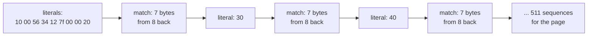
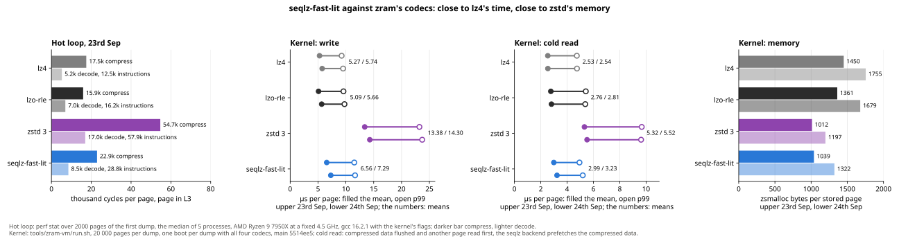
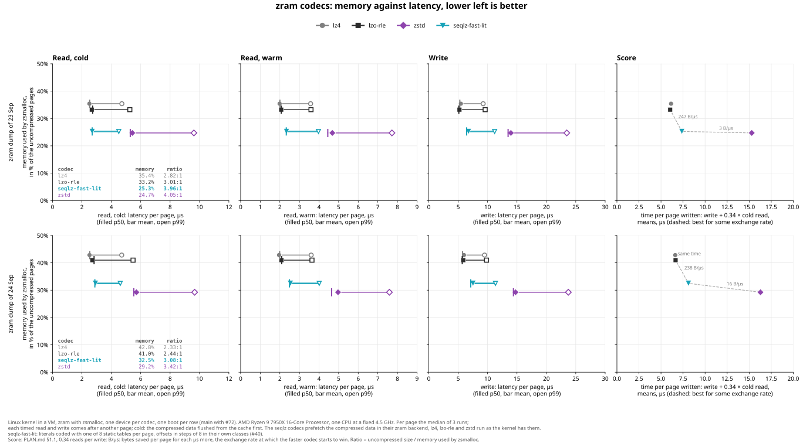
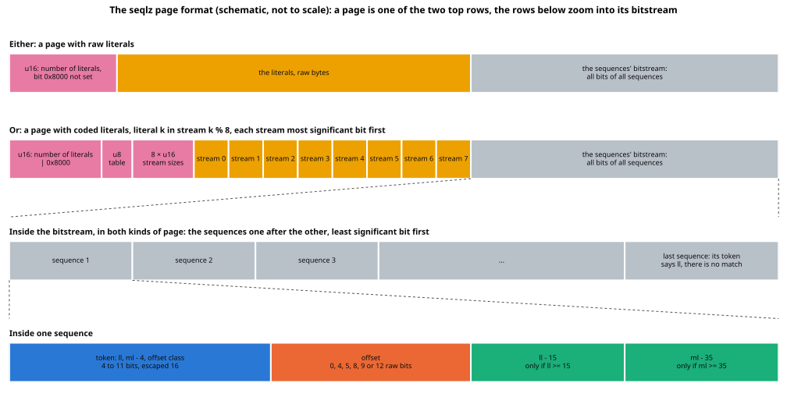
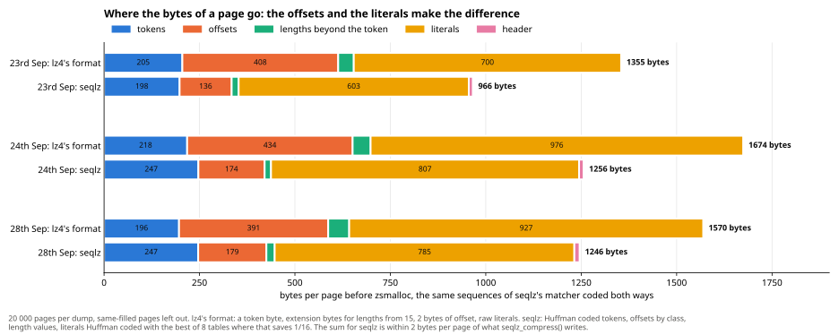
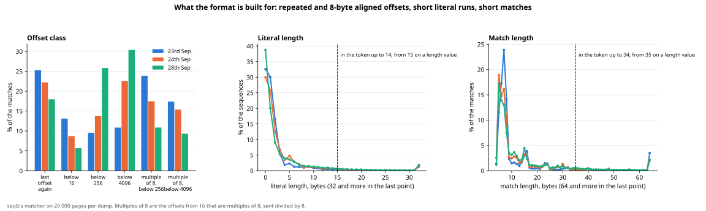
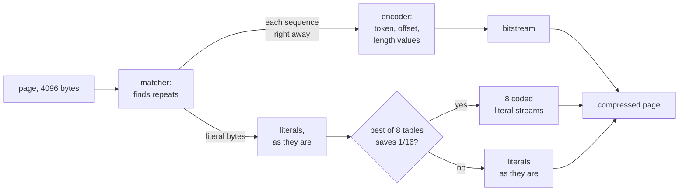
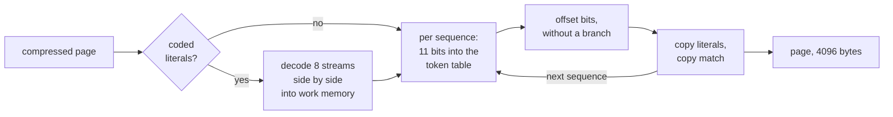

# seqlz: how it works, and why

*How to store a memory page almost as small as `zstd` does, almost as fast as `lz4` does.*

> [!NOTE]
> **In short.** zram keeps swapped-out memory pages compressed in RAM. On the pages my desktop swapped
> there, `seqlz-fast-lit` stores a page in **24% and 21% fewer bytes** than `lzo-rle`, zram's default,
> and 29% and 24% fewer than `lz4`, the fastest common choice. It takes **22% and 24% more time** than
> `lz4` to write a page and 7% and 13% more to read one. `zstd`, which compresses best, stores a page
> in 2% and 10% fewer bytes than `seqlz-fast-lit`, but takes twice the time to write and 2.0 and 1.9
> times the time to read. Each pair of numbers is for two sets of pages, see below.

This document explains how `seqlz` works for someone who has not written a compressor before. Every
term is explained where it is first used, and the [glossary](#glossary) at the end lists them all.
The exact bytes of a compressed page, for writing a decoder, are in [format.md](format.md); the
history of every idea, also of the ones that failed, is in [explored-designs.md](explored-designs.md).
The code is in [`src/seqlz.c`](../src/seqlz.c), [`src/seqlz.h`](../src/seqlz.h) and
[`src/page_lz.h`](../src/page_lz.h).

## How to read this

* **If you are new to compression,** read [Compression in five minutes](#compression-in-five-minutes),
  [What makes zram different](#what-makes-zram-different), [The result](#the-result-lz4s-time-zstds-size-almost)
  [What makes code slow on a CPU](#what-makes-code-slow-on-a-cpu), and [How seqlz stores a page](#how-seqlz-stores-a-page)
  up to and including [The literals](#the-literals-one-table-per-page-in-8-streams). The rest, and the parts
  folded away behind a click, are for readers who want to know why each detail is the way it is.
* **Watch it.** [seqlz, bit by bit](seqlz-bit-by-bit.html) decodes three real pages one step at a
  time, every bit coloured by what it means; [seqlz, compressed](seqlz-compressed.html) compresses
  them, from the first position the matcher tries to the header. GitHub shows only their source:
  download a file and open it in a browser.
* **Two names, one format.** `seqlz-fast` stores the leftover bytes of a page as they are,
  `seqlz-fast-lit` also compresses them. Both write the same format, and one decoder reads both.
  Numbers are for `seqlz-fast-lit` unless they say otherwise.
* **Dumps.** A dump is a copy of all pages that were in zram on my desktop at one moment. The numbers
  come from two of them: the first from 23rd September 2026, the second from 24th September. Two
  numbers like "1035 / 1331" or "24% and 21%" are the first and the second dump. "From 18% to 25%"
  is a range, over the dumps or over the codecs. One chart also has a third dump, from 28th September.
* **Two kinds of memory.** The **stored size** is how many bytes zram spends on one compressed page.
  The **work memory** is what the codec needs for its own buffers, once per CPU. "Smaller" in this
  document means the stored size.
* **Points.** A point is 1% of the 4096 bytes of a page, 41 bytes. A page stored in 25.3% of its size
  takes 1035 bytes; 0.5 points less means about 20 bytes less.
* **When it was measured.** [The result](#the-result-lz4s-time-zstds-size-almost), its charts and
  the cycle counts in [why it is fast](#why-it-is-nearly-as-fast-as-lz4) are from 5th October 2026,
  with the tables used before 7th October. The tables of 7th October, now in the code, store the pages
  of the first dump 0.3% and of the second 4% smaller than those of 6th October, at the same speed
  ([explored-designs.md](explored-designs.md#the-tables-trained-again-4-less-on-one-desktop-dump-the-phone-the-same)).
  They are trained on pages that programs had in RAM on a desktop, on a third zram dump of that desktop,
  and on a phone's zram dump, not on the two dumps measured here. The breakdowns further down, where the
  bytes and bits of a page go, were measured earlier still, with the tables used until 5th October and
  stream sizes of 2 bytes each. The stream sizes now take as many bits as the largest needs, which
  stores a page about 5 bytes smaller
  ([explored-designs.md](explored-designs.md#stream-sizes-in-as-many-bits-as-the-largest-needs-kept)).
  The code lengths and the byte counts in the examples are from the tables now in the code.

## Contents

* [Compression in five minutes](#compression-in-five-minutes)
* [What makes zram different](#what-makes-zram-different)
* [The result](#the-result-lz4s-time-zstds-size-almost)
* [What makes code slow on a CPU](#what-makes-code-slow-on-a-cpu)
* [How seqlz stores a page](#how-seqlz-stores-a-page)
* [The encoder](#the-encoder-one-pass-over-the-page)
* [The decoder](#the-decoder-one-table-lookup-per-sequence)
* [Why it is nearly as fast as lz4](#why-it-is-nearly-as-fast-as-lz4)
* [Why zstd still stores pages smaller](#why-zstd-still-stores-pages-smaller)
* [Next to lz4, lzo, lzo-rle and zstd](#next-to-lz4-lzo-lzo-rle-and-zstd-the-same-idea-written-down-differently)
* [What is not known yet](#what-is-not-known-yet)
* [The choices, with their numbers](#the-choices-with-their-numbers)
* [Glossary](#glossary)

## Compression in five minutes

Almost every fast compressor, `lz4`, `zstd` and `seqlz` included, is built from two ideas.

### Idea 1: say "that again" instead of repeating bytes

The part of the compressor that finds repeats is the **matcher**. It walks through the page. When
the next bytes appeared before, it takes a **match**: go back `offset` bytes and copy `ml` bytes.
When they did not, the bytes stay as they are, as **literals**. Memory pages are full of repeats,
because programs store arrays of similar things.

Here are the first 24 bytes of a page that holds an array of pointers, each pointing 16 bytes further
than the one before. x86 and arm64 store a number with its lowest byte first, so the pointer
0x7f1234560010 is the 8 bytes `10 00 56 34 12 7f 00 00`. One pointer per line:

```text
pointer 1:  10 00 56 34 12 7f 00 00
pointer 2:  20 00 56 34 12 7f 00 00
pointer 3:  30 00 56 34 12 7f 00 00
...
```

Every pointer differs from the one before only in its first byte (every 16th also in the second,
when 0xf0 + 0x10 carries over). The compressor writes the page as a list of **sequences**. A
sequence is always the same two steps: first `ll` literals, then one match of `ml` bytes from
`offset` bytes back.



| sequence | literals | `ll` | match | `ml` | offset |
| --- | --- | --- | --- | --- | --- |
| 1 | `10 00 56 34 12 7f 00 00 20` | 9 | `00 56 34 12 7f 00 00` | 7 | 8 |
| 2 | `30` | 1 | `00 56 34 12 7f 00 00` | 7 | 8 |
| 3 | `40` | 1 | `00 56 34 12 7f 00 00` | 7 | 8 |

`20` is a literal because nothing before it has that byte at that place; the 7 bytes after it equal
the 7 bytes 8 places back, so they are a match. The first sequence covers two pointers, so 512
pointers take 511 sequences. A match is at least 4 bytes long: a shorter one would cost about as many
bits as its bytes as literals, so the matcher does not look for them, and the format stores `ml - 4`
so that no number is spent on lengths 0 to 3. The last sequence of a page has only literals and no
match.

### Idea 2: frequent things get short codes

`lz4` writes every sequence in whole bytes: one byte holds `ll` and `ml` of a sequence, and every
offset takes two bytes, whatever they are. But some sequences are much more common than others. The
idea of a **Huffman code** is to give frequent things short codes and rare things long codes.

A small example. Say a page has only four kinds of sequence: A in half the cases, B in a quarter, C
and D in an eighth each. Give A the code `0`, B `10`, C `110` and D `111`. No code is the start of
another one, so a decoder reading bit by bit always knows where a code ends: `0 10 0 111 0` can only
be A B A D A. On average that is 1.75 bits for a kind of sequence, where 4 kinds in a fixed number of
bits need 2. A set of codes where no code is the start of another is a **prefix code**; a Huffman
code is the best prefix code for the frequencies.

The decoder does not read bit by bit. It takes the next 3 bits, the length of the longest code, and
looks them up in a table of 8 entries:

| next 3 bits | means |
| --- | --- |
| `000` to `011` | A, 1 bit used |
| `100`, `101` | B, 2 bits used |
| `110` | C, 3 bits used |
| `111` | D, 3 bits used |

Then it drops the bits it used and looks up the next 3. One lookup per code, whatever its length.
Every combination of 3 bits starts some code, the table has no empty entry: such a code is
**complete**, and then the decoder never has to check for bits that are no code. `seqlz`'s token table
works the same way, with 11 bits and 2048 entries.

In `seqlz` the thing coded is a **token**, one number for a whole sequence, see
[below](#one-sequence-a-token-and-the-offset). "1 literal, a match of 7 bytes, the same offset as
before", the pointer array's sequence, is one of the most common on real pages and gets 4 bits. A
rare sequence gets up to 11, the rarest 16.

> [!TIP]
> For the page of pointers above, `lz4` needs 2058 bytes, about 4 bytes per pointer: a byte for
> `ll` and `ml`, the literal, and 2 bytes of offset. `seqlz-fast-lit` needs 730 bytes, about 11.4 bits
> per pointer: a 4-bit token and the literal byte, Huffman coded too, and no offset at all, because it
> is the same as before. `lzo-rle` needs 1564 bytes and `zstd` 434.

The decoder needs the same table as the encoder. `zstd` builds tables for each chunk of its input and
stores them in front of it, which pays off for large inputs. `zstd` stores a table's code lengths
packed, and for the 256 byte values that takes about 64 bytes; on a page of 4 KiB that often costs
more than it saves. So `seqlz`'s tables are
built once, from many pages, and fixed in the code: the same for every page, and part of the format.
Fixed tables, and one lookup per sequence (see [the decoder](#the-decoder-one-table-lookup-per-sequence)),
make it much faster than `zstd`, which uses both ideas too; the second idea makes it smaller than
`lz4`, which uses only the first.

## What makes zram different

zram is a compressed swap device in RAM. When memory runs low, the kernel moves pages that were not
used for a while into zram, compressed. When a program touches such a page again, it waits until
zram has decompressed it. Four things follow from that, and they shape everything below:

> [!IMPORTANT]
> 1. **Every page is compressed on its own**, 4096 bytes, without the pages around it, so that any
>    page can be read back alone. There is no room to send a Huffman table with each page.
> 2. **Reading is on the critical path**: a program waits for it. Writing happens when the kernel
>    reclaims memory, often in the background, sometimes while a program waits for memory.
> 3. **The stored size is counted in size classes.** zram's allocator, zsmalloc, has slots of fixed
>    sizes, at least 16 bytes apart: a page compressed to 1001 bytes takes a slot of about 1008. A page
>    that compresses to 3625 bytes or more is stored uncompressed, as 4096 bytes; such pages and pages
>    filled with one repeated value never reach the codec on a read.
> 4. **The code runs in the kernel**: no floating point, no vector instructions, and each CPU may
>    compress a page at the same time, so each has its own work memory. On a phone every byte of it
>    counts: the project's limit is `lz4`'s work space, 16 416 bytes per CPU.

To compare codecs by their time, writes and reads go into one number, the time part of the score of
[plan.md](plan.md#11-the-score-memory-against-time-not-bars):

$$\text{time per page written} = t_\text{write} + 0.34 \cdot t_\text{read}$$

Here $t_\text{write}$ is the mean time to write a page and $t_\text{read}$ the mean time to read a
page back **cold**: its compressed bytes are not in any CPU cache, as for a page swapped out a while
ago. The 0.34 is measured: my desktop read one page back from zram for every three it swapped out,
3 146 179 pages read back from zram against 9 210 320 written to it in 27.5 days. So the number is what a codec costs per page
that goes into zram, its reads included. E.g. for `lz4` on the first dump it is 5.28 + 0.34 × 2.53 =
6.14 µs.

The stored size is the other side. Which codec is best depends on how many bytes one microsecond per
page is worth to you, an exchange rate between time and size. Say it is 100 bytes per µs. Going from
`lzo-rle` to `seqlz-fast-lit` costs 7.36 − 6.04 = 1.32 µs, worth 132 bytes, and saves 1361 − 1035 =
326 bytes: worth it. Going on to `zstd` costs 7.93 µs more, worth 793 bytes, and saves 23 bytes: not
worth it. plan.md's score adds both with such a rate.

## The result: lz4's time, zstd's size, almost



Measured in the real kernel, in a virtual machine, on 20 000 pages of each dump, on one desktop CPU
core, means over the pages, first dump / second dump:

| codec | stored bytes per page | write, µs | cold read, µs | time per page written, µs |
| --- | --- | --- | --- | --- |
| `lz4` (fastest) | 1450 / 1755 | 5.28 / 5.75 | 2.53 / 2.54 | 6.14 / 6.61 |
| `lzo-rle` (zram's default) | 1361 / 1679 | 5.11 / 5.69 | 2.73 / 2.83 | 6.04 / 6.65 |
| **`seqlz-fast-lit`** | **1035 / 1331** | **6.44 / 7.13** | **2.70 / 2.88** | **7.36 / 8.11** |
| `zstd` 3 (smallest) | 1012 / 1197 | 13.49 / 14.40 | 5.29 / 5.53 | 15.29 / 16.28 |

Compare the bold row with `lz4` and `zstd`: its size is close to `zstd`'s, its time close to
`lz4`'s. In the chart above, the three panels on the right have the numbers of the table, write,
cold read and stored bytes, each with the first dump above and the second below. The first panel,
"Hot loop", is the codec alone, outside the kernel, in a loop over pages that are in the CPU's
cache, in thousands of CPU cycles (ticks of the CPU's clock) per page: the darker bar compressing,
the lighter one decoding.

> [!NOTE]
> **How the times are measured, and what p99 is.** The VM is [`tools/zram-vm/run.sh`](../tools/zram-vm/run.sh),
> all codecs in one boot per dump, `seqlz-fast` too, one CPU of a Ryzen 9 7950X fixed at 4.5 GHz. A program in
> the VM writes each page to zram with `pwrite` and reads it back with `pread`, and times each call.
> So a time is the whole system call, zram and zsmalloc included, not only the codec. Each page is
> timed 3 times and its median counts. For a cold read, the compressed page is flushed from the CPU
> cache first. The **mean** is the average over the 20 000 pages, the **median** or p50 the time half
> of them stay below. For **p99** the 20 000 times are sorted: p99 is the one at position 19 800, so
> 99% of the pages are done faster and the slowest 200 take longer. The mean says how much time all
> pages cost together; p99 shows whether some pages are much slower than the rest, and a program
> that waits for such a page feels it.

<details>
<summary>The slowest pages, p99, and the work memory</summary>

At p99 `seqlz-fast-lit` reads cold pages in 4.51 and 4.61 µs, faster than `lzo-rle` (5.26 and 5.48)
and than `lz4` (4.72 and 4.71). It writes in 11.2 and 11.3 µs, where `lz4` needs 9.3 and 9.5 and
`zstd` 23.5 and 23.7. Its work memory is 12 304 bytes per CPU: the matcher's table of
8192 bytes and a buffer of 4112 bytes the decoder decodes literals into. `lz4`'s is 16 440: the
16 416 bytes of work space the limit is about, and a small struct. Two things are not work memory:
the buffer the compressed page is written into is zram's, two pages per CPU for every codec, and the
tables for encoder and decoder, 43 280 bytes, are built once per zram device from the fixed code
lengths and shared by all CPUs.

</details>

No codec is better on both counts: nothing stores pages smaller than `seqlz-fast-lit` without taking
twice its time, and nothing is faster without taking at least 26% more bytes. `zstd` saves 3 and 16
bytes per page for each µs more than `seqlz-fast-lit`, and `seqlz-fast-lit` saves 247 and 238 bytes
per page for each µs more than `lzo-rle`. So if a µs is worth less than 16 bytes to you, `zstd`'s
smaller pages pay for its extra time, at least on the second dump. If a µs is worth more than about
240 bytes, `lzo-rle`'s saved time beats `seqlz-fast-lit`'s smaller pages. In between,
`seqlz-fast-lit` is the best choice on both dumps. The chart below shows it.



How to read this chart: one row per dump. In each panel a codec's stored size is up and down, its
time left and right, so lower left is better; the panels are the time to read cold, to read warm,
to write, and the time per page written, the "Score". The markers are the median (filled), the mean
(bar) and p99 (open). In the Score panel the dashed line joins the codecs that are the best choice
for some exchange rate, and "B/µs" is the bytes saved per µs between two of them. The table in each
row has the stored size in % of the page and the ratio, e.g. 3.94:1: the page's size divided by its
stored size.

## What makes code slow on a CPU

The rest of this document explains `seqlz`'s speed with three things a CPU does. Here they are in
short, since they decide most of the design.

> [!NOTE]
> * **Waiting for memory.** Data that is not in a CPU cache takes about 100 ns to arrive from RAM.
>   The smallest and fastest cache, **L1**, holds a few dozen KiB and answers in about 1 ns. A table
>   that fits into L1 is cheap to look up; a page that is cold is in no cache at all.
> * **Wrong guesses at `if`s.** The CPU guesses which way a **branch**, an `if` or the end of a loop,
>   goes, and works ahead. A wrong guess, a **mispredicted branch**, throws that work away, about 15
>   to 20 cycles. Code "without a branch" computes both outcomes and picks one with arithmetic.
> * **Steps that wait for each other.** A CPU core runs several independent instructions per cycle,
>   but a step that needs the result of the step before has to wait for it. A **chain** of such steps
>   sets the speed. The small cores of phones, such as the Cortex-A55, are **in-order**: they run
>   instructions strictly in the order of the program and cannot work ahead around a step that waits,
>   so every instruction on a chain costs time.

## How seqlz stores a page

### The big picture



`lz4` writes the sequences one after the other, each in whole bytes, with its literals in the middle
of it. `seqlz` takes the page apart into two parts: all literals of the page in one block, and all
the rest of the sequences, packed as bits:

```text
lz4:    [token | literals | offset] [token | literals | offset] ...    each sequence in whole bytes
seqlz:  [header] [all literals of the page] [the sequences, as bits, one after the other]
```

Keeping the literals in one block lets them be coded as a whole, with one table for the page, and
leaves the sequences as a pure stream of bits, the **bitstream**. The chart above shows both kinds of
page `seqlz` writes: the top row with the literals as they are, the second with them coded; the rows
below zoom into the bitstream, which is the same in both.

### One sequence: a token and the offset

Each sequence in the bitstream has up to four parts:

| part | bits | what it says |
| --- | --- | --- |
| **token** | 4 to 11, Huffman coded; 16 if escaped | `ll` and `ml - 4` up to a cap, and the offset class |
| **offset bits** | 0 to 12, plain bits | the offset, stored as its class says |
| **`ll` value** | Huffman code and plain bits | only if `ll` is 15 or more: the rest of `ll` |
| **`ml` value** | Huffman code and plain bits | only if `ml` is 35 or more: the rest of `ml` |

The **token** is one number that holds three things:

    token = min(ll, 15) + 16 × min(ml − 4, 31) + 512 × class

Like hours, minutes and seconds packed into one number of seconds, it is easy to take apart again:
`ll` is `token mod 16`, `ml − 4` is `(token div 16) mod 32`, the class is `token div 512`. That gives
16 × 32 × 6 = 3072 tokens, and the Huffman code is for the whole token. `ll` from 0 to 14 and `ml`
from 4 to 34 fit into the token; a 15 for `ll` means "15 or more, the rest follows as an `ll` value",
and 31 for `ml − 4` the same for `ml`.

**The offset class is part of the token.** It says how the offset is stored:

| class | the offset is | offset bits | the encoder uses it for |
| --- | --- | --- | --- |
| 0 | the **repeat offset**: the same as the match before | 0 | an offset equal to the one before |
| 1 | the 4 bits | 4 | offsets below 16 |
| 2 | the 8 bits | 8 | offsets below 256 |
| 3 | the 12 bits | 12 | offsets below 4096 |
| 4 | the 5 bits × 8 | 5 | multiples of 8 from 16, below 256 |
| 5 | the 9 bits × 8 | 9 | multiples of 8 from 256 |

Memory is full of 8-byte things, pointers and 8-byte fields, so an offset that is a multiple of 8 is
common, and classes 4 and 5 store it divided by 8, 3 bits shorter. At the start of a page the
repeat offset is 1, so class 0 works for the first match too. The offset bits are plain binary,
not Huffman coded. Putting the class into the token makes the average token code about 2 bits longer;
a code of its own for the class would cost about 2.5 bits, so the token saves about half a bit per
sequence there, and the decoder a second table lookup. Against a Huffman code for the offset's
number of bits, which `seqlz` had before, plain offset bits cost 0.4 points, see
[the choices](#the-choices-with-their-numbers). The token's code can also use that class
and lengths go together: a match of 4 bytes has almost always the repeat offset, because at a new
offset 4 bytes are barely worth a match, and 29% and 36% of the matches with a class 3 offset are 5
bytes long, against 12% and 19% of all matches.

Here is one sequence taken apart: 2 literals, a match of 7 bytes, 16 bytes back.

* `ll` = 2, `ml` = 7, so `ml − 4` = 3.
* The offset 16 is a multiple of 8 and below 256: class 4, sent as 16 / 8 = 2 in 5 bits.
* The token is `2 + 16 × 3 + 512 × 4 = 2098`. Its Huffman code in the table has 9 bits.
* Both lengths fit into the token, so there are no length values.

The sequence costs 9 + 5 = 14 bits, plus the 2 literal bytes. In `lz4`'s format the same sequence is
a token byte, the 2 literal bytes and 2 bytes of offset: 24 bits plus the literals. The pointer
array's sequence is token 49: "1 literal, a match of 7 bytes, the repeat offset", `1 + 16 × 3 +
512 × 0 = 49`, with a 4-bit code and no offset bits.

**Escapes.** Only 576 of the 3072 tokens have a code of their own. Each of the other 2496 is rare,
but together they are a good part of the sequences, 14 to 38 of about 200 per page on my dumps. So
they share one code, the **escape**, followed by the token's number in 12 plain bits: 4 + 12 = 16
bits. The escape is itself a frequent **symbol**, a thing that gets a code, and has a 4-bit code. Giving codes to more tokens would
make the codes of the frequent ones longer, and those matter more.

There is no count of the sequences: the last one is the one whose literals fill the page, and it has
no match.

### A sequence takes 14 to 16 bits, against 25 in lz4

Measured on the same 20 000 pages of each dump, without the literals:

| bits per sequence, mean | first dump | second dump |
| --- | --- | --- |
| token, the offset class included | 7.7 | 9.1 |
| offset | 5.4 | 6.4 |
| `ll` and `ml` values | 0.7 | 0.6 |
| **`seqlz`, total** | **13.8** | **16.1** |
| the same sequences in `lz4`'s format | 25.5 | 25.7 |

`lz4`'s 25.5 bits are its token byte, the 2 bytes of offset, and now and then a byte for a long
length. The median `seqlz` sequence takes 13 bits on the first dump and 16 on the second. The
shortest take 4 bits, a frequent token with the repeat offset. 99% take at most 31 bits, the longest
59, with a long `ll` and a long `ml` value. The literals come on top: 8 bits each when they are stored
as they are, fewer when they are coded, see [the literals](#the-literals-one-table-per-page-in-8-streams).

### Where the bytes go

The same sequences, from `seqlz`'s own matcher, cost this many bytes per page in `lz4`'s format and
in `seqlz`'s, as written, before zsmalloc rounds them up to its size classes:



| bytes per page, first dump | `lz4`'s format | `seqlz` | saved |
| --- | --- | --- | --- |
| tokens | 205 | 198 | 7 |
| **offsets** | **408** | **136** | **272** |
| lengths beyond the token | 41 | 18 | 23 |
| **literals** | **700** | **603** | **97** |
| header, on average | 0 | 11 | -11 |
| total | 1355 | 966 | 389 |

The totals are smaller than the stored sizes in [the result](#the-result-lz4s-time-zstds-size-almost),
1035 and 1450, because zsmalloc rounds every page up to its size class and stores pages of 3625
bytes or more as 4096; and the `lz4` column uses `seqlz`'s matches, not `lz4`'s own. The chart also
has the third dump, from 28th September.

> [!NOTE]
> **The offsets are two thirds of the gain.** `lz4` spends 2 bytes on every offset. `seqlz` spends 0
> bits on a repeat offset, 5 or 9 bits on one that is a multiple of 8, and 4 or 8 bits on a short one,
> instead of 16.



The chart shows how often each offset class, each literal length and each match length occurs, with
lines where the token's caps are:

* **18% to 25%** of the matches have the repeat offset: 0 bits.
* **20% to 41%** are multiples of 8: 5 or 9 bits instead of 8 or 12.
* Of the rest, many are short: below 16 in 4 bits, below 256 in 8.

**The literals are the second part.** The matcher already took out the repeated runs of bytes. What
is left are single bytes, and some byte values are far more common than others: zero, ASCII letters,
small numbers. 50% to 69% of the pages get their literals coded, and over all pages the literals get
14% to 17% smaller.

**The tokens cost about the same as `lz4`'s token byte**, 198 against 205 bytes per page, but they
also carry the offset class, and a length value follows only after 8.5% of the matches.

### The literals: one table per page, in 8 streams

A page's literals are stored as they are, or all of them are Huffman coded with **one** of 8 fixed
**literal tables**. The encoder chooses once per page, not per literal and not per sequence, and the
choice costs 3 bits of header, the table's number. A choice per literal would need 3 more bits for
every literal, just to say which table.

The 8 tables are fixed in the code and part of the format. They were trained on the pages programs
had in RAM on a desktop, on pages that desktop swapped, and on the pages of a phone's zram: a
clustering method, k-means, puts pages whose literals look alike into one group, and each table is the
Huffman code of one group, see
[explored-designs.md](explored-designs.md#the-tables-trained-again-4-less-on-one-desktop-dump-the-phone-the-same).
So the tables are quite different. How many bits each table spends on a few byte values:

| byte | table 0 | 1 | 2 | 3 | 4 | 5 | 6 | 7 |
| --- | --- | --- | --- | --- | --- | --- | --- | --- |
| `00` | 8 | 2 | 2 | 2 | 2 | 9 | 3 | 8 |
| `20`, a space | 4 | 7 | 7 | 6 | 7 | 9 | 8 | 8 |
| `65`, the letter `e` | 4 | 9 | 10 | 5 | 9 | 9 | 10 | 10 |
| `ff` | 10 | 7 | 9 | 8 | 8 | 10 | 4 | 10 |

Table 0 gives `e` and the space 4 bits each, so it fits text. Tables 1 to 4 give `00` 2 bits, they fit
pages with many zero bytes. Table 6 gives `ff` 4 bits. Table 7 is for pages of a few other bytes: it
gives `c1` 2 bits and `00` 8.

**Picking the table.** The encoder adds up the code lengths of all literals of the page in all 8
tables and takes the table with the smallest sum. E.g. for the literals `65 20 65 00`:

| literal | table 0 | 1 | 2 | 3 | 4 | 5 | 6 | 7 |
| --- | --- | --- | --- | --- | --- | --- | --- | --- |
| `65` | 4 | 9 | 10 | 5 | 9 | 9 | 10 | 10 |
| `20` | 4 | 7 | 7 | 6 | 7 | 9 | 8 | 8 |
| `65` | 4 | 9 | 10 | 5 | 9 | 9 | 10 | 10 |
| `00` | 8 | 2 | 2 | 2 | 2 | 9 | 3 | 8 |
| **sum** | 20 | 27 | 29 | **18** | 27 | 36 | 31 | 36 |

Table 3 wins with 18 bits, where the bytes as they are take 32. Table 0 fits text better, but one zero
byte costs it 8 bits.

<details>
<summary>How the 8 sums are one addition per literal</summary>

For each of the 256 byte values the encoder has a 64-bit number with the byte's code lengths in all 8
tables, one table per byte of the number. Adding up these numbers adds all 8 sums at once, so each
row of the table above is one 64-bit addition for the CPU, not 8. The encoder keeps 8 such sums, one
per stream, because each stream is rounded up to whole bytes on its own. A byte of a sum holds at
most 255 and a code has at most 10 bits, so every 200 literals of the page, 25 per stream, the sums
are added into two other 64-bit numbers per stream, with 4 sums of 16 bits each, before they can
overflow. This was measured at 30 to 40 ns per write in the
kernel, about 1.5% of a write. Writing the coded literals afterwards costs much more, about 0.6 ns
per literal.

</details>

**The 1/16 rule.** The encoder codes the literals only if the 8 streams and 51 bytes more are smaller
than 15/16 of the literals as they are, `coded + 51 < n − n / 16` in
[`code_literals()`](../src/seqlz.c) for `n` literals. zsmalloc's size classes are at least 16 bytes
apart, so saving a few bytes mostly saves nothing, and coding the literals whenever they save
anything gave less than 0.1 points more, for decoding time on every such page. The 51 bytes are for
the phone: a page with coded literals costs a fixed time to read, its literal table and the buffer the
literals are decoded into, and on the phone's little core that is several µs. With 51 instead of 19
bytes, pages are 7.9 bytes larger and the time per page written 2.7 µs shorter on the phone's little
core, 1.1 µs on its big core; on the PC it is 11 bytes for 0.1 µs.
`seqlz-fast` never codes literals.

**8 streams, all with the same table.** The coded literals are dealt out like cards: literal 0 goes
into stream 0, literal 1 into stream 1, and so on up to literal 7 in stream 7. Literal 8 goes into
stream 0 again:

```text
the page's literals:  L0  L1  L2  L3  L4  L5  L6  L7  L8  L9  L10 L11 ...
stream 0:             L0  L8  L16 L24 ...
stream 1:             L1  L9  L17 L25 ...
stream 2:             L2  L10 L18 L26 ...
...
stream 7:             L7  L15 L23 L31 ...
```

This is only for the speed of the decoder. To decode one literal, it looks at the next 10 bits of
its stream, looks them up in the table of 1024 entries, writes the byte, and moves the stream on by
the code length. Only then does it know where the next literal of that stream starts: in one stream
that is a chain, look up, move on, look up, and every step waits for the one before. 8 streams are 8
chains that do not wait for each other, and a CPU works on them side by side. With 4 streams a
literal took 2.9 cycles to decode, and 8 streams made decoding a page 4% faster than 4. The streams
cost no bits for the codes, which depend only on the literal, but each stream's size is in the header,
and each stream is filled up to a whole byte: going from 4 to 8 streams cost 0.1 to 0.2 points, when
a size took 2 bytes.

> [!NOTE]
> **The 8 streams have nothing to do with the 8 tables.** All 8 streams of a page are coded with the
> page's one table. That both are 8 is a coincidence: the number of tables was chosen for size, 16
> tables saved only 0.1 to 0.3 points more, and the number of streams for the decoder's speed.

Before the first sequence, the decoder decodes all literals of the page this way into a buffer of
work memory, 8 at a time. Then they are in their order, as if they had been stored as they are, and
the sequences take them from there, the same way for both kinds of page.

### The bytes of a page

Now the header can be read. Its first 2 bytes are the number of literals, a page has at most 4096,
and 4096 fits into 13 bits, so the top bit of the 2 bytes is free: set means coded literals.

| kind of page | layout |
| --- | --- |
| **literals as they are** | 2 bytes: the number of literals · the literals · the bitstream |
| **coded literals** | 2 bytes: the number of literals with the top bit set · 1 byte: which literal table, and how many bits `w` each stream size takes, 5 to 12 · `w` bytes: the 8 sizes of `w` bits each · the 8 streams · the bitstream |

The 8 sizes take as many bits as the largest stream needs, at least 5: 8 numbers of `w` bits are
exactly `w` bytes. A page whose largest stream has 100 bytes takes 7 bits per size, a header of 3 + 7 =
10 bytes. A stream can't be larger than 640 bytes, 512 literals of at most 10 bits, so 12 bits are
always enough, also on pages of 16 KiB; byte 2 has the table in 3 bits, `w − 5` in 3 bits, and 2 bits
that are 0, kept for later.
Most pages have streams below 128 bytes. With 2 bytes per size, as until 5th October, the header was
19 bytes, and pages were 5.2 and 5.5 bytes larger on average.

The bitstream has no length of its own: it goes to the end of the compressed page, and zram stores
that page's size.

E.g. the 9 bytes `02 00 61 62 dc 65 ef db 8a` are a page of `ab` 2048 times. `02 00` is the number of
literals, 2, with the top bit clear; `61 62` are the literals `a` and `b`. The 40 bits after them are
one sequence and the end: the code of token 1010 (`ll` 2, `ml − 4` 31, class 1), 4 offset bits for
offset 2, a length value that makes `ml` 4094, the rest of the page, and the code of token 0, the last
sequence with 0 literals. [format.md](format.md#example) takes it apart bit by bit.

<details>
<summary>Why the tables are fixed, and why there are no tables per device</summary>

A literal table of its own for each page, where that saves 16 bytes, made writes 13% and 15% slower
for 0.3 and 4.6 points less; with one of 4 token tables as well, 43% slower for 2.6 and 6.6 points.
zram can pass a dictionary to the codec, a block of bytes set for each zram device, and tables
trained on a phone's own pages could have come that way. They saved at most 1% on another dump of the same phone, so there are none: one
set of tables for all, trained on other pages than the ones the numbers here are measured on.

</details>

## The encoder: one pass over the page



The matcher, [`match_page()`](../src/page_lz.h), is **greedy**: it takes the first match it
finds, without checking whether one that starts a byte later would be longer.

1. At every position it checks two candidates: the repeat offset, and the last position whose next
   5 bytes had the same hash, from a table of 4096 positions, 8 KiB, cleared for each page. The
   table can hold a position with other bytes, see [below](#the-table-of-positions-is-a-cache-not-a-map).
2. On a match it extends it backwards, because the bytes just before the found position may match
   too, and forwards, and hands the sequence to the encoder right away. Matcher and encoder are one
   loop.
3. The encoder's output buffer is zram's and two pages long. The literals go to its start, after the header;
   the sequences' bits are written behind room for a page of literals, and moved down behind the
   literals at the end. The bits are collected in a 64-bit variable and written to memory once per
   sequence, twice when it has an `ll` value.
4. At the end it picks the literal table and writes the 8 streams if they save 1/16, see [the
   literals](#the-literals-one-table-per-page-in-8-streams).

Two pages are always enough: a sequence takes at most 28 bits for its token and offset, an escaped
token and a 12-bit offset, and covers at least 4 bytes of the page, so the bits of a page never take
more than about 3600 bytes. Behind the header, a page of literals and 16 bytes of room for the
decoder's 16-byte copies, there are 4078.

### The table of positions is a cache, not a map

The table has 4096 slots of 2 bytes, and each slot holds one position in the page. At every position
the matcher computes a **hash** of the next 5 bytes: a number from 0 to 4095 that depends on all 5
bytes, the slot to look in. E.g. `10 00 56 34 12` goes to slot 1533 and `20 00 56 34 12` to 1305.

* **Looking up** reads the one slot. The position in it is only a candidate: the matcher compares 4
  bytes there with the 4 bytes at the current position, and only if they are equal it is a match.
  4 bytes are enough, because that is the shortest match; the match is then extended.
* **Inserting** writes the current position into the slot and overwrites what was there. There is no
  second slot and no list of older positions.

Two different byte strings with the same hash, a **collision**, overwrite each other, and the older
one is lost. That costs a match now and then, never a wrong result, because every candidate is
compared first. It keeps the matcher at one memory read and one write per position.

<details>
<summary>The hash, and what keeping more positions would give</summary>

The matcher reads 8 bytes at a position and hashes the lowest 5 with a multiplication and a shift,
the hash of `zstd`: `v << 24` keeps the 5 bytes, the multiplication by an odd constant mixes them,
and the top 12 bits of the product, which depend on all 40 bits, are the slot. Positions inside a
match are not inserted, only the one 2 bytes before its end, which is where the next match often
starts; the table is cleared for each page, so all its positions are in the current page. Both
candidates are read before either is compared, so that one branch decides, not three.

Keeping more was measured, and each way costs about as much time as it saves bytes:

| variant | stored size, first / second dump | compress cycles per page |
| --- | --- | --- |
| the matcher kept, as measured then | 24.6% / 31.8% | about 22 500 |
| twice the slots, 16 KiB, more work memory than `lz4` | 24.4% / 31.6% | 1.2% more with an older matcher |
| half the slots, 4 KiB | 0.2 points more | the same with an older matcher |
| 1 older position per slot, the longer match wins | 24.4% / 31.5% | 26 400 |
| 3 older positions per slot | 24.2% / 31.4% | 28 400 |

These are from an older version of the matcher, and are sizes as written, before zsmalloc rounds
them up, so they are lower than the 25.4% of the result; the differences between the rows are what
counts. So collisions are not what the matcher misses. It misses older places with the same bytes,
which only a search through more positions finds.

The hash covers 5 bytes and not 4 for speed. A table on 4 bytes finds many more matches of 4 bytes,
and checking them costs time, while with coded literals such a match saves little: it costs about as
many bits as its 4 bytes as literals. 5 bytes cost 0.6 points and save 5% of the compress cycles, see
[the choices](#the-choices-with-their-numbers). Matches of 4 bytes at the repeat offset are still
found without the table.

</details>

## The decoder: one table lookup per sequence



The decoder keeps up to 64 bits of the bitstream in a **register**, a variable inside the CPU
itself, and takes codes off it. Per sequence
it:

1. loads the next bytes into the register if fewer than 23 bits are left: enough for a token with a
   code of its own, 11 bits, and a 12-bit offset. An escaped token, and a length value, load more
   before they read. On a core that runs instructions out of order, a sequence without a length value
   instead loads every second time without asking, because whether the bits run short is a branch the
   CPU guesses wrong on a page it has not seen
   ([explored-designs.md](explored-designs.md#the-refill-without-its-branch-every-second-fast-sequence-63-ns-less-per-swap-in-on-x86-64-and-the-a76-kept));
2. looks up the next 11 bits in the token table, like the 3-bit table in
   [Idea 2](#idea-2-frequent-things-get-short-codes). The bitstream is read highest bit first, so
   these are the top 11 bits of the register, and the entries of a short code are next to each other
   in the table: a page needs fewer of its cache lines. The entry has `ll`, `ml`, how many bits the
   sequence takes, how to cut the offset out of the bits after the token, and whether a length value
   follows. Unpacking the offset class at run time instead took 18 instructions, which matters on an
   in-order core;
3. takes the offset bits right after the token, or the repeat offset for class 0, without a branch;
4. copies the literals and the match. Most sequences are short, so it copies a fixed 16 bytes of
   literals and 16 to 40 of the match without a loop, if both lengths fit into the token and there is
   room in the page, and then moves on by the real lengths: with `ll` = 3 it copies 16 bytes and moves
   3 on, and the next sequence overwrites the other 13. Otherwise it reads the length values and
   copies with loops.

A match can overlap the bytes it writes. With offset 1 and length 6 after an `a`, each byte it copies
is the one it just wrote, and the result is `aaaaaa`: that is how a run of zeros compresses. So the
match is copied front to back, never with a block copy that reads all bytes first.

<details>
<summary>Overlapping matches fast, and checking the input</summary>

For an offset below 8 the decoder builds the first 8 bytes of the match in a register: with offset 3
after `abc`, the register gets `abcabcab`. Then it stores the register again and again, each time 6
bytes further, the largest multiple of the offset up to 8, so that no step reads what the step before
just wrote. A long match with a short offset gets a loop of such stores.

Every length and offset is checked against the room in the page and the literals left before it is
used, so a damaged page is rejected and never makes the decoder read or write outside its buffers.
A literal stream whose literals need more bits than its size makes the page invalid: the decoder reads
8 bytes of a stream at a time and may read into the next one, so it checks at the end that each stream
stayed within its bytes. The fuzz tests in [`fuzz/`](../fuzz) feed the decoder billions of random and
damaged pages to keep it that way, and hold it against a second decoder, `tools/seqlz-ref/seqlz_ref.c`, written
from [format.md](format.md) alone: both have to call the same pages valid and decode them to the same
bytes. The work per page has a bound, at most `PAGE / 4 + 1` sequences; the slowest pages found decode
in 1.3 times the p99 of real pages
([explored-designs.md](explored-designs.md#the-worst-case-the-slowest-pages-found-cost-13-times-the-p99-of-real-ones-as-for-lz4)).

</details>

## Why it is nearly as fast as lz4

`seqlz` decodes with 2.1 times the instructions of `lz4`, 25 284 against 11 899 per page. But the
CPU runs 3.3 of its instructions per cycle, against 2.4 for `lz4`, because more of `seqlz`'s work is
independent: 7609 cycles against 4992, with the page in the cache. In the kernel the reads are closer
still, 2.70 against 2.53 µs, because the system call and getting the cold page from memory cost the
same for every codec.

> [!WARNING]
> These numbers decode every page more than once, in a loop or in zram's read benchmark, and that
> trains the CPU's branch predictor on the page. In a real swap-in `seqlz-fast-lit` mispredicts about
> 110 branches per page more, and `zcomp_decompress()` takes 2.0 µs against 1.4 µs for `lz4`
> ([explored-designs.md](explored-designs.md#the-decoder-in-a-fault-found-110-branch-mispredictions-per-page-that-a-decode-of-the-same-page-before-hides)).

| what | why it matters |
| --- | --- |
| **one table lookup per sequence** | the offset class is in the token, not a second symbol; the chain from one sequence to the next is lookup, shift, lookup |
| **fixed tables, small enough for L1** | the token table has 2048 entries of 4 bytes, the page's literal table 1024 of 2 bytes, the two length tables 256 of 4 bytes, 12 KiB together; nothing is built from the page, where `zstd` builds its literal table for each page with coded literals |
| **only complete Huffman codes** | every bit pattern starts a code, so the decoder never checks for one that does not |
| **the common sequence has no loop and no length value** | literal runs up to 14 bytes and matches up to 34 bytes are the token alone, and fixed copies of 16 to 40 bytes cover them |
| **literals in 8 streams** | 8 chains of work side by side instead of one |
| **the compressed data is fetched early** | zram asks the CPU to load it before decoding starts (a prefetch), so it is on its way while the decoder sets up; this helps every codec, it made `lz4`'s p99 read 30% faster |

Writing takes 1.22 and 1.24 times `lz4`'s time: the matcher alone costs about as much as all of
`lz4`, and coding sequences and literals comes on top. `zstd` 3 needs 2.4 times `seqlz`'s cycles to
compress (54 037 against 22 076 per page) and 2.2 times to decode (16 489 against 7609).

## Why zstd still stores pages smaller

On the second dump `zstd` 3 stores pages 10% smaller than `seqlz-fast-lit`, on the first 3%. Three
things make the difference, each measured:

* **Better matches.** `zstd` 3 searches more. The matches of `lz4hc`, `lz4`'s slow and thorough
  compressor, coded by `seqlz` take 3% and 7% fewer bytes than `seqlz`'s greedy matcher, but a matcher
  that searches that much takes more time than zram's writes can spend.
* **Its own literal table per page.** Coding the literals is worth 2.3 and 4.7 points to `zstd` 3.
  A page's own table instead of the best of 8 fixed ones would save `seqlz` 0.3 and 4.6 points more,
  for 13% to 15% slower writes.
* **Adaptive sequence coding.** `zstd` codes literal length, match length and offset with separate
  tables, which it can pick or build for each chunk of data; decoding them takes three lookups per
  sequence. `seqlz`'s one fixed token table is what keeps its decoder fast.

> [!NOTE]
> Where the ratio of `zstd` comes from in the first place, measured on the whole first dump: the best
> matches of `lz4hc` in `lz4`'s format take 30.7% of the page, the same matches with Huffman coded
> sequences 25.8%, and with coded literals as well 23.6%. **Coding the sequences is the largest step**,
> and that is what `seqlz` is built on. See
> [explored-designs.md](explored-designs.md#where-the-ratio-of-zstd-comes-from).

## Next to lz4, lzo, lzo-rle and zstd: the same idea, written down differently

All five codecs zram can run here do the same thing at the core: they cut a page into sequences of
literals and a match, "copy `ml` bytes from `offset` back". They differ in two places. The encoder
searches more or less hard for matches, and the format writes the three numbers of a sequence down in
whole bytes or in bits. `lz4`, `lzo` and `lzo-rle` write bytes and have no tables at all. `zstd` and
`seqlz` write bits with Huffman-like codes: `zstd` builds its tables from the data and sends them along,
`seqlz`'s are fixed and part of the format. The facts below are from the kernel's sources, `lib/lz4/`,
`lib/lzo/` with
[Documentation/staging/lzo.rst](https://docs.kernel.org/staging/lzo.html), and `lib/zstd/`, at
`986c24e0fe44`, for a 4 KiB page.

### Finding the matches

| | `lz4` | `lzo`, `lzo-rle` | `zstd` 3 | `seqlz` |
| --- | --- | --- | --- | --- |
| hash table | 8192 positions of 2 bytes | 8192 positions of 2 bytes | two: one on 8 bytes, one on 4 | 4096 positions of 2 bytes |
| bytes hashed | 4 | 4 | 8 and 4 | 5 |
| candidates per position | 1 | 1 | the repeat offset, then the 8-byte table, then the 4-byte one | the repeat offset and 1 from the table |
| shortest match | 4 | 4 | 4 | 4 |
| extends a match backwards | yes | no | yes | yes |
| skips ahead without matches | yes, a step longer every 64 misses | yes, 1 + 1/32 of the literals since the last match | yes | no |

All of them are greedy: they take a match when they find one and do not look whether a byte later
starts a longer one. `zstd` 3 is the one that searches more. It looks for a long match on 8 bytes
first and falls back to 4. When it finds a short match, it also checks whether a long one starts one
byte later. `lz4` and `lzo` look at one candidate. `seqlz` looks at two, and one of them, the repeat
offset, costs no table lookup, and 18% to 25% of the matches have it.

`lz4`, `lzo` and `zstd` skip ahead over data without matches, faster the longer they find none. That
saves time on data that does not compress. `seqlz` did the same until the step needed more work in its
loop than it saved: without it, pages that compress are written 5% faster, and pages that zram stores
uncompressed take 2.3 µs longer
([explored-designs.md](explored-designs.md#the-matcher-without-its-step-writes-1-to-3-faster-kept)).

`lzo-rle`'s encoder adds one thing. Before it hashes, it checks for 4 zero bytes, and if they are
there, it measures the whole run of zeros, 8 bytes at a time.

### Writing a sequence down

| | `lz4` | `lzo` | `lzo-rle` | `zstd` 3 | `seqlz` |
| --- | --- | --- | --- | --- | --- |
| unit | bytes | bytes | bytes | bits | bits |
| `ll` and `ml` | 4 bits each in a token byte, then bytes of 255 | in the instruction byte; up to 3 literals in the 2 low bits of the instruction before | as `lzo` | a code each, from tables in the page | together in one token, Huffman coded with a fixed table |
| offset | always 2 bytes | 1 byte after the instruction below 2 KiB with a match up to 8 bytes, else 2 | as `lzo` | a code for its number of bits, then the bits; 3 repeat offsets | its class in the token, then 0 to 12 plain bits; 1 repeat offset, multiples of 8 divided by 8 |
| literals | as they are, between the sequences | as they are, between the sequences | as they are, between the sequences | Huffman, a table for the page in the page, 1 stream or 4 | in a block of their own, as they are or Huffman with 1 of 8 fixed tables, 8 streams |
| runs of zeros | a match at offset 1 | a match at offset 1 | one instruction of 4 bytes for 4 to 2051 zeros | a match at offset 1 | a match at the repeat offset, 1 at the start of a page |
| header and end | none | 3 bytes at the end | 2 bytes at the start, 3 at the end | about 10 bytes of frame and block header | 2 bytes, 8 to 15 with coded literals |

The sequence of [one sequence](#one-sequence-a-token-and-the-offset), 2 literals and 7 bytes from 16
bytes back, in each format, without the 2 literal bytes:

* **`lz4`**: the token byte with 2 and 7 − 4, then 2 bytes of offset. 24 bits.
* **`lzo` and `lzo-rle`**: the 2 literals are counted in the 2 low bits of the instruction before.
  The match is 5 to 8 bytes long and closer than 2 KiB, so it is one instruction byte, `1 L L D D D S
  S`, with the length and 3 bits of the offset, and one more byte with the rest of the offset. 16
  bits.
* **`zstd`**: three codes, for the literal length 2, the match length 7 and the offset's 4 bits, and
  the 4 bits of the offset. How many bits the codes take depends on the tables of the page, which come
  first. A frequent code can take less than 1 bit, because `zstd`'s codes for sequences are not
  Huffman codes but FSE, which can spend a fraction of a bit on a symbol.
* **`seqlz`**: one token with a 9-bit code, then the offset 16 / 8 = 2 in 5 bits. 14 bits.

`lzo` is cheaper than `lz4` for a short match nearby, 2 bytes against 3, because its instruction
byte has a layout for each range of distances and lengths, and it counts up to 3 literals in bits
that are there anyway. As far as I can say, that is where `lzo` and `lzo-rle` win their bytes against
`lz4`: on the first dump `lzo-rle` stores a page in 1361 bytes, `lz4` in 1450. The zero runs make
`lzo-rle` faster, not smaller, because a run of zeros was one match before too. In userspace on the
same pages `lzo-rle` compresses in 2.90 µs against 3.85 for `lzo`, and stores 1326 bytes against
1307 ([explored-designs.md](explored-designs.md#the-designs-by-the-score), the table "In
userspace the hull is the same").

### Tables, and what the decoder does per sequence

| | `lz4` | `lzo`, `lzo-rle` | `zstd` 3 | `seqlz` |
| --- | --- | --- | --- | --- |
| tables | none | none | built for each page from the description in it, or predefined ones | fixed, built once per zram device |
| per sequence | read the token, copy the literals, read 2 bytes of offset, copy the match | a branch on the top bits of the instruction, then the same | 3 FSE states step from one bitstream, read backwards, then copy | 1 table lookup for the token, the offset bits, copy |
| literals | copied with the sequence | copied with the sequence | Huffman decoded first, in 1 or 4 streams | Huffman decoded first, in 8 streams, if coded |
| work memory per CPU | 16 440 B, 16 384 of them the hash table | 16 384 B | 186 112 B | 12 304 B |
| memory per zram device | none | none | 91 496 B, a dictionary without content | 43 280 B, the decoded tables |

The byte formats are what makes `lz4` and `lzo` fast to decode: no bit is read, every length and
offset is a byte or two at a known place. `zstd` decodes its tables from the page before the first
sequence, and then each sequence steps three FSE states, for `ll`, `ml` and the offset. `seqlz` has
no tables to read from the page, and does one lookup per sequence: the token holds all three. That is
how [it is nearly as fast as lz4](#why-it-is-nearly-as-fast-as-lz4) and still codes its sequences in
bits. The memory is what the harness allocates as zram does, `quetschn-bench-<codec> --no-timing`;
`zstd`'s per device is the dictionary it creates even without one, which Sergey Senozhatsky's series
of October 2026 removes in its patch 3 (#103).

What `zstd` gets for its work is [smaller pages](#why-zstd-still-stores-pages-smaller): tables that fit
the page, three repeat offsets, and better matches. What `seqlz` loses with fixed tables is measured in
[the choices](#the-choices-with-their-numbers): 0.3 and 4.6 points for the literals. Picking one of 4
token tables per page was measured too, together with the literal table, and was not kept: 2.6% and
6.6% smaller pages for 43% slower writes
([explored-designs.md](explored-designs.md#per-page-its-own-literal-table-and-one-of-4-token-tables-measured-not-kept)).

## What is not known yet

> [!WARNING]
> * **One desktop, one phone.** The numbers in this document are from two zram dumps of one desktop;
>   the tables are trained on other pages of that desktop, the ones programs had in RAM, and on one
>   zram dump of a phone.
> * **arm64 on one phone.** The times here are from x86-64. On the small core of a Mi 9T phone, a
>   Cortex-A55, in the phone's own kernel, on the pages of the first dump, a cold read takes 59 µs for
>   `seqlz-fast` and 61 µs for `seqlz-fast-lit` at the median, against 52 µs for `lz4`: 12% and 17% more.
>   On the big core it is 9.3 and 9.4 µs against 7.2. On the little core `seqlz-fast-lit` is the best
>   choice only up to 16 bytes per µs, `seqlz-fast` up to 36
>   ([explored-designs.md](explored-designs.md#the-numbers-again-with-the-bit-order-and-the-token-tables-prefetch-cold-reads-on-the-a76-3-µs-faster)).
>   In a test that switches between 25 apps, with the same RAM given to zram, launches were not
>   slower, and because `seqlz` stores pages smaller every app stayed in memory, where `lz4` lost some
>   ([Apps on the phone](explored-designs.md#apps-on-the-phone-with-the-same-ram-no-cold-launch-in-6-runs-of-seqlz-54-in-3-runs-of-lz4)).
> * **16 KiB pages.** Android is moving to them, and there `seqlz-fast-lit` needs 32 784 bytes of
>   work memory per CPU, twice `lz4`'s, which breaks the project's limit of `lz4`'s work memory. A way
>   around it is built and measured, but not kept, see [explored-designs.md](explored-designs.md). Their
>   tables are trained on a zram dump of the Android 17 emulator with 16 KiB pages and measured on a
>   second one ([explored-designs.md](explored-designs.md#android-17-in-the-emulator-the-4-kib-tables-fit-the-16-kib-ones-trained-again-26-smaller)); there is
>   no phone with 16 KiB pages yet, and the format for 16 KiB pages is not fixed
>   ([format.md](format.md#status)).
> * **Writes at p99** take 1.21 and 1.19 times `lz4`'s time.

## The choices, with their numbers

Each choice was measured against the alternative in the second column; the numbers are from
[explored-designs.md](explored-designs.md), 4 KiB pages, two numbers for the first and the second
dump. Cycle counts are from the time of each change, so rows are not comparable with each other.

<details>
<summary><b>The format</b></summary>

| choice | instead of | gain | price |
| --- | --- | --- | --- |
| `ll`, `ml` and the offset class in one token | a symbol each | 22% fewer decode cycles, and smaller pages | |
| the offset class in the token, plain offset bits after it | the offset's size Huffman coded on its own | 7% fewer decode cycles, 8168 instead of 8758 per page: one table lookup per sequence | 0.4 points |
| token codes of at most 11 bits, a table of 2048 entries | 12 bits, 4096 entries | the slowest 1% of cold reads take 4350 instead of 5070 ns: the smaller table stays in L1, measured with entries of 2 bytes | none measured in size |
| the bitstream read highest bit first | lowest bit first | a code's entries are one range of the token table, so a page needs 42 instead of 55 of its 128 cache lines, on every CPU without reversing bits | none, the same bytes |
| rare tokens escaped | a code for every token | needed: 11 bits have room for 2048 codes, there are 3072 tokens | 16 bits for a rare token |
| match lengths up to 34 in the token | up to 18 | a length value after 8.5% of the matches instead of 18.7%, and fewer mispredicted branches: 9180 instead of 9400 decode cycles | |
| one repeat offset | three, as in `zstd` | 17% fewer decode cycles | 0.2 points: the other two were 11% of the matches |
| two classes for offsets that are multiples of 8 | only plain offsets | 24 and 2 bytes less per page in the kernel | 0.2 µs more time per page written |
| only complete Huffman codes | checks for invalid codes | 6% fewer instructions in the decoder | |
| trained codes for the length values | the symbol in 5 plain bits | 3.2 and 2.8 bytes less per page | two more tables in the format |

</details>

<details>
<summary><b>The literals</b></summary>

| choice | instead of | gain | price |
| --- | --- | --- | --- |
| fixed tables | a table built for each page | 13% and 15% faster writes | 0.3 and 4.6 points |
| one of 8 literal tables per page | one table for all pages | pages 10.2% and 12.5% smaller than without coded literals, where one table gives 7.3% and 6.3% | 8 tables of 2 KiB to decode with |
| literals in 8 streams | 4 streams | 4% fewer decode cycles, 8676 instead of 9070 per page | 8 more bytes of header, with sizes of 2 bytes: 0.1 to 0.2 points |
| stream sizes in as many bits as the largest needs | 2 bytes each | 5.2 and 5.5 bytes less per page, 0.13 points, no time measured | 5 bits of byte 2 |
| literals coded only if that saves 1/16 of them | coded whenever it saves anything | no decoding of literals on pages where it saves only a few bytes | less than 0.1 points |

</details>

<details>
<summary><b>The matcher</b></summary>

| choice | instead of | gain | price |
| --- | --- | --- | --- |
| a hash of 5 bytes | 4 bytes | 5% fewer compress cycles, and the slowest 1% of writes 10% faster in the kernel | 0.6 points |
| the repeat offset checked at every position | only the table of positions | 0.5 points smaller | |
| the table of positions cleared for each page | checking each entry's age | compressing 7% faster | |
| every position tried | `lz4`'s way of skipping ahead faster and faster when it finds no match | writes 1% to 3% faster in the kernel | pages zram stores uncompressed take 2.3 µs longer |

</details>

<details>
<summary><b>The decoder</b></summary>

| choice | instead of | gain | price |
| --- | --- | --- | --- |
| the token table prefetched only on in-order arm64 cores | on every core | on a phone's Cortex-A76 cold reads 1.3 to 2.6 µs faster, at p99 about 5 µs; a Cortex-A55 needs the prefetch, 14.5 µs slower cold without any | the core's id read per page |

</details>

<details>
<summary><b>Tried and not kept</b></summary>

A token table chosen by the offset class before it (3 to 12 bytes per page for three times the
tables), the literals coded inside the matcher's loop (more cycles than the pass after it), decoding
the literals into the output page to save the work memory (slower cold reads), `lz4`'s format from a
better compressor, other ways to compress memory pages and short strings (the word model of WKdm,
BΔI, a byte shuffle, FSST and Tunstall codes for the literals), recompressing idle pages, and on the
phone a token table of 10 bits (4.8 bytes per page for 2 µs of cold reads on the A55 only), literal
tables of 9 bits, 4 literal streams, other hash sizes and fixed copies of 32 and 40 bytes. Why each
of them failed is in [explored-designs.md](explored-designs.md).

</details>

## Glossary

Many of these words sound alike and are not. They belong to levels: what is on the page, how a
sequence becomes numbers, how numbers become bits, and the compressed page.

**What is on the page**

| word | meaning |
| --- | --- |
| **zram** | a swap device in RAM: the pages the kernel swaps out are stored there compressed |
| **page** | 4096 bytes of memory, the unit the kernel swaps out and zram compresses |
| **literal** | a byte stored as it is, because the matcher found no earlier copy of it |
| **match** | "copy `ml` bytes from `offset` bytes back": bytes that appeared earlier in the page |
| **offset** | how many bytes back the copy of a match starts |
| **repeat offset** | the offset of the match before, used again; class 0, it costs no bits |
| **`ll`** | literal length: how many literals a sequence has, 0 or more |
| **`ml`** | match length: how many bytes the match copies, 4 or more |
| **sequence** | `ll` literals followed by one match; the compressor turns a page into a list of sequences, and the last one has literals only |

**How a sequence becomes numbers**

| word | meaning |
| --- | --- |
| **token** | one number for `ll`, `ml − 4` and the offset class of a sequence together, 3072 of them; it is what the Huffman code codes |
| **offset class** | one of 6 ways to store the offset, e.g. class 0, the repeat offset, in 0 bits |
| **offset bits** | the plain bits after the token that hold the offset, as many as its class says |
| **length value** | the rest of `ll` or `ml` when it is too large for the token: a symbol of its own table and some plain bits |
| **escape** | the code shared by all tokens that have none of their own, followed by the token in 12 plain bits |

**How numbers become bits**

| word | meaning |
| --- | --- |
| **symbol** | whatever is coded. In the token table a symbol is a token, in a literal table a byte value, in a length table a length or a range of lengths |
| **code** | the bits written for one symbol, e.g. `11011100011` for token 1010. Frequent symbols get short codes, rare ones long codes |
| **code length** | how many bits a symbol's code has; a table stores only these, the codes follow from them by a fixed rule |
| **prefix code** | a set of codes where no code is the start of another, so a decoder reading bit by bit knows where a code ends: `0`, `10`, `11` is one, `0`, `01` is not |
| **Huffman code** | the best prefix code for how often each symbol occurs; seqlz's tables are Huffman codes |
| **complete** | a prefix code whose codes use up every bit pattern, so a lookup table has no empty entry |
| **table** | the code lengths of all symbols of one kind. seqlz has 11: tokens, literal length values, match length values, and 8 literal tables, all fixed and part of the format |
| **literal table** | one of the 8 tables for literals; a page with coded literals uses one of them for all its literals. It has nothing to do with the 8 streams |
| **bitstream** | codes and plain bits written one after the other, not aligned to bytes |

**The compressed page**

| word | meaning |
| --- | --- |
| **header** | the first bytes: the number of literals, and with coded literals the literal table and the 8 stream sizes |
| **coded literals** | each literal written as its code from one literal table, which takes fewer bits than a byte |
| **stream** | coded literals are split into 8 streams, literal `k` into stream `k mod 8`, so that the decoder can work on 8 at a time |

**The codecs, the machine, and the measurements**

| word | meaning |
| --- | --- |
| **codec** | a compressor and its decoder, such as `lz4` or `seqlz` |
| **`seqlz-fast`, `seqlz-fast-lit`** | `seqlz` without and with coded literals; one format |
| **`lz4`, `lzo-rle`, `zstd`, `lz4hc`** | other compressors: the fastest common one, zram's default, the one that compresses best, and `lz4`'s slow and thorough variant |
| **dump** | a copy of all pages that were in zram at one moment |
| **stored size** | the bytes zram spends on one compressed page, rounded up to zsmalloc's size class |
| **point** | 1% of a page, 41 bytes |
| **work memory** | the codec's own buffers, once per CPU: for `seqlz-fast-lit` 12 304 bytes, the matcher's table of 8192 and a buffer of 4112 for decoded literals |
| **zsmalloc** | the allocator zram stores compressed pages in |
| **size class** | one of zsmalloc's fixed slot sizes; a compressed page takes the smallest slot it fits in |
| **matcher** | the first half of the compressor: it walks through the page and looks for matches |
| **greedy** | a matcher that takes a match as soon as it finds one |
| **hash** | a number computed from some bytes, here from 5 bytes to a slot from 0 to 4095 |
| **collision** | two different byte strings with the same hash |
| **encoder** | the second half of the compressor: it writes the sequences and literals in the format |
| **decoder** | turns a compressed page back into its 4096 bytes |
| **cache, L1** | fast memory in the CPU; L1 is the smallest and fastest |
| **cold** | the data is not in any CPU cache and has to come from RAM |
| **branch, mispredicted** | an `if` or the end of a loop; the CPU guesses its outcome, and a wrong guess costs about 15 to 20 cycles |
| **chain** | steps that each wait for the result of the one before, so the CPU cannot run them side by side |
| **register** | a variable inside the CPU itself, 64 bits on x86-64 and arm64 |
| **in-order core** | a CPU core that runs instructions strictly in program order, like a phone's small Cortex-A55 |
| **prefetch** | asking the CPU to load data before it is needed |
| **cycle** | one tick of the CPU's clock, 0.22 ns at 4.5 GHz |
| **µs** | a microsecond, a millionth of a second |
| **mean, median, p50** | the average over all pages; the time half of them stay below |
| **p99** | the time 99% of the pages stay below, the slowest 1% take longer |
| **time per page written** | write time + 0.34 × read time, see [What makes zram different](#what-makes-zram-different) |
| **exchange rate** | how many bytes of stored size one µs per page is worth to you |
| **score** | plan.md's measure of a codec: the stored size and the time per page written, added up at an exchange rate |
