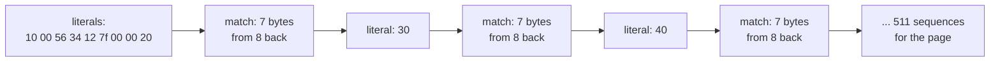
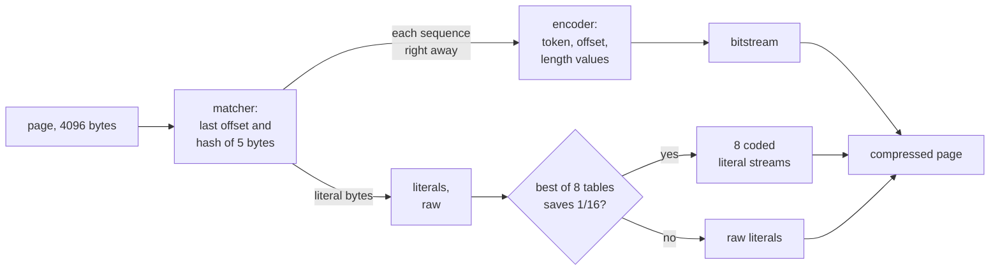
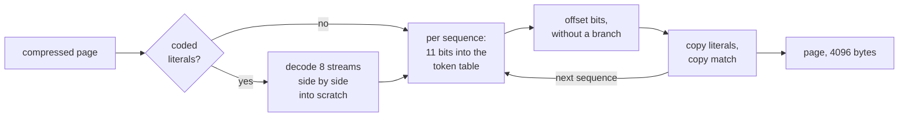

# seqlz: how it works, and why

*Or how to get most of `zstd`'s memory at most of `lz4`'s speed, for zram's 4 KiB pages.*

> [!NOTE]
> **In short.** On the pages my desktop swapped into zram, `seqlz-fast-lit` needs **21% to 24% less
> memory** than `lzo-rle`, zram's default, and 25% to 28% less than `lz4`. It is **about 25%
> slower** than `lz4` to write a page and 18% to 27% slower to read one. `zstd` level 3 needs 3% to
> 10% less memory than `seqlz`, but twice the time to write and 1.7 to 1.8 times the time to read.

This document explains how `seqlz` works for someone who has not written a compressor before: the
page format, the encoder, the decoder, and why each part is the way it is, with the measurement that
decided it. The history of every idea, also of the ones that failed, is in
[explored-designs.md](explored-designs.md). The code is in [`explore/seqlz.c`](../explore/seqlz.c),
[`explore/seqlz.h`](../explore/seqlz.h) and [`explore/page_lz.h`](../explore/page_lz.h).

## Contents

* [Compression in five minutes](#compression-in-five-minutes)
* [What makes zram different](#what-makes-zram-different)
* [The result](#the-result-lz4s-time-zstds-memory-almost)
* [The format](#the-format-lz4s-sequences-coded-like-zstds)
* [A sequence takes 14 to 16 bits](#a-sequence-takes-14-to-16-bits-in-lz4s-format-25)
* [Why it needs less memory](#why-it-needs-less-memory-offsets-and-literals)
* [The encoder](#the-encoder-one-pass-over-the-page)
* [The decoder](#the-decoder-one-table-lookup-per-sequence)
* [Why it is nearly as fast as lz4](#why-it-is-nearly-as-fast-as-lz4)
* [Why zstd still needs less memory](#why-zstd-still-needs-less-memory)
* [The choices, with their numbers](#the-choices-with-their-numbers)
* [What is not known yet](#what-is-not-known-yet)

<details>
<summary><b>Glossary</b>: the words this document uses, click to open</summary>

| word | meaning |
| --- | --- |
| **page** | 4096 bytes of memory, the unit the kernel swaps out and zram compresses |
| **literal** | a byte stored as it is, because the matcher found no earlier copy of it |
| **match** | "copy `ml` bytes from `offset` bytes back": bytes that appeared earlier in the page |
| **offset** | how many bytes back the copy of a match starts |
| **sequence** | `ll` literals followed by one match; the compressor turns a page into a list of sequences |
| **`ll`** | literal length: how many literals a sequence has, 0 or more |
| **`ml`** | match length: how many bytes the match copies, 4 or more |
| **matcher** | the first half of the compressor: it walks through the page and looks for matches. It decides where the matches are, and the bytes between them are the literals |
| **greedy** | a matcher that takes a match as soon as it finds one, without checking whether a match that starts a byte later would be longer |
| **encoder** | the second half of the compressor: it writes the matcher's sequences and literals in the format |
| **decoder** | turns a compressed page back into its 4096 bytes |
| **offset class** | one of 6 ways to store the offset, e.g. "the same as the match before", in 0 bits |
| **token** | one Huffman coded symbol for `ll`, `ml` and the offset class of a sequence |
| **Huffman code** | a code where frequent symbols get few bits and rare ones many; see below |
| **static table** | a Huffman table fixed in the code, the same for every page |
| **bitstream** | the codes written one after the other, bit by bit, not aligned to bytes |
| **zsmalloc** | the allocator zram stores compressed pages in, in size classes |
| **µs** | a microsecond, a millionth of a second |
| **mean** | the average time over all pages |
| **p99** | sort the times of all pages: p99 is the time 99% of them stay below, the slowest 1% take longer |
| **cold** | the data is not in the CPU cache and has to come from memory |
| **time per page written** | write time + 0.34 × read time, see [below](#what-makes-zram-different) |

</details>

## Compression in five minutes

Almost every fast compressor, `lz4`, `lzo`, `zstd` and `seqlz` included, is built from two ideas.

### Idea 1: say "that again" instead of repeating bytes

The part of the compressor that finds repeats is the **matcher**. It walks through the page. When
the next bytes appeared before, it takes a **match**: go back `offset` bytes and copy `ml` bytes.
When they did not, the bytes stay as they are, as **literals**. Memory pages are full of repeats,
because programs store arrays of similar things. Here are the first 24 bytes of a page that holds an
array of pointers, each pointing 16 bytes further than the one before. The bytes follow each other
in memory, here one pointer per line:

```text
pointer 1:  10 00 56 34 12 7f 00 00
pointer 2:  20 00 56 34 12 7f 00 00
pointer 3:  30 00 56 34 12 7f 00 00
...
```

Every pointer differs from the one before in its first byte, and every 16th in the second byte too.
The compressor writes the page as a list of **sequences**. A sequence is always the same two steps:
first `ll` literals, then one match of `ml` bytes from `offset` bytes back.



| sequence | literals | `ll` | match | `ml` | offset |
| --- | --- | --- | --- | --- | --- |
| 1 | `10 00 56 34 12 7f 00 00 20` | 9 | `00 56 34 12 7f 00 00` | 7 | 8 |
| 2 | `30` | 1 | `00 56 34 12 7f 00 00` | 7 | 8 |
| 3 | `40` | 1 | `00 56 34 12 7f 00 00` | 7 | 8 |

A match is at least 4 bytes long: like `lz4`'s, the matcher does not look for shorter ones. That is
why the format stores `ml - 4`. The last sequence of a page has only literals and no match.

### Idea 2: frequent things get short codes

`lz4` spends a whole byte on `ll` and `ml` of every sequence, and two bytes on every offset,
whatever they are. But some sequences are much more common than others: "1 literal, 7 bytes from the
same offset as before" is one of the most common on real pages. A **Huffman code** gives it 4 bits,
a rare sequence up to 11, and the rarest 16. On average that is far less than `lz4`'s bytes. This is
called entropy coding.

> [!TIP]
> For the page of pointers above, `lz4` needs 2058 bytes, about 4 bytes per pointer: a token byte,
> the literal, and 2 bytes of offset. `seqlz-fast-lit` needs 671 bytes, about 10.5 bits per pointer:
> a 4-bit token and the literal byte, Huffman coded too. `lzo-rle` needs 1564 bytes and `zstd` 434.

`lz4` uses idea 1 only, which makes it very fast. `zstd` uses both, with tables it can adapt to
every block of data. `seqlz` uses both too, but with tables that are built once and compiled in,
which makes it much faster than `zstd`.

## What makes zram different

zram is a compressed swap device in RAM. When memory runs low, the kernel moves pages that were not
used for a while into zram, compressed. When a program touches such a page again, the page fault
waits until zram has decompressed it. Four things follow from that, and they shape everything below:

> [!IMPORTANT]
> 1. **Every page is compressed on its own**, 4096 bytes, without the pages around it. There is no
>    room to send a Huffman table with each page; a table can cost more than it saves.
> 2. **Reading is on the critical path**: a program waits for it. Writing happens when the kernel
>    reclaims memory, often in the background, sometimes while a program waits for memory.
> 3. **Memory is counted in zsmalloc's size classes**, at least 16 bytes apart, not in bytes. A page
>    of 3625 bytes and more is stored uncompressed, as 4096.
> 4. **The code runs in the kernel**: no floating point, no SIMD, and every byte of work memory per
>    CPU counts on a phone.

To compare codecs by their time, writes and reads go into one number, the time part of the score of
[PLAN.md](../PLAN.md#11-the-score-memory-against-time-not-bars):

$$\text{time per page written} = t_\text{write} + 0.34 \cdot t_\text{read}$$

Here $t_\text{write}$ is the mean time to write a page and $t_\text{read}$ the mean time to read a
page back cold. The 0.34 is measured: my desktop read one page back from zram for every three it
swapped out, 3 146 179 pages in against 9 210 320 out in 27.5 days. So the number is what a codec
costs per page that goes into zram, its reads included. E.g. for `lz4` on the first dump it is 5.27
+ 0.34 × 2.53 = 6.13 µs.

Memory is the other axis. Which codec is best then depends on how many bytes of memory one
microsecond per page is worth to you, and PLAN.md's score adds both with that exchange rate.

## The result: lz4's time, zstd's memory, almost


Kernel VM of [`tools/zram-vm/run.sh`](../tools/zram-vm/run.sh), 20 000 pages of each of two zram
dumps, all four codecs in one boot per dump, one CPU of a Ryzen 9 7950X fixed at 4.5 GHz, means over
the pages, first dump / second dump:

| codec | zsmalloc bytes per page | write, µs | cold read, µs | time per page written, µs |
| --- | --- | --- | --- | --- |
| `lz4` | 1450 / 1755 | 5.27 / 5.74 | 2.53 / 2.54 | 6.13 / 6.61 |
| `lzo-rle` (zram's default) | 1361 / 1679 | 5.09 / 5.66 | 2.76 / 2.81 | 6.03 / 6.61 |
| **`seqlz-fast-lit`** | **1039 / 1322** | **6.56 / 7.29** | **2.99 / 3.23** | **7.58 / 8.39** |
| `zstd` 3 | 1012 / 1197 | 13.38 / 14.30 | 5.32 / 5.52 | 15.19 / 16.17 |

> [!NOTE]
> **How the times are measured, and what p99 is.** A program in the VM writes each page to zram with
> `pwrite` and reads it back with `pread`, and times each call. So a time is the whole system call,
> zram and zsmalloc included, not only the codec. Each page is timed 3 times and its median counts.
> For a **cold read**, the compressed page is flushed from the CPU cache first, and the read before
> it was of another page, as for a page swapped out a while ago. The **mean** is the average over
> the 20 000 pages. For **p99** the 20 000 times are sorted: p99 is the one at position 19 800, so
> 99% of the pages are done faster and the slowest 200 take longer. The mean says how much time all
> pages cost together; p99 shows whether some pages are much slower than the rest, and a program
> that waits for such a page feels it.

<details>
<summary>The slowest pages, p99, and the work memory</summary>

At p99 `seqlz-fast-lit` reads cold pages in 4.94 and 5.19 µs, faster than `lzo-rle` (5.42 and 5.38)
and a bit slower than `lz4` (4.74 and 4.75). It writes in 11.5 and 11.7 µs, where `lz4` needs 9.2
and 9.5 and `zstd` 23.2 and 23.7. Per CPU it needs 12 336 bytes of work memory, `lz4` 16 440.

</details>

There is no fastest codec here, there is a pareto front: nothing beats `seqlz-fast-lit` on memory
without taking twice its time, and nothing beats it on time without taking 27% to 40% more memory.
By the [score](../PLAN.md#11-the-score-memory-against-time-not-bars) it is the best choice for
anyone who values a microsecond per page written at 16 to about 200 bytes of memory per page, on
both dumps. The rightmost column of the chart below shows where that comes from: `zstd` saves 3 and
16 bytes per page for each µs more than `seqlz-fast-lit`, and `seqlz-fast-lit` saves 208 and 201
bytes per page for each µs more than `lzo-rle`.


## The format: lz4's sequences, coded like zstd's


Like `lz4`, `seqlz` describes a page as sequences. Unlike `lz4`, it Huffman codes them with tables
that are compiled in. The chart shows the two kinds a compressed page can have, in the two top rows.
The rows below it zoom into the bitstream, which is the same in both kinds.

| kind of page | layout |
| --- | --- |
| **raw literals** | `u16` number of literals, bit `0x8000` not set · the literals · the bitstream of the sequences |
| **coded literals** | `u16` number of literals \| `0x8000` · `u8` which literal table · 8 × `u16` stream sizes · 8 literal streams · the bitstream of the sequences |

The literals of all sequences are stored together, in front, and the rest of each sequence is in the
bitstream behind them.

> [!IMPORTANT]
> **The encoder decides, for every page.** After the matcher, `seqlz-fast-lit` counts how many bytes
> the page's literals would take in each of the 8 literal tables and takes the smallest. It writes
> the coded kind only if those streams and the 17 more bytes of header are smaller than the raw
> literals minus 1/16. For `n` literals and `coded` bytes of streams, that is `coded + 19 < n - n /
> 16` in [`code_literals()`](../explore/seqlz.c). Else the page keeps its raw literals. That is 50%
> to 69% coded pages on my dumps. `seqlz-fast` never codes literals, so all its pages are of the raw
> kind.
>
> **The decoder sees the kind in the first 2 bytes.** A page has at most 4096 literals, so the
> number needs 13 bits and bit `0x8000` of the `u16` is free: set means coded literals. The other
> bits are the number of literals in both kinds.

The bitstream has no length of its own: it goes to the end of the compressed page, and zram stores
that page's size. Two kinds of page never reach the decoder of `seqlz` at all: a page filled with
one repeated value, which zram stores as just that value, and a page that `seqlz` cannot compress
below 3625 bytes, which zram stores as it is. On a read zram copies such a page back without calling
the codec.

The bitstream holds the sequences one after the other, read least significant bit first. Each
sequence has up to four parts in it:

| part | bits | what it says |
| --- | --- | --- |
| **token** | 4 to 11, Huffman coded; 16 if escaped | `ll` up to 15, `ml - 4` up to 31, and the offset class |
| **offset** | 0 to 12, raw | the offset, stored as its class says |
| **`ll` value** | Huffman code + raw bits | only if `ll` >= 15: the rest of `ll` |
| **`ml` value** | Huffman code + raw bits | only if `ml` >= 35: the rest of `ml` |

### The offset class is part of the token

The token is one number that holds three things: `min(ll, 15) + 16 × min(ml - 4, 31) + 512 × class`.
That gives 16 × 32 × 6 = 3072 possible tokens, and the Huffman code is for the whole token. **So the
offset class has no bits of its own.** It makes the token's code longer, by about **2 bits** on
average on both dumps, the entropy of the tokens with the class against without it. On its own the
class would need about 2.5 bits. It is cheaper in the token because the class goes together with the
lengths, and the token's code can use that: e.g. a match of 4 bytes has almost always the offset of
the match before, and 29% and 36% of the matches with a class 3 offset are 5 bytes long, against 12%
and 19% of all matches. That the decoder gets `ll`, `ml` and the class with one table lookup is what
makes it fast, see [the decoder](#the-decoder-one-table-lookup-per-sequence).

The class says how the offset's raw bits right after the token are to be read:

| class | offset | raw bits |
| --- | --- | --- |
| 0 | the same as the match before | 0 |
| 1 | below 16 | 4 |
| 2 | below 256 | 8 |
| 3 | below 4096 | 12 |
| 4 | a multiple of 8, from 16, below 256 | 5, the offset / 8 |
| 5 | a multiple of 8, from 256 | 9, the offset / 8 |

A token that is rare has no code at all: only 512 of the 3072 tokens have one. A rare token is sent
as a 4-bit escape code and the token in 12 raw bits. That keeps the frequent codes short; on my
dumps 14 to 38 of about 200 sequences per page are escaped. There is no count of the sequences: the
last one is the one whose literals fill the page.

### A sequence takes 14 to 16 bits, in lz4's format 25

Measured on the same 20 000 pages of each dump, without the literals:

| bits per sequence, mean | first dump | second dump |
| --- | --- | --- |
| token, the offset class included | 7.7 | 9.1 |
| offset | 5.4 | 6.4 |
| `ll` and `ml` values | 0.7 | 0.6 |
| **`seqlz`, total** | **13.8** | **16.1** |
| the same sequences in `lz4`'s format | 25.5 | 25.7 |

Half of the sequences take at most 13 and 16 bits. The shortest take 4 bits, a frequent token with
the offset of the match before. 99% take at most 31 bits, and the longest 59, with a long `ll` and a
long `ml` value. The literals come on top: 8 bits each when they are stored raw, fewer when they are
coded, see [the literals](#why-it-needs-less-memory-offsets-and-literals).

Here is one sequence taken apart: 2 literals, a match of 7 bytes, 16 bytes back.

* `ll` = 2, `ml` = 7, so `ml - 4` = 3.
* The offset 16 is a multiple of 8 and below 256: class 4, sent as 16 / 8 = 2 in 5 bits.
* The token is `2 + 16 × 3 + 512 × 4 = 2098`. Its Huffman code in the compiled-in table has 9 bits.
* Both lengths fit into the token, so there are no length values.

The sequence costs 9 + 5 = 14 bits, plus the 2 literal bytes. In `lz4`'s format the same sequence is
a token byte, the 2 literal bytes and 2 bytes of offset: 24 bits plus the literals.

The most frequent tokens have 4 bits: token 49 is "1 literal, a match of 7 bytes, the offset of the
match before", exactly the pointer array from the start: `1 + 16 × 3 + 512 × 0 = 49`, and no offset
bits.

### The literals

**Literals** stay raw, or are Huffman coded with one of 8 fixed tables, the one that fits the page
best, if that saves at least 1/16 of them. Coded literals are split into 8 streams, literal `k` into
stream `k % 8`, so that the decoder can work on 8 of them at the same time.

## Why it needs less memory: offsets and literals

The same sequences, from `seqlz`'s own matcher, cost this many bytes per page in `lz4`'s format and
in `seqlz`'s:


| bytes per page, first dump | `lz4`'s format | `seqlz` | saved |
| --- | --- | --- | --- |
| tokens | 205 | 198 | 7 |
| **offsets** | **408** | **136** | **272** |
| lengths beyond the token | 41 | 18 | 23 |
| **literals** | **700** | **603** | **97** |
| header | 0 | 11 | -11 |
| total | 1355 | 966 | 389 |

> [!NOTE]
> **The offsets are two thirds of the gain.** `lz4` spends 2 bytes on every offset. `seqlz` spends 0
> bits on a repeated offset, 5 or 9 bits on an 8-byte aligned one, and 4 or 8 bits on a short one.

Memory pages are full of arrays of structs and pointers, and that shows in the offsets:


* **18% to 25%** of the matches repeat the offset of the match before: 0 bits.
* **20% to 41%** are multiples of 8, 8-byte aligned data: 5 or 9 bits instead of 8 or 12.
* Of the rest, many are short: below 16 in 4 bits, below 256 in 8.

**The literals are the second part.** After the matcher, the literals have no structure of more than
one byte left, but single bytes are far from uniform: zero bytes, ASCII, small integers. 50% to 69%
of the pages get their literals coded, and over all pages the literals get 14% to 17% smaller.

**The tokens cost about the same as `lz4`'s token byte**, 198 against 205 bytes per page, but they
also carry the offset class, and lengths beyond the token are rare: 53% to 68% of the matches are 4
to 8 bytes, and 56% to 63% of the literal runs are 0 or 1 byte long.

<details>
<summary>Why the tables are fixed, and why literals are coded only when they save 1/16</summary>

**Static tables.** A page of 4 KiB has little room for its own tables: the 256 code lengths of a
literal table take about 64 bytes, coded. A literal table of its own, where that saves 16 bytes,
made writes 13% and 15% slower for 0.3% and 4.6% less memory; with one of 4 token tables as well,
43% slower for 2.6% and 6.6%. The fixed tables are trained on other pages than the ones they are
measured on: on resident pages of running programs, measured on the zram dumps.

**The 1/16 rule.** zsmalloc stores in size classes at least 16 bytes apart, so saving a few bytes
mostly saves nothing. Coding the literals whenever they save anything gave less than 0.1 points of
memory more, for decoding time on every such page.

</details>

## The encoder: one pass over the page



The matcher, [`match_page()`](../explore/page_lz.h), is greedy like `lz4`'s fast mode: it takes the
first match it finds.

1. At every position it checks two candidates: the offset of the last match, and the last position
   where the same 5 bytes were seen, from a hash table of 4096 positions, 8 KiB, cleared for each
   page. Both are read before either is compared, so that one branch decides, not three.
2. On a match it extends it backwards into the literals and forwards, the first 16 bytes without a
   branch, and hands the sequence to the encoder right away. Matcher and encoder are one loop.
3. The encoder writes the literals to the front of the output and the sequences' bits behind the
   room of a page, with a 64-bit accumulator that is flushed once per sequence.
4. At the end, the literal coder counts the bits of the literals in all 8 tables at once: per byte
   its 8 code lengths are the 8 lanes of one 64-bit number, one addition per literal. If the best
   table saves 1/16, the 8 streams are written, four at a time, each with its accumulator in a
   register.

zram hands the codec a buffer of two pages, and that is always enough: the most bits per page byte
are sequences of 4-byte matches without literals, 23 bits each, 2948 bytes for a page.

## The decoder: one table lookup per sequence



Per sequence the decoder:

1. refills the bit reader if fewer than 23 bits are left, the most a token and an offset need;
2. looks up the next 11 bits in the token table: the entry has the code length, `ll`, `ml - 4` and
   the offset class;
3. takes the offset's raw bits right after the token, or the last offset for class 0, without a
   branch;
4. copies 16 literal bytes and 16 to 40 match bytes without a loop, if the lengths fit into the
   token and there are 64 bytes of room; otherwise it reads the length values and copies with loops.

<details>
<summary>Coded literals, and matches that overlap themselves</summary>

Coded literals are decoded first, into a scratch of a page, by 8 independent chains: per literal a
table lookup of 10 bits, a shift and a store. The sequences then take them from there.

A match with an offset below 8 overlaps itself: its first bytes are also its source. For those the
decoder builds the first 8 bytes in a register and stores them in steps of the largest multiple of
the offset up to 8, so that no load waits for the store before it.

</details>

## Why it is nearly as fast as lz4

`seqlz` decodes with 2.3 times the instructions of `lz4`, 28 768 against 12 527 per page, but at 3.4
instructions per cycle: 8507 cycles against 5238 with the page in the cache. In the kernel the reads
are closer, 2.99 against 2.53 µs, because much of a page fault is waiting for memory, whatever the
codec.

| what | why it matters |
| --- | --- |
| **one table lookup per sequence** | the offset class is in the token, not a second symbol; the chain from one sequence to the next is lookup, shift, lookup |
| **static tables, small enough for L1** | token table 2048 entries of 2 bytes, the page's literal table 1024 of 2 bytes, two length tables 256 of 4 bytes; nothing is built from the page, where `zstd` builds its literal table for each page with coded literals |
| **only complete Huffman codes** | every bit pattern starts a code, so the decoder never checks for one that does not |
| **the common sequence has no loop and no length value** | literal runs up to 14 bytes and matches up to 34 bytes are the token alone, and fixed copies of 16 to 40 bytes cover them |
| **literals in 8 streams** | 8 chains of work side by side instead of one |
| **the compressed data is prefetched** | the zram backend asks for it before decoding starts; in the same kernel VM prefetching made `lz4`'s p99 read latency 30% lower |

Writing takes 1.25 times `lz4`'s time: the matcher alone costs about as much as all of `lz4`, and
coding sequences and literals comes on top. `zstd` 3 needs 2.4 times `seqlz`'s cycles to compress
(54 680 against 22 912 per page) and 2 times to decode (16 973 against 8507).

## Why zstd still needs less memory

On the second dump `zstd` 3 needs 10% less memory than `seqlz-fast-lit`, on the first 3%. Three
things make the difference, each measured:

* **Better matches.** `zstd` 3 searches more. `lz4hc`'s matches coded by `seqlz` need 3% to 7% fewer
  bytes than `seqlz`'s greedy matcher, but a matcher that searches that much takes more time than
  zram's writes can spend.
* **Its own literal table per page.** Coding the literals is worth 2.3 and 4.7 points of memory to
  `zstd` 3 on the two dumps. A page's own table instead of the best of 8 fixed ones would save
  `seqlz` 0.3% to 4.6% more, for 13% to 15% slower writes.
* **Adaptive sequence coding.** `zstd` codes literal length, match length and offset with separate
  tables that adapt. `seqlz`'s one static token table is what keeps its decoder fast.

> [!NOTE]
> Where the ratio of `zstd` comes from in the first place, measured on the whole first dump:
> `lz4hc`'s best matches in `lz4`'s format need 30.7%, the same matches with entropy coded sequences
> 25.8%, and with coded literals as well 23.6%. **Coding the sequences is the largest step**, and
> that is what `seqlz` is built on. See
> [explored-designs.md](explored-designs.md#where-the-ratio-of-zstd-comes-from).

## The choices, with their numbers

Each choice was measured against the alternative; the numbers are from
[explored-designs.md](explored-designs.md), 4 KiB pages.

<details open>
<summary><b>The format</b></summary>

| choice | against | why |
| --- | --- | --- |
| `ll`, `ml` and the offset class in one token | separate symbols | two table lookups per sequence instead of three: 22% fewer decode cycles, and less memory |
| the offset class in the token, raw bits after it | a Huffman coded offset bucket | one lookup per sequence: 8758 to 8168 decode cycles, for 0.4 points of memory |
| token codes of at most 11 bits, 4 KiB table | 12 bits, 8 KiB | cold p99 5070 to 4350 ns: the decoder's tables have to stay in L1 |
| rare tokens escaped | a code for every token | 11 bits have room for 2048 codes, there are 3072 tokens |
| match lengths up to 34 in the token | up to 18 | with 15 values, every fifth match needed a length value, and that branch mispredicted (commit `f0381e7`) |
| one repeat offset | three, as `zstd` | keeping three in order cost 17% of the decode cycles; the other two were 11% of the matches, 0.2 points |
| multiples of 8 in classes of their own | plain offsets | 24 and 2 bytes per page less in the kernel, for 0.2 µs per page written |
| only complete Huffman codes | checks for invalid codes | the checks were 6% of the decoder's instructions |

</details>

<details>
<summary><b>The literals</b></summary>

| choice | against | why |
| --- | --- | --- |
| static tables | a table per page | 13% and 15% slower writes for 0.3% and 4.6% less memory |
| one of 8 literal tables per page | one | 89% and 76% of the way from `lz4`'s to `zstd`'s memory in the kernel |
| literals in 8 streams | 4 | 2.9 cycles per literal with 4; 9070 to 8676 decode cycles per page |
| coded only if they save 1/16 | whenever they save anything | less than 0.1 points of memory more, for decode time on every such page |

</details>

<details>
<summary><b>The matcher</b></summary>

| choice | against | why |
| --- | --- | --- |
| a hash of 5 bytes | 4 bytes | 5% fewer compress cycles for 0.6 points, 10% less write time at p99 in the kernel |
| the last offset checked at every position | only the table | 0.5 points of memory |
| the hash table cleared for each page | checking each entry's age | 7% faster |
| every position tried | `lz4`'s growing step | writes 1% to 3% faster in the kernel |

</details>

<details>
<summary><b>Tried and not kept</b></summary>

A token table chosen by the offset class before it (3 to 12 bytes per page for three times the
tables), the literals coded inside the matcher's loop (more cycles than the pass after it), decoding
the literals into the output page to save the scratch (slower cold reads), `lz4`'s format from a
better compressor, the word model of WKdm, BΔI, a byte shuffle, FSST and Tunstall codes for the
literals, and recompressing idle pages. Why each of them failed is in
[explored-designs.md](explored-designs.md).

</details>

## What is not known yet

> [!WARNING]
> * **One machine.** All of this is measured on one desktop: two zram dumps of the same machine, and
>   tables trained on its resident pages.
> * **No arm64 yet.** Every latency is from x86-64, and phones are the users of zram. The decoder
>   runs 3.4 instructions per cycle on a Ryzen; on a small core that runs one or two, its 2.3 times
>   `lz4`'s instructions probably count for more.
> * **16 KiB pages.** Android is moving to them, and there `seqlz-fast-lit` needs 32 816 bytes of
>   work memory per CPU, twice `lz4`'s, which breaks one of the project's own limits. A fix is built
>   and measured, but not kept.
> * **Writes at p99** take 1.2 to 1.25 times `lz4`'s time.

Nevertheless, on the pages this machine actually swapped, `seqlz` sits between `lzo-rle` and `zstd`
on both axes: much less memory than `lzo-rle`, much less time than `zstd`.